# Analyze App Adoption
{:.no_toc}

production

|                                  		                    | Initial | Recurring  |
|---------------------------------------------------------|---------|------------|
| <i class="far fa-clock fa-sm"></i> **Estimated Time**   | 25 Min  | 10 min     |

Benefits:

  - Understand adoption
  - Better understand user-base
  - Identify top and bottom applications by adoption
  
-------------------------

## Goal
{:.no_toc}
At it simplest, the goal of this page is to identify the top five and bottom five applications by two metrics:
  
  - Total sessions by application
  - Total distinct users by application
  
It is then also important to identify any visible trends of usage -- is usage trending up or down, or are there consistent spikes? In addition, it is helpful to characterize these applications, e.g. _highly used yet only by a few inidividuals_, _widely used but infrequently_, etc. To visualize these areas, two additional charts will be built.

## Table of Contents
{:.no_toc}

* TOC
{:toc}
-------------------------

## Suggested Prerequisites

- [Remove/Quarantine Unused Apps](remove_quarantine_unused_apps.md)

-------------------------

## Operations Monitor

This page leverages the **Operations Monitor**. Please refer to the [Operations Monitor](../../tooling/operations_monitor.md) page for an overview and relevant documentation links.

### Confirm Operations Monitor is Operational

Navigate to the **Monitoring apps** and select the _Details_ button (info icon) on the **Operations Monitor** application. Confirm that the application's data is up-to-date.

If the **Operations Monitor** is not up-to-date, please refer to the [Operations Monitor Documentation](../../tooling/operations_monitor.md#documentation) for configuration details and troubleshooting steps.

-------------------------

## User & Session Metrics

Navigate to the **Monitoring apps** stream and open up the **Operations Monitor** application.

[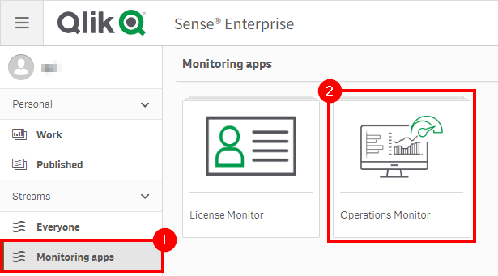](https://raw.githubusercontent.com/qs-admin-guide/qs-admin-playbook/master/docs/asset_management/apps/images/app_adoption_17.png)

Select the _Session Details_ sheet.

[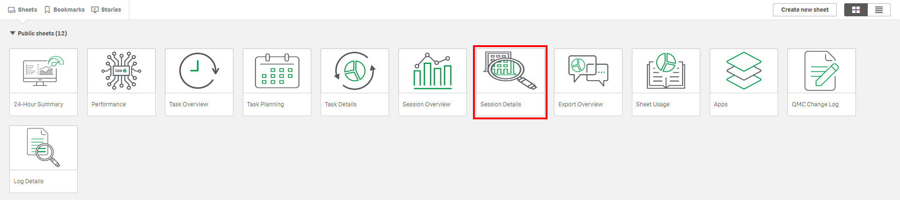](https://raw.githubusercontent.com/qs-admin-guide/qs-admin-playbook/master/docs/asset_management/apps/images/app_adoption_19.png)

Next, assuming this process is taking place quarterly, select the latest three full months.

[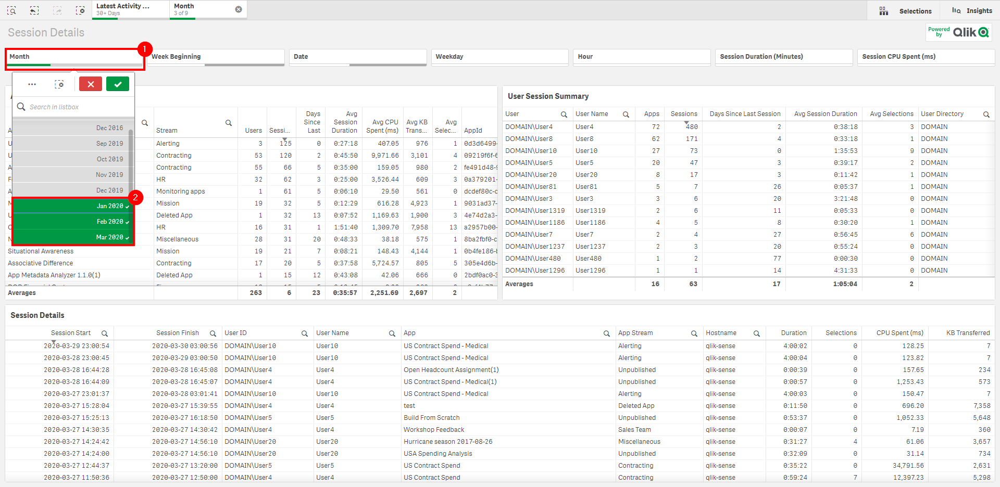](https://raw.githubusercontent.com/qs-admin-guide/qs-admin-playbook/master/docs/asset_management/apps/images/app_adoption_20.png)

Following, sort the **Sessions** column of the _App Session Summary_ table descending to view the applications with the greatest number of sessions.

[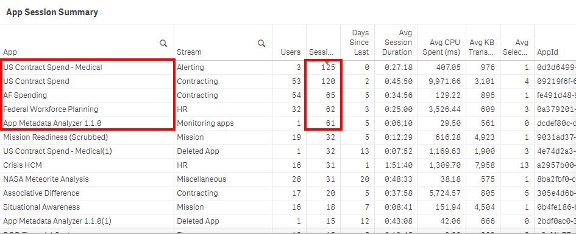](https://raw.githubusercontent.com/qs-admin-guide/qs-admin-playbook/master/docs/asset_management/apps/images/app_adoption_21.png)

Now, to see the applications with the greatest number of distinct users, sort the **Users** column descending.

[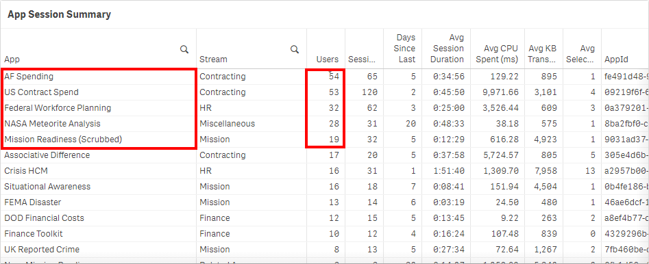](https://raw.githubusercontent.com/qs-admin-guide/qs-admin-playbook/master/docs/asset_management/apps/images/app_adoption_22.png)

In this case, three of the applications overlap, but notice that one of them was heavily used only by a single user. It is important to recognize weigh the application's importance by considering both metrics. Is it because the application is only relevant to one person, or is it only known to that person, or is that person not aware of a newer application? These are just some questions one might want to consider asking.

Repeat the same process above for the bottom five applications, by sorting both the **Sessions** and **Users** column _descending_ one by one and recording and then comparing the results.

## Application/Session Activity Breakdown

The metrics above are valuable for discerning which applications are used the most, but how about the following questions:

- What is the breakdown of each user's usage within each app?
- Is the session usage relatively evenly distributed, or is it condensed to only a few users?
- What is the percentange of an application's usage against other applications? For instance, what percentage do the top five applications take up of the entire environment?

A new chart can be created to easily visualize session usage and users to answer all of the above questions.

Duplicate the _Session Details_ sheet, and clear some real estate on the dashboard to make room for a new chart object.

[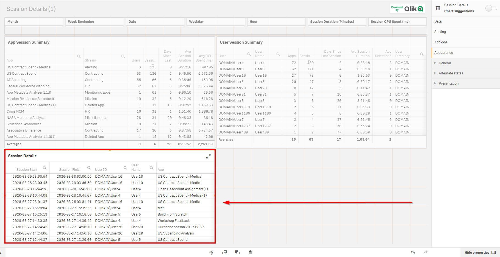](https://raw.githubusercontent.com/qs-admin-guide/qs-admin-playbook/master/docs/asset_management/apps/images/app_adoption_1.png)

Drag and drop the _Mekko chart_ (available as of the **November 2019** release), select _Add dimension_ and insert the **Session App Name** field.

[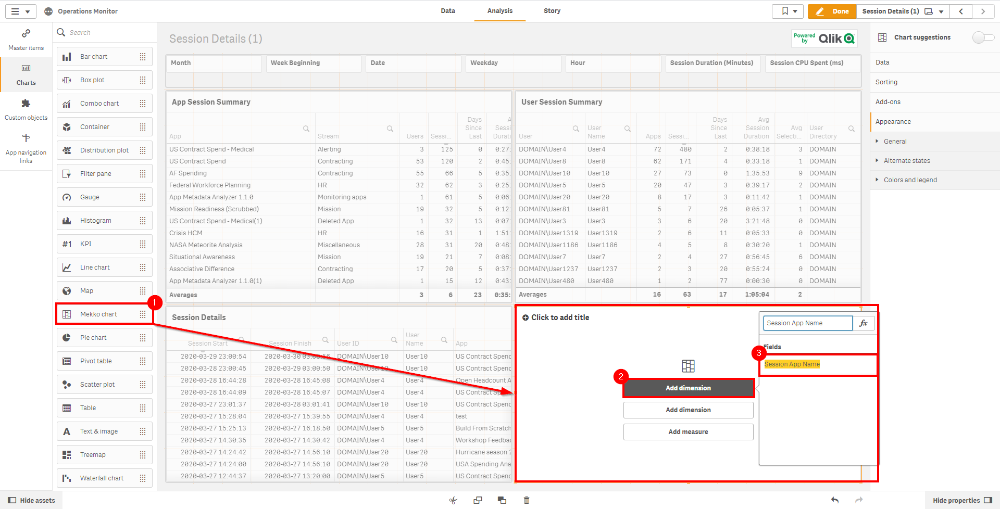](https://raw.githubusercontent.com/qs-admin-guide/qs-admin-playbook/master/docs/asset_management/apps/images/app_adoption_2.png)

Next, add the second dimension of **UserId**.

[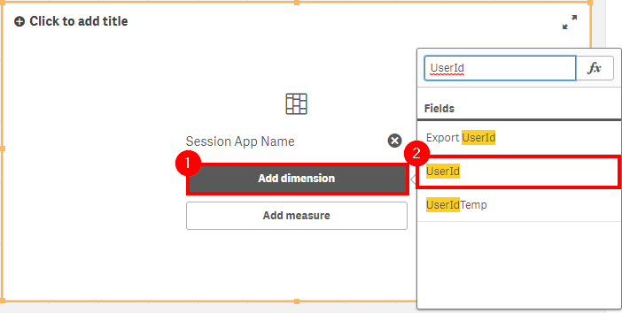](https://raw.githubusercontent.com/qs-admin-guide/qs-admin-playbook/master/docs/asset_management/apps/images/app_adoption_3.png)

Now select _Add measure_, and add **Sessions**.

[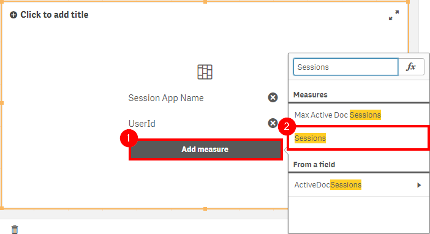](https://raw.githubusercontent.com/qs-admin-guide/qs-admin-playbook/master/docs/asset_management/apps/images/app_adoption_4.png)

In the properties panel, expand the **Session App Name** panel, and set the _Limitation_ to _Fixed number_, and set the _Top_ to "6". The "6" allows for the top five applications to show, along with the _Others_. Ensure that _Show others_ is toggled on.

[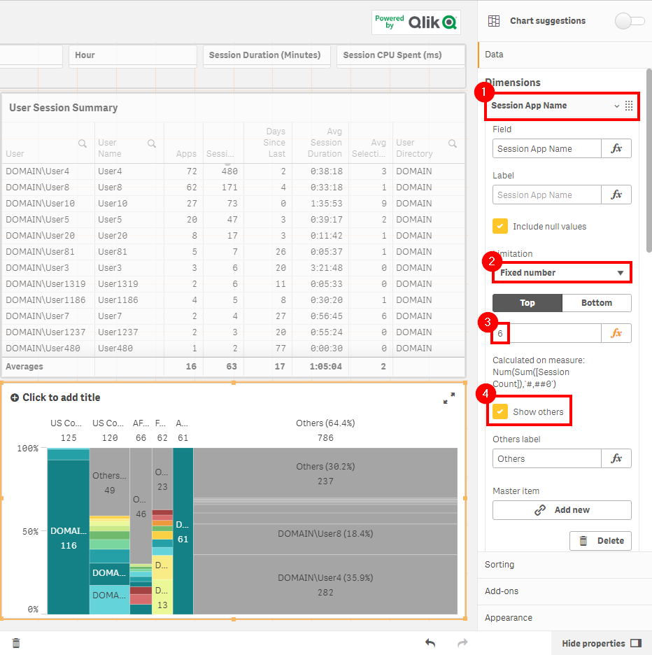](https://raw.githubusercontent.com/qs-admin-guide/qs-admin-playbook/master/docs/asset_management/apps/images/app_adoption_5.png)

Following, select the **UserId** dimension, and do the same as above, except now set the top to "11".

[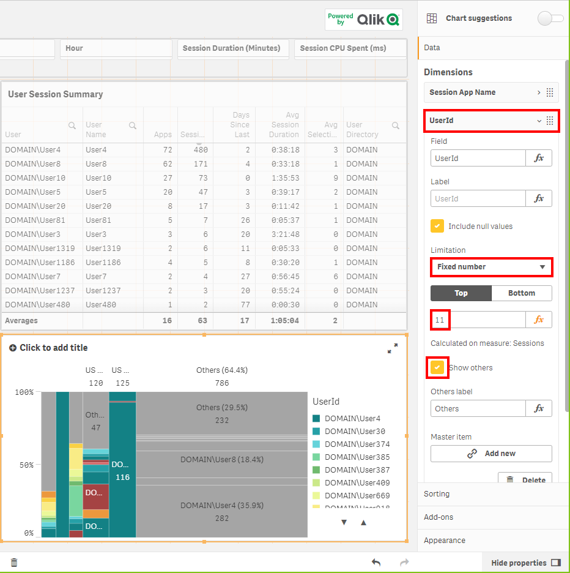](https://raw.githubusercontent.com/qs-admin-guide/qs-admin-playbook/master/docs/asset_management/apps/images/app_adoption_6.png)

Navigate down to the sorting section, and expand **Session App Name**. Untoggle the default sorting (Auto), toggle on _Sort by expression_, select _Descending_, and then enter `Sum([Session Count])` as the expression value.

[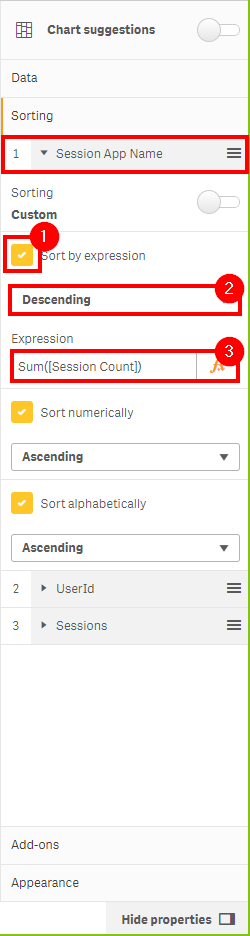](https://raw.githubusercontent.com/qs-admin-guide/qs-admin-playbook/master/docs/asset_management/apps/images/app_adoption_7.png)

Repeat the same process for the **UserId** sorting.

[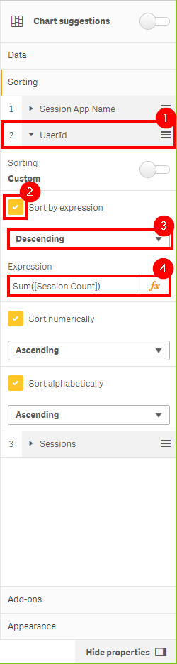](https://raw.githubusercontent.com/qs-admin-guide/qs-admin-playbook/master/docs/asset_management/apps/images/app_adoption_8.png)

Ensure that the sort order is:

  1. Session App Name
  2. UserId
  3. Sessions
  
Next, move down to the _Colors and legend_ section under _Appearance_. Toggle off _Show legend_ to give the chart some exra space.

[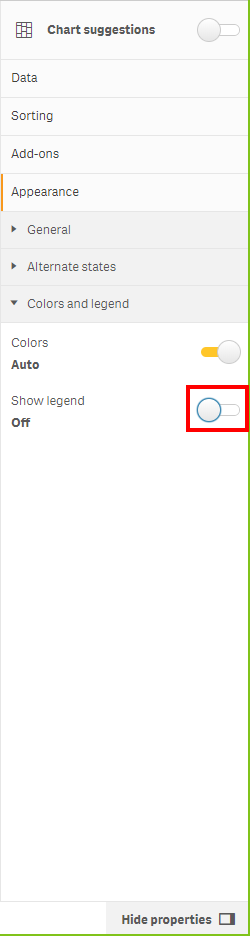](https://raw.githubusercontent.com/qs-admin-guide/qs-admin-playbook/master/docs/asset_management/apps/images/app_adoption_9.png)

Lastly, view the completed chart. One can quickly spot:

  - Who the predominant consumers of the top five applications are (if the distribution is less even)
  - The distribution of sessions by user (even or condensed to several)
  - The percentage of distribution of sessions relative to others
  - The percentage of all sessions of the top five applications against all others
  
[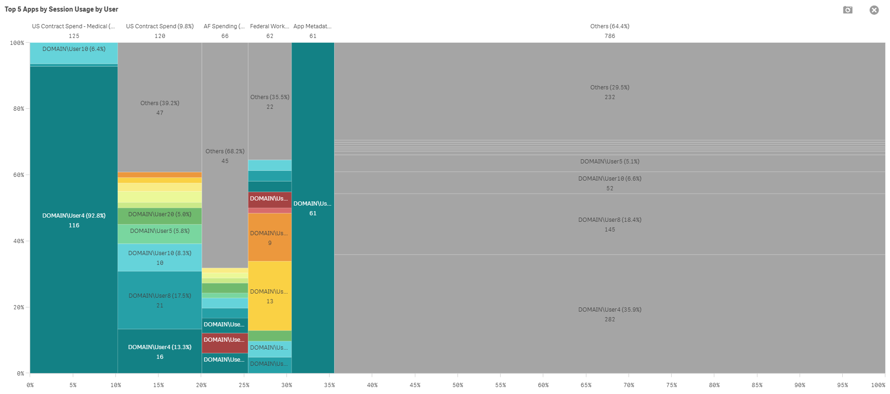](https://raw.githubusercontent.com/qs-admin-guide/qs-admin-playbook/master/docs/asset_management/apps/images/app_adoption_23.png)

By clicking in on the top five applications specifically (after noting the higher-level metric regarding overall usage), it can make the detail a bit easier to consume.

[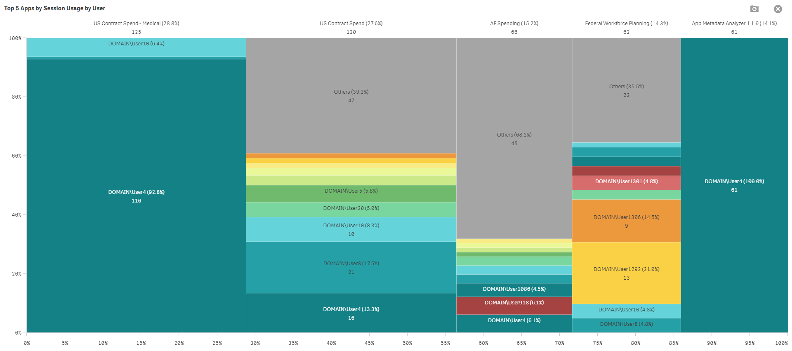](https://raw.githubusercontent.com/qs-admin-guide/qs-admin-playbook/master/docs/asset_management/apps/images/app_adoption_10.png)

## Application Usage Trending

After identifying the top five applications, it is important to see in which direction their usage is trending, if any. To do so, a new chart can be created.

First, create some room on the duplicated _Session Details_ sheet. In this case, the details table has been removed, as it is not relevant to this analysis. 

Select _Combo chart_, and insert it. Then, select the **Date** as the dimension.

[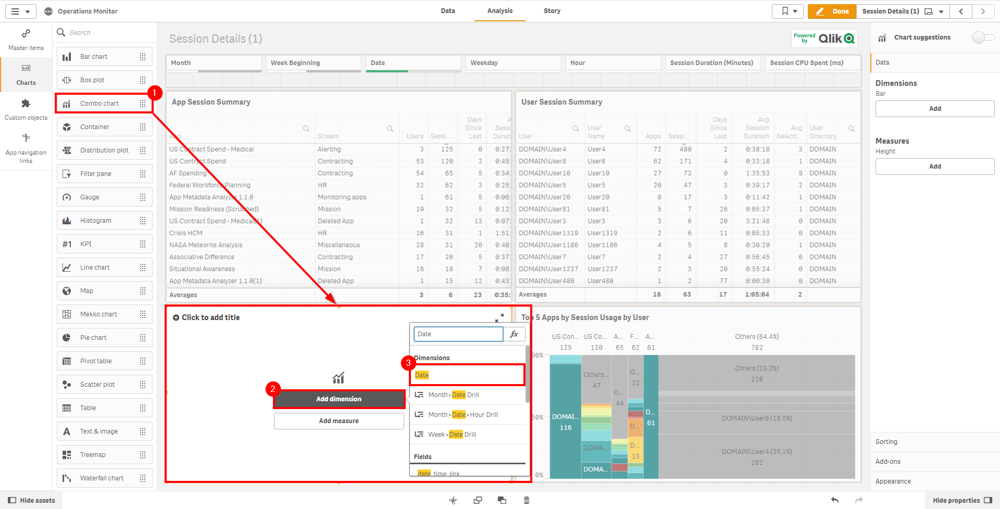](https://raw.githubusercontent.com/qs-admin-guide/qs-admin-playbook/master/docs/asset_management/apps/images/app_adoption_11.png)

Select _Add measure_, and insert the **Sessions** measure.

[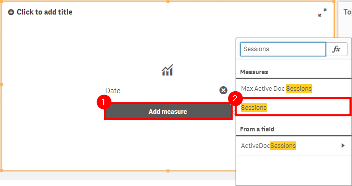](https://raw.githubusercontent.com/qs-admin-guide/qs-admin-playbook/master/docs/asset_management/apps/images/app_adoption_12.png)

Under _Measures_, select **Sessions**, and change the type to _Line_.

[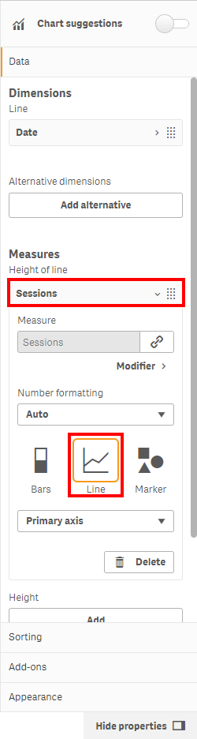](https://raw.githubusercontent.com/qs-admin-guide/qs-admin-playbook/master/docs/asset_management/apps/images/app_adoption_13.png)

While remaining in the editing pane, under _Height_, select _Add_. Next, click the _fx_ button.

[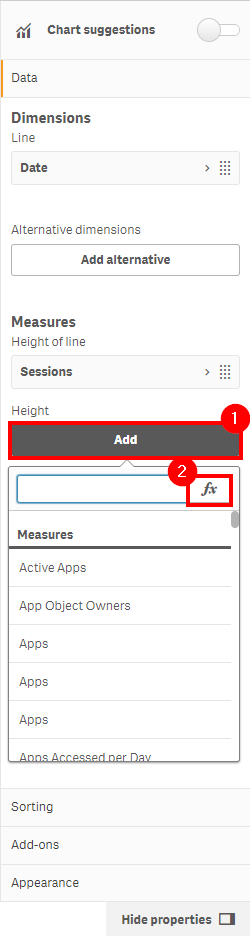](https://raw.githubusercontent.com/qs-admin-guide/qs-admin-playbook/master/docs/asset_management/apps/images/app_adoption_14.png)

Insert the expression `count({<[Session Count]={1}>} DISTINCT UserId)`. Name the measure "Users", and ensure it is of type _Line_.

[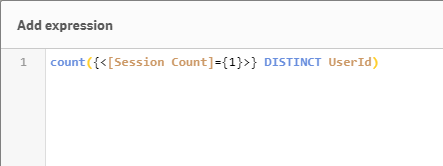](https://raw.githubusercontent.com/qs-admin-guide/qs-admin-playbook/master/docs/asset_management/apps/images/app_adoption_15.png)

View the the completed chart. It is easy to spot when there are many distinct users with few sessions each, or when there are only a few users with many sessions. Ensure that you select each of the top five applications (as well as the bottom five) and view the trends.

[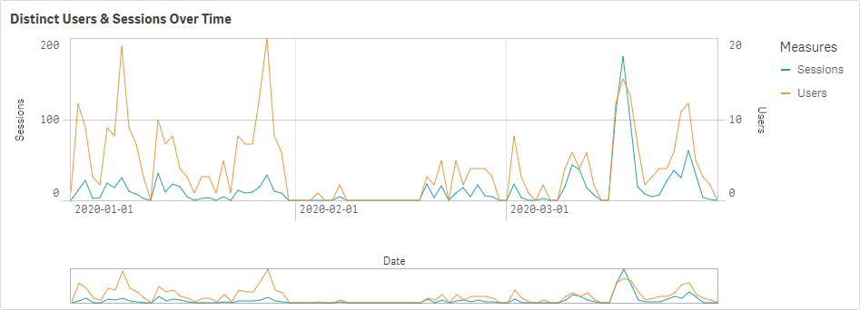](https://raw.githubusercontent.com/qs-admin-guide/qs-admin-playbook/master/docs/asset_management/apps/images/app_adoption_16.png)

**Tags**

#quarterly

#asset_management

#apps

&nbsp;
