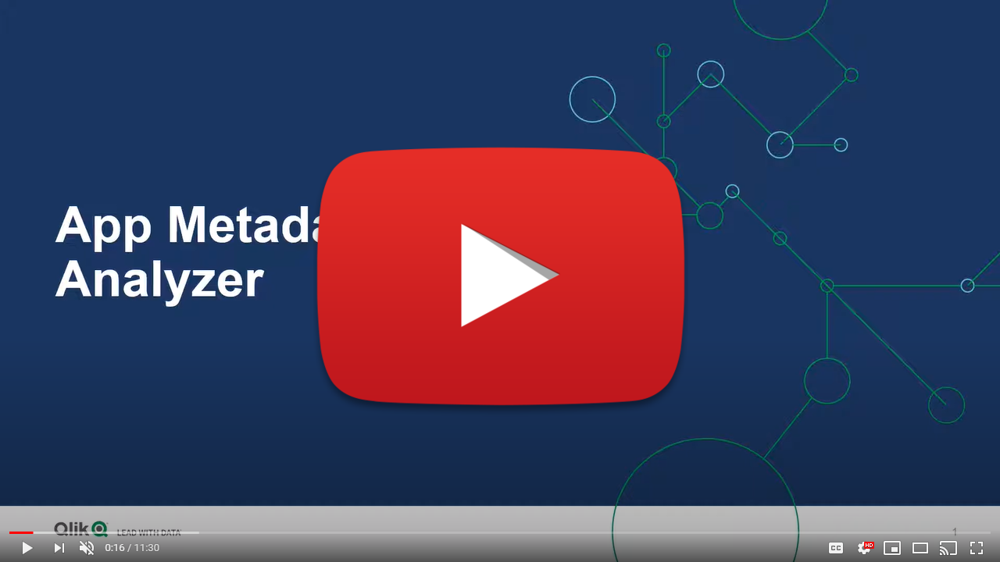
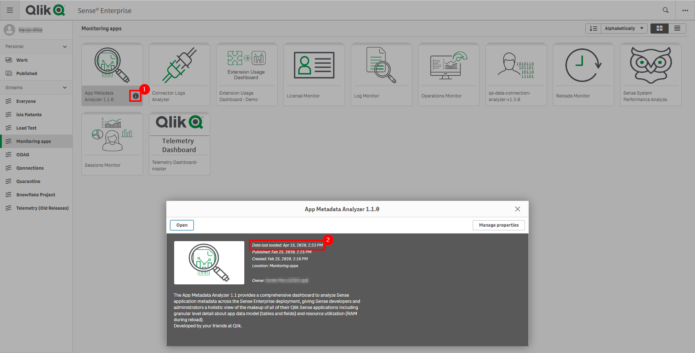
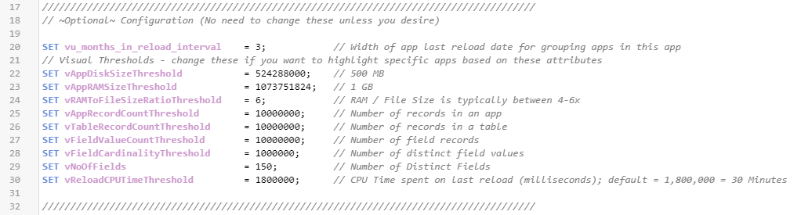
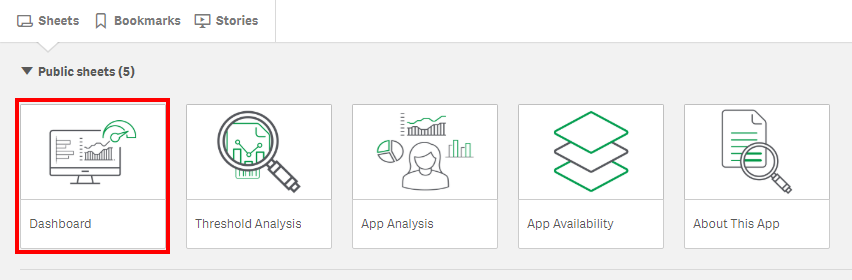
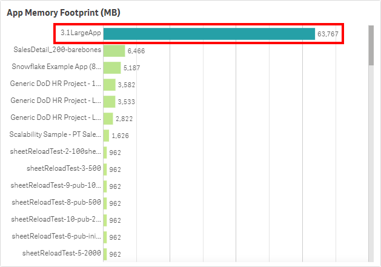
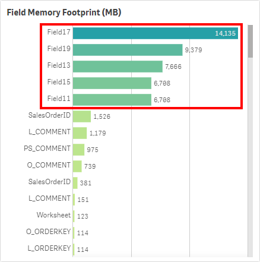
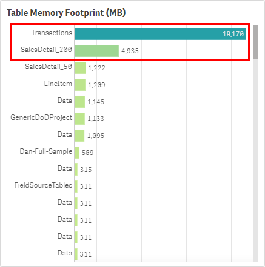
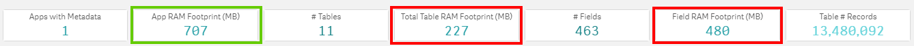
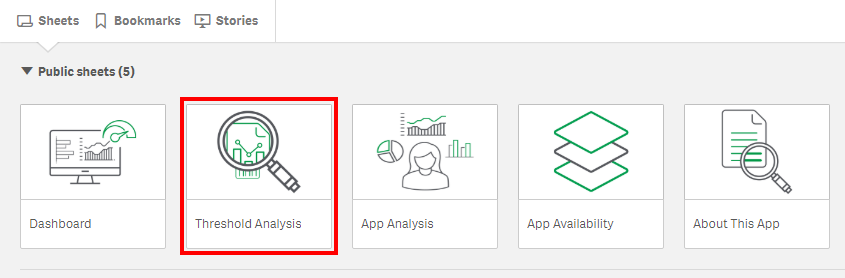
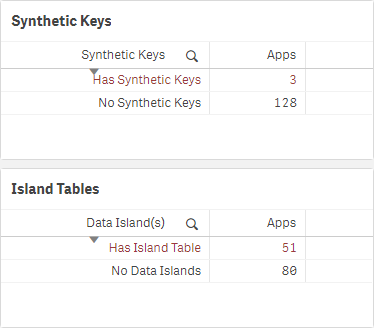

# Analyze App Metadata Analyzer
{:.no_toc}

**Cadence** Weekly

**Sites** developmentproduction

|                                  		          | Initial | Recurring |
|---------------------------------------------------------|---------|------------|
| <i class="far fa-clock fa-sm"></i> **Estimated Time**   | 45 Min  | 15 min     |

Benefits:

  - Anomaly detection
  - Visibility/standardization of data models (e.g. gating mechanism to Production)
  - Optimization of data models
  - Load balancing visibility/validation
  
-------------------------

## Goal
{:.no_toc}
Leveraging the [App Metadata Analyzer](../../tooling/app_metadata_analyzer.md) enables the following:
  - Insight into the composition of all data models across an entire Qlik site.
  - Visibility into what apps have synthetic keys, data islands, and circular references.
  - Visibility of base RAM footprints--which allows for sizing/load balancing considerations.
  - Indicators of what fields could be dropped/optimized by clearly displaying their size/proportion of the application.
  - Ability to apply thresholds at the application level such as: total records, total number of fields, total number of tables, disk size, etc -- allowing one to employ gating-like mechanisms to ensure data modeling standards and best practices across the site.

## Table of Contents
{:.no_toc}

* TOC
{:toc}
-------------------------

## Demo Video

{:target="_blank" .no-modal}

-------------------------

## Prerequisite

If the **App Metadata Analyzer** has not yet been imported into the site, navigate to the [Where to get it](../../tooling/app_metadata_analyzer.md#where-to-get-it) section of the [App Metadata Analyzer](../../tooling/app_metadata_analyzer.md) article for instructions on where to find the application.

### Confirm the App Metadata Analyzer is Operational

Navigate to the **Monitoring apps** stream (or wherever the **App Metadata Analyzer** application has been published to) and select the **Details** button (info icon) on the **App Metadata Analyzer** application. Confirm that the application's data is up-to-date.

If the **App Metadata Analyzer** is not up-to-date, please refer to the [App Metadata Analyzer](../../tooling/app_metadata_analyzer.md#documentation) article for configuration details and troubleshooting steps.

{::options parse_block_html="true" /}

<i class="fas fa-exclamation-circle fa-sm"></i> Note

As the **App Metadata Analyzer** is not imported into the QMC by default, it is suggested that it is put on a nightly reload task. The application can of course be reloaded more frequently if desired, but nightly is the suggested cadence.

-------------------------

## Set Thresholds

{::options parse_block_html="true" /}

<i class="fas fa-exclamation-circle fa-sm"></i> Note

If this is not the first time this activity has been completed, then likely the thresholds do not need to be reset. Skip to the next action unless they require modification.

Navigate to the **Data load editor** and select the **configuration** tab. On this tab, optional variables can be set to adjust the threshold settings. Ensure that these settings are set to values that the organization _does not want to exceed_. For example, if it is desired to not have a table with more than 100M records, then the `vTableRecordCountThreshold` can be set to `100000000`.

These threshold variables will set dimensional fields so that applications that breach these thresholds can be flagged and easily selected during analysis.

## Establish Goals

{::options parse_block_html="true" /}

<i class="fas fa-exclamation-circle fa-sm"></i> Note

If this is not the first time this activity has been completed, then likely the goals do not need to be re-established. Skip to the next action unless they require modification.

This application can be used for many different purposes, depending on the environment it is running in (Dev, Test, Prod, etc). Decide what the overall goals should be with the application for the administrator.

**Suggested Goals per Tier**

- **Dev**
  - Use as a gating mechanism for higher tiers. Applications must conform to data modeling standards and exist below the desired thresholds unless a justification is provided for an exception.
  - Use to gain insight/clarity into what developers are doing/enforce thresholds.
  - Identify developers that might be candidates for educational data modeling courses. I.e. those that have many apps with synthetic keys, very many fields/many tables, etc. This can be relevant to organizations that have many developers.
  
- **Test**
  - Use for optimization. Refer to the [Optimization](#optimization) section below.
  
- **Prod**
  - Use for optimization. Refer to the [Optimization](#optimization) section below.
  - Identify candidates for load balancing. Refer to the [load balancing section](../../system_planning/review_update_capacity_plan/applications.md#app-metadata-analyzer-1){:target="_blank"} of the [Review/Update Capacity Plan](../../system_planning/review_update_capacity_plan.md){:target="_blank"} article.
  
## Optimization

The purpose of this subsection is to optimize application's data models, prioritizing the applications with large base RAM footprints first (the amount of RAM an application takes on the server without any users).

### Identify applications with large base RAM footprints.

Navigate to the **Dashboard** sheet.

Refer to the **App Memory Footprint (MB)** table. In this example, there is an application that takes up ~63 GB in RAM.

Prioritize applications that are both large _and_ widely used. Refer to [Analyze App Adoption](analyze_app_adoption.md){:target="_blank"} for how to view the user activity on an application, and review each large application from this exercise there.

### Identify Fields for Optimization

For each large app identified above, look for fields that take a large amount of RAM. Refer to the **Field Memory Footprint (MB)** table. This table illustrates the **Symbol Tables** (for a good read on Symbol Tables and Data Tables, refer to [this article on Qlik Community](https://community.qlik.com/t5/Qlik-Design-Blog/Symbol-Tables-and-Bit-Stuffed-Pointers/ba-p/1475369){:target="_blank"}). If the values are large in this table, it typically implies that the field's values are large and non-unique. Take a comment field for example -- long text values with a very high cardinality. It is imporant to ensure fields like this are optimized/necessary for analysis, as they can add weight to applications quickly.

Can these fields be optimized or potentially removed if unused? For instance, are any of the fields timestamps that could be floored or split apart into multiple fields to reduce cardinality? 

To see if the fields are unused, it is suggested to use Rob Wunderlich's [App Analyzer](https://qlikviewcookbook.com/tools/#squelch-taas-accordion-shortcode-content-5){:target="_blank"}. This tool is used to lift a single app into RAM and analyze it, then provide a detailed output in the form of a Qlik application. It is a great companion tool to the **App Metadata Analyzer**, as the **App Metadata Analyzer** allows one to spot potential applications that could use optimization, and then the **App Analyzer** can drill into the low-level details of that application. It has the ability to optimize the UI of the application as well, which this exercise does not cover.

### Identify Tables for Optimization

For each large app identified above, look for tables that take a large amount of RAM. Have a look at the **Table Memory Footprint (MB)** table, also on the **Dashboard** sheet. This table illustrates the **Data Tables** ([article on Qlik Community](https://community.qlik.com/t5/Qlik-Design-Blog/Symbol-Tables-and-Bit-Stuffed-Pointers/ba-p/1475369){:target="_blank"}). The more records/columns in a table, the higher the table memory footprint.

How many fields exist in these tables? If there are many fields (hundreds for example) in a table, it is likely that the developer is using a `SELECT * FROM` approach, and likely have many fields that aren't used for analysis in the application. This is another prime opportunity to leverage Rob Wunderlich's [App Analyzer](https://qlikviewcookbook.com/tools/#squelch-taas-accordion-shortcode-content-5){:target="_blank"} to remove many fields.

It is also worth considering the total record count of the tables. Are they at the appropriate level of grain? Is it possible that the table or portions of the table could be aggregated, or could alternative approaches like app segmentation, app chaining, or on-demand app generation be leveraged?

{::options parse_block_html="true" /}

<i class="fas fa-exclamation-circle fa-sm"></i> Note

When dealing with very large data volumes, there are many strategies when designing the architecture of your applications. Here are three strategies:
  
[**Segmentation**](https://community.qlik.com/t5/Qlik-Design-Blog/Big-Data-with-Qlik-One-method-does-not-fit-all/ba-p/1474484){:target="_blank"}: Segmenting QVDs and QVF's by timeframes or another dimensionality like region. You might have a QVF that views the most recent two years, then another that views years that are further back, and one large QVF that contains all data that is only used when necessary by a small subset of users. Another approach might be to have multiple apps focused on different regions, so that user's do not open an app with data that they are not interested in or have the right to see (data that is not able to be seen via section access still affects memory). With this method, the lighter weight (most recent data) application will be used by most users, saving memory as that is all they will typically need.
  
[**ODAG**](https://help.qlik.com/en-US/sense/Subsystems/Hub/Content/DataSource/Manage-big-data.htm){:target="_blank"}: ODAG stands for on-demand app generation, and is a method where you have two applications: 1. a shopping cart (aggregated data), 2. an empty template app to display detail. The workflow is such that a user must first make selections in the shopping cart app (this criteria is completely customizable), and once a threshold has been met, a custom LOAD script is then created which then populates the template app with whatever detail was requested.
  
[**Document Chaining**](https://community.qlik.com/t5/Qlik-Design-Blog/Big-Data-with-Qlik-One-method-does-not-fit-all/ba-p/1474484){:target="_blank"}: Document chaining is where you have an aggregated application which typically is sufficient to the user, but when the user does need the detail, selections can be passed from the aggregated app to the detail app so that they can view a lower level of granularity. This keeps a low user footprint on the detail app, thereby reducing the memory of everyone loading unnecessary detail. While this is directly available in QlikView, it is supported via the APIs and thereby extensions in Qlik Sense.

  
Much more information around optimizing applications and data models can be found on the [Diagnostic Toolkit](https://diagnostictoolkit.qlik-poc.com){:target="_blank"} website.

Together, both of these metrics (Table RAM and Field RAM) add up to the base RAM footprint.

### Identify the Presence of Synthetic Keys & Data Islands

Navigate to the **Threshold Analysis** sheet.

On each sheet on the bottom left, there are two tables: 

If there are synthetic keys, the majority of the time, it is a sign of a problem in the data model, and they should be rectified. There are of course scenarios when synthetic keys are harmless, and in fact the most optimal option, but that is typically not the case. For more information, refer to this [Qlik Design Blog: Synthetic Keys](https://community.qlik.com/t5/Qlik-Design-Blog/Synthetic-Keys/ba-p/1472634){:target="_blank"} article.

If there are any synthetic keys, select `Has Synthetic Keys`, and then view the applications, tables, and fields that contain them.

If there are data islands, these also should be avoided where possible and should be _attempted_ to be rectified in the model. For more information, refer to [The Impact of Data Islands on Cache and CPU](https://qlikviewcookbook.com/2015/06/the-impact-of-data-islands-on-cache-and-cpu/){:target="_blank"}, an article by Rob Wunderlich.

Repeat the process for data islands, by selecting **Has Island Table**, and viewing the associated apps and island tables.

## Review Load Balancing

If the Qlik Sense site has greater than two end-user facing nodes, it is worth considering "pinning" (load balancing) large applications to dedicated engines (2+ for resiliency).

Refer to the [load balancing](../../system_planning/review_update_capacity_plan/applications.md#app-metadata-analyzer-1){:target="_blank"} section of the [Review/Update Capacity Plan](../../system_planning/review_update_capacity_plan.md){:target="_blank"} article, where this process is explained.

For more detail on load balancing of assets and instructions on how to do so, refer to the [Segregation of Larger Qlik Apps](review_pinning_load_balancing.md#scenario-2---segregation-of-larger-qlik-apps){:target="_blank"} section of the [Review Pinning/Load Balancing](review_pinning_load_balancing.md){:target="_blank"} article.

## Documentation

[App Metadata Analyzer](../../tooling/app_metadata_analyzer.md)

**Tags**

#weekly

#asset_management

#apps

#metadata

#app_metadata_analyzer

&nbsp;
