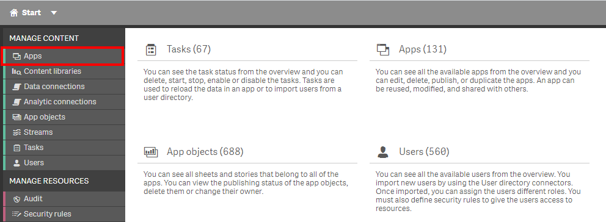
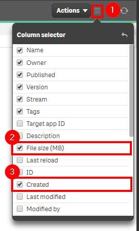
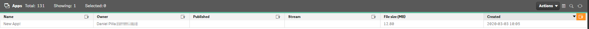
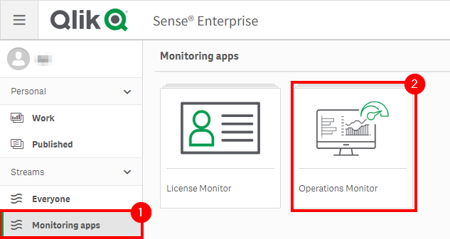
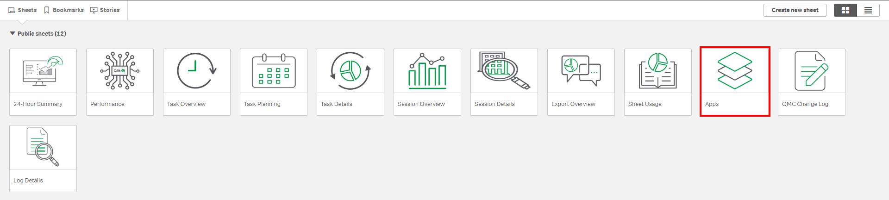
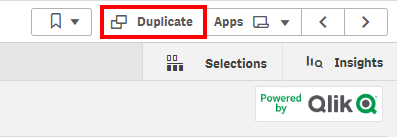
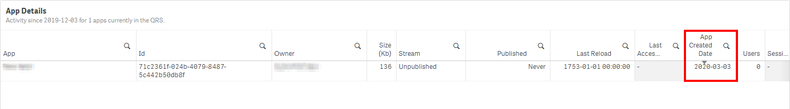

# Check for New Apps <i class="fas fa-file-code fa-xs" title="API | Script Optional"></i>*
{:.no_toc}

<span class="label dev">development</span><span class="label prod">production</span>

|                                  		                    | Initial | Recurring |
|---------------------------------------------------------|---------|-----------|
| <i class="far fa-clock fa-sm"></i> **Estimated Time**   | 5 Min   | 5 min     |

Benefits:

  - Awareness of new applications
  
-------------------------

## Goal
{:.no_toc}
While the idea of simply checking for new applications seems relatively trivial and not particularly actionable, it is a good practice as it only takes a couple of minutes and can increase reaction times to the presence of large applications. This page illustrates three methods of visualizing/gathering that high-level application data on newly created applications, so that the administrator can be aware/potentially report on it.

## Table of Contents
{:.no_toc}

* TOC
{:toc}
-------------------------

## QMC - Apps

In the QMC, select **Apps**:

[](https://raw.githubusercontent.com/qs-admin-guide/qs-admin-playbook/master/docs/asset_management/apps/images/check_new_apps_native_1.png)

In the upper right hand side of the screen, select the **Column selector**, and then select the **File size (MB)** and **Created** columns. To make the resulting table a bit more manageable, optionally deselect additional columns like **Version** and **Tags**.

[](https://raw.githubusercontent.com/qs-admin-guide/qs-admin-playbook/master/docs/asset_management/apps/images/check_new_apps_native_2.png)

Now select the filter icon for the **Created** column, and then select the filter of **Last seven days**, or the desired range.

[](https://raw.githubusercontent.com/qs-admin-guide/qs-admin-playbook/master/docs/asset_management/apps/images/check_new_apps_native_3.png)

Lastly, one can review the resulting table and view any new apps, noting their file sizes. If any are particularly large, it might be worthwhile to follow-up with the owner of the application, and possibly do further analysis in with the App Metadata Analyzer.

[](https://raw.githubusercontent.com/qs-admin-guide/qs-admin-playbook/master/docs/asset_management/apps/images/check_new_apps_native_4.png)

-------------------------

## Operations Monitor

This page leverages the **Operations Monitor**. Please refer to the [Operations Monitor](../../tooling/operations_monitor.md) page for an overview and relevant documentation links.

### Confirm Operations Monitor is Operational

Navigate to the **Monitoring apps** and select the _Details_ button (info icon) on the **Operations Monitor** application. Confirm that the application's data is up-to-date.

[](https://raw.githubusercontent.com/qs-admin-guide/qs-admin-playbook/master/docs/asset_management/apps/images/ops_monitor_operational.png)

If the **Operations Monitor** is not up-to-date, please refer to the [Operations Monitor Documentation](../../tooling/operations_monitor.md#documentation) for configuration details and troubleshooting steps.

-------------------------

## Hub - Operations Monitor

Open up the Hub and navigate to the **Monitoring apps** stream. Select the **Operations Monitor** application.

[](https://raw.githubusercontent.com/qs-admin-guide/qs-admin-playbook/master/docs/asset_management/apps/images/check_new_apps_native_2_1.png)

From the **App overview** page, select the **Apps** sheet.

[](https://raw.githubusercontent.com/qs-admin-guide/qs-admin-playbook/master/docs/asset_management/apps/images/check_new_apps_native_2_2.png)

Select **Duplicate**, as a column will be added that isn't currently in a table.

[](https://raw.githubusercontent.com/qs-admin-guide/qs-admin-playbook/master/docs/asset_management/apps/images/check_new_apps_native_2_3.png)

In **Edit** mode, select the **App Details** table, and add the **App Created Date** field.

[](https://raw.githubusercontent.com/qs-admin-guide/qs-admin-playbook/master/docs/asset_management/apps/images/check_new_apps_native_2_4.png)

It is now possible to sort by that column to view new apps. In addition, feel free to add the **App File Size** field as well to filter by large applications only.

[](https://raw.githubusercontent.com/qs-admin-guide/qs-admin-playbook/master/docs/asset_management/apps/images/check_new_apps_native_2_5.png)

-------------------------

## Get List of New Apps (Qlik CLI) <i class="fas fa-file-code fa-xs" title="API | Requires Script"></i>

The below script snippet requires the [Qlik CLI](../../tooling/qlik_cli.md).

The script will bring back any application that is greater than or equal to x days old _and_ greater than or equal to z bytes. The script will then store the output into a desired location in either csv or json format.

### Script
```powershell
# Function to collect applications that were created in the last x days over z size in bytes

################
## Parameters ##
################

# Assumes default credentials are used for the Qlik CLI Connection

# machine name
$computerName = 'machineName'
# leave empty if windows auth is on default VP
$virtualProxyPrefix = '/default'
# set the number of days back for the app created date
$daysBack = 7
# set the byte size threshold for application disk size (if only large apps are desired)
$byteSize = 0
# directory for the output file
$filePath = 'C:\'
# desired filename of the output file
$fileName = 'output'
# desired format of the output file (can be 'json' or 'csv')
$outputFormat = 'json'

################
##### Main #####
################

# set the output file path
$outFile = ($filePath + $fileName + '.' + $outputFormat)

# set the date to the current time minus $daysback
$date = (Get-Date -date $(Get-Date).AddDays(-$daysBack) -UFormat '+%Y-%m-%dT%H:%M:%S.000Z').ToString()

# set the computer name for the Qlik connection call
$computerNameFull = ($computerName + $virtualProxyPrefix).ToString()

# connect to Qlik
Connect-Qlik -ComputerName $computerNameFull -UseDefaultCredentials -TrustAllCerts

# check the output format
# GET all apps that are created >= $date and >= $byteSize
# output results to $outfile
If ($outputFormat.ToLower() -eq 'csv') {
  Get-QlikApp -filter "createdDate ge '$date' and fileSize ge $byteSize" -full | ConvertTo-Csv -NoTypeInformation | Set-Content $outFile
  }  Else {
  Get-QlikApp -filter "createdDate ge '$date' and fileSize ge $byteSize" -full | ConvertTo-Json | Set-Content $outFile
} 
```
{:.snippet}

**Tags**

#weekly

#asset_management

#apps

&nbsp;
