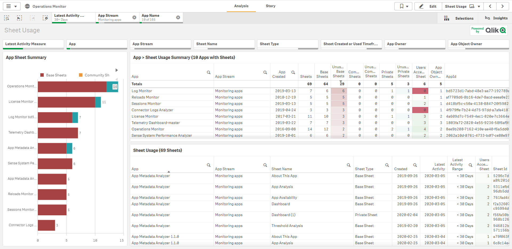
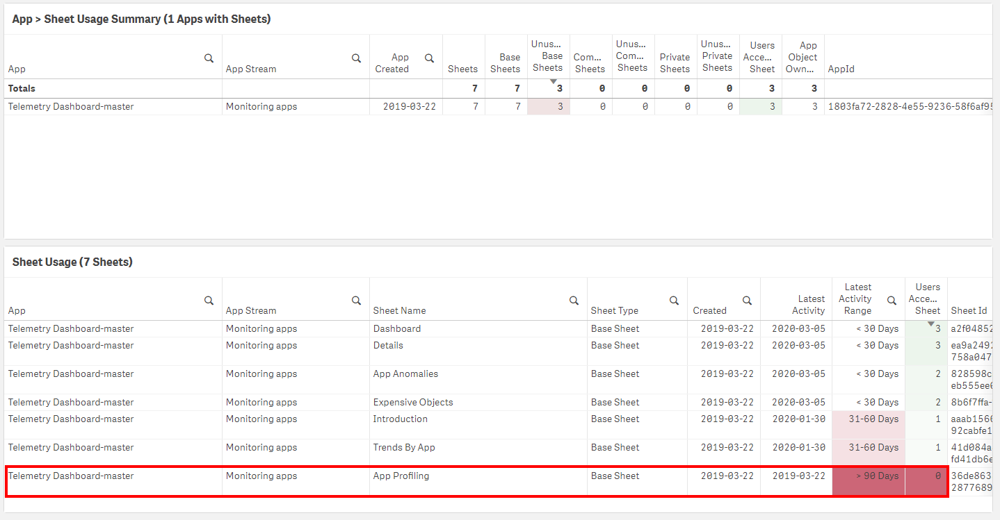
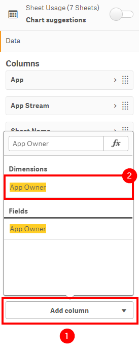
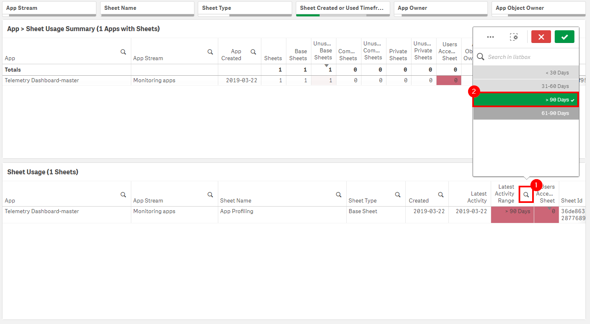

# Flag Unused Base/Community Sheets <i class="fas fa-file-code fa-xs" title="API | Script Optional"></i>*
{:.no_toc}

**Cadence** <span class="label cadence">Monthly</span>

**Sites** <span class="label prod">production w/ self-service</span>

|                                  		                    | Initial    | Recurring |
|---------------------------------------------------------|------------|-----------|
| <i class="far fa-clock fa-sm"></i> **Estimated Time**   | 1-2 hr     | 30 min    |

Benefits:

  - Increase performance
  - Reduce maintenance
  - Improve focus
  
-------------------------

## Goal
{:.no_toc}
There are three primary goals:
  - Remove (or consider modifying) "Base" sheets that are not being used. This will focus down your applications and remove clutter, while also increasing performance of the site.
  - Keep "Community" sheets under control. In large environments where self-service is enabled, both private (personal sheets on a published application), and community sheets can grow rapidly out of control -- especially if the application's base sheets doesn't offer what the end-user is looking for, causing them to create their own sheets.
  - Finding out "why" users are not using certain base sheets and/or why they are creating and publishing many community sheets, as that content could potentially be made part of the standardized application.

{::options parse_block_html="true" /}
<div class="card">
<div class="card-header">
<i class="fas fa-exclamation-circle fa-sm"></i> Note
</div>
<div class="card-body">
<p>"Private" sheets should be handled a bit differently--please refer to: [Remove Unused Private Sheets](remove_unused_private_sheets.md)</p>
</div>
</div>

## Table of Contents
{:.no_toc}

* TOC
{:toc}

-------------------------

## Suggested Prerequisites

- [Remove/Quarantine Unused Apps](remove_quarantine_unused_apps.md)

-------------------------

## Audit Activity Log

As of the February 2019 release, an improvement was added to the product to log sheet usage at default log levels. This enables the ability to measure sheet adoption as well as manage the amount of sheets in the applications--keeping them trimmed to only what is being leveraged.

Ensure that the **Audit Activity log level** is set to **Basic** for _every engine_. 

{::options parse_block_html="true" /}
<div class="card">
<div class="card-header">
<i class="fas fa-exclamation-circle fa-sm"></i> Note
</div>
<div class="card-body">
<p>This is the default setting, but it is encouraged for the Qlik administrator to confirm what is configured for their environment(s).</p>
</div>
</div>


-------------------------

## Operations Monitor

This page leverages the **Operations Monitor**. Please refer to the [Operations Monitor](../../tooling/operations_monitor.md) page for an overview and relevant documentation links.

### Confirm Operations Monitor is Operational

Navigate to the **Monitoring apps** and select the **Details** button (info icon) on the **Operations Monitor** application. Confirm that the application's data is up-to-date.


If the **Operations Monitor** is not up-to-date, please refer to the [Operations Monitor Documentation](../../tooling/operations_monitor.md#documentation) for configuration details and troubleshooting steps.

-------------------------

## Identification of Unused Sheets

This usage information is then surfaced inside of the **Operations Monitor** on the **Sheet Usage** sheet.



As an example, we'll select the **Telemetry Dashboard** application on one of our rarely used internal servers, and we can see that the **App Profiling** base sheet hasn't been accessed in, actually almost exactly one year.



It is suggested that the administrator would add the **App Owner** field to the **Sheet Usage** table, as this table already contains the relevant information needed to report on usage, and the owner field is need to know who to contact.



As far as the time range for sheets that are unused (or minimally used), it is suggested to select the `> 90 days` value from the **Latest Activity Range** field -- though this range is ultimately up to the organization.



-------------------------

## Suggested Actions

Once the table has been built out and the filters and time ranges have been decided upon, it is suggested to then contact the owners either manually or programmatically via something like NPrinting. It is advised that it should be the owner's responsibility to decide what to do with these unused sheets. The app owners can then be responsible for contacting the community sheet owners for their individual cleanup. Base sheets should be considered the most critical sheets to address, with community sheets following.

In addition to the above, it is entirely possible that users aren't leveraging sheets because they potentially aren't positioned (ordered) properly, users are unaware of them, users don't understand how to leverage them, or users possibly aren't interested in the data presented on them. Rather than simply remove them, is is encouraged for the app owners to understand _why_ they are not being leveraged to better the applications and overall Qlik experience.

-------------------------

## Bulk Community Sheet Removal <i class="fas fa-tools fa-xs" title="Tooling | Pre-Built Solutions"></i> <i class="fas fa-file-code fa-xs" title="API | Requires Script"></i>

The below script snippet requires the [Qlik CLI](../../tooling/qlik_cli.md).

{::options parse_block_html="true" /}
<div class="card">
<div class="card-header">
<i class="fas fa-exclamation-circle fa-sm"></i> Note
</div>
<div class="card-body">
<p>Base sheets should never be removed programmatically.</p>
</div>
</div>

{::options parse_block_html="true" /}
<div class="card">
<div class="card-header">
<i class="fas fa-exclamation-circle fa-sm"></i> Note
</div>
<div class="card-body">
<p>When possible, one should always remove community sheets manually, leaving that responsibility to the owner of the applications. That being said, if there are potentially thousands of community sheets that need to be removed, and this is the first time the organization is starting this management process, it is possible to programmatically remove these assets. This would generally be a one-time operation, as it is suggested to do this process monthly, which should be able to be maintained incrementally.</p>
</div>
</div>

The script below will tag any community sheets with the tag `UnusedCommunitySheet`. It expects an Excel file (XLSX) as an input, where the name of the column with the **Sheet Id** is specified. This allows for the Qlik Administrator to export a filtered down list from the **Sheet Usage** table in the **Sheet Usage** sheet of the Operations Monitor.

The below script assumes that the desired **Tag** has already been created, e.g. `UnusedCommunitySheet`.

### Script to Tag Unused Community Sheets

```powershell
#Requires -Modules ImportExcel
# Assumes the ImportExcel module: `Install-Module -Name ImportExcel`
# Function to tag community sheet ids from excel and tag them
# Assumes tag exists, such as 'UnusedCommunitySheet'
# GUID validation code referenced from: https://pscustomobject.github.io/powershell/functions/PowerShell-Validate-Guid-copy/

################
## Parameters ##
################

# Assumes default credentials are used for the Qlik CLI Connection

# machine name
$computerName = '<machine-name>'
# leave empty if windows auth is on default VP
$virtualProxyPrefix = '/default'
# set the number of days back for the app created date
# fully qualified path to excel file with sheet ids
$inputXlsxPath = '<absolute file path>/<filename>.xlsx'
# column number of sheet id column in Excel file
$sheetIdColumnNumber = '9'
# the desired name of the tag to tag sheets with - it must exist in the QRS
$tagName = 'UnusedCommunitySheet'
# directory for the output file
$outFilePath = 'C:\'
# desired filename of the output file
$outFileName = 'tagged_community_sheets'

################
##### Main #####
################

# set the output file path
$outFile = ($outFilePath + $outFileName + '.csv')

# set the computer name for the Qlik connection call
$computerNameFull = ($computerName + $virtualProxyPrefix).ToString()

# if the output file already exists, remove it
if (Test-Path $outFile) 
{
  Remove-Item $outFile
}

# function to validate GUIDs
function Test-IsGuid
{
	[OutputType([bool])]
	param
	(
		[Parameter(Mandatory = $true)]
		[string]$ObjectGuid
	)
	
	[regex]$guidRegex = '(?im)^[{(]?[0-9A-F]{8}[-]?(?:[0-9A-F]{4}[-]?){3}[0-9A-F]{12}[)}]?$'
	return $ObjectGuid -match $guidRegex
}

# import sheet ids from excel
$data = Import-Excel $inputXlsxPath -DataOnly -StartColumn $sheetIdColumnNumber -EndColumn $($sheetIdColumnNumber + 1)

# validate GUIDs and only use those (handles nulls/choosing wrong column)
$sheetIds = $data | foreach { $_.psobject.Properties } | where Value -is string | foreach { If(Test-IsGuid -ObjectGuid $_.Value) {$_.Value} }

# connect to Qlik
Connect-Qlik -ComputerName $computerNameFull -UseDefaultCredentials -TrustAllCerts

# add headers to output csv
Add-Content -Path $outFile -Value $('SheetObjectName,SheetObjectSheetId,SheetObjectAppId,SheetObjectAppName')

# GET desired tag JSON
$tagsJson = Get-QlikTag -filter "name eq '$tagName'" -raw

# get the id of the tag
$tagId = $tagsJson.id

# if the tag exists
if($tagsJson) {

	# for each tag
	foreach ($sheetId in $sheetIds) {
	
		# GET the object, ensuring it is a community sheet
		$sheetObjJson = Get-QlikObject -filter "published eq true and approved eq false and id eq $sheetId" -full -raw
		
		# if the object exists and is a community sheet
		if ($sheetObjJson) {

			# set a flag to check if the tag is already assigned to the sheet
			$tagAlreadyThere = $false

			# get the current tags assigned to sheet, if any
			$currentTags = $sheetObjJson.tags
			$currentTags

			# for each tag
			foreach ($tag in $currentTags) {

				# if the target tag is already there, set the flag to "true"
				if ($tagId -eq $tag.id) {
					$tagAlreadyThere = $true
					break
				}
				else {
					continue
				}
			}
		
			# get the sheet name, app id, and app name
			$sheetObjName = $sheetObjJson.name
			$sheetObjAppId = $sheetObjJson.app.id
			$sheetObjAppName = $sheetObjJson.app.name

			# if the tag isn't already there, add it
			if (!$tagAlreadyThere) {
				$sheetObjJson.tags += $tagsJson

				# convert to JSON for the PUT
				$sheetObjJson = $sheetObjJson | ConvertTo-Json

				# PUT the sheet with the new tag
				Invoke-QlikPut -path /qrs/app/object/$sheetId -body $sheetObjJson
			}
			
			# write output
			Add-Content -Path $outFile -Value $($sheetObjName + ',' + $sheetId + ',' + $sheetObjAppId + ',' + $sheetObjAppName)
		}
		
		# the sheet is not a community sheet
		else {
			$sheetId + ' is not a community sheet. Skipping.'
		}
	}
}

# the tag doesn't exist
else {
	"Tag: '" + $tagName + "' doesn't exist. Please create it in the QMC."
}
```
{:.snippet}

### Script to Delete Tagged Sheets

{::options parse_block_html="true" /}
<div class="card">
<div class="card-header">
<i class="fas fa-exclamation-circle fa-sm"></i> Note
</div>
<div class="card-body">
<p>It is highly recommended to _backup your site and applications_ before considering taking the approach of programmatic sheet removal. This process cannot be reversed. The sheet pointers are stored in the repository database, and the sheets reside within the qvfs themselves.</p>
</div>
</div>

In order to completely remove sheets from both an application and the repository database, the [Qlik Engine JSON API](https://help.qlik.com/en-US/sense-developer/Subsystems/EngineAPI/Content/Sense_EngineAPI/introducing-engine-API.htm) must be used. To work with this API, the sample script leverages [Enigma.js](https://help.qlik.com/en-US/sense-developer/Subsystems/APIs/Content/Sense_ClientAPIs/enigmajs/enigmajs-introduction.htm).

{::options parse_block_html="true" /}
<div class="card">
<div class="card-header">
<i class="fas fa-exclamation-circle fa-sm"></i> Note
</div>
<div class="card-body">
<p>If it is attempted to use the QRS API to remove sheets instead of the Engine API, only the "pointers" to those sheets will be removed from the repository database--the sheet information itself stored inside of the qvf will not be removed. This is why the Engine API must be leveraged for programmatic deletion, as it purges both.</p>
</div>
</div>

#### Prerequisites

- NodeJS

This process uses NodeJS to interact with the Qlik Engine JSON API. To confirm that NodeJS is installed and properly configured, run the following commands in `cmd.exe`:
- `node --version`
- `npm --version`

#### Steps

1. Download the following files from [here](https://github.com/eapowertools/qs-admin-playbook/tree/master/scripts/remove_tagged_community_sheets) and place them in a desired folder.
  - `remove_tagged_community_sheets.js`
  - `package.json`
2. Edit the following mandatory variables in `remove_tagged_community_sheets.js`
 - `host`
 - `TAG_TO_SEARCH_FOR`
3. Open a cmd prompt, and navigate to the folder from step 1.
4. Enter `npm install`
5. To execute the program, enter `node remove_tagged_community_sheets.js`
6. Refer to both `log.txt` and `output.csv`

**Tags**

#monthly

#asset_management

#apps

#sheets

#operations_monitor

&nbsp;
