# Optimize Sheet Order for Adoption
{:.no_toc}

production

|                                  		                    | Initial | Recurring |
|---------------------------------------------------------|---------|-----------|
| <i class="far fa-clock fa-sm"></i> **Estimated Time**   | 1 hr    | 15 min    |

Benefits:

  - Increase adoption
  - Improve focus
  
-------------------------

## Goal
{:.no_toc}

This supports both the administrator and the application owner in optimizing application the order of sheets, supported by usage data. 

When an application is developed, the sheets are ordered in a logical flow (Ex: [DAR methodology](https://community.qlik.com/t5/Qlik-Design-Blog/DAR-methodology/ba-p/1466733), a methodology that suggests flowing data from high-level down to the detail. When considering re-ordering sheets, ensure that this methodology isn't lost if already in place.

It is integral to combine the usage data with the logical flow to make sure that the new sheet order will increase adoption rates and BI effectiveness.

This activity should not be attempted for every application, and should be prioritized to highly-used applications.

## Table of Contents
{:.no_toc}

* TOC
{:toc}

-------------------------

## Suggested Prerequisites

- [Notification of Unused Base/Community Sheets](notification_unused_sheets.md)

-------------------------

## Audit Activity Log

As of the February 2019 release, the **Audit Activity Log** capability is now enabled, which allows for the tracking of who is accessing what sheets in applications. This enables the ability to measure sheet adoption as well as manage the amount of sheets in the applications--keeping them trimmed to only what is being leveraged.

This logging must be enabled on _every engine_ that the information is desired from, and is turned on by default on supporting releases.

[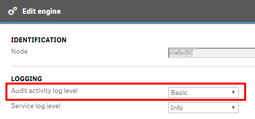](https://raw.githubusercontent.com/qs-admin-guide/qs-admin-playbook/master/docs/asset_management/apps/images/notification_unused_sheets_native_1.png)

-------------------------

## Operations Monitor

This page leverages the **Operations Monitor**. Please refer to the [Operations Monitor](../../tooling/operations_monitor.md) page for an overview and relevant documentation links.

### Confirm Operations Monitor is Operational

Navigate to the **Monitoring apps** and select the _Details_ button (info icon) on the **Operations Monitor** application. Confirm that the application's data is up-to-date.

If the **Operations Monitor** is not up-to-date, please refer to the [Operations Monitor Documentation](../../tooling/operations_monitor.md#documentation) for configuration details and troubleshooting steps.

-------------------------

## Select Applications with a Higher or Lower Quantity of Sessions

Before analyzing the sheet usage data, it is a good practice to select specific applications to analyze. It is recommended that one starts with the top five applications with the highest quantity of sessions.

Open up the **Operations Monitor** application, inside of **Monitoring Apps** stream.

Open the **Session Details** sheet.

[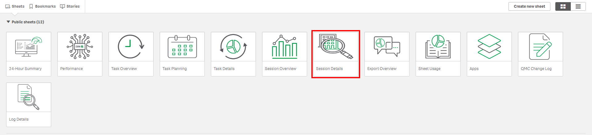](https://raw.githubusercontent.com/qs-admin-guide/qs-admin-playbook/master/docs/asset_management/apps/images/session_details.png)

In the _App Session Summary_ table, sort the **Sessions** column descending.

[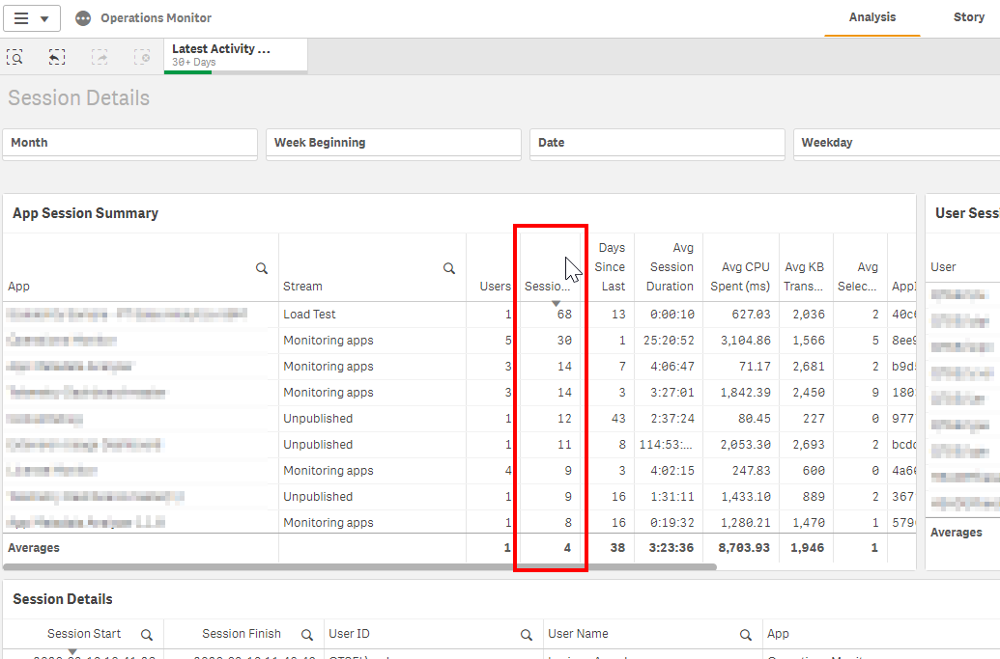](https://raw.githubusercontent.com/qs-admin-guide/qs-admin-playbook/master/docs/asset_management/apps/images/optimize_sheet_order_for_adoption03.png)

Select the top five applications.

[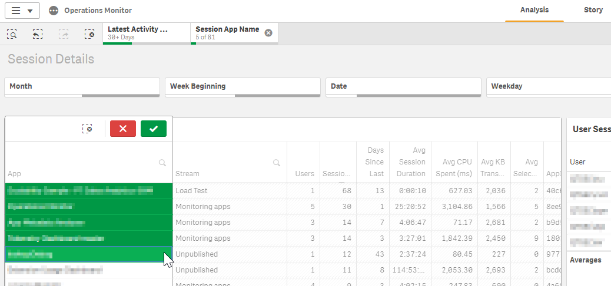](https://raw.githubusercontent.com/qs-admin-guide/qs-admin-playbook/master/docs/asset_management/apps/images/optimize_sheet_order_for_adoption04.png)

-----------------------

## Analyze Aplication Sheet Adopion

After selecting the top five applications in the previous step, the next step is to take a look at the sheet usage data for each application.

While keeping the five applications selected, navigate to the **Sheet Usage** sheet.

[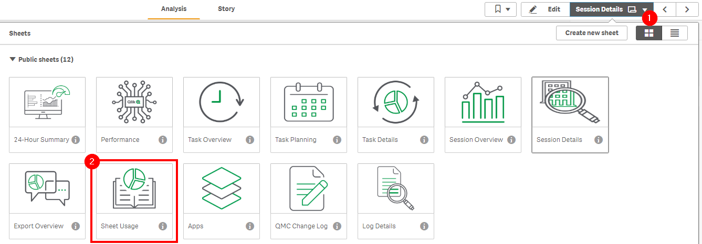](https://raw.githubusercontent.com/qs-admin-guide/qs-admin-playbook/master/docs/asset_management/apps/images/optimize_sheet_order_for_adoption05.png)

One can now visualize the number of sheets (Base, Community, and Private) that are in each selected application.

To simply the process, it is suggested to select only one application at a time. Feel free to _bookmark_ the five applications if it is more convenient. In this example, "Sample App" has been selected.

To reorder the table by the sheet usage, sort the **Users Accessing Sheets** column descending.

At this point, it is also an option to export the **Users Accessing Sheets** table and share it with the application owner to optimize the order, as the owner of the application likely knows the content the best.

> **Protip:**
> It is possible to use Qlik NPrinting to distribute the _Sheet Usage_ table to distribute sheet usage data to application owners.

[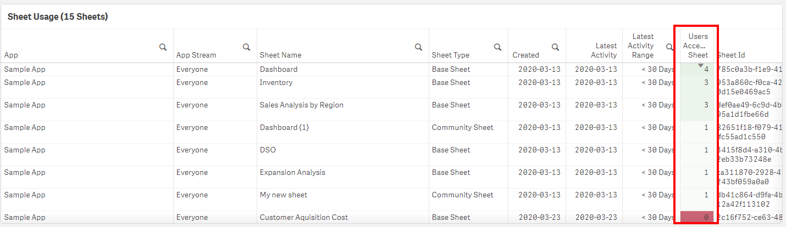](https://raw.githubusercontent.com/qs-admin-guide/qs-admin-playbook/master/docs/asset_management/apps/images/optimize_sheet_order_for_adoption07.png)

> **Protip:**
> If there are Community Sheets with a higher quantity of sessions than base sheets, it is worth investigating the content of those sheets with the application owners and considering either promoting the sheet to base, or incorporating the content into the base app otherwise.

This process should be repeated for each of the selected applications.

[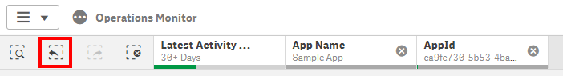](https://raw.githubusercontent.com/qs-admin-guide/qs-admin-playbook/master/docs/asset_management/apps/images/optimize_sheet_order_for_adoption08.png)

-------------------------

## Reorder Application Sheets

Before reordering the sheets, it is important to analyze the sheet's logical flow from one to the next combined with the sheet's usage data.

In this example, the _Dashboard_ sheet should remain first, even though it is not the most accessed, so that it doesn't break the application's logical flow. The _Sales Analysis_ and _Inventory_ will be moved.

[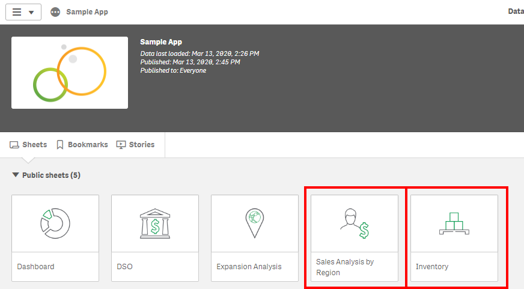](https://raw.githubusercontent.com/qs-admin-guide/qs-admin-playbook/master/docs/asset_management/apps/images/optimize_sheet_order_for_adoption09.png)

To change the sheets order, the administrator or application owner should clone the application.

[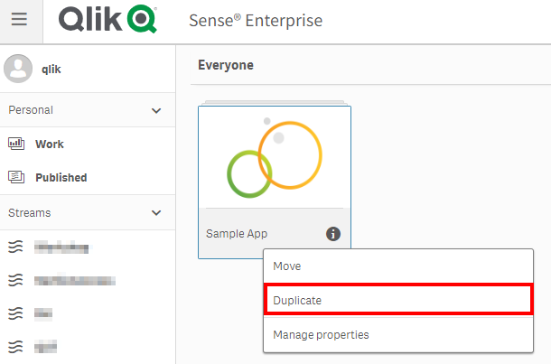](https://raw.githubusercontent.com/qs-admin-guide/qs-admin-playbook/master/docs/asset_management/apps/images/optimize_sheet_order_for_adoption10.png)

As soon as the application gets duplicated, the new duplicated application will reside in the owner's "My work" area.

[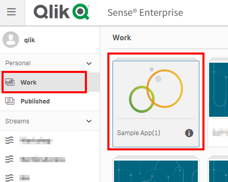](https://raw.githubusercontent.com/qs-admin-guide/qs-admin-playbook/master/docs/asset_management/apps/images/optimize_sheet_order_for_adoption11.png)

Open the application, and ensure that the _Touch screen mode_ feature is turned off.

Sheets can be moved by dragging and dropping them to a new position. In this case, the _Sales Analysis by Region_ will be moved to the second position.

[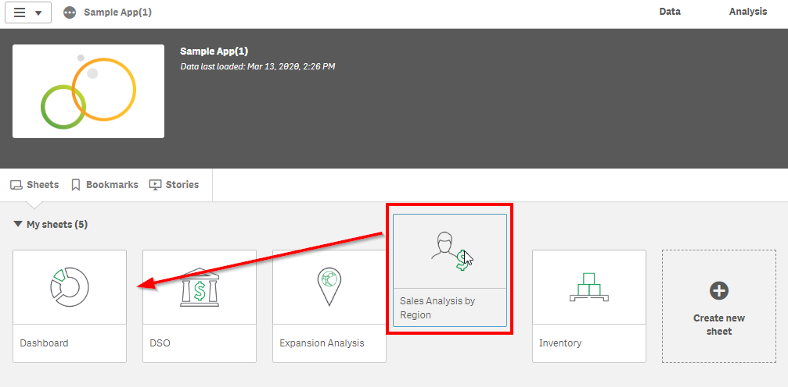](https://raw.githubusercontent.com/qs-admin-guide/qs-admin-playbook/master/docs/asset_management/apps/images/optimize_sheet_order_for_adoption13.png)

The _Inventory_ sheet will be shifted to the third position.

[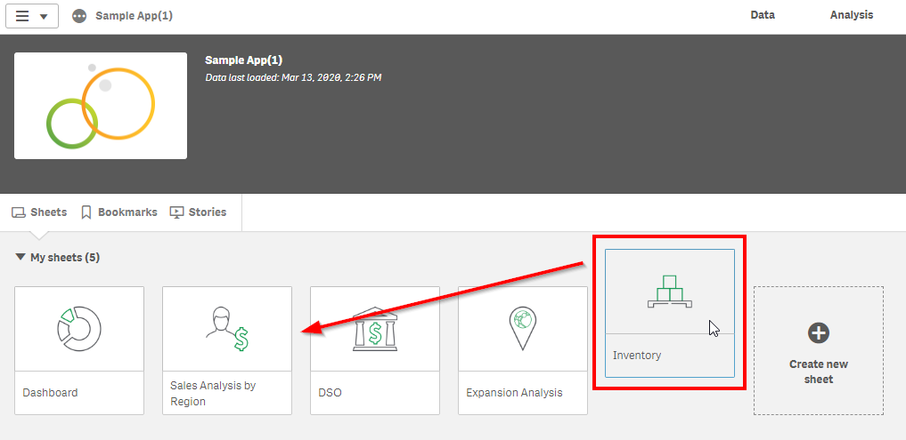](https://raw.githubusercontent.com/qs-admin-guide/qs-admin-playbook/master/docs/asset_management/apps/images/optimize_sheet_order_for_adoption14.png)

The sheet order has now been optimized.

[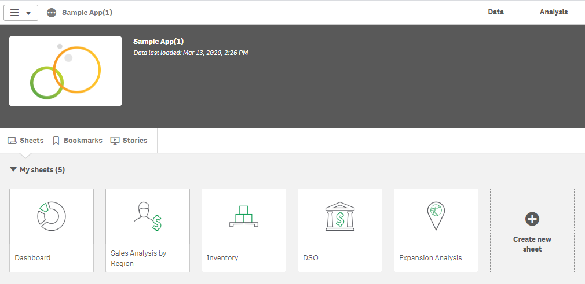](https://raw.githubusercontent.com/qs-admin-guide/qs-admin-playbook/master/docs/asset_management/apps/images/optimize_sheet_order_for_adoption15.png)

Following, the application should now "publish and replace" the original.

[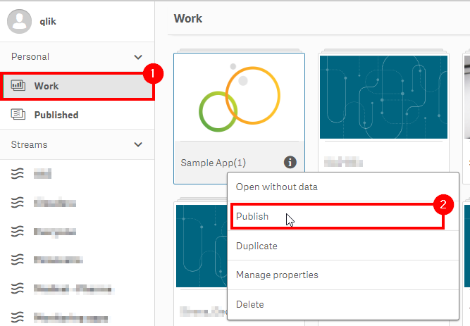](https://raw.githubusercontent.com/qs-admin-guide/qs-admin-playbook/master/docs/asset_management/apps/images/optimize_sheet_order_for_adoption16.png)

Make sure to check the **Replace the existing app** box.

[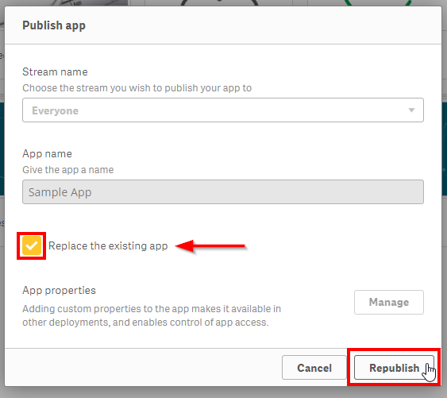](https://raw.githubusercontent.com/qs-admin-guide/qs-admin-playbook/master/docs/asset_management/apps/images/optimize_sheet_order_for_adoption17.png)

**Tags**

#quarterly

#asset_management

#apps

#sheets

&nbsp;
