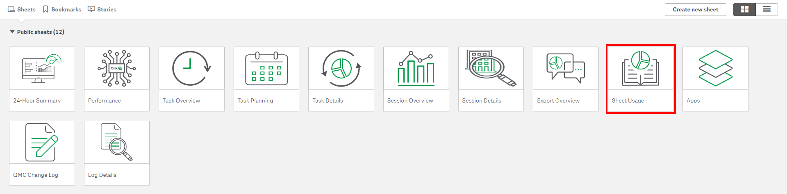
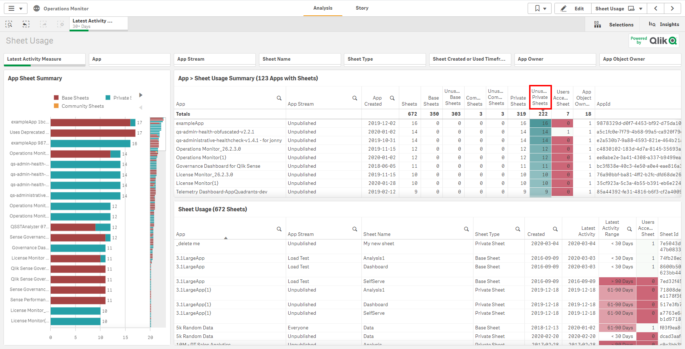
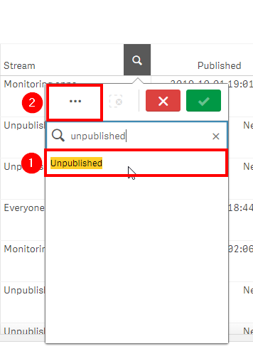
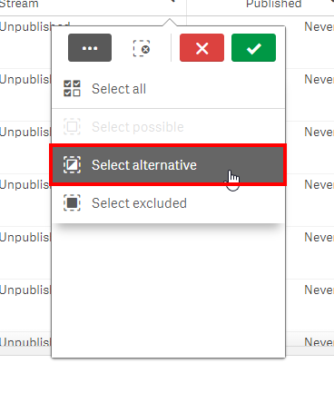
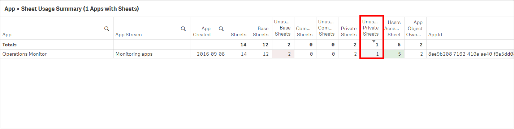
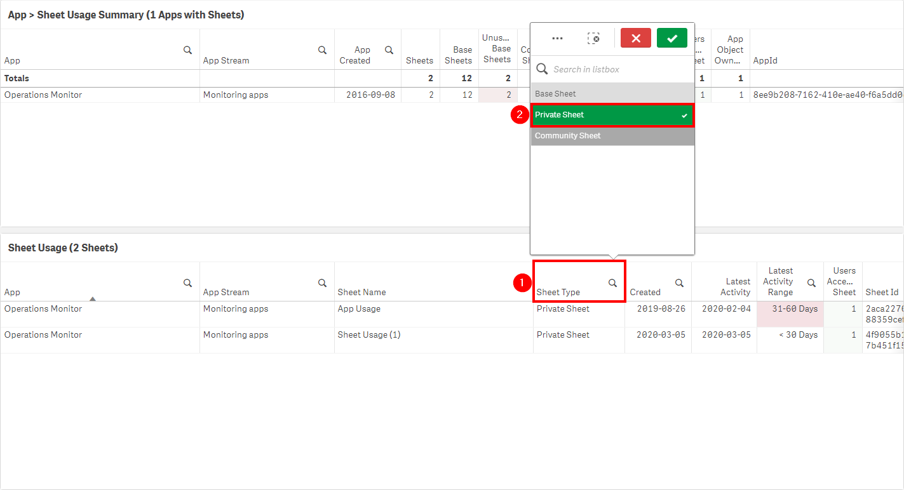

# Remove Unused Private Sheets <i class="fas fa-file-code fa-xs" title="API | Script Optional"></i>*
{:.no_toc}

<span class="label prod">production w/ self-service</span>

|                                  		          | Initial | Recurring |
|---------------------------------------------------------|---------|------------|
| <i class="far fa-clock fa-sm"></i> **Estimated Time**   | 1-2 hr  | 30 min     |

Benefits:

  - Increase performance
  - Reduce maintenance
  
-------------------------

## Goal
{:.no_toc}
In environments where self-service is enabled, i.e. users have the ability to create their own private sheets on published applications, with a high number of users, the number of private sheets can ultimately grow very large. The goal of this section is to illustrate how to put policies/practices in place to consistently keep the number of private sheets under control--allowing for a tidy/more performant site.

**Note that "Public" and "Community" sheets should be handled a bit differently--please refer to:** [Notification of Unused Base/Community Sheets](notification_unused_sheets.md).

## Table of Contents
{:.no_toc}

* TOC
{:toc}

-------------------------

## Suggested Prerequisites

- [Remove/Quarantine Unused Apps](remove_quarantine_unused_apps.md)

-------------------------

## Audit Activity Log

As of the February 2019 release, the **Audit Activity Log** capability is now enabled, which allows for the tracking of who is accessing what sheets in applications. This enables the ability to measure sheet adoption as well as manage the amount of sheets in the applications--keeping them trimmed to only what is being leveraged.

This logging must be enabled on _every engine_ that the information is desired from, and is turned on by default on supporting releases.

[](https://raw.githubusercontent.com/qs-admin-guide/qs-admin-playbook/master/docs/asset_management/apps/images/notification_unused_sheets_native_1.png)

-------------------------

## Operations Monitor

This page leverages the **Operations Monitor**. Please refer to the [Operations Monitor](../../tooling/operations_monitor.md) page for an overview and relevant documentation links.

### Confirm Operations Monitor is Operational

Navigate to the **Monitoring apps** and select the _Details_ button (info icon) on the **Operations Monitor** application. Confirm that the application's data is up-to-date.

[](https://raw.githubusercontent.com/qs-admin-guide/qs-admin-playbook/master/docs/asset_management/apps/images/ops_monitor_operational.png)

If the **Operations Monitor** is not up-to-date, please refer to the [Operations Monitor Documentation](../../tooling/operations_monitor.md#documentation) for configuration details and troubleshooting steps.

-------------------------

## Identification of Unused Private Sheets

Open up the **Operations Monitor** application, inside of **Monitoring Apps** stream:

[](https://raw.githubusercontent.com/qs-admin-guide/qs-admin-playbook/master/docs/asset_management/apps/images/app_adoption_17.png) 

Navigate to the **Sheet Usage** sheet.

[](https://raw.githubusercontent.com/qs-admin-guide/qs-admin-playbook/master/docs/asset_management/apps/images/unused_private_sheets_native_1.png)

Sort by **Unused Private Sheets** descending.

[](https://raw.githubusercontent.com/qs-admin-guide/qs-admin-playbook/master/docs/asset_management/apps/images/unused_private_sheets_native_2.png)

Now ideally, any unused applications should be removed _before_ this sheet pruning activity. This will allow for bulk removal of those private sheets as the _entire_ app has been identified as unused. This example is intended to only remove private sheets from _published_ applications that are _used_. Ensure that [Remove/Quarantine Unused Apps](remove_quarantine_unused_apps.md) has been followed first.

From the **App Stream** column, select _Unpublished_, and then select _Select alternative_ so that all streams are selected (all _published_ applications). Ensure that if a _Quarantine_ stream exists, that it is also deselected -- as there is no need to prune applications that are already marked for potential removal.

[](https://raw.githubusercontent.com/qs-admin-guide/qs-admin-playbook/master/docs/asset_management/apps/images/quarantine_unused_apps_native_2.png)

[](https://raw.githubusercontent.com/qs-admin-guide/qs-admin-playbook/master/docs/asset_management/apps/images/quarantine_unused_apps_native_3.png)

Now on this example server, the **Operations Monitor** application has been selected, and it is visible that there is a single unused prviate sheet. In a real-world environment, there would potentially be many, many more, but as this is taken from a rarely used testing environment, this simple example will suffice.

[](https://raw.githubusercontent.com/qs-admin-guide/qs-admin-playbook/master/docs/asset_management/apps/images/unused_private_sheets_native_3.png)

On the **Sheet Usage** table, select _Private Sheet_ under the **Sheet Type** column.

[](https://raw.githubusercontent.com/qs-admin-guide/qs-admin-playbook/master/docs/asset_management/apps/images/unused_private_sheets_native_4.png)

In this scenario, the _App Usage_ sheet has not been used in over one month but less than two. Ideally, private sheets should only be removed if they have not been used in > 90 days or more, but this needs to be defined by a policy decided internally. Please refer to the **Retention Policy** section below.

-------------------------

## Suggested Actions

### Retention Policy

It is highly suggested to have a corporate policy in place for unused private sheet retention. As the number of these sheets can grow very large and it can become quite difficult to manage manually, an automatic approach is suggested. In order to employee such a practice though, there must be notifications in place and the users must be able to act to retain their assets.

**Example Policy**

- Unused sheets will be purged after > 180 days, run at the start of each business quarter.
- An email blast will go out to all Qlik users two weeks prior to the start of the quarter, letting them know that in order retain their assets, they must ensure that they have been accessed. The simple way to do this is with a non-customized blast, however if NPrinting is available to the corporation, NPrinting could customize the emails to include the specific sheets that would be expiring sent to each specific individual.
- A reminder email will go out one week following.

**A Warning**

Deleting sheets is a permanent operation. Ensure that every measure/precaution/warning has been taken so that users are well aware of the resulting action.

-------------------------

## Bulk Private Sheet Removal <i class="fas fa-file-code fa-xs" title="API | Script Optional"></i>

The below script snippet requires the [Qlik CLI](../../tooling/qlik_cli.md).

**When possible, one should always remove private sheets manually, leaving that responsibility to the owner of the sheets. That being said, this is not typically possible in large organizations.**

The script below will tag any private sheets with the tag _'UnusedPrivateSheet'_. It expects a csv file as an input, where the name of the column with the **Sheet Id** is specified.

### Script to Tag Unused Private Sheets

```powershell
# Function to tag private sheet ids from excel and tag them
# Assumes the ImportExcel module: `Install-Module -Name ImportExcel`
# Assumes tag exists, such as 'UnusedPrivateSheet'
# GUID validation code referenced from: https://pscustomobject.github.io/powershell/functions/PowerShell-Validate-Guid-copy/

################
## Parameters ##
################

# Assumes default credentials are used for the Qlik CLI Connection

# machine name
$computerName = '<machine-name>'
# leave empty if windows auth is on default VP
$virtualProxyPrefix = '/default'
# set the number of days back for the app created date
# fully qualified path to excel file with sheet ids
$inputXlsxPath = '<absolute file path>/<filename>.xlsx'
# column number of sheet id column in Excel file
$sheetIdColumnNumber = '1'
# the desired name of the tag to tag sheets with - it must exist in the QRS
$tagName = 'UnusedPrivateSheet'
# directory for the output file
$outFilePath = 'C:\'
# desired filename of the output file
$outFileName = 'tagged_private_sheets'

################
##### Main #####
################

# set the output file path
$outFile = ($outFilePath + $outFileName + '.csv')

# set the computer name for the Qlik connection call
$computerNameFull = ($computerName + $virtualProxyPrefix).ToString()

# if the output file already exists, remove it
if (Test-Path $outFile) 
{
  Remove-Item $outFile
}

# function to validate GUIDs
function Test-IsGuid
{
	[OutputType([bool])]
	param
	(
		[Parameter(Mandatory = $true)]
		[string]$ObjectGuid
	)

	[regex]$guidRegex = '(?im)^[{(]?[0-9A-F]{8}[-]?(?:[0-9A-F]{4}[-]?){3}[0-9A-F]{12}[)}]?$'
	return $ObjectGuid -match $guidRegex
}

# import sheet ids from excel
$data = Import-Excel $inputXlsxPath -DataOnly -StartColumn $sheetIdColumnNumber -EndColumn $($sheetIdColumnNumber + 1)

# validate GUIDs and only use those (handles nulls/choosing wrong column)
$sheetIds = $data | foreach { $_.psobject.Properties } | where Value -is string | foreach { If(Test-IsGuid -ObjectGuid $_.Value) {$_.Value} }

# connect to Qlik
Connect-Qlik -ComputerName $computerNameFull -UseDefaultCredentials -TrustAllCerts

# add headers to output csv
Add-Content -Path $outFile -Value $('SheetObjectName,SheetObjectSheetId,SheetObjectAppId,SheetObjectAppName')

# GET desired tag JSON
$tagsJson = Get-QlikTag -filter "name eq '$tagName'" -raw

# get the id of the tag
$tagId = $tagsJson.id

# if the tag exists
if($tagsJson) {

	# for each tag
	foreach ($sheetId in $sheetIds) {

		# GET the object, ensuring it is a private sheet
		$sheetObjJson = Get-QlikObject -filter "published eq false and approved eq false and id eq $sheetId" -full -raw

		# if the object exists and is a private sheet
		if ($sheetObjJson) {

			# set a flag to check if the tag is already assigned to the sheet
			$tagAlreadyThere = $false

			# get the current tags assigned to sheet, if any
			$currentTags = $sheetObjJson.tags
			$currentTags

			# for each tag
			foreach ($tag in $currentTags) {

				# if the target tag is already there, set the flag to "true"
				if ($tagId -eq $tag.id) {
					$tagAlreadyThere = $true
					break
				}
				else {
					continue
				}
			}

			# get the sheet name, app id, and app name
			$sheetObjName = $sheetObjJson.name
			$sheetObjAppId = $sheetObjJson.app.id
			$sheetObjAppName = $sheetObjJson.app.name

			# if the tag isn't already there, add it
			if (!$tagAlreadyThere) {
				$sheetObjJson.tags += $tagsJson

				# convert to JSON for the PUT
				$sheetObjJson = $sheetObjJson | ConvertTo-Json

				# PUT the sheet with the new tag
				Invoke-QlikPut -path /qrs/app/object/$sheetId -body $sheetObjJson
			}

			# write output
			Add-Content -Path $outFile -Value $($sheetObjName + ',' + $sheetId + ',' + $sheetObjAppId + ',' + $sheetObjAppName)
		}

		# the sheet is not a community sheet
		else {
			$sheetId + ' is not a private sheet. Skipping.'
		}
	}
}

# the tag doesn't exist
else {
	"Tag: '" + $tagName + "' doesn't exist. Please create it in the QMC."
}
```
{:.snippet}

Once the script has been run above, and a review of the tagging has been confirmed as correct, the script below can be run to **permanently delete** these base/community sheets. **This process cannot be reversed.**

-------------------------

### Script to Delete Tagged Sheets

**It is highly recommended to _backup your site and applications_ before considering taking the approach of programmatic sheet removal. This process cannot be reversed. The sheet pointers are stored in the repository database, and the sheets reside within the qvfs themselves.**

In order to completely remove sheets from both an application and the repository database, the [Qlik Engine JSON API](https://help.qlik.com/en-US/sense-developer/February2020/Subsystems/EngineAPI/Content/Sense_EngineAPI/introducing-engine-API.htm) must be used. To work with this API, the sample script leverages [Enigma.js](https://help.qlik.com/en-US/sense-developer/February2020/Subsystems/APIs/Content/Sense_ClientAPIs/enigmajs/enigmajs-introduction.htm).

_Note that if it is attempted to use the QRS API to remove sheets instead of the Engine API, only the "pointers" to those sheets will be removed from the repository database--the sheet information itself stored inside of the qvf will not be removed. This is why the Engine API must be leveraged for programmatic deletion, as it purges both._

1. Download the following files from [here](https://github.com/qs-admin-guide/qs-admin-playbook/tree/master/scripts/remove_tagged_private_sheets) and place them in a desired folder.
  - `remove_tagged_private_sheets.js`
  - `package.json`
2. Edit the following mandatory variables in `remove_tagged_private_sheets.js`
 - `host`
 - `TAG_TO_SEARCH_FOR`
3. Refer to the following page regarding NPM configuration, which is required to run the script. In short, if the script is being run on a server with Qlik Sense Enterprise running on it, the instance of NodeJS that is installed with Qlik can be leveraged with little effort: [NPM Configuration](https://github.com/qs-admin-guide/qs-admin-playbook/blob/master/docs/helper/npm.md)
4. Ensure both `npm` and `node` are in the _Path_. Refer to step 2 above.
5. Open a cmd prompt, and navigate to the folder from step 1.
6. Enter `npm install`
7. To execute the program, enter `node remove_tagged_private_sheets.js`
8. Refer to both `log.txt` and `output.csv`

**Tags**

#quarterly

#asset_management

#apps

#sheets

&nbsp;
