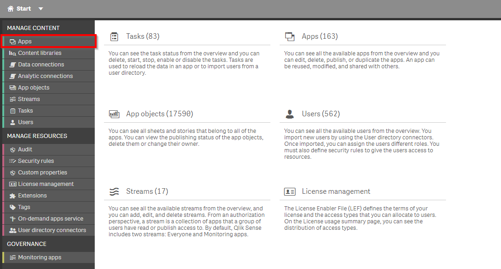
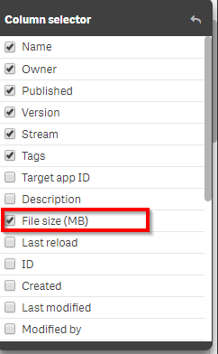
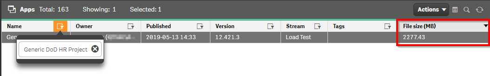
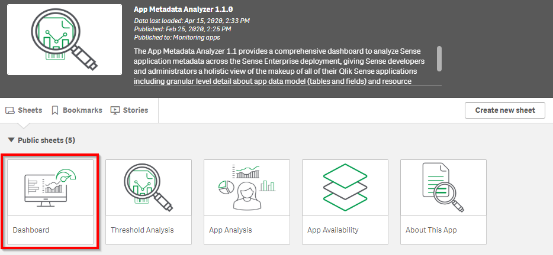
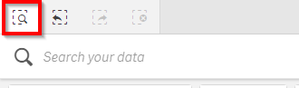
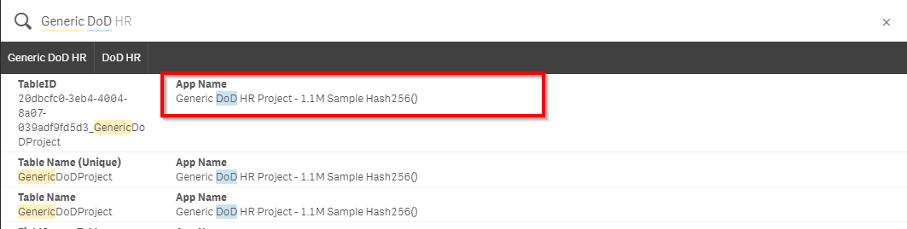
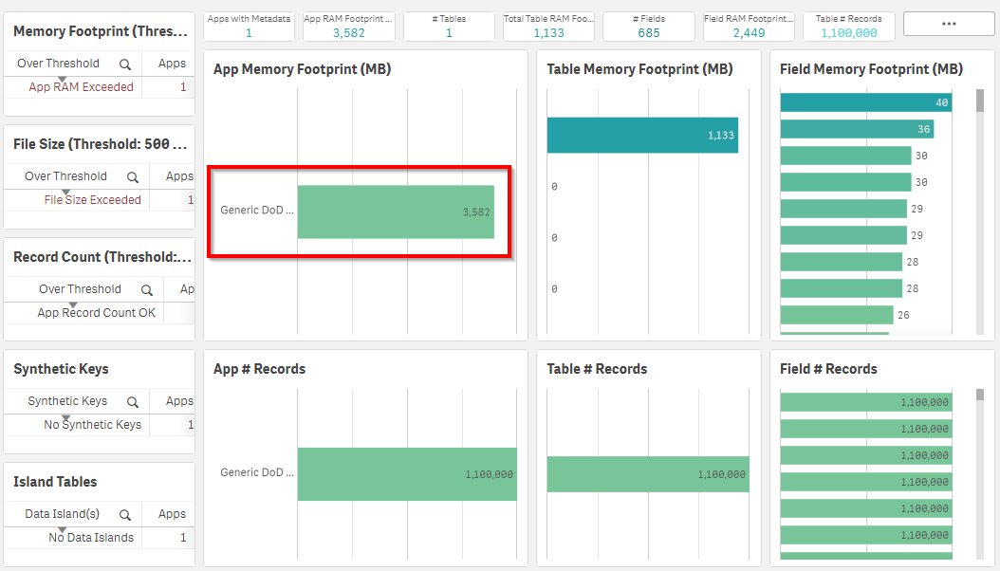

# Review App Cache Warming
{: .no_toc }

**Cadence** Quarterly

**Sites** production

|                                  		                    |  Initial | Recurring |
|---------------------------------------------------------|----------|-----------|
| <i class="far fa-clock fa-sm"></i> **Estimated Time**   | 120 Min  | 5 min     |

Benefits:

  - Increase performance
  - Segregation/isolation of resources

## Goal
{:.no_toc}

The goal of this activity is for the Qlik Administrator to review available tooling to determine whether adoption of a cache warming strategy is appropriate for their environment.

## Table of Contents
{:.no_toc}

* TOC
{:toc}

-------------------------

## What is Cache Warming

Briefly, cache warming refers to programmatically opening Qlik apps to ensure that the first user to open the app has a better response time. For a more exhaustive explaination refer to the write-up on [Cache Warming](../../tooling/cache_warming.md#about) for more details on what cache warming is.

## When is Cache Warming appropriate?

The exact answer will always vary between Qlik sites, but broadly the two use cases where this strategy is commonly needed is:

1. For frequently accessed large apps
2. To ensure high performance

Use case (1) is incredibly common for many Qlik sites. It is common to have a few larger Qlik apps which are frequently or semi-frequently used and to have complaints of poor performance.

Use case (2) is less common but may be required due to hard or soft SLAs for the Qlik deployment or generally due to provide a higher level of performance for select apps.

If the Qlik Administrator already knows which app(s) need to be cache warmed due need then the Administrator can continue to the article on [Cache Warming](../../tooling/cache_warming.md) to select an appropriate approach.

## Scenario (1), large apps

In this section we will outline how to use two pieces of tooling to help aid qualifying what Qlik apps should be targetted for a cache warming strategy.

### Qualifying App Popularity

It is common for customers to use the qualifications of top 5 / 10 / 15 of number of sessions as a measure of popularity. Use the method outlined in [Analyze App Adoption](./analyze_app_adoption.md) to determine which apps are most popular. 

### Determining App Size

With the list of Qlik apps which are most popular, the Qlik Administrator needs to now determine which of those app(s) are large.

For the purposes of this exercise we will work off an example that we have determined that the app named `Generic DoD HR Project - 1.1M Sample Hash256()` has been determined to be sufficiently popular to investigate it's app size. This approach should be repeated for all large Qlik apps which have moderate popularity.

#### What is _Large_?

Qlik apps can perform well at scale, but a common baseline is a large Qlik app is one which is greater than 1 GB on disk / 5 GB in RAM.

#### QMC (Basic)

In the QMC, navigate to the _Apps_ section.

Using the _Column_ selector, toggle the **File Size (MB)** column.

In the newly constructed table, use the filter on the _Name_ column to filter on the app by its name and inspect the **File Size (MB)** column.

Repeat this process for all popular apps. If the app(s) is large, then a cache warming strategy is appropriate.

#### App Metadata Analyzer (Advanced)

In the previous section we used the QMC to inspect the application's size on disk. That method provided a quick and dirty metric for the size of a Qlik app in memory. In this section we will use an additional tool to provide a more accurate determination.

Refer to [Cache Warming](../../tooling/app_metadata_analyzer.md) for more guidance on configuring this app.

With a configured and reloaded app, open the app in the Hub, and open the _Dashboard_ sheet.

Use the global search section to search for the app(s) by name.

With the app(s) selected, inspect the _App Memory Footprint (MB)_ table for the app's in-memory size.

## Scenario (2), Important Apps

For this scenario it is expected that the Qlik Administrator has received feedback from their user population about the relative importance of Qlik apps. This may be due to the audience for this app (i.e. executives) or due to demos being performed on the platform for a important audience.

## Implementing a Cache Warming Strategy

If app(s) need to be cache warmed, then the Qlik administrator should decide on an appropriate tool for the task. Refer to [Cache Warming](../../tooling/cache_warming.md) for more guidance on this.

**Tags**
  
#quarterly

#asset_management

#apps

#cache_warming

&nbsp;

