# Analyze Data Connections <i class="fas fa-tools fa-xs" title="Tooling | Pre-Built Solutions"></i>
{:.no_toc}

**Cadence** Monthly

**Sites** developmentproduction

|                                  		                    | Initial                            | Recurring  |
|---------------------------------------------------------|------------------------------------|------------|
| <i class="far fa-clock fa-sm"></i> **Estimated Time**   | 20 min *(+ long initial reload)*   | 10 min     |

Benefits:

  - Map data connections to owners
  - Track data connection usage
  - Enable auditing
  - Allow for elegant data connection deprecation
  
-------------------------

## Goal
{:.no_toc}
There are numerous goals to managing and curating data connections in a Qlik site -- especially in a development tier, where potentially many, many power users are creating data connections. In essence, the goal is **to run a leaner, more performant, and more easily and holistically governed Qlik Sense site.**

In this section, there will be a _How-to_ and an _Action_ section for each of the [commonly asked questions](../../tooling/data_connection_analyzer.md#common-questions--associated-benefits-of-the-app) about data connections.

-------------------------

## Table of Contents
{:.no_toc}

* TOC
{:toc}

-------------------------

## Prerequisite <i class="fas fa-tools fa-xs" title="Tooling | Pre-Built Solutions"></i>

### Data Connection Analyzer

This pages leverages the **Data Connection Analyzer** application. For documentation, please refer to [Data Connection Analyzer](../../tooling/data_connection_analyzer.md). To understand why this tool is needed for this process, please refer to the [Data Connection Usage](remove_unused_data_connections.md#data-connection-usage) section of the [Remove Unused Data Connections](remove_unused_data_connections.md) article.

-------------------------

## Which connections are no longer used?

 **A data connection is found in a script log and exists in the Qlik Sense site, however no associated applications currently exist that at one point had used it.**
 
### How-to
{:.no_toc}

Navigate to the _Unused Connection Analysis_ sheet.

[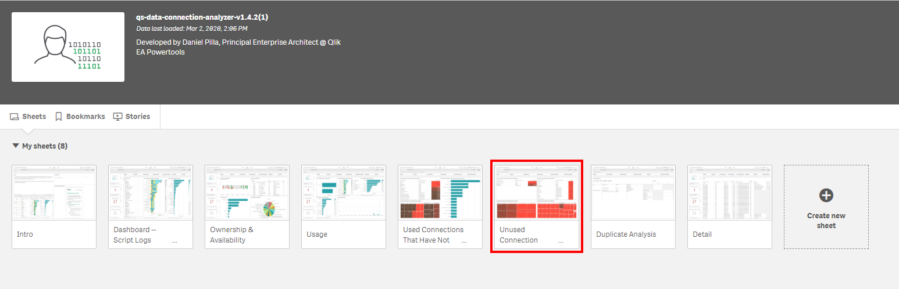](https://raw.githubusercontent.com/eapowertools/qs-admin-playbook/master/docs/asset_management/data_connections/images/analyze_data_connections_1.png)

If there are any connections that fall into this category, they will appear in the _Connections that have been used, but the Apps have since been Deleted: X_ table. In the example here, there are 6. 

[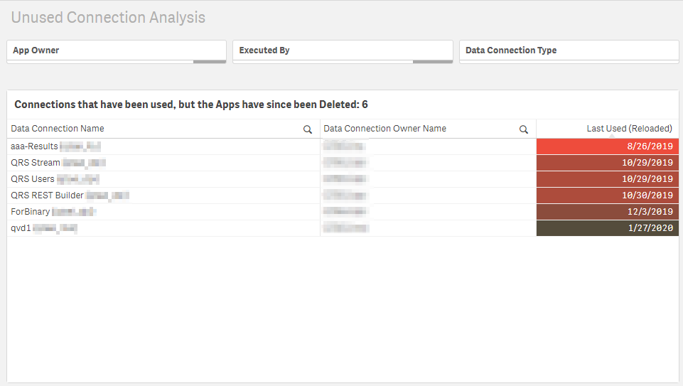](https://raw.githubusercontent.com/eapowertools/qs-admin-playbook/master/docs/asset_management/data_connections/images/analyze_data_connections_2.png)

### Action
{:.no_toc}

If the data connection **Last Used (Reloaded)** date is over 90 days old (or whatever is the desired age of a connection to be unused organizationlly), contact the owner of the data connection to see if it can be quarantined and then ultimately removed. Please refer to the [Suggested Actions](remove_unused_data_connections.md#suggested-actions) section of the [Remove Unused Data Connections](remove_unused_data_connections.md) article.

-------------------------
 
## What connections have never been used?

**A data connection exists in the Qlik Sense site, but no reference exists to it in any script log.**

It is common that users will create data connections to test connectivity, but then never actually use them. By leveraging this app, one can identify connections that have never been used and have existed for x amount of time (say 90+ days), so that action can be taken to remove them.

{::options parse_block_html="true" /}

<i class="fas fa-exclamation-circle fa-sm"></i> Note

If the variable `vNumLogDays` in the load script is set to something like `90`, then the data connection could likely be found in script logs _older_ than 90 days, but the application has just been set to ignore logs older than that--so the KPI showing the number of data connections that have _never been used_ could be misleading in that scenario. If the goal is to get a more accurate read here, ensure that `vNumLogDays` is set to capture all logs, with a value of something like `99999`.
  
If old Archived Logs are being archived (refer to: [Archive Old Archived Logs](../../backup_and_archiving/archive_old_archived_logs.md)) then that needs to be taken into account as well, as those script logs will not be analyzed. Typically, this is perfectly acceptable, as those script logs are usually quite old, and if a connection hasn't been used since then, it is safe to say it is unused and can be removed.

### How-to
{:.no_toc}

Navigate to the _Unused Connection Analysis_ sheet.

If there are any connections that fall into this category, they will appear in the _Connections that have never been used in an App Reload_ table. In the example here, there are 27. 

[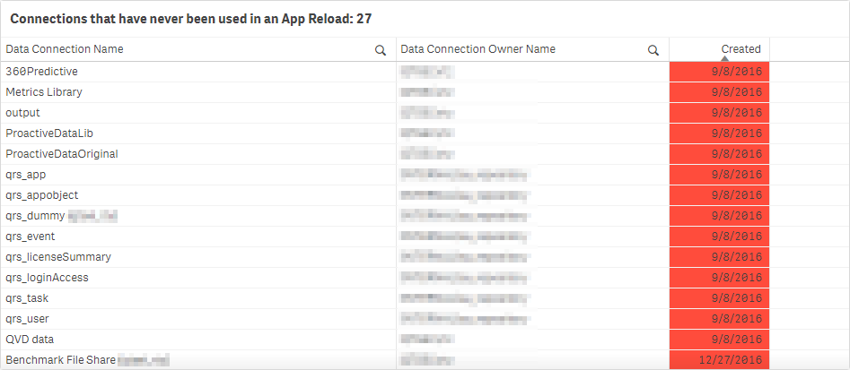](https://raw.githubusercontent.com/eapowertools/qs-admin-playbook/master/docs/asset_management/data_connections/images/analyze_data_connections_3.png)

### Action
{:.no_toc}

If the data connection **Last Used (Reloaded)** date is over 90 days old (or whatever is the desired age of a connection to be unused organizationlly), contact the owner of the data connection to see if it can be quarantined and then ultimately removed. Please refer to the [Suggested Actions](remove_unused_data_connections.md#suggested-actions) section of the [Remove Unused Data Connections](remove_unused_data_connections.md) article.

-------------------------

## Where are data connections being used?

**Let’s say a data source is being transformed and will be moved from one database to another location. The first question one might ask is, “What applications are using that connection, so we can re-route it to the new db and make adjustments to the load scripts?”. This historically has not been easy to answer. This application allows one to select that connection and visualize apps that are using it.**

### How-to
{:.no_toc}

Navigate to the _Dashboard_ sheet.

[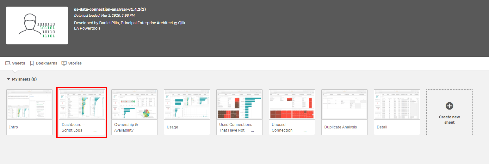](https://raw.githubusercontent.com/eapowertools/qs-admin-playbook/master/docs/asset_management/data_connections/images/analyze_data_connections_4.png)

Select _True_ next to the _Connections Used_ KPI to select all used data connections.

[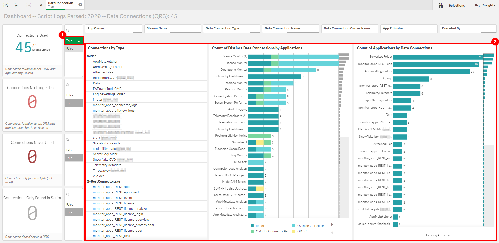](https://raw.githubusercontent.com/eapowertools/qs-admin-playbook/master/docs/asset_management/data_connections/images/analyze_data_connections_13.png)

Select a single data connection to visualize all of the applications that are dependent on it.

[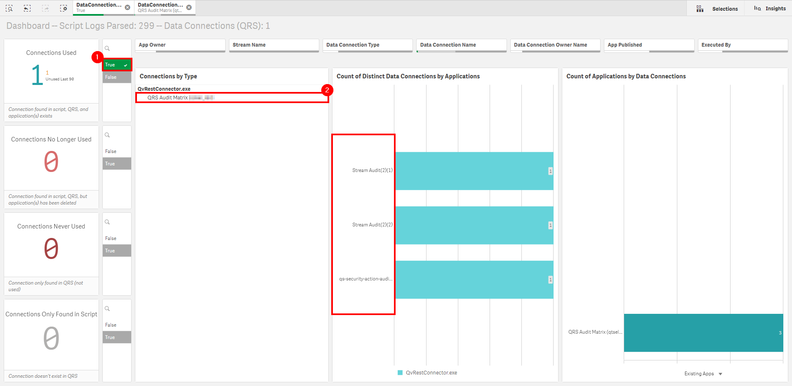](https://raw.githubusercontent.com/eapowertools/qs-admin-playbook/master/docs/asset_management/data_connections/images/analyze_data_connections_15.png)

Optionally, select a single application to view all of the data connection dependencies for a specific application.

[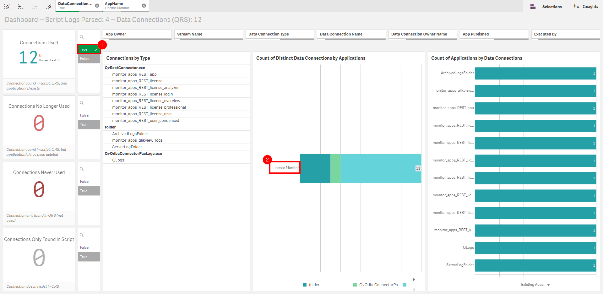](https://raw.githubusercontent.com/eapowertools/qs-admin-playbook/master/docs/asset_management/data_connections/images/analyze_data_connections_14.png)

### Action
{:.no_toc}

If a data connection is being deprecated, or re-routed, etc--ensure that the process above of identifying all of the applications that are dependent on that data connection is followed, so that the new connection details can be addressed in each of the application's load scripts.

-------------------------

## Do we have duplicate data connections?

**By analyzing the connection strings, one can tackle duplicate connections to the same source data. This eases administration overhead and will ensure that there is reusability/consistency across the platform.**

### How-to
{:.no_toc}

Navigate to the _Duplicate Analysis_ sheet.

[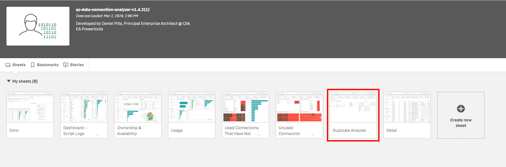](https://raw.githubusercontent.com/eapowertools/qs-admin-playbook/master/docs/asset_management/data_connections/images/analyze_data_connections_10.png)

In this example, the type of **Folder** connection has been selected, and it is visible that there are 2 folder connection duplicates. From the below we can tell that:

  - The `C:\QlikShare\QVD\` connection
      - Has four duplicates across two different users.
      - Is leveraged by two applications.
  - The `C:\QlikShare\SharedApps\` connection
      - Has two duplicates across a single user.
      - Isn't leveraged by any application.
      
It is very likely that these folder connections point to different subfolders within.

[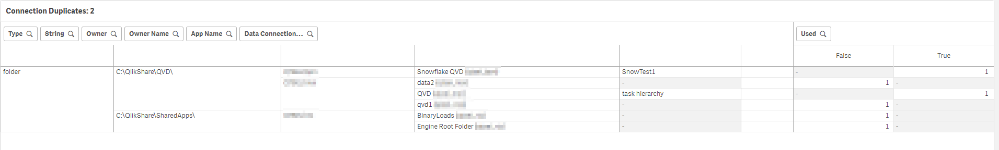](https://raw.githubusercontent.com/eapowertools/qs-admin-playbook/master/docs/asset_management/data_connections/images/analyze_data_connections_11.png)

Now, in the following example, the type of **QvOdbcConnectorPackage.exe** has been selected, and it is visible that there is a single ODBC connection that has a single duplicate. It is also visible that the connection has a different username--which is common across ODBC connections to ensure database security for individual users where passthrough auth is not an option.

[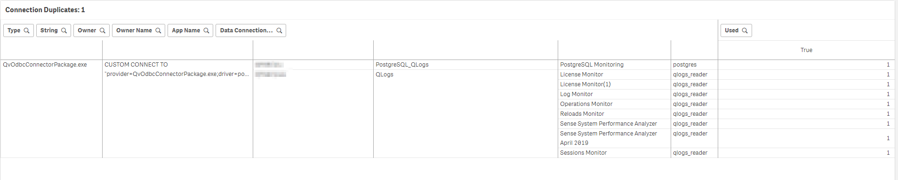](https://raw.githubusercontent.com/eapowertools/qs-admin-playbook/master/docs/asset_management/data_connections/images/analyze_data_connections_12.png)

### Action
{:.no_toc}

Connection duplicates should be resolved where possible. Contact the owners of the applications, and audit which applications are using them. Decide which connections should become the primary with the developers, and ensure that they are all moved to that new connection and tested.

-------------------------

## What connections have been deleted that used to be used?

**By parsing the script logs, one can visualize old data connection names/paths that can help to serve as an audit trail.**

### How-to
{:.no_toc}

Navigate to the _Dashboard_ sheet.

Select the value of _True_ next to the _Connections Only Found in Script_ KPI. The _Connections by Type_ will now show all of the connections that were found in script log files, but were not found in the QRS.

[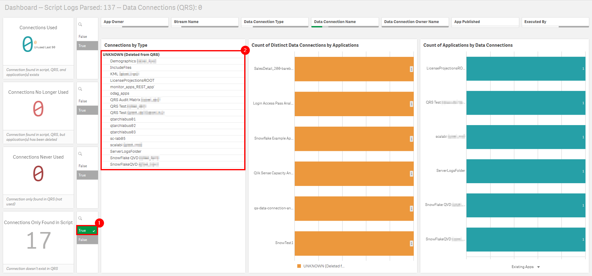](https://raw.githubusercontent.com/eapowertools/qs-admin-playbook/master/docs/asset_management/data_connections/images/analyze_data_connections_5.png)

### Action
{:.no_toc}

There is no direct action necessary here, as this exercise is only particularly useful in the context of auditing. Leverage as required.

-------------------------

## What are the most widely used data connections?

**Depending on how this application is deployed, whether it be strictly administrative or potentially visible to developers, this metric is important both administratively and socially throughout the organization.**

### How-to
{:.no_toc}

Navigate to the _Usage_ sheet.

Locate the _Connection # Times Used (Script Logs)_ table. This table visualizes the amount of script logs that each connection is found in.

Select a connection, and visualize the what applications utilized it and when--as well as by what execution type (Task, Manual, API).

[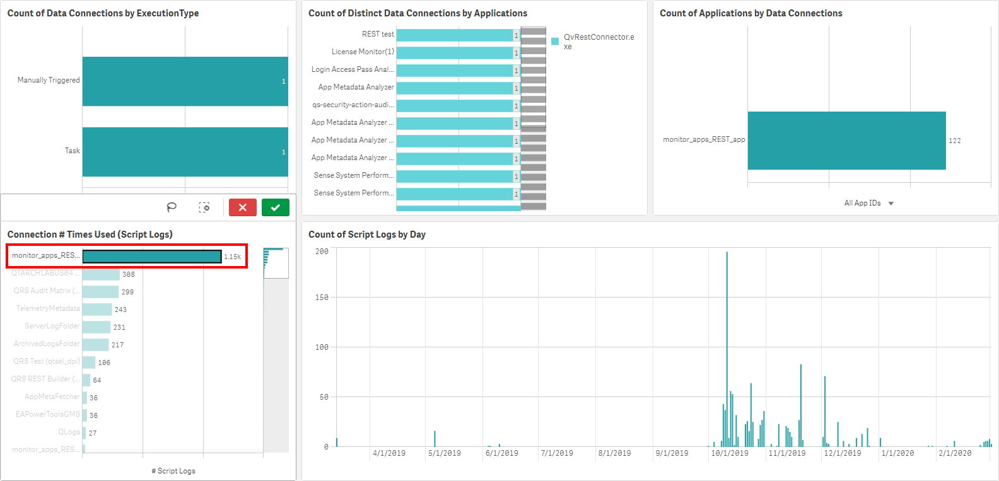](https://raw.githubusercontent.com/eapowertools/qs-admin-playbook/master/docs/asset_management/data_connections/images/analyze_data_connections_8.png)

In the upper right, one can then select the **Executed By** filter to visualize what users have leveraged the data connection.

  - INTERNAL\sa_scheduler maps to **Task** executions
  - INTERNAL\sa_api maps to **API (ODAG or otherwise)** executions
  - User accounts map to **Hub** executions
  
[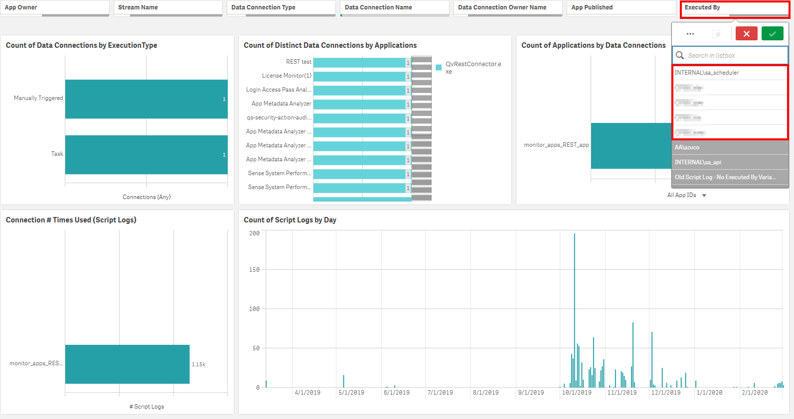](https://raw.githubusercontent.com/eapowertools/qs-admin-playbook/master/docs/asset_management/data_connections/images/analyze_data_connections_9.png)

### Action
{:.no_toc}

There is no direct action necessary here. Leverage as required.

-------------------------

## Who is using what data connections?

**While “User A” might own “Data Connection A”, “User B” might also have read access to that data connection. This can of course be visualized through the audit capability of the QMC, however this application will physically reveal who is executing any reloads of those data connections, giving greater visibility and allowing a deeper level of auditing and governance.**

### How-to
{:.no_toc}

The process to answer this question is addressed in the **What are the most widely used data connections?**, by navigating to the _Usage_ sheet and filtering on the **Executed By** filter.

### Action
{:.no_toc}

There is no direct action necessary here. Leverage as required.

-------------------------

## Via what mechanism are data connections being used?

**The application visualizes what connections are being run as tasks, manually, or in ODAG (or other API) requests. This is crucial in understanding user behavior.**

### How-to
{:.no_toc}

The process to answer this question is addressed in the **What are the most widely used data connections?**, by navigating to the _Usage_ sheet and filtering on the **ExecutionType** filter within the _Count of Data Connections by ExecutionType_ table.

[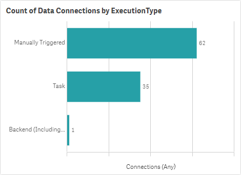](https://raw.githubusercontent.com/eapowertools/qs-admin-playbook/master/docs/asset_management/data_connections/images/analyze_data_connections_16.png)

### Action
{:.no_toc}

There is no direct action necessary here. Leverage as required.

**Tags**

#monthly

#asset_management

#data_connections

&nbsp;
