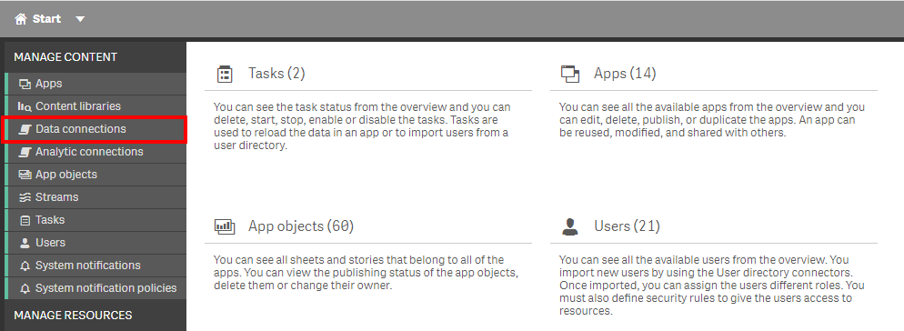
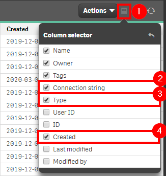
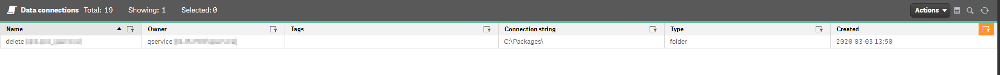

# Check for New Data Connections <i class="fas fa-file-code fa-xs" title="API | Script Optional"></i>*
{:.no_toc}

<span class="label prod">production</span>

|                                  		                  | Initial | Recurring |
|---------------------------------------------------------|---------|-----------|
| <i class="far fa-clock fa-sm"></i> **Estimated Time**   | 5 Min   | 5 min     |

Benefits:

  - Decrease redundancy
  - Increase awareness
  
-------------------------

## Goal
{:.no_toc}
Checking for new data connections on a regular basis is one of the ways to help curb the amount of connections that exist in the environment. It allows for the ability to spot duplicates ahead of time, track what sources are being used, and catch any potential out-of-process additions. For a much deeper analysis of data connections, please refer to the [Data Connection Analyzer](../../tooling/data_connection_analyzer.md).

## Table of Contents
{:.no_toc}

* TOC
{:toc}
-------------------------

## QMC - Data Connections

In the QMC, select **Data Connections**:

[](https://raw.githubusercontent.com/qs-admin-guide/qs-admin-playbook/master/docs/asset_management/data_connections/images/check_new_data_connections_native_1.png)

In the upper right hand side of the screen, select the **Column selector**, and then select the **Connection String**, **Type**, and **Created** columns.

[](https://raw.githubusercontent.com/qs-admin-guide/qs-admin-playbook/master/docs/asset_management/data_connections/images/check_new_data_connections_native_2.png)

Now select the filter icon for the **Created** column, and then select the filter of **Last seven days**, or the desired range.

[](https://raw.githubusercontent.com/qs-admin-guide/qs-admin-playbook/master/docs/asset_management/data_connections/images/check_new_data_connections_native_3.png)

Lastly, review the resulting table and view any new data connections.

[](https://raw.githubusercontent.com/qs-admin-guide/qs-admin-playbook/master/docs/asset_management/data_connections/images/check_new_data_connections_native_4.png)

-------------------------

## Get List of New Data Connections (Qlik CLI) <i class="fas fa-file-code fa-xs" title="API | Requires Script"></i>

The below script snippet requires the [Qlik CLI](../../tooling/qlik_cli.md).

The script will bring back any data connection with a **Created Date** that is greater than or equal to x days old. The script will then store the output into a desired location in either csv or json format.

### Script
```powershell
# Function to collect data connections that were created in the last x days

################
## Parameters ##
################

# Assumes default credentials are used for the Qlik CLI Connection

# machine name
$computerName = '<machine-name>'
# leave empty if windows auth is on default VP
$virtualProxyPrefix = '/default'
# set the number of days back for the app created date
$daysBack = 7
# directory for the output file
$filePath = 'C:\'
# desired filename of the output file
$fileName = 'output'
# desired format of the output file (can be 'json' or 'csv')
$outputFormat = 'json'

################
##### Main #####
################

# set the output file path
$outFile = ($filePath + $fileName + '.' + $outputFormat)

# set the date to the current time minus $daysback
$date = (Get-Date -date $(Get-Date).AddDays(-$daysBack) -UFormat '+%Y-%m-%dT%H:%M:%S.000Z').ToString()

# set the computer name for the Qlik connection call
$computerNameFull = ($computerName + $virtualProxyPrefix).ToString()

# connect to Qlik
Connect-Qlik -ComputerName $computerNameFull -UseDefaultCredentials -TrustAllCerts

# check the output format
# get all data connections that are created >= $date
# output results to $outfile
If ($outputFormat.ToLower() -eq 'csv') {
    Get-QlikDataConnection -filter "createdDate ge '$date'" -full | ConvertTo-Csv -NoTypeInformation | Set-Content $outFile
    }  Else {
    Get-QlikDataConnection -filter "createdDate ge '$date'" -full | ConvertTo-Json | Set-Content $outFile
  }
```
{:.snippet}

**Tags**

#weekly

#asset_management

#data_connections

&nbsp;
