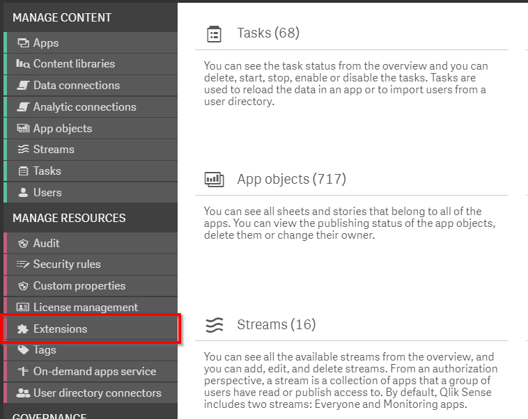
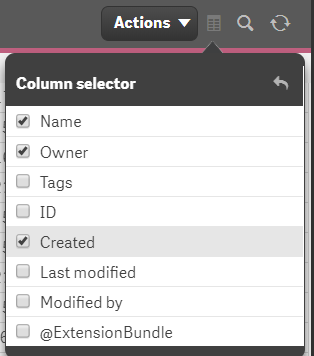
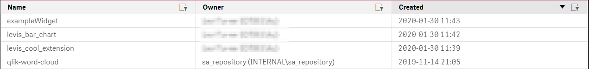
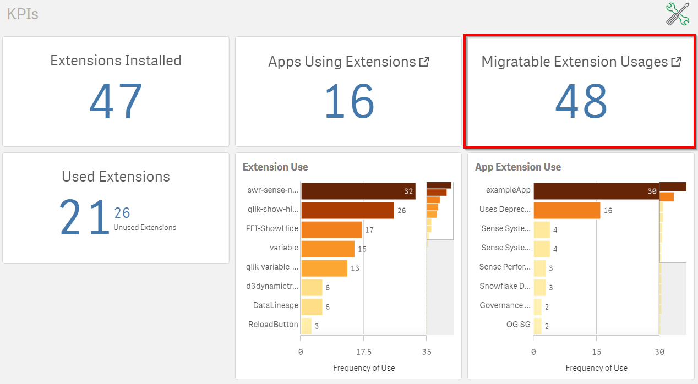
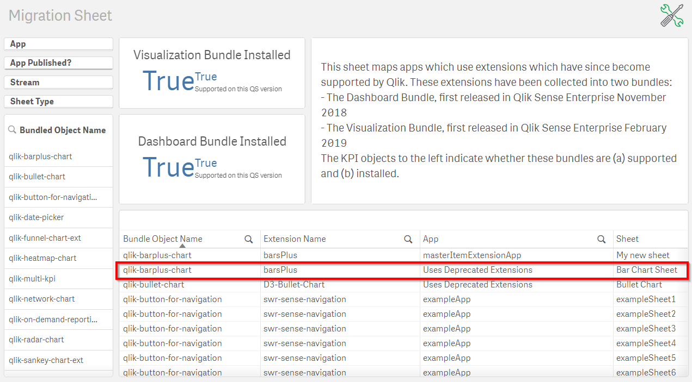
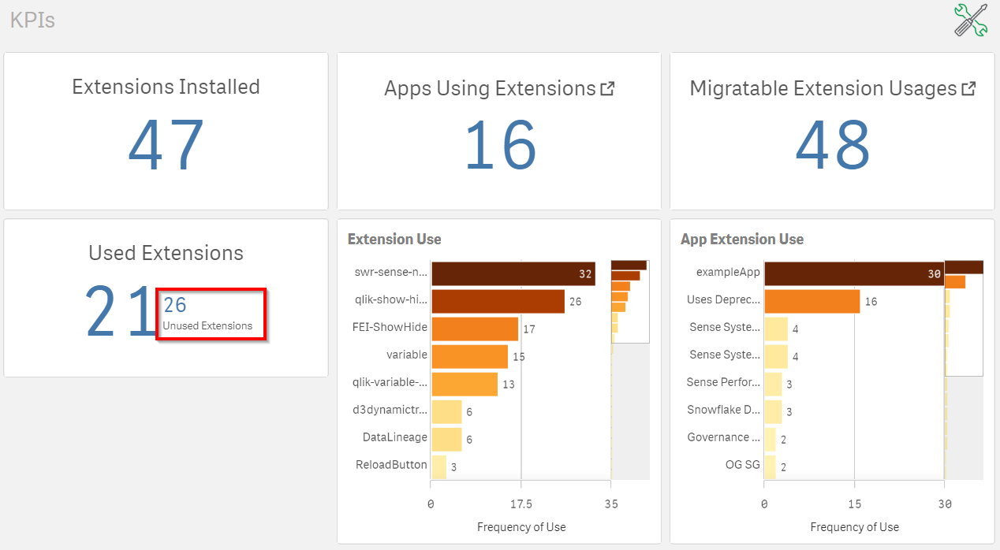
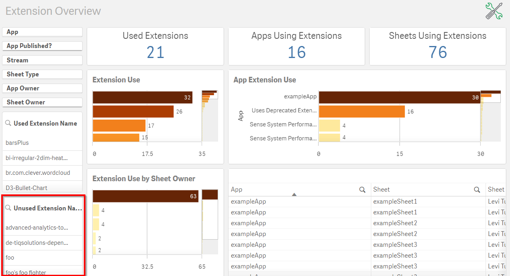
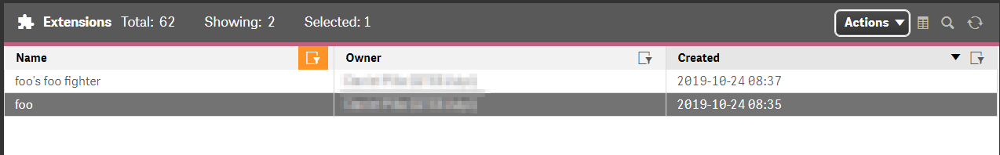

# Analyze/Curate Extensions <i class="fas fa-tools fa-xs" title="Tooling | Pre-Built Solutions"></i>
{:.no_toc}

**Cadence** Quarterly

**Sites** all

|                                  		                      | Initial    | Recurring   |
|-----------------------------------------------------------|------------|-------------|
| <i class="far fa-clock fa-sm"></i> **Estimated Time**     | 45 min     | 10 min      |

Benefits:

  - Reduce/eliminate unsupported extensions
  - Increase stability
  - Decrease upgrade maintenance/time
  
-------------------------

## Goal
{:.no_toc}
The goal of this activity is to be aware of new extensions which have been imported into the environment in addition to the use of the [Extension Usage Dashboard](https://github.com/eapowertools/qs-extension-usage-dashboard/) to focus optimization efforts / reduce the carrying cost to a Qlik deployment.

## Table of Contents
{:.no_toc}

* TOC
{:toc}
-------------------------

## Monitor for New Extensions

In the QMC, select **Extensions**.

In the upper right hand side of the screen, select the **Column selector** and then select the  **Created** column. To make the resulting table a bit more manageable, feel free to deselect the **Tags** column.

Now sort by the **Created** column to see recently added extensions.

Given this overview of new extensions is rather minimal, a pre-built tool ([Qlik Sense Extension Usage Dashboard](https://github.com/eapowertools/qs-extension-usage-dashboard)) has been developed by the Enterprise Architecture team to help administrators provide more insight into what applications are _using_ extensions and _where_. This will be covered next.

## Extension Usage Dashboard <i class="fas fa-tools fa-xs" title="Tooling | Pre-Built Solutions"></i>

The [Qlik Sense Extension Usage Dashboard](https://github.com/eapowertools/qs-extension-usage-dashboard), covered in this guide [here](../../tooling/extension_usage_dashboard.md), allows administrators to drill into granular metadata on extensions in their environment. The goal of this exercise is to take a look at high level KPIs which an administrator should monitor and take action on.

### Migratable Extensions

On the **KPIs** sheet in the upper right hand corner, the app will count the number of instances where a Qlik application is using an extension which has since become part of a Qlik Sense bundle.

Take the below as an example.

In this example an app named **Uses Deprecated Extensions** uses an extension named `barsPlus` on the sheet named **Bar Chart Sheet**. This extension can be replaced by the extension named `qlik-barplus-chart` and this app now will receive full support from Qlik should issues arise.

Administrators should monitor this metric and communicate with the application's owner(s) to have their use of the deprecated extension changed to using the supported bundle from Qlik.

### Unused Extensions

On the **KPIs** sheet in the bottom left KPI, the secondary measure is the count of extensions which exist on the Qlik server and which are _not_ used in a Qlik app.

For a list of which extensions are not used, the administrator can do so in the **Extension Overview** sheet.

As extensions are listed on this section of the **Extension Usage Dashboard**, the administrator should contact the owner of the extension whether the extension is needed. To take an example, for the extension `foo` which is unused, the administrator would filter on the name (`foo`) in the QMC to see who the owner of the extension is.

At this point, it is apparent that the extension was created on October 24th 2019 by the user named `xxx`. A good guideline here is if an extension has been in a Qlik site for over a three months without being used then the owner needs to justify why the extension needs to exist. Without a cogent explanation for the use case for the extension, there is arguably little need for it to exist in its current state. The owner (or administrator) can easily export the extension for potential use later then delete the extension.

### Extension Consolidation

The last activity that will be covered is a bit more difficult to operationalize. For many Qlik deployments, as the number of used extension grows there is often an overlap of capabilities / visualizations / etc. It is not uncommon to have multiple types of bar chart extensions, for example. While this is not intrinsically a problem for deployments, the administrator is encouraged to use usage information from the **Extension Usage Dashboard** to focus energies on eliminating extensions which are not widely used and offer no or little unique capability from other extensions or bundles from Qlik. Over time this will reduce the efforts needed to test extensions after upgrades of the Qlik deployment.

**Tags**

#quarterly

#asset_management

#extensions

#extension_analyzer

&nbsp;
