# Review/Optimize QVDs  <i class="fas fa-tools fa-xs" title="Tooling | Pre-Built Solutions"></i>

developmentproduction

|                                  		                    | Initial  | Recurring  |
|---------------------------------------------------------|----------|------------|
| <i class="far fa-clock fa-sm"></i> **Estimated Time**   | 2 hrs  | 15 min       |

Benefits:

  -	Reduce Maintenance
  -	Increase Data Consistency

-------------------------

## Goal

The goal here is to identify and remedy inefficiencies and overlaps in QVD files, as well as detecting anomalies that could point to reload logic issues or unplanned spikes in growth/capacity. *Note that this exercise does not refer to optimizing QVDs in the traditional sense of optimizing their read-time, but rather optimizing the QVD inventory.*

## Prerequisite <i class="fas fa-tools fa-xs" title="Tooling | Pre-Built Solutions"></i>

### Qlik Sense QVD Monitor

This pages leverages the **Qlik Sense QVD Monitor** application. For documentation, please refer to [QVD Monitor](../../tooling/qvd_monitor.md).

## Exercise

### Assumptions

  - **Qlik Sense QVD Monitor** application is configured
  - Application is published to the **Monitoring apps** stream
  - Daily reload task
  - *Preferably greater than 14 days worth of data, so that trends are visible
  
### Process

Open the **Qlik Sense QVD Monitor** application, and then select the _QVD Details_ sheet.

[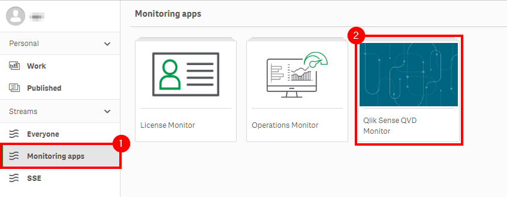](https://raw.githubusercontent.com/qs-admin-guide/qs-admin-playbook/master/docs/asset_management/qvds/images/optimize_qvds_1.png)

[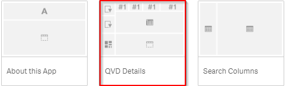](https://raw.githubusercontent.com/qs-admin-guide/qs-admin-playbook/master/docs/asset_management/qvds/images/Screenshot - QVD Details 1.png)

**Priority 1**

Note the overall metrics at the top of the sheet, and ensure that all of the QVD folders are reflected in the _QVD Growth Rates_ table.

[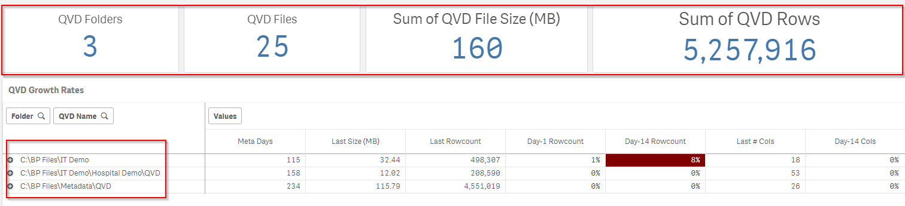](https://raw.githubusercontent.com/qs-admin-guide/qs-admin-playbook/master/docs/asset_management/qvds/images/screenshot - Details Overview.png)

**Priority 2**

Look for anomalies in the growth rates (pos or neg) of the QVD files. These will be highlighted in red, and the pivot table may need to be expanded in order to see them. *Note: the default thresholds can be modified in the load script.

[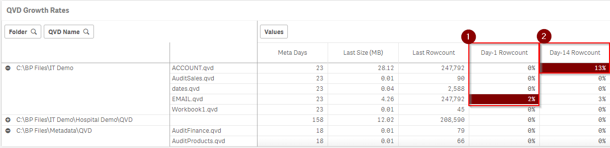](https://raw.githubusercontent.com/qs-admin-guide/qs-admin-playbook/master/docs/asset_management/qvds/images/screenshot - Growth Rate1.png)

When the goal is to examine growth by day and any trending of a QVD, display the _QVD Metadata Details_ table at the bottom of the sheet (the first of two objects in the container).

[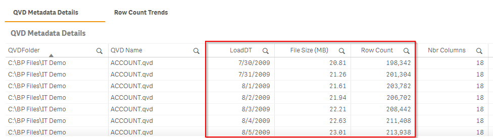](https://raw.githubusercontent.com/qs-admin-guide/qs-admin-playbook/master/docs/asset_management/qvds/images/screenshot - metadata details.png)

It is also suggested to view the row count trends of the same QVD in the second object in the container, named _Row Count Trends_.

[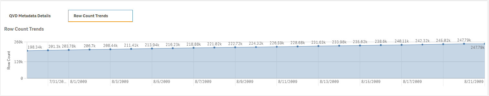](https://raw.githubusercontent.com/qs-admin-guide/qs-admin-playbook/master/docs/asset_management/qvds/images/Screenshot - Rowcount Trends 1.png)

Decisions on whether or not a growth trend is "normal" or "anomalous" are up to the organization. However, in general it is considered a best practice that negative growth is typically something that should be justified, and spikes in growth or irregular growth should also be validated. For those situations, it is best to open the application that builds the QVD in question (QVD generator typically) and/or speak with the developer responsible. It could also be tied to a recent logic change, or source change, and, in that case, should also be validated.

**Priority 3**

Navigate to the _Search Columns_ sheet in the application.

[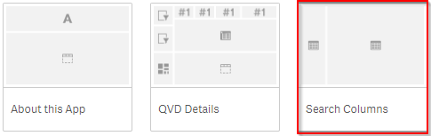](https://raw.githubusercontent.com/qs-admin-guide/qs-admin-playbook/master/docs/asset_management/qvds/images/Screenshot - Search Columns1.png)

In the "Column Occurrences" table on the left side of the sheet, a complete list of QVD columns is visible, with the number of occurrences that each column name has across all QVDs. Note that this table only contains the most recent QVD load of all QVDs.

[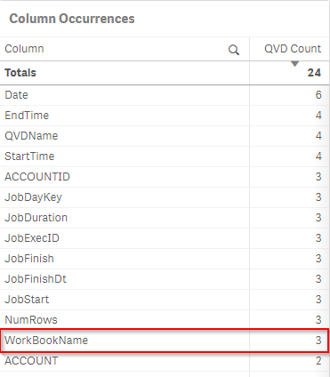](https://raw.githubusercontent.com/qs-admin-guide/qs-admin-playbook/master/docs/asset_management/qvds/images/screenshot - Column Search 1.png)

Select a column in this table to filter the main table down, and view the details about the QVDs that contain that column name. This is critical to ensure that the same column is not being used with either different source data, or logic that produces materially different values across QVDs for the same column. When this happens, it can cause confusion amongst developers/designers/users, and it can cause inconsistencies across apps. Refer to the example below where "WorkBookName" was chosen, and the resulting QVDs that contained that column had differing numbers of unique values for that same column. This *could* be an inconsistency that should be investigated further.

[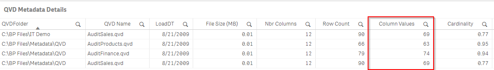](https://raw.githubusercontent.com/qs-admin-guide/qs-admin-playbook/master/docs/asset_management/qvds/images/Screenshot - Column Search 2.png)

**Priority 4**

"QVD Overlap" is a term for when _many_ column names from two or more QVDs overlap heavily, say 50% or more. Sometimes this is done by design, for example, having a summary and detail version of the QVD can be great for performance, and having segmented QVDs for large datasets is in fact considered a best practices. However, when it is unintended that QVDs greatly overlap each other or are duplicates of each other, it could imply extra reload work, storage bloat, extra maintenance, and could cause confusion among developers, designers, and users.

Navigate to the _QVD Overlap_ sheet.

[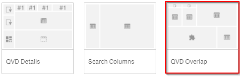](https://raw.githubusercontent.com/qs-admin-guide/qs-admin-playbook/master/docs/asset_management/qvds/images/Screnshot - QVD Overlap.png)

In the _Source → Target Overlap_ table on the right, find and select QVDs that have a large percentage of overlap with other QVDs. 

[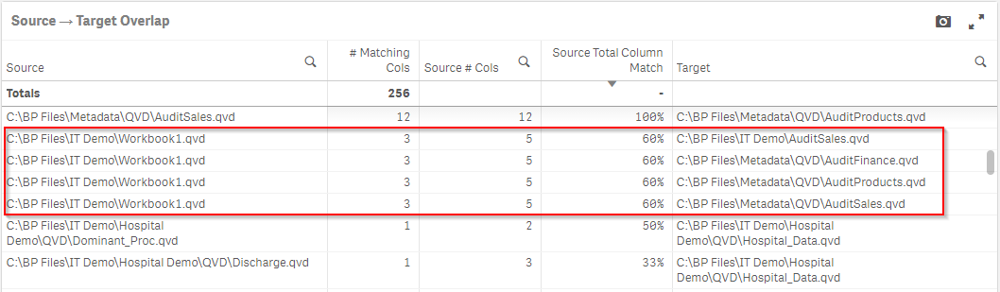](https://raw.githubusercontent.com/qs-admin-guide/qs-admin-playbook/master/docs/asset_management/qvds/images/screenshot - Source-Target Overlap 1.png)

Then individually select the Target QVDs to see the column overlaps between the QVDs.

[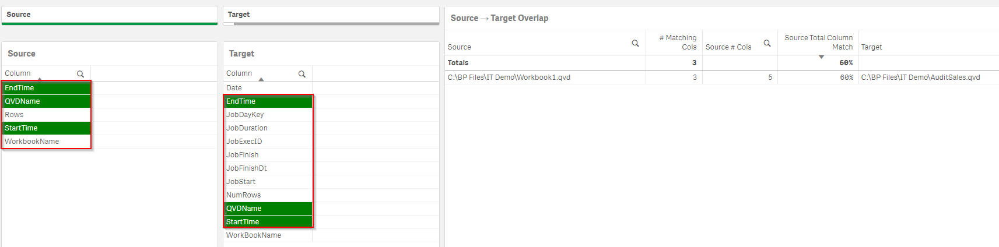](https://raw.githubusercontent.com/qs-admin-guide/qs-admin-playbook/master/docs/asset_management/qvds/images/Screenshot - Source Target 2.png)

Analyze the overlap to determine whether or not it is something to react to. For example, if the two QVDs have a 95% overlap, and they are the same granularity of data, this may be duplicative work and might be confusing to your Qlik Sense developers.   It may also result in inconsistencies down the road, if the QVDs get differing logic in how they are loaded. Though, this can occur if new fields are added to QVDs that are written out monthly. Naturally, as new fields become added, they will begin to differ--which is natural.

**Tags**

#quarterly

#asset_management

#qvds

&nbsp;