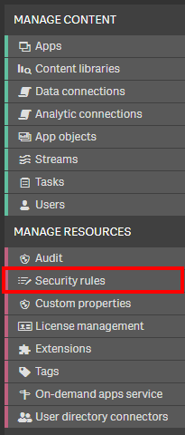
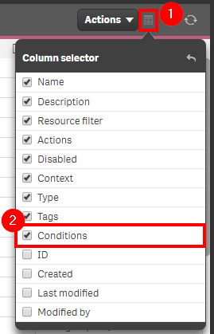
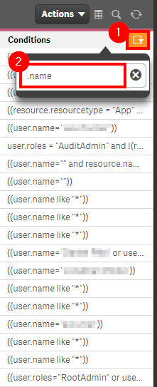
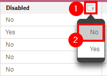

# Analyze Security Rules <i class="fas fa-tools fa-xs" title="Tooling | Pre-Built Solutions"></i>
{: .no_toc }

**Cadence** <span class="label cadence">Monthly</span>

**Sites** <span class="label dev">development</span><span class="label prod">production</span>

|                                  		                  | Initial   | Recurring  |
|---------------------------------------------------------|-----------|------------|
| <i class="far fa-clock fa-sm"></i> **Estimated Time**   | 30 min    | 10 min     |

Benefits:

  - Decrease security rule evaluation time (increase performance)
  - Ensure readable/scalable rules
  
-------------------------

## Goal
{:.no_toc}
The goal of this section is to analyze security rules for quality--ultimately increasing readability, performance, and scalability. This page will explore two options of doing so--one natively through the QMC (manual), and the other via an application created named the **qs-security-rules-analyzer**.

For auditing, please refer to [Audit User Access](../../audit/audit_user_access.md).

## Table of Contents
{:.no_toc}

* TOC
{:toc}
-------------------------

When writing security rules, it is essential to think about how they will scale and how easy it is for them to be read and understood by others. There are of course times when rules _must_ become quite complex and might be rather difficult to read, but generally, these should be niche scenarios for very granular requirements.


## Readability

When writing a security rule, try to break up the formatting into multiple lines, to make the rule more easily digested by a human being. For example, here is a perfectly valid rule:

```
(resource.resourcetype = "App" and resource.stream.HasPrivilege("read") and resource.@AppLevelMgmt.empty()) or ((resource.resourcetype = "App.Object" and resource.published = "true" and resource.objectType != "app_appscript") and resource.app.stream.HasPrivilege("read"))
```
{:.snippet}

Now, here is that same rule, formatted differently:

```
(
    resource.resourcetype = "App" 
    and resource.stream.HasPrivilege("read") 
    and resource.@AppLevelMgmt.empty() 
) 
or
( 
    (
        resource.resourcetype = "App.Object" 
        and resource.published = "true" 
        and resource.objectType != "app_appscript" 
    ) 
    and resource.app.stream.HasPrivilege("read") 
)
```
{:.snippet}

The second is surely far easier to read.

Lastly, include a good _description_ of the security rule. It is common to simply write out the pseudocode.

## Scale

When writing a rule, one must ensure that it can scale. While `((user.name="Rodion Romanovich Raskolnikov") or (user.name="Sofya Semyonovna Marmeladov"))` works for a couple of users, as more and more users come into the system, that 1:1 rule style quickly becomes very difficult to maintain. Also, now imagine that Mr. Raskolnikov now changes roles, and should no longer see the resource that the security rule applies to. One would have to first know that he changed roles, and second, go remove him from that security rule. This simply is not maintainable. Instead, _groups_ should be used, be that `user.group` or `user.environment.group` or `user.@SomeCustomGroup`. This 1:many style rule is highly scalable, and is generally hands off, especially when using the former two options, as they are dynamic from the source, vs hardcoded as a custom property.

To summarize, instead of writing this:

```
((user.name="Rodion Romanovich Raskolnikov") or (user.name="Sofya Semyonovna Marmeladov"))
```
{:.snippet}

Write something like this, where the resource has a hardcoded custom property value assigned to it, and that matches up against a dynamic value from the _group_ property, say, from Active Directory. This rule is then completely hands off, and scales to many users dynamically.

```
((resource.@Department=user.group))
```
{:.snippet}

## Performance

Another area to be very mindful of is the performance of the evaluation of security rules. Of course, a rule with many _and/or_ conditions is going to take longer to evaluate. One thing to be particularly keen on here is the number of values in the custom property field that the security rule is going to be evaluated on. If there are thousands of potential values in the custom property field, this will significantly increase evaluation times.

## Security Rule Flagging

To ensure security rule quality, the following areas are things to look out for either manually via the QMC, or programmatically with the provided application.

**Do not create**

1. 1:1 style rules, e.g.

    - Rules that contain `.name`

    - Rules that contain `.id`

2. Rules that contain `*`

3. Rules that contain many `and` `or` operators

4. Rules that reference a custom property that has many possible values (hundreds or thousands)


## Security Rule Performance

The following guidelines can be used to aid optimization efforts if required:

- Be as specific as possible--more filtered results will perform better (the lower the grain, the better).

|   Resource Filter                          |  Explanation                                                        |   Efficieny               |
| ------------------------------------------ | ------------------------------------------------------------------- | ------------------------- |
| `*`                                        | Access to all things in Qlik Sense                                  | Least efficient           |
| `App*`                                     | Access to all Apps and App.Objects                                  | More efficient than above |
| `App_*`                                    | Access to all Apps                                                  | More efficient than above |
| `App_d1309075-86e8-4784-a9fd-2658ab47018e` | Access the app with the ID `d1309075-86e8-4784-a9fd-2658ab47018e`   | More efficient than above |


- Use only the required **Context**

    - Security rules have context options of **Hub**, **QMC**, or **Both**. Be as specific as possible.

- Avoid traversing several object reference boundaries

    - An example of this would be `user.@customproperty=resource.app.stream.@customproperty`. In this example the user's custom property is compared to the resource (the thing) which belongs to an app which belongs in a stream which has a custom property.

- Minimize the number of custom property values.

    - Custom properties with 100s of values are expensive to process

- Order of execution matters.

    - For example `resource.app.stream.owner.@a = "b" or user.name = "user1"`. In this example, all owners of stream need to be evaluated for a custom property and only then is the user's name evaluated. Put the more exclusionary clauses to the rule first. Example: `(user.group="rare" and user.group="common")`. This minimizes the number of users who need to evaluate the 2nd clause.

- Avoid use of `HasPrivilege`

    - Example: `App.Stream.HasPrivilege("read")`. This function requires additional rule engine to evaluate the read permission check on the App's Stream.

## QMC - Security Rules

For manually reviewing security rules, start by navigating to the QMC, and then select **Security Rules**.

[](https://raw.githubusercontent.com/eapowertools/qs-admin-playbook/master/docs/asset_management/security_rules/images/security_rules_1.png)

Click on the _Column selector_, and add the **Conditions** column.

[](https://raw.githubusercontent.com/eapowertools/qs-admin-playbook/master/docs/asset_management/security_rules/images/security_rules_2.png)

Select the filter on the **Conditions** column, and then search for any of the bad practices, such as `.name`, `.id`, `*`, etc.

[](https://raw.githubusercontent.com/eapowertools/qs-admin-playbook/master/docs/asset_management/security_rules/images/security_rules_3.png)

As an additional step, filter on the **Disabled** column to _No_ to only view active security rules.

[](https://raw.githubusercontent.com/eapowertools/qs-admin-playbook/master/docs/asset_management/security_rules/images/security_rules_4.png)

This is of course a very manual process, and might prove to be rather difficult to consume. For an automated process that will sum up all of the flagged bad practices and allow for deeper analysis, please explore the application below.

## Security Rule Analyzer <i class="fas fa-tools fa-xs" title="Tooling | Pre-Built Solutions"></i>

The **qs-security-rule-analyzer** application is an application supported by the Americas Enterprise Architecture team from Qlik. It is a very straight forward application that makes to calls to the QRS (repository database) that fetches metadata around custom properties and all security rule information. The application itself takes advantage of the existing `monitor_apps_REST_app` data connection, so there is no installer and it is plug and play, spare a couple of variable settings and ensuring that the user executing the reload has _RootAdmin_ rights and access to the data connection. Complete setup instructions can be found in the script.

Download it here: [qs-security-rule-analyzer](https://github.com/eapowertools/qs-security-rule-analyzer/releases)

[](https://raw.githubusercontent.com/eapowertools/qs-admin-playbook/master/docs/asset_management/security_rules/images/security_rules_5.png)

**Tags**

#monthly

#asset_management

#security_rules

&nbsp;
