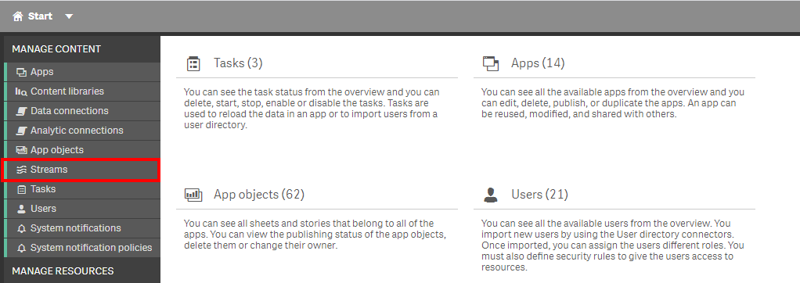
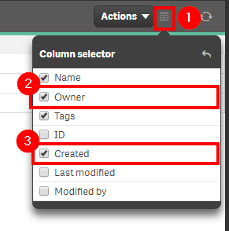
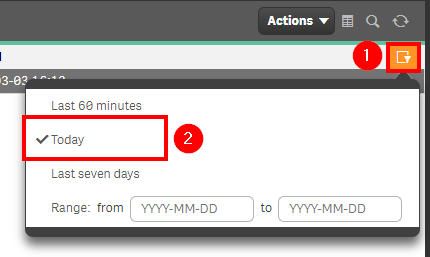
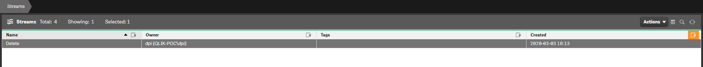

# Check for New Streams <i class="fas fa-file-code fa-xs" title="API | Script Optional"></i>*
{:.no_toc}

**Cadence** <span class="label cadence">Weekly</span>

**Sites** <span class="label dev">development</span><span class="label prod">production</span>

|                                  		                    | Initial   | Recurring  |
|---------------------------------------------------------|-----------|------------|
| <i class="far fa-clock fa-sm"></i> **Estimated Time**   | 2 min     | 2 min     |

Benefits:

  - Increase awareness
  - Increase reaction times
  
-------------------------

## Goal
{:.no_toc}
Checking for new streams and ensuring that stream governance is tightly controlled is an important aspect of Qlik management. If streams are being created regularly, it is a potential sign that the way assets are organized might not be optimal, or potentially that users/LOBs' are trying to go around a certain process. Ideally, very few individuals should have the right to create streams, so it is an important thing to keep an eye on to ensure nothing is out of the ordinary.

{::options parse_block_html="true" /}
<div class="card">
<div class="card-header">
<i class="fas fa-exclamation-circle fa-sm"></i> Note
</div>
<div class="card-body">
<p>This page will outline two methods for accomplishing this activity (using the QMC and using a Qlik-Cli script). The QMC approach is generally appropriate for most environments. The Qlik-Cli approach is more appropriate for environments where automation is required.</p>
</div>
</div>

## Table of Contents
{:.no_toc}

* TOC
{:toc}
-------------------------

## QMC - Streams

In the QMC, select **Streams**:



In the upper right hand side of the screen, select the **Column selector**, and then select the **Owner** and **Created** columns.



Now select the filter icon for the **Created** column, and then select the filter of **Last seven days**, or the desired range.



Lastly, review the resulting table and view any new streams.



-------------------------

## Get List of New Streams (Qlik CLI) <i class="fas fa-file-code fa-xs" title="API | Requires Script"></i>

The below script snippet requires the [Qlik CLI](../../tooling/qlik_cli.md).

The script will bring back any streams with a **Created Date** that is greater than or equal to x days old. The script will then store the output into a desired location in either csv or json format.

### Script
```powershell
# Script to collect streams that were created in the last x days

################
## Parameters ##
################

# Assumes default credentials are used for the Qlik CLI Connection

# machine name
$computerName = '<machine-name>'
# leave empty if windows auth is on default VP
$virtualProxyPrefix = '/default'
# set the number of days back for the app created date
$daysBack = 7
# directory for the output file
$filePath = 'C:\tmp\'
# desired filename of the output file
$fileName = 'new_streams'
# desired format of the output file (can be 'json' or 'csv')
$outputFormat = 'json'

################
##### Main #####
################

# create filePath

if (Test-Path $filePath) {
} else {
    New-Item -ItemType directory -Path $filePath | Out-Null
}

# set the output file path
$outFile = ($filePath + $fileName + '_' + $(Get-Date –f "yyyy-MM-dd") + '.' + $outputFormat)

# set the date to the current time minus $daysback
$date = (Get-Date -date $(Get-Date).AddDays(-$daysBack) -UFormat '+%Y-%m-%dT%H:%M:%S.000Z').ToString()

# set the computer name for the Qlik connection call
$computerNameFull = ($computerName + $virtualProxyPrefix).ToString()

# connect to Qlik
Connect-Qlik -ComputerName $computerNameFull -UseDefaultCredentials -TrustAllCerts

# check the output format
# get all streams that are created >= $date
# output results to $outfile
If ($outputFormat.ToLower() -eq 'csv') {
  Get-QlikStream -filter "createdDate ge '$date'" -full | ConvertTo-Csv -NoTypeInformation | Set-Content $outFile
  }  Else {
  Get-QlikStream -filter "createdDate ge '$date'" -full | ConvertTo-Json | Set-Content $outFile
}
```
{:.snippet}

**Tags**

#weekly

#asset_management

#streams

&nbsp;
