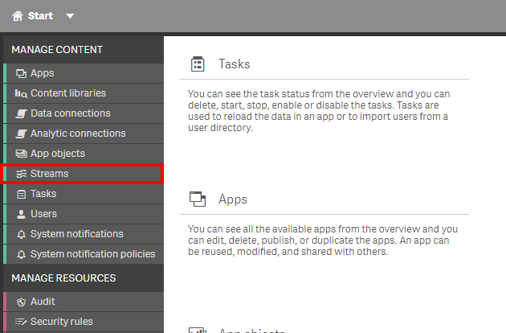
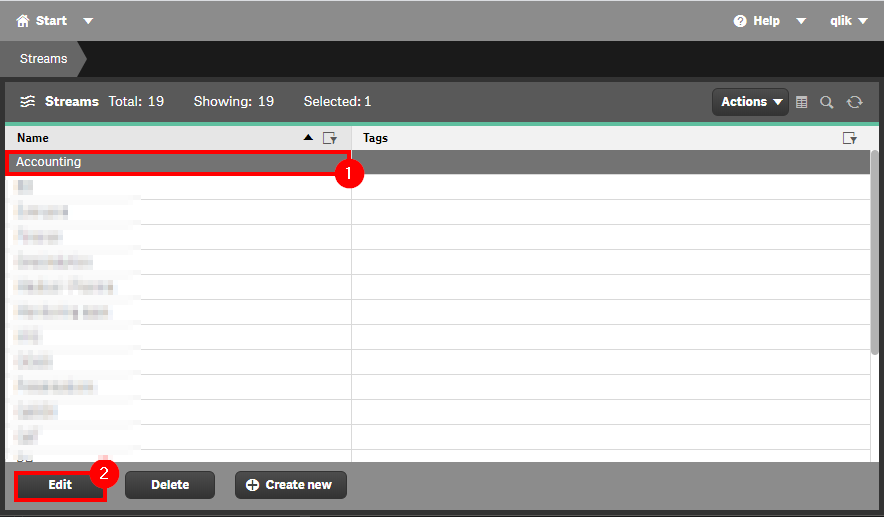
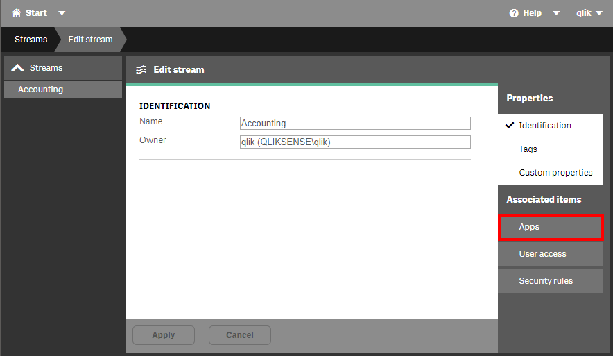
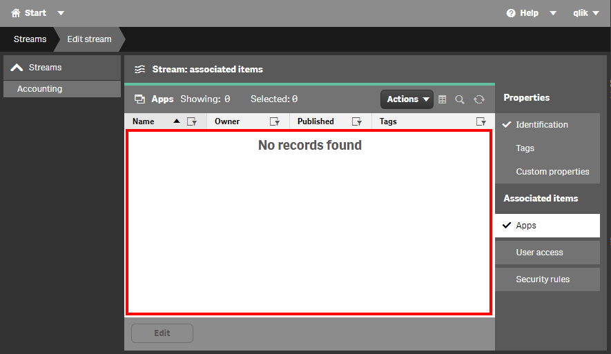

# Remove Unused Streams <i class="fas fa-file-code fa-xs" title="API | Script Optional"></i>
{:.no_toc}

<span class="label dev">development</span><span class="label prod">production</span>

|                                  		                    | Initial   | Recurring  |
|-----------------------------------------------------------|-----------|------------|
| <i class="far fa-clock fa-sm"></i> **Estimated Time**     | 2 min     | 2 min      |

Benefits:

  - Decrease maintenance
  - Increase focus
  
-------------------------

## Goal
{:.no_toc}

There are several reasons why empty streams may be present in a Qlik environment. Sometimes, applications are moved from one stream to another and the admin doesn't notice that the former stream is now empty. Other times, streams are created in anticipation of new applications being published to them, yet none ever actually get published. It is always a good practice to periodically check on the validity of the streams and to remove those that are deemed unnecessary.

## Table of Contents
{:.no_toc}

* TOC
{:toc}

-------------------------

## QMC - Manually Check Published Apps For Each Stream

In the QMC, select **Streams**:

[](https://raw.githubusercontent.com/qs-admin-guide/qs-admin-playbook/master/docs/asset_management/streams/images/remove_unused_stream_01.png)

To view all applications that were published to a specific stream, select the stream name and enter into edit mode.

[](https://raw.githubusercontent.com/qs-admin-guide/qs-admin-playbook/master/docs/asset_management/streams/images/remove_unused_stream_02.png)

In **Edit** mode, select the **Apps** tab.

[](https://raw.githubusercontent.com/qs-admin-guide/qs-admin-playbook/master/docs/asset_management/streams/images/remove_unused_stream_03.png)

Applications that were published to this stream will now be visible.

[](https://raw.githubusercontent.com/qs-admin-guide/qs-admin-playbook/master/docs/asset_management/streams/images/remove_unused_stream_04.png)

This process should be repeated for each **Stream** to find unused streams.

If there is a considerable quantity of streams, consider the [Qlik CLI method](#get-list-of-unused-streams-qlik-cli-).

-------------------------

## Get List of Unused Streams (Qlik CLI) <i class="fas fa-file-code fa-xs" title="API | Requires Script"></i>

The below script snippet requires the [Qlik CLI](../../tooling/qlik_cli.md).

**Streams should always be removed manually. The below script is only used to identify what streams are empty.**

### Script
```powershell
# Script to find empty streams

################
## Parameters ##
################

# Assumes default credentials are used for the Qlik CLI Connection

# machine name
$computerName = 'machineName'
# leave empty if windows auth is on default VP
$virtualProxyPrefix = '/default'
# directory for the output file
$filePath = 'C:\'
# desired filename of the output file
$fileName = 'output'
# desired format of the output file (can be 'json' or 'csv')
$outputFormat = 'json'

################
##### Main #####
################

# set the output file path
$outFile = ($filePath + $fileName + '.' + $outputFormat)

# if the output file already exists, remove it
if (Test-Path $outFile) 
{
  Remove-Item $outFile
}

# set the computer name for the Qlik connection call
$computerNameFull = ($computerName + $virtualProxyPrefix).ToString()

# connect to Qlik
Connect-Qlik -ComputerName $computerNameFull -UseDefaultCredentials -TrustAllCerts

# GET all streams
$streamJson = Get-QlikStream -raw

# GET all applications, and then get all unique stream ids
$appStreamIds = Get-QlikApp -filter "published eq true" | foreach{$_.stream.id} | Sort-Object | Get-Unique

# compare both lists to see if any stream ids belong to no apps
$emptyStreamIds = ($streamJson | foreach{$_.id}) | ?{$appStreamIds -notcontains $_}

# if there are any empty streams, retain the full detail of them
$streamEmptyJson = $streamJson | ?{$emptyStreamIds -contains $_.id}

# see if there are any empty streams
(&{If($emptyStreamIds.count) {$("Empty Streams Found: " + $emptyStreamIDs.count); $streamEmptyJson} Else {"No Empty Streams Found"}})

# if there are any empty streams, write them to $outfile
If ($emptyStreamIds.count) {
    (&{If($outputFormat.ToLower() -eq 'csv') {$streamEmptyJson | ConvertTo-Csv -NoTypeInformation | Set-Content $outFile} Else {$streamEmptyJson | ConvertTo-Json | Set-Content $outFile}})
}
```
{:.snippet}

**Tags**

#monthly

#asset_management

#streams

&nbsp;
