# Analyze Tasks
{:.no_toc}

production

|                                  		                      | Initial    | Recurring   |
|-----------------------------------------------------------|------------|-------------|
| <i class="far fa-clock fa-sm"></i> **Estimated Time**     | 20 min     | 10 min      |

Benefits:

  - Decrease batch time
  - Decrease redundancy
  - Optimize concurrency
  - Reduce task failures
  
-------------------------

## Goal
{:.no_toc}
Checking for new tasks regularly helps not only to curate what is necessary (cadence, duplicates, etc), but also allows for you to review your batch window, task concurrencies, and any implications against the Qlik schedulers. The above may influence architectural patterns and dictate the need for reload task pinning.

## Table of Contents
{:.no_toc}

* TOC
{:toc}
-------------------------

## Batch Time Analysis

As outlined on [Optimize Batch Window](../system_planning/optimize_batch_window.md), use the Reloads Monitor app to review the peak reload hour(s). Significant deviation from previous weeks may signal 

- that additional resources are needed for the Qlik Sense Enterprise nodes which are performing reloads
- Apps have hourly reload cadences which are not needed
  - Example: Out of the box, the License and Operations Monitor reload task have hourly reloads which are generally not needed for most deployments.

## Decrease Redundancy

To determine whether apps have duplicative reload tasks, open the Operations Monitor app and Duplicate the **Task Details Sheet**.

[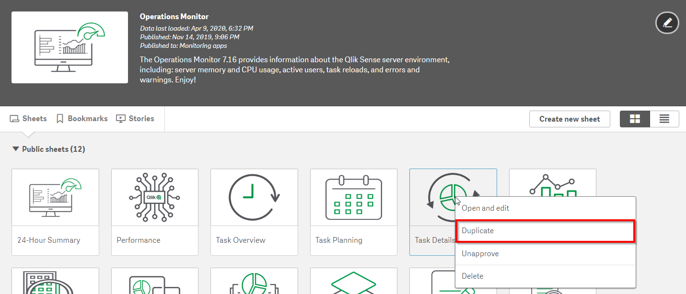](https://raw.githubusercontent.com/qs-admin-guide/qs-admin-playbook/master/docs/asset_management/tasks/images/analyze_tasks-1.png)

Give the new sheet a descriptive name. For example `Task Details (Duplicates)`.

[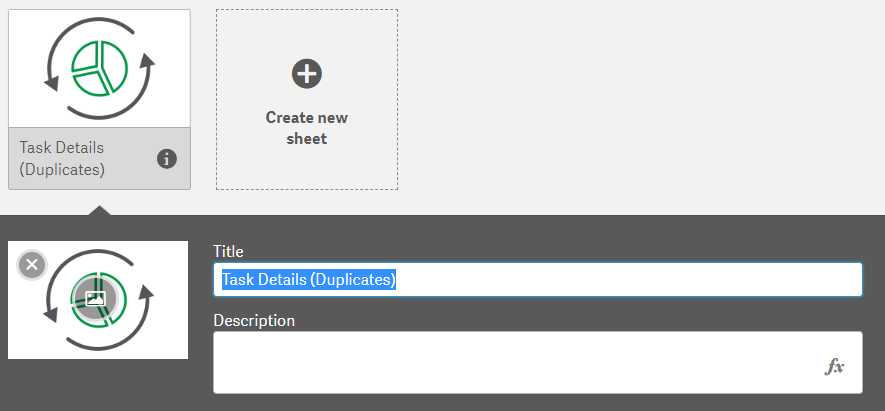](https://raw.githubusercontent.com/qs-admin-guide/qs-admin-playbook/master/docs/asset_management/tasks/images/analyze_tasks-2.png)

Remove both tables as we will build a custom table for our needs.

[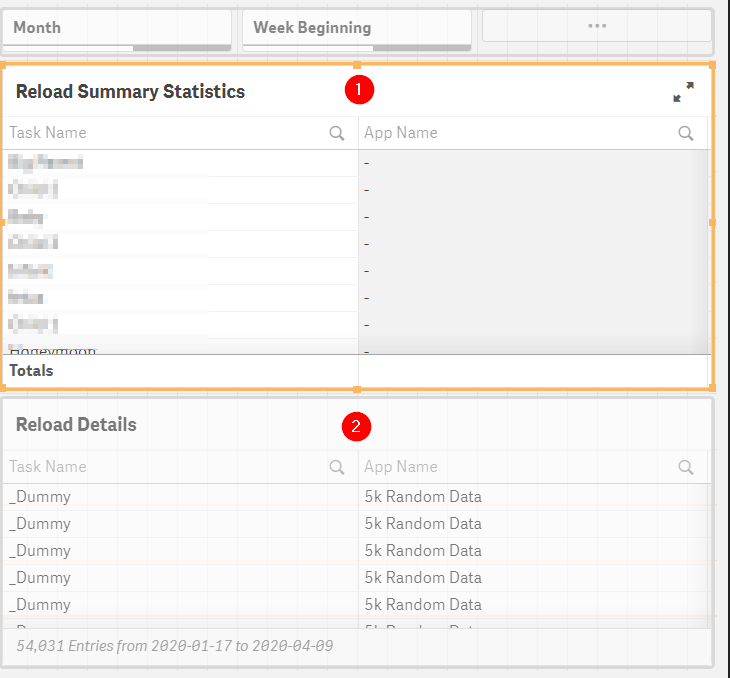](https://raw.githubusercontent.com/qs-admin-guide/qs-admin-playbook/master/docs/asset_management/tasks/images/analyze_tasks-3.png)

Drag in a table visualization object and add the dimension `Task App Name`.

[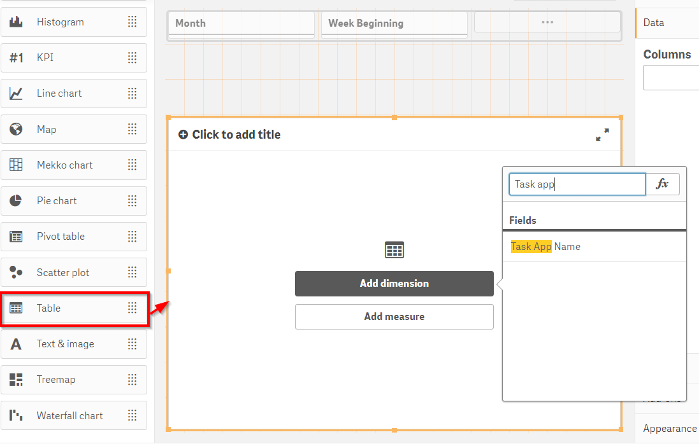](https://raw.githubusercontent.com/qs-admin-guide/qs-admin-playbook/master/docs/asset_management/tasks/images/analyze_tasks-4.png)

Add a measure.

[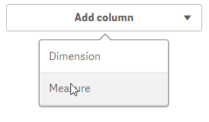](https://raw.githubusercontent.com/qs-admin-guide/qs-admin-playbook/master/docs/asset_management/tasks/images/analyze_tasks-5.png)

Select the measure `Task Name` and chose the aggregation of `Count()`.

[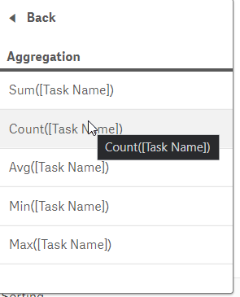](https://raw.githubusercontent.com/qs-admin-guide/qs-admin-playbook/master/docs/asset_management/tasks/images/analyze_tasks-6.png)

Change the label of the measure to a meaningful label like **# of Tasks**.

Move the **# of Tasks** to be sorted first.

[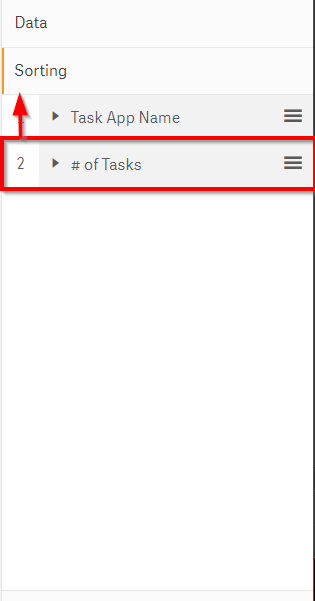](https://raw.githubusercontent.com/qs-admin-guide/qs-admin-playbook/master/docs/asset_management/tasks/images/analyze_tasks-8.png)

Edit the dimension and remove null values.

[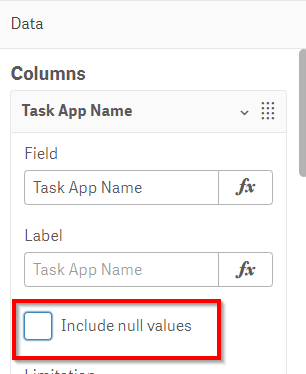](https://raw.githubusercontent.com/qs-admin-guide/qs-admin-playbook/master/docs/asset_management/tasks/images/analyze_tasks-9.png)

The completed table should look similar to this and will signal what apps have duplicative reload tasks.

[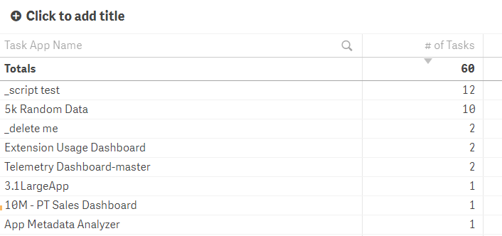](https://raw.githubusercontent.com/qs-admin-guide/qs-admin-playbook/master/docs/asset_management/tasks/images/analyze_tasks-10.png)

Taking the example of the app named `5k Random Data`, navigate to the QMC > Apps, go into the App's record and navigate to the **Tasks** section. This will show the tasks associated with a given app.

[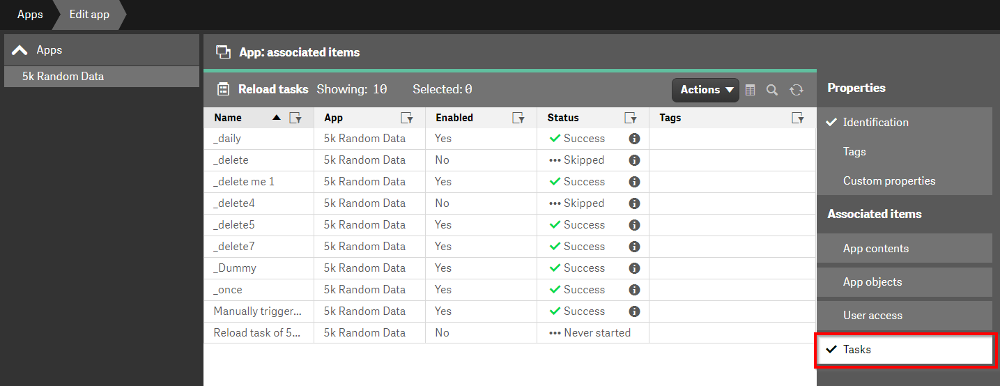](https://raw.githubusercontent.com/qs-admin-guide/qs-admin-playbook/master/docs/asset_management/tasks/images/analyze_tasks-11.png)

There may be use cases for apps to have multiple tasks (e.g. run every day at 6AM and Noon) but review the duplicates and follow up with the app owner as to whether the currently configured duplicates have business value or are legacy tasks which can be removed.

## Optimize Concurrency

As outlined on [Optimize Batch Window](../system_planning/optimize_batch_window.md#task-concurrency), ensure that the Scheduler service(s) have an appropriate number of **Max Concurrent Reloads** for the server(s) that the services are running on.

## Reduce Task Failures

For this activity, navigate to the **Task Details** sheet of the Operations Monitor.

[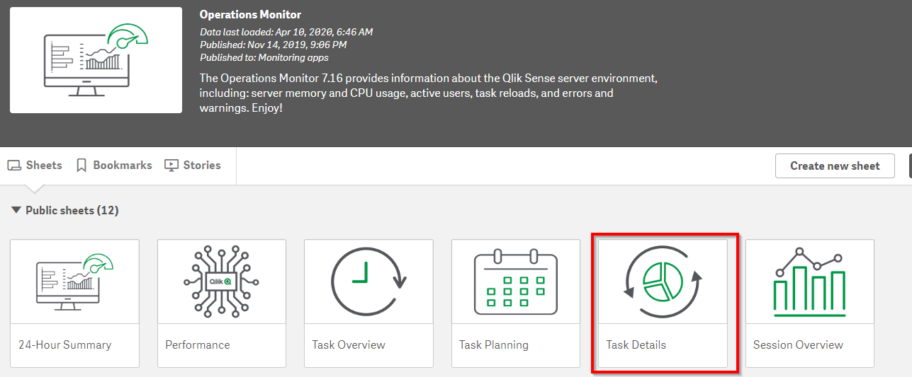](https://raw.githubusercontent.com/qs-admin-guide/qs-admin-playbook/master/docs/asset_management/tasks/images/analyze_tasks-12.png)

In the Reload Summary Statistics table, sort by Failure Rate.

[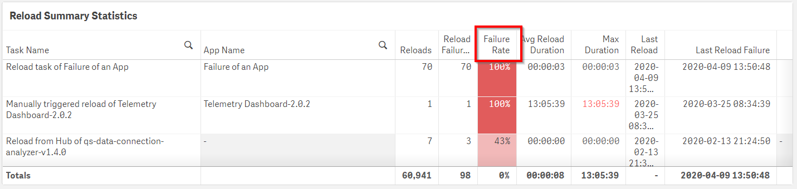](https://raw.githubusercontent.com/qs-admin-guide/qs-admin-playbook/master/docs/asset_management/tasks/images/analyze_tasks-15.png)

**Action**

- For apps which fail at an extremely high rate. Disable the tasks and alert the app owner. In this example, reload task `Reload of Failure of an App` fails 100% of the time. There is no need to have this task enabled when it always fails to successfully reload.

- For apps which fail at a modest rate, explore further in the **Task Details** sheet as to whether there are patterns (e.g. time of the day) which are correlated. Common patterns which customers face include:

- Resource constraint due to multiple reloads
- Resource constraint due to a task reloading along side a computationally heavy task
- Data source unavailability (e.g. due to maintenance)

To aid in this analysis, in the Reload Details table, select the Reload Status of Failed.

[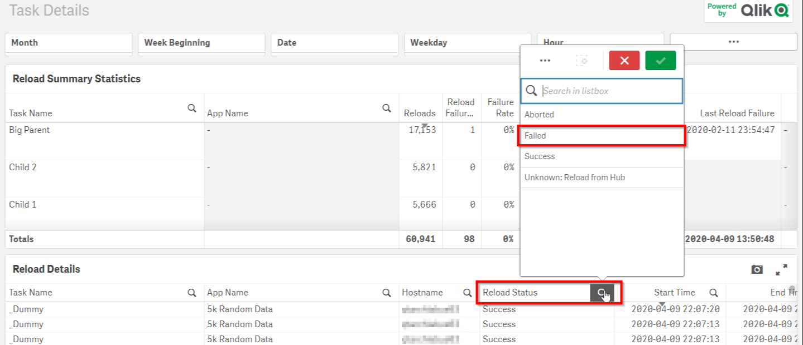](https://raw.githubusercontent.com/qs-admin-guide/qs-admin-playbook/master/docs/asset_management/tasks/images/analyze_tasks-13.png)

In the Reload Details table, granular details of the tasks that have failed will allow the Qlik administrator to see correlations.

[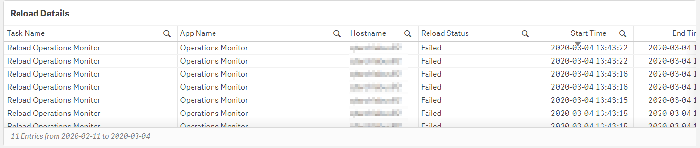](https://raw.githubusercontent.com/qs-admin-guide/qs-admin-playbook/master/docs/asset_management/tasks/images/analyze_tasks-14.png)

**Tags**

#weekly

#asset_management

#tasks

&nbsp;
