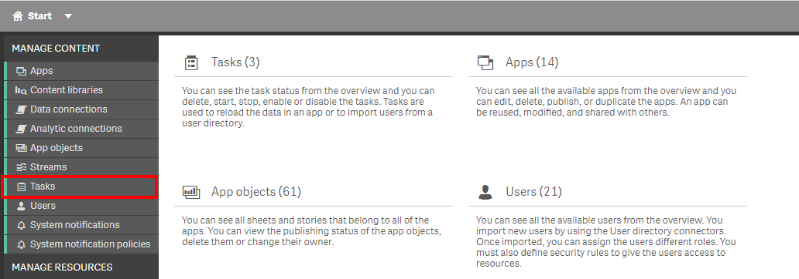
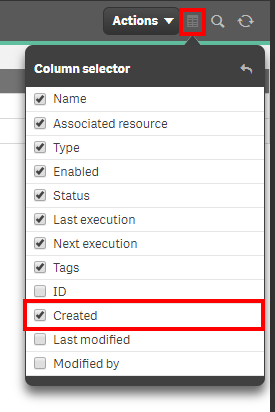
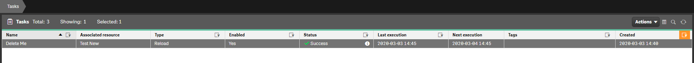
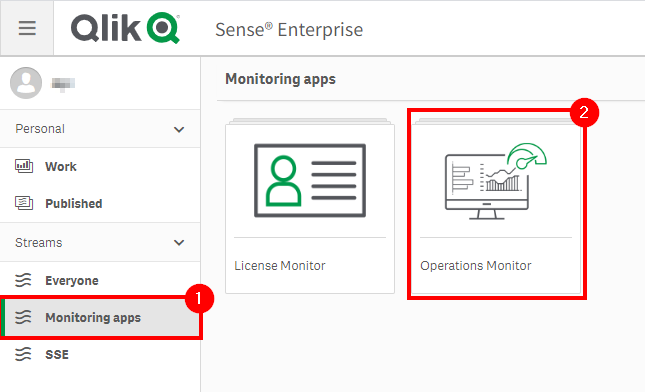
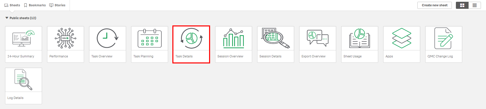
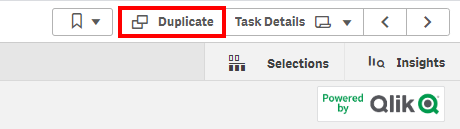
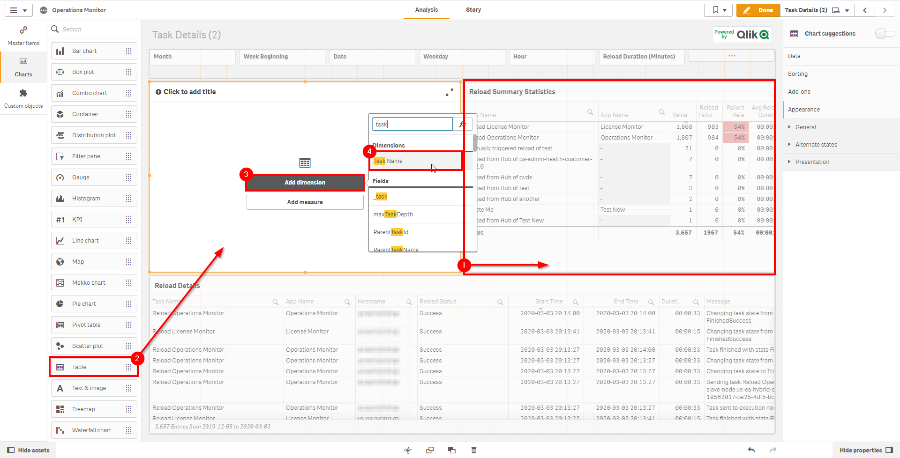
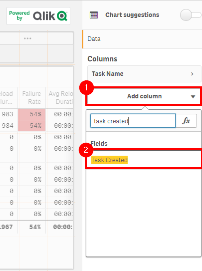
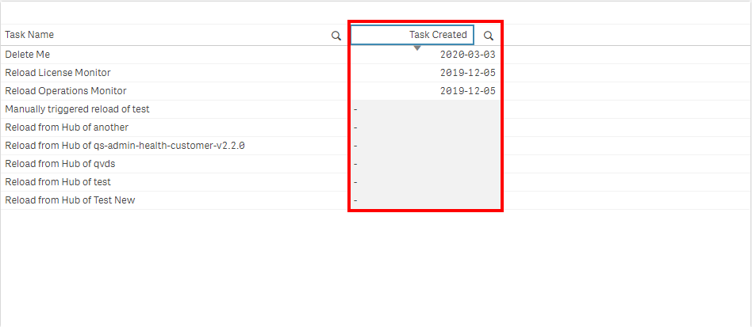

# Check for Tasks <i class="fas fa-file-code fa-xs" title="API | Script Optional"></i>
{:.no_toc}

<span class="label prod">production</span>

|                                  		                      | Initial   | Recurring  |
|-----------------------------------------------------------|-----------|------------|
| <i class="far fa-clock fa-sm"></i> **Estimated Time**     | 2 min     | 2 min      |

Benefits:

  - Increase awareness
  - Increase reaction times
  
-------------------------

## Goal
{:.no_toc}
Checking for new tasks regularly helps not only to curate what is necessary (cadence, duplicates, etc), but also encourages reviews of batch windows, task concurrencies, and any other implications against the Qlik schedulers. The above may influence architectural patterns and dictate the need for reload task pinning.

## Table of Contents
{:.no_toc}

* TOC
{:toc}
-------------------------

## QMC - Tasks

In the QMC, select **Tasks**:

[](https://raw.githubusercontent.com/qs-admin-guide/qs-admin-playbook/master/docs/asset_management/tasks/images/check_tasks_native_1.png)

In the upper right hand side of the screen, select the **Column selector**, and then select the **Created** column.

[](https://raw.githubusercontent.com/qs-admin-guide/qs-admin-playbook/master/docs/asset_management/tasks/images/check_tasks_native_2.png)

Now select the filter icon for the **Created** column, and then select the filter of **Last seven days**, or the desired range.

[](https://raw.githubusercontent.com/qs-admin-guide/qs-admin-playbook/master/docs/asset_management/tasks/images/check_tasks_native_3.png)

Lastly, review the resulting table and view any new tasks.

[](https://raw.githubusercontent.com/qs-admin-guide/qs-admin-playbook/master/docs/asset_management/tasks/images/check_tasks_native_4.png)

-------------------------

## Hub - Operations Monitor

Open up the Hub and navigate to **Monitoring apps** stream. Select the **Operations Monitor** application.

[](https://raw.githubusercontent.com/qs-admin-guide/qs-admin-playbook/master/docs/asset_management/tasks/images/check_tasks_native_1_1.png)

From the **App overview** page, select the **Task Details** sheet.

[](https://raw.githubusercontent.com/qs-admin-guide/qs-admin-playbook/master/docs/asset_management/tasks/images/check_tasks_native_1_2.png)

Select **Duplicate**, as wa column will be added that isn't currently in a table.

[](https://raw.githubusercontent.com/qs-admin-guide/qs-admin-playbook/master/docs/asset_management/tasks/images/check_tasks_native_1_3.png)

In **Edit** mode, select the **Reload Summary Statistics** table and shrink it to allow for more real estate, as another table will be added.

Drag in a new table object, and add the dimension of **Task Name**.

[](https://raw.githubusercontent.com/qs-admin-guide/qs-admin-playbook/master/docs/asset_management/tasks/images/check_tasks_native_1_4.png)

Next, the **Task Created** dimension needs to be added to that table. Note that reloads from the Hub and manual reloads will not show a created date.

[](https://raw.githubusercontent.com/qs-admin-guide/qs-admin-playbook/master/docs/asset_management/tasks/images/check_tasks_native_1_5.png)

It is now possible to sort by the **Task Created** column to view new tasks.

[](https://raw.githubusercontent.com/qs-admin-guide/qs-admin-playbook/master/docs/asset_management/tasks/images/check_tasks_native_1_6.png)

For deeper analysis into tasks, refer to [Analyze Tasks](analyze_tasks.md)


-------------------------

## Get List of New Tasks (Qlik CLI) <i class="fas fa-file-code fa-xs" title="API | Requires Script"></i>

The below script snippet requires the [Qlik CLI](../../tooling/qlik_cli.md).

The script will bring back any reload tasks with a **Created Date** that is greater than or equal to x days old. The script will then store the output into a desired location in either csv or json format.

### Script
```powershell
# Function to collect tasks that were created within the last x days

################
## Parameters ##
################

# Assumes default credentials are used for the Qlik CLI Connection

# machine name
$computerName = '<machine-name>'
# leave empty if windows auth is on default VP
$virtualProxyPrefix = '/default'
# set the number of days back for the app created date
$daysBack = 7
# directory for the output file
$filePath = 'C:\'
# desired filename of the output file
$fileName = 'output'
# desired format of the output file (can be 'json' or 'csv')
$outputFormat = 'json'

################
##### Main #####
################

# set the output file path
$outFile = ($filePath + $fileName + '.' + $outputFormat)

# set the date to the current time minus $daysback
$date = (Get-Date -date $(Get-Date).AddDays(-$daysBack) -UFormat '+%Y-%m-%dT%H:%M:%S.000Z').ToString()

# set the computer name for the Qlik connection call
$computerNameFull = ($computerName + $virtualProxyPrefix).ToString()

# connect to Qlik
Connect-Qlik -ComputerName $computerNameFull -UseDefaultCredentials -TrustAllCerts

# check the output format
# get all apps that are created >= $date and >= $byteSize
# output results to $outfile
If ($outputFormat.ToLower() -eq 'csv') {
  Get-QlikReloadTask -filter "createdDate ge '$date'" -full | ConvertTo-Csv -NoTypeInformation | Set-Content $outFile
  }  Else {
  Get-QlikReloadTask -filter "createdDate ge '$date'" -full | ConvertTo-Json | Set-Content $outFile
} 
```
{:.snippet}

**Tags**

#weekly

#asset_management

#tasks

&nbsp;
