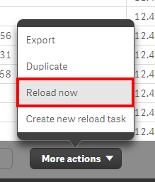
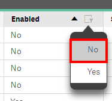
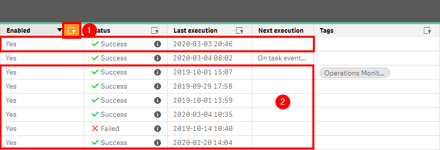

# Remove/Disable Unused Tasks
{:.no_toc}

production

|                                  		                      | Initial    | Recurring   |
|-----------------------------------------------------------|------------|-------------|
| <i class="far fa-clock fa-sm"></i> **Estimated Time**     | 20 min     | 5 min       |

Benefits:

  - Increase performance
  - Increase focus
  - Decrease redundancy
  
-------------------------

## Goal
{:.no_toc}
The goal is to remove all unnecessary tasks from the site. This will make the site more manageable, readable, and more easily navigable.

## Table of Contents
{:.no_toc}

* TOC
{:toc}

-------------------------

## Suggested Actions

**Ensure daily task spot-checks are followed to rectify erroring tasks. The below section assumes those have been handled and accounted for. Refer to: [Remove/Quarantine Unused Apps](..\..\system_spot_check\tasks.md)** 

### Priority

  1. _"Manually triggered reload of..."_ tasks. These tasks should always be routinely cleaned out, as they are created to run once and then typically left to live out their long and lonely lives to never be run again. These are "one-off" tasks that are created and triggered by the **Reload now** option under the **Apps** section in the QMC when selecting a single application.
  
  
  
  **Action**
    - Immediate removal.
    
  **Suggested Policy**
    - Do nothing. This is an easy way to clear out reloads that were used for testing, that might otherwise be more difficult to discern.
  
  2. Disabled tasks.
  
  
  
  **Action**
    - Contact the **Owner** of the application for which the task is associated with, as well as potentially the **Modified by** user of the task, or is more than likely the user who disabled the task. This information can all be found in the QMC.
    
  **Suggested Policy**
    - Any disabled task older than 90 days can be deleted without prior validation.

  3. Active tasks with no **Next execution**
  
  
  
  **Action**
    - Contact the **Owner** of the application for which the task is associated with, as well as potentially the **Modified by** user of the task.

**Tags**

#monthly

#asset_management

#tasks

&nbsp;
