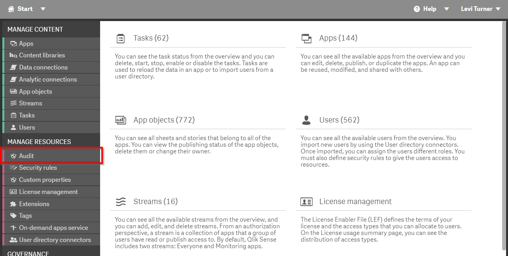
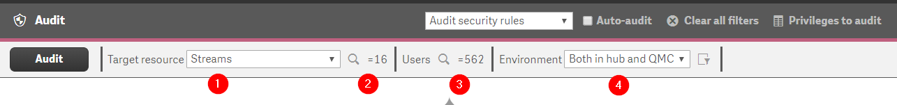
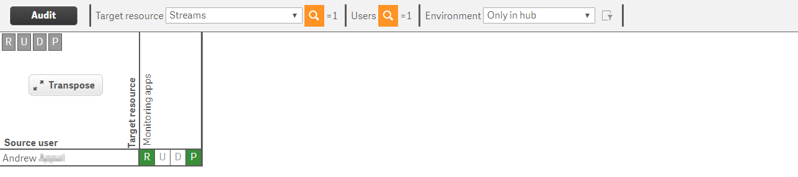
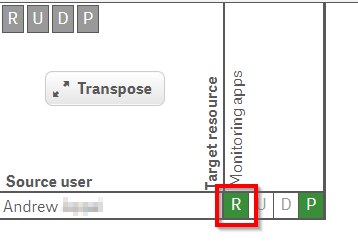
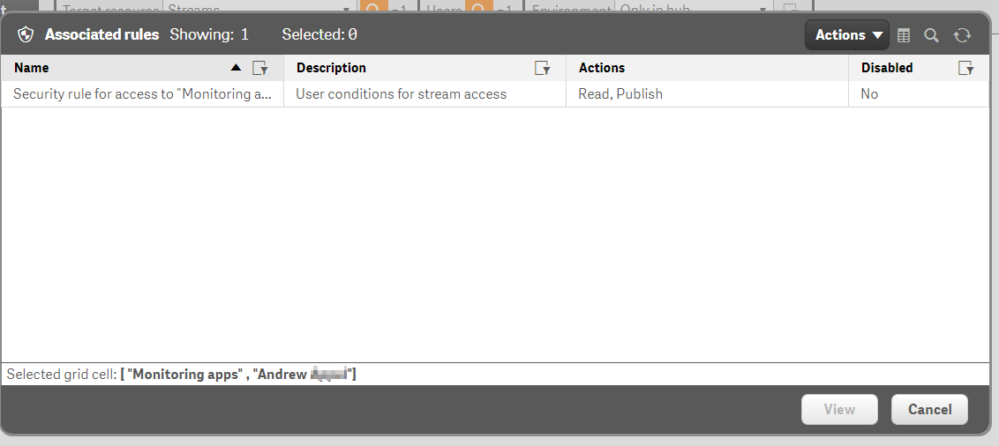
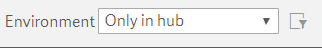
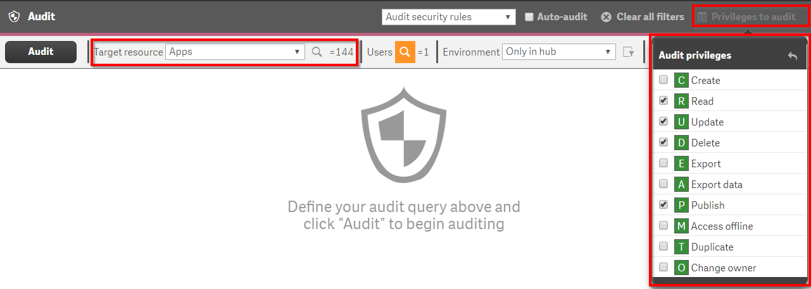
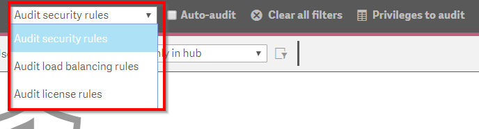
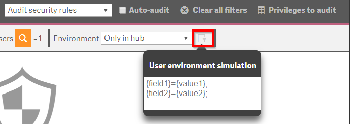

# Audit User Access <i class="fas fa-tools fa-xs" title="Tooling | Pre-Built Solutions"></i> <i class="fas fa-file-code fa-xs" title="API | Script Optional"></i>*
{:.no_toc}

<span class="label prod">production</span>

|                                  		                      | Initial    | Recurring   |
|-----------------------------------------------------------|------------|-------------|
| <i class="far fa-clock fa-sm"></i> **Estimated Time**     | 30 min     | 20 min      |

Benefits:

  - Ensure Security
  
-------------------------

## Goal
{:.no_toc}
This activity will center around auditing what assets (e.g. apps, streams, data connections) that users of the Qlik site have access to. This audit can be done on an ad-hoc basis using the QMC or in a more systemic way using script(s) + a Qlik app. Auditing provides a validation for the configured security rules. This section is listed as ideal to do quarterly so that the Qlik administrator can be generally aware of who has access to _what_ in their environment but practically an audit should be performed before and after a change in the security rules in the environment.

## Table of Contents
{:.no_toc}

* TOC
{:toc}
-------------------------

## QMC - Audit

To audit access using the QMC, navigate to the `Audit` section of the QMC.

[](https://raw.githubusercontent.com/qs-admin-guide/qs-admin-playbook/master/docs/audit/images/user_access-1.png)

The available options are displayed across the top pane of the Audit section.

[](https://raw.githubusercontent.com/qs-admin-guide/qs-admin-playbook/master/docs/audit/images/user_access-2.png)

1. **Target Resource**: The Qlik thing you are auditing. Examples include: Streams, Apps, etc.
2. **(Optional) Filtering of 1**: In this section you can filter to a subset of the type of thing selected for 1.
3. **Users**: In this section you can filter on the user(s) which you are auditing.
4. **Environment**: Select whether you are auditing Hub or QMC access, or both.

The resulting audit will highlight whether the user(s) have access to the Qlik thing(s).

[](https://raw.githubusercontent.com/qs-admin-guide/qs-admin-playbook/master/docs/audit/images/user_access-3.png)

From [the documentation](https://help.qlik.com/en-US/sense-admin/Subsystems/DeployAdministerQSE/Content/Sense_DeployAdminister/QSEoW/Administer_QSEoW/Managing_QSEoW/audit-overview.htm), we can interpret the colors used in the audit:

- **Green**: The Security Rule which provides access is valid and enabled
- **Yellow**: The Security rule which (would) provide access is valid but disabled
- **Red** The Security rule which (would) provide access is invalid

In this example, Andrew has **Read** and **Publish** access to the `Monitoring Apps` stream. By selecting the cell for the action that we are interested in, we can see what rule(s) are providing access.

[](https://raw.githubusercontent.com/qs-admin-guide/qs-admin-playbook/master/docs/audit/images/user_access-4.png)

[](https://raw.githubusercontent.com/qs-admin-guide/qs-admin-playbook/master/docs/audit/images/user_access-5.png)

### Tips

- Be sure to set an appropriate context. Security rules can be applied to the QMC, Hub, or Both. The default value for this is Both which will result in showing access if the user has access to the asset _either_ in the QMC and/or Hub. If this is the intended audit, then the default choice is acceptable. But for most use cases, the administrator will want to be specific about the context.

[](https://raw.githubusercontent.com/qs-admin-guide/qs-admin-playbook/master/docs/audit/images/user_access-6.png)

- (1) : In the Upper right hand corner the administrator can select **Privileges to audit** which will allow the administrator to select which security rule actions they are auditing.
- (2) : The list of available Privileges changes as the administrator changes the `Target Resource` since the types of action(s) which can be applied to a Qlik entity inside of a security rule varies. For example, the Export Data action is applied at the App level. That action neither exists nor makes sense at the Stream level since Streams do not contain data.

[](https://raw.githubusercontent.com/qs-admin-guide/qs-admin-playbook/master/docs/audit/images/user_access-7.png)

- The administrator can audit Security, Load Balancing, or License rules using the Audit interface.

[](https://raw.githubusercontent.com/qs-admin-guide/qs-admin-playbook/master/docs/audit/images/user_access-8.png)

- If using Session Attributes ([example](https://community.qlik.com/t5/Qlik-Design-Blog/User-Environment-What-Session-Attributes-in-Qlik-Sense/ba-p/1476590)), the administrator can _simulate_ the effect should the attribute be present. Since session attributes are not stored by Qlik Sense Enterprise, the administrator will need to type / paste in the values here.

[](https://raw.githubusercontent.com/qs-admin-guide/qs-admin-playbook/master/docs/audit/images/user_access-9.png)


## qs-security-audit <i class="fas fa-file-code fa-xs" title="API | Requires Script"></i> <i class="fas fa-tools fa-xs" title="Tooling | Pre-Built Solutions"></i>

The approach above is fundamentally a manual one and is ideal for ad-hoc scenarios where the Qlik administrator needs to quickly survey who has access to what in their Qlik site, for example after changing a security rule. An alternative one is to do a bulk query programmatically then load the output into a Qlik App. For this approach we will need a script to bulk extract the audit information.

```powershell
$auditStreams = $true
$auditApps = $true
$auditDataConnections = $true


Connect-Qlik

# Get the Archived Logs folder
$rootFolder = (Get-QlikServiceCluster -full).settings.sharedPersistenceProperties.archivedLogsRootFolder

# Check for the store folder, create if needed
$storeDir = $rootFolder + '\qs-security-audit-csv'
if (!(Test-Path $storeDir)){
    Set-Location $rootFolder
    New-Item -path $storeDir -type directory | Out-Null
}

if ($auditStreams -eq $true){
    $streamAuditBody = '{"resourceType":"Stream","resourceRef":{},"subjectRef":{"resourceFilter":""},"actions":2,"environmentAttributes":"context=AppAccess;","subjectProperties":["id","name","userId","userDirectory"],"auditLimit":100000,"outputObjectsPrivileges":4,"resourceProperties":["name"]}'
    $streamAudit = Invoke-QlikPost -path /qrs/systemrule/security/audit/matrix -body $streamAuditBody
    $streamAudit.matrix | Export-Csv -path "$($rootFolder)\qs-security-audit-csv\streamsAudit.csv" -NoTypeInformation
    $streams = Get-QlikStream
    $streams | Export-Csv -path "$($rootFolder)\qs-security-audit-csv\streams.csv" -NoTypeInformation
}


if ($auditApps-eq $true){
    $appAuditBody = '{"resourceType":"App","resourceRef":{},"subjectRef":{"resourceFilter":""},"actions":2,"environmentAttributes":"context=AppAccess;","subjectProperties":["id","name","userId","userDirectory"],"auditLimit":100000,"outputObjectsPrivileges":4,"resourceProperties":["name"]}'
    $appAudit = Invoke-QlikPost -path /qrs/systemrule/security/audit/matrix -body $appAuditBody
    $appAudit.matrix | Export-Csv -path "$($rootFolder)\qs-security-audit-csv\appsAudit.csv" -NoTypeInformation
    $apps = Get-QlikApp
    $apps | Export-Csv -path "$($rootFolder)\qs-security-audit-csv\apps.csv" -NoTypeInformation
}

if ($auditDataConnections-eq $true){
    $dataConnectionAuditBody = '{"resourceType":"DataConnection","resourceRef":{},"subjectRef":{"resourceFilter":""},"actions":2,"environmentAttributes":"context=AppAccess;","subjectProperties":["id","name","userId","userDirectory"],"auditLimit":100000,"outputObjectsPrivileges":4,"resourceProperties":["name"]}'
    $dataConnectionAudit = Invoke-QlikPost -path /qrs/systemrule/security/audit/matrix -body $dataConnectionAuditBody
    $dataConnectionAudit.matrix | Export-Csv -path "$($rootFolder)\qs-security-audit-csv\dataConnectionsAudit.csv" -NoTypeInformation
    $dataConnections = Get-QlikDataConnection
    $dataConnections | Export-Csv -path "$($rootFolder)\qs-security-audit-csv\dataConnections.csv" -NoTypeInformation
}

$user = Get-QlikUser
$user | Export-Csv -path "$($rootFolder)\qs-security-audit-csv\users.csv" -NoTypeInformation
```
{:.snippet}

From there we can use [this Qlik App](https://doesnotexistyet.com)...

**Tags**

#quarterly

#audit

#users

&nbsp;
