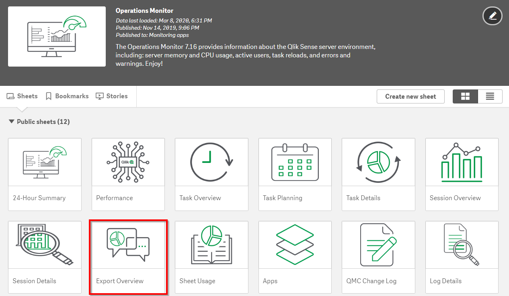
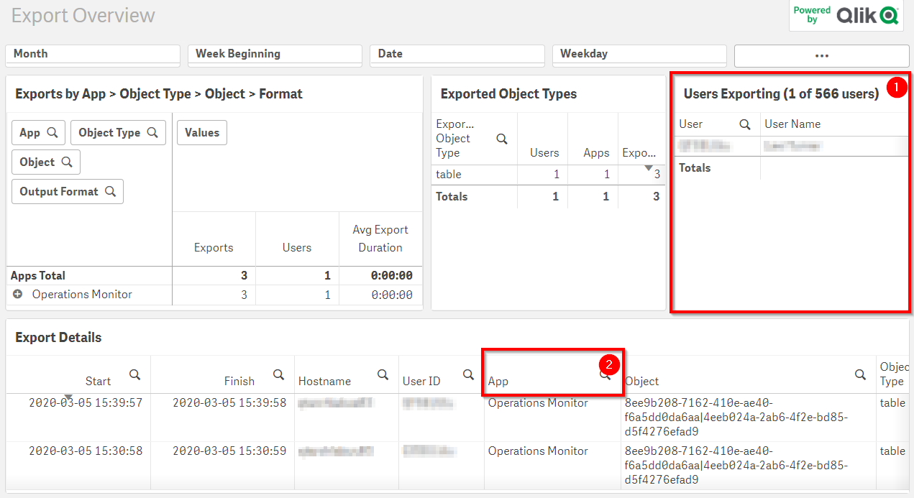

# Review Data Exports <i class="fas fa-dolly-flatbed fa-xs" title="Shipped | Native Capability"></i> 
{: .no_toc }

production

|                                  		                      | Initial    | Recurring   |
|-----------------------------------------------------------|------------|-------------|
| <i class="far fa-clock fa-sm"></i> **Estimated Time**     | 30 min     | 15 min      |

Benefits:

  - Understand user behavior
  - Increase analysis within Qlik
  
-------------------------

## Goal
{:.no_toc}
The goal for this activity is to review the Operations Monitor in Qlik Sense Enterprise to review what user(s) are exporting data to Excel. Exports to Excel are expensive for the Qlik Engine since it needs to:

- Construct a duplicative hypercube of the requested data
- Calculate the aggregates (if needed, e.g. pivot tables)
- Explode the hypercube from memory and dump it to disk
- Notify the browser that there is a file ready for download
- Deliver that stream across the network to the end user

For the majority of use cases, bulk exports to Excel signal that dashboards need to be better optimized to meet the work-flow needs of the user base. The action from this activity is for the administrator to consult with the app's owner / developer and potentially the end user(s) to discuss the data needs that they have and how the Qlik app can better support them.

## Table of Contents
{:.no_toc}

* TOC
{:toc}
-------------------------

### Review Operations Monitor <i class="fas fa-dolly-flatbed fa-xs" title="Shipped | Native Capability"></i> 

Open up the **Operations Monitor** application and navigate to the **Export Overview** sheet:

Inside the app review the **Users Exporting** table for a list of users who have exported data to Excel (1) and review the **Export Details** table for the applications where the exports originated from (2).

**Tags**

#monthly

#audit

&nbsp;