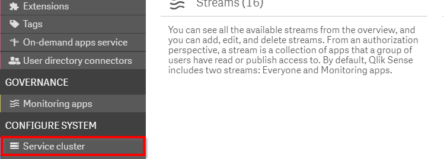
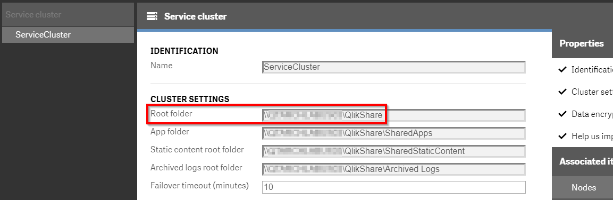

# Verify Backup Execution  <i class="fas fa-file-code fa-xs" title="API | Requires Script"></i>
{: .no_toc }

<span class="label all">all</span>

|                                  		                      | Initial    | Recurring   |
|-----------------------------------------------------------|------------|-------------|
| <i class="far fa-clock fa-sm"></i> **Estimated Time**     | 2 hrs     | 1 hr      |

Benefits:

  - Reduce/eliminate unsupported extensions
  - Increase stability
  - Decrease upgrade maintenance/time
  
-------------------------

## Goal
{:.no_toc}
The goal for this activity is for the administrator to verify that appropriate backups of their Qlik Sense Enterprise deployment have been made. This allows the administrator to increase the organization's fault tolerance, demonstrate preparedness, and harden out processes around backups before they are needed.

## Table of Contents
{:.no_toc}

* TOC
{:toc}

## What do I backup?

With Qlik Sense Enterprise on Windows there are three core components (and an additional one) which need to be backed up in order to maintain a minimally functioning site:

1. The persistent content used by the site
2. The site wide metadata stored in PostgreSQL
3. The certificates used by the Qlik site for internal communication
4. Ancillary content

### Persistent Content

The persistent content used by the site includes things like apps, extensions, and images used in application thumbnails. These are the core elements of a Qlik site. In a disaster, an administrator can use these flattened assets to rebuild a Qlik site from scratch. These pieces of content are stored in the **Service Cluster** for the site. To confirm this location in the QMC go to the **Service Cluster** section.

[](https://raw.githubusercontent.com/qs-admin-guide/qs-admin-playbook/master/docs/backup_and_archiving/images/verify-1.png)

Note the **Root folder**.

[](https://raw.githubusercontent.com/qs-admin-guide/qs-admin-playbook/master/docs/backup_and_archiving/images/verify-2.png)

### PostgreSQL

Beneath every Qlik Sense Enterprise on Windows site is a series of PostgreSQL databases which store site-wide metadata. This metadata contains ownership of assets, hierarchies, authentication settings, security rules, licenses, and so on. Think the information with is displayed in the QMC. The combination of this metadata and the persistent content allow for a more seamless restoration process. To take the example of Qlik apps, the structure of the physical file on disk is flattened. In a published Qlik app, there may be sheets which are part of the base app, sheets published to the community for consumption across the user base, and private sheets created by individuals for their personal analyses. The physical file makes no distinction between these states of sheets, so if an administrator were to import the file from disk they would get a flattened list of all the sheets no matter their status.

### Certificates

When Qlik Sense Enterprise was designed, security against eavesdropping was built in by using certificates which Qlik generates to encrypt all traffic between services. This communication is encrypted no matter if the communication is self-contained to a single server or distributed across multiple nodes in a cluster. These certificates likewise are used to encrypt sensitive data which is stored in PostgreSQL (e.g. passwords to data connections). Due to this, the original certificates in a Qlik site are key seamless recovery. Without the availabity of these certificates the site can be recovered but at a consequence of needing to re-enter passwords, re-distribute certificates to other members of the Qlik Sense cluster, as well as replacement of certificates used in integration points like Web Ticketing using the Qlik Proxy API, automation tasks using the Qlik Repository API, or visualization integrations using the Qlik Engine API.

### Ancillary content

The previous items are universal to every Qlik Sense Enterprise site. This fourth item is customized per deployment. When we say ancillary content, we refer to all the non Qlik stuff which is important to a Qlik site. These can include but as not limited to:

- Third party certificates attached to the Qlik Sense Proxy Service to enable trusted HTTPS communication
- Third party drivers installed to the Windows Operating System to connect to databases without bundled connectivity options
- Server Side Extension modules (e.g. Python, R) which run on the Qlik server
- Automation code which is running on the Qlik server (for example like a back-up process)

## How do I backup?

### Persistent Content

Since these files are just files on a file system, it is ideal to use existing mechanisms for backing up files. This can be snapshots on a VM level, backup processes on storage devices (e.g. NAS, SAN) if those devices are used to host the Qlik share. 

The important component of this backup process is that it needs to be made in synchronization with the backup of the **PostgreSQL** meta-data. This is ideal for Qlik Sense services to be stopped during this backup processes. This ensures that the state on disk is exactly the state in the PostgreSQL database. Think ensuring that no user has created a new sheet. In a pinch an asynchronous backup is acceptable but there may be data loss.

If an administrator needs to manually backup these files we will cover these in a later section where we review a complete backup solution.

### PostgreSQL  <i class="fas fa-file-code fa-xs" title="API | Requires Script"></i>

In order to backup PostgreSQL, use the `pg_dump` PostgreSQL process. This can be illustrated in this example PowerShell script:

**Script**

```powershell
# Define the backup directory
$backupDir = 'C:\QSR'

# Define the PostgreSQL password
$pwd = 'MySuperSecretPassword'

# Pass the password to an environmental variable for PostgreSQL
$env:PGPASSWORD = $pwd

# Determine the installation path
$installPath = (Get-ChildItem HKLM:\SOFTWARE\Microsoft\Windows\CurrentVersion\Uninstall | % { Get-ItemProperty $_.PsPath } | Select DisplayName,InstallLocation | Where-Object {$_.DisplayName -eq 'Qlik Sense Repository'}).InstallLocation

# Create backup directory if needed
if (Test-Path $backupDir) {
} else {
    New-Item -ItemType directory -Path $backupDir > $null
}

# GOTO installation directory's PostgreSQL subdirectory
Set-Location $installPath\Repository\PostgreSQL\*\bin

# Execute the backup
.\pg_dump.exe -h localhost -p 4432 -U postgres -b -F t -f "$($backupDir)\$(Get-Date -Format 'yyyy-MM-dd')-QSR.tar" QSR

.\pg_dump.exe -h localhost -p 4432 -U postgres -b -F t -f "$($backupDir)\$(Get-Date -Format 'yyyy-MM-dd')-Licenses.tar" Licenses

.\pg_dump.exe -h localhost -p 4432 -U postgres -b -F t -f "$($backupDir)\$(Get-Date -Format 'yyyy-MM-dd')-SenseServices.tar" SenseServices

.\pg_dump.exe -h localhost -p 4432 -U postgres -b -F t -f "$($backupDir)\$(Get-Date -Format 'yyyy-MM-dd')-QLogs.tar" QLogs

.\pg_dump.exe -h localhost -p 4432 -U postgres -b -F t -f "$($backupDir)\$(Get-Date -Format 'yyyy-MM-dd')-QSMQ.tar" QSMQ

# Remove the environmental variable for PostgreSQL password
Remove-Item Env:\PGPASSWORD
```
{:.snippet}

As a note for this script, it is backing up all the databases used by Qlik Sense Enterprise as of **February 2020** including the optional [Centralized Logging database](https://help.qlik.com/en-US/sense-admin/Subsystems/DeployAdministerQSE/Content/Sense_DeployAdminister/QSEoW/Deploy_QSEoW/Qlik-Logging-Service.htm). Please reference documentation of the version of Qlik Sense Enterprise that is running to ensure full coverage for the databases used. The ideal page for this list is Qlik's page on [installing and configuring PostgreSQL](https://help.qlik.com/en-US/sense-admin/Subsystems/DeployAdministerQSE/Content/Sense_DeployAdminister/QSEoW/Deploy_QSEoW/Installing-configuring-postgresql.htm) which outlines the databases which are needed to be present.

### Certificates  <i class="fas fa-file-code fa-xs" title="API | Requires Script"></i>

There are three certificates on a Qlik site:

1. a Root Certificate
2. a Server Certificate
3. a Client certificate

(1) is used to generate (2) and (3). Each component uses either (2) or (3) depending on whether it is the client or server in the exchange. (2) likewise is bound to the API ports which can be integrated into authentication modules (i.e. using the QPS API) or automation processes (i.e. using the QRS API). It is important to keep a backup of these certificates in case of recovery. Strictly speaking there isn't a need for incremental backups of these certificates but it is wise to integrate a backup process nonetheless. An example of how to automate this process is here:

**Script** 

```powershell
# Define the backup directory
$backupDir = 'C:\QSR'

# Define the certificate password
$pwd = 'MySuperSecretPassword'

# Create backup directory if needed
if (Test-Path $backupDir) {
} else {
    New-Item -ItemType directory -Path $backupDir > $null
}

# Get Root Certificate Thumbprint
$store = Get-Item "cert:\LocalMachine\Root";
$store.Open("ReadOnly");
$certs = $store.Certificates.Find("FindByExtension", "1.3.6.1.5.5.7.13.3", $false);
$rootThumb = $certs.Thumbprint

# Get Server Certificate Thumbprint
$store = Get-Item "cert:\LocalMachine\My";
$store.Open("ReadOnly");
$certs = $store.Certificates.Find("FindByExtension", "1.3.6.1.5.5.7.13.3", $false);
$serverThumb = $certs.Thumbprint

# Get Client Certificate Thumbprint
$store = Get-Item "cert:\CurrentUser\My";
$store.Open("ReadOnly");
$certs = $store.Certificates.Find("FindByExtension", "1.3.6.1.5.5.7.13.3", $false);
$clientThumb = $certs.Thumbprint

# Export the certificates to the backupDir
$null = certutil -f -p $pwd -exportpfx -privatekey Root $rootThumb "$backupDir\$(Get-Date -Format 'yyyy-MM-dd')-root.pfx"

$null = certutil -f -p $pwd -exportpfx -privatekey MY $serverThumb "$backupDir\$(Get-Date -Format 'yyyy-MM-dd')-server.pfx" NoRoot

$null = certutil -f -p $pwd -exportpfx -privatekey -user MY $clientThumb "$backupDir\$(Get-Date -Format 'yyyy-MM-dd')-client.pfx" NoRoot

```
{:.snippet}

A non-automated process is documented on Qlik's [help site](https://help.qlik.com/en-US/sense-admin/Subsystems/DeployAdministerQSE/Content/Sense_DeployAdminister/QSEoW/Deploy_QSEoW/Backing-up-certificates.htm).

### Ancillary content

For this section, the administrator will need to survey the other non-Qlik stuff and ensure appropriate backups of those items has occurred. This can range from installation files (in the case of drivers) and configurations (for DSNs) to third party certificates. Initially this process will require some effort, but practically administrators should get into the habit of placing the needed non-Qlik things into a location which can be referenced in documentation for the entirity of the Qlik deployment along with the specific needed configurations. This planning and documentation can be critical in a disaster scenario or well appreciated by the next person who takes over responsibilities for administering the Qlik deployment.

### Full backups

With every (modern) Qlik Sense Enterprise installation, a utility is bundled with the install. This utility (`QlikSenseUtil.exe`) is placed in the install folder for Qlik Sense Enterprise in the Repository's Util directory. With a default installation path, the path to utility would be `C:\Program Files\Qlik\Sense\Repository\Util\QlikSenseUtil\QlikSenseUtil.exe`. One of the many pieces of functionality that this utility provides is the ability to do a full backup of a Qlik Sense Enterprise site via command line. There is a robust Qlik Support article located [here](https://support.qlik.com/articles/000051894) which goes over this utility in more depth, but a sample command which can be used to do a full site backup is:

```batch
"C:\Program Files\Qlik\Sense\Repository\Util\QlikSenseUtil\QlikSenseUtil.exe" -backup -databaseHostname="localhost" -databasePassword="MySuperSecretPassword" -path="D:\Backups" -rootPath="\\MyServer\Share"
```
{:.snippet}

The utility will snapshot all the files on Qlik's share, the database, and the internal Qlik certificates. This tool is ideal for many organizations where the flexibility of custom backup scripts is not needed.

## How do I verify that backups are being done?

After ensuring that there _is_ a backup process in place, the administrator should check for the existence of backups in the designated backup location. This backup location should be **off** the Qlik Sense Enterprise server. It is therefore ideal to structure the backups into a format where a quick check can be done to confirm that backups are occurring. For example:

```plaintext
D:\QSBackup
D:\QSBackup\YYYY-MM-DD
D:\QSBackup\YYYY-MM-DD\QlikShare
D:\QSBackup\YYYY-MM-DD\Certificates
D:\QSBackup\YYYY-MM-DD\Database
```
{:.snippet}

Using a structure like this allows for the administrator to quickly survey 

- whether the expected root folder exists (YYYY-MM-DD)
- whether the files in the QlikShare, Certificates, and Database folders have non-zero file size

## Documentation

- [Help.qlik.com](https://help.qlik.com/en-US/sense-admin/Subsystems/DeployAdministerQSE/Content/Sense_DeployAdminister/QSEoW/Deploy_QSEoW/Backing-up-a-site.htm)

**Tags**

#monthly

#backup_and_archiving

#backup

&nbsp;
