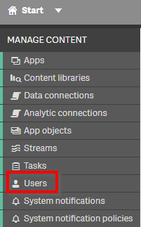
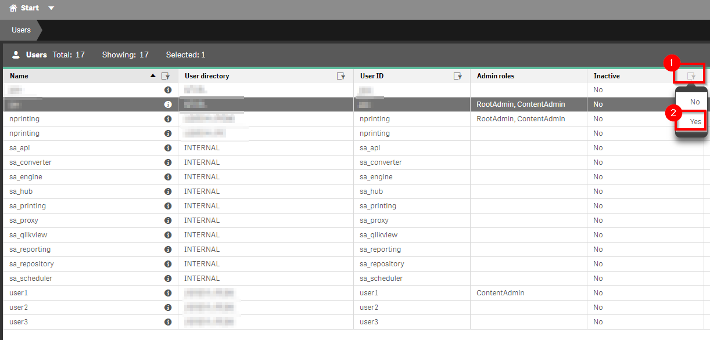
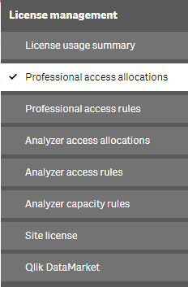
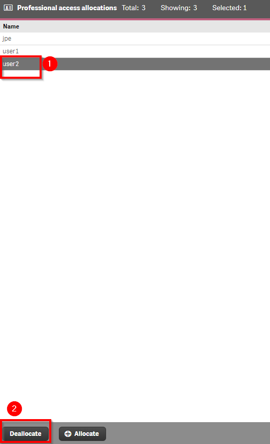
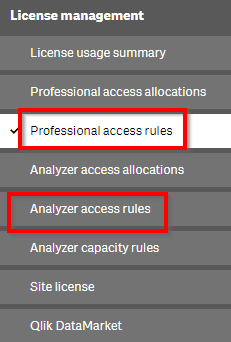
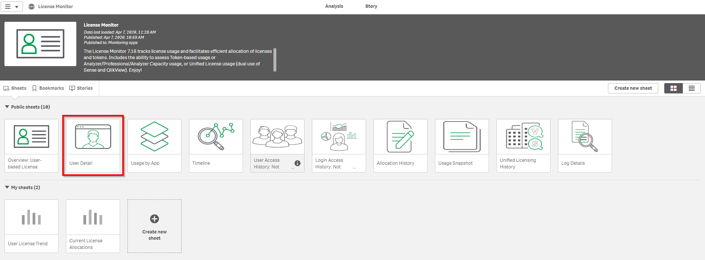
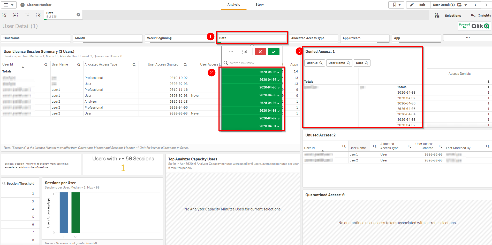
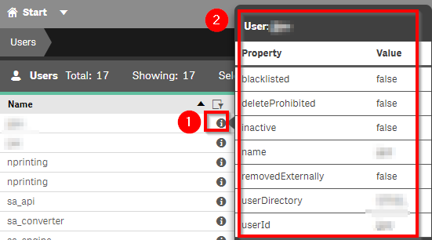
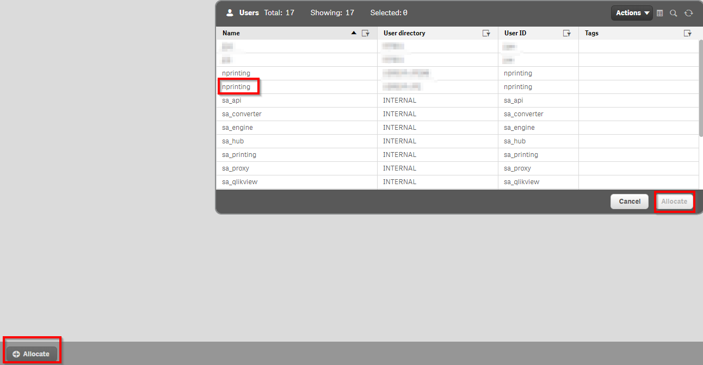

# License Maintenance
{:.no_toc}

all

|                                  		                  | Initial | Recurring |
|---------------------------------------------------------|---------|-----------|
| <i class="far fa-clock fa-sm"></i> **Estimated Time**   | 20 min | 10 min    |

Benefits:

  - Ensure all licenses can be leveraged
  - Ensure desired users have access 

## Goal
{:.no_toc}
The goal of this activity is to keep up with general license maintenance, specifically focusing on the following exercises:

1. Remove license allocations for _Inactive_ users
2. Consider/review license allocations for users that are being denied access

## Table of Contents
{:.no_toc}

* TOC
{:toc}
-------------------------

## Removing License Allocations for Inactive Users

To check for inactive users, go to the _QMC_ and select the _Users_ section.

Select the filter icon above the **Inactive** column and select _Yes_. The list of users will be filtered to those who are inactive. 

A user is marked inactive when a configured **User Directory Connector (UDC)** can no longer can find the user in the 3rd party user directory (AD, LDAP etc...).  Such users are candidates for license dealloaction if they have left the company or moved to a department or group that no longer has access--the latter comes into play when there is an LDAP filter on the UDC.

To remove a license allocation, go to the **QMC** and select **License Management**

The license allocation will be present under **Professional Allocations** or **Analyzer Allocations**. Check both sections to find the inactive user.

To deallocate a user, select the user from the appropriate allocation screen and select **Deallocate** at the bottom of the screen.

If a **License Rule** is present to allocate licenses to users automatically, check if the license rule should be updated. 

## Check for License Denials

From the HUB select the **Monitoring Apps** Stream and then select the **License Monitor** application.

Select the 'User Detail' sheet

At the top, select the **Date** Filter pane and select the most recent dates.  On the right , the **Denied Access** object will show a list of users who have been denied access. These users are candidates for being allocated a new license

When users are getting a denied access, it means that they have successfully authenticated to Qlik Sense and have been identified, but they have not yet been allocated a license. It may be because of a misconfiguration in the current license allocation rule, or it may be because a new group is interested in using the platform and that group is not configured in the allocation rule, as they were not anticipated.

If a **user directory connector** is in use, then more information about the denied user can be determined by accessing the **QMC** and going to the **User** section. 

Click the **info** icon next to the user to bring up a pop-up set of additional properties. 

When a user directory connector is used, typically a group (IE AD Group, or SAML parameter) will be presented for additional information.

Depending on what is found out about the user the follow-up action is either simply  allocate the single user , or update the licence **allocation rules** from the **License Management** section of the **QMC*.

To allocate a single license,  go to the **QMC** and select the **License Management** section.

Depending on the level of capability required, select **Professional Allocations** or **Analyzer Allocations**.

Next, select **Allocate** at the bottom, select the same user that was denied, and select **Allocate**.

Otherwise, a license rule can be created or updated to automatically allow new users acces from the **License Management** screen select **Professional Allocations** or **analyzer allocations**.  

For more information on access rules consult the Qlik Sense help:

- [Qlik Help - Create Professional Access Rule](https://help.qlik.com/en-US/sense-admin/February2020/Subsystems/DeployAdministerQSE/Content/Sense_DeployAdminister/QSEoW/Administer_QSEoW/Managing_QSEoW/create-professional-access-rule.htm)
- [Qlik Help - Create Analyzer Access Rule](https://help.qlik.com/en-US/sense-admin/February2020/Subsystems/DeployAdministerQSE/Content/Sense_DeployAdminister/QSEoW/Administer_QSEoW/Managing_QSEoW/create-analyzer-access-rule.htm)

**Tags**

#monthly

#licensing

#license

#users

&nbsp;
