# Review License Allocations
{:.no_toc}

all

|                                  		                  | Initial | Recurring |
|---------------------------------------------------------|---------|-----------|
| <i class="far fa-clock fa-sm"></i> **Estimated Time**   | 20 min | 10 min    |

Benefits:

  - Ensure licenses are available
  - Plan for license growth

## Goal
{:.no_toc}
The goal of this activity is to evaluate license growth and needs using the built in "License Monitor" application. 

## Table of Contents
{:.no_toc}

* TOC
{:toc}
-------------------------

## License Monitor

This page leverages the **License Monitor**. Please refer to the [License Monitor](../../tooling/operations_monitor.md) page for an overview and relevant documentation links.

### Confirm License Monitor is Operational

Navigate to the **Monitoring apps** and select the _Details_ button (info icon) on the **License Monitor** application. Confirm that the application's data is up-to-date.

If the **License Monitor** is not up-to-date, please refer to the [License Monitor Documentation](../../tooling/license_monitor.md#documentation) for configuration details and troubleshooting steps.

-------------------------

## Check License Growth

First check the QMC to see how many total license are available for Professional and Analyzers. Navigate to the _License Management_ section of the QMC. 

[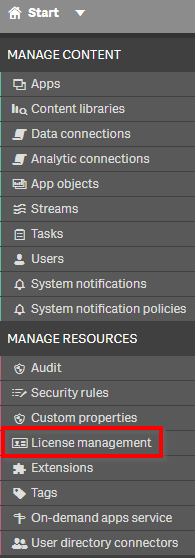](https://raw.githubusercontent.com/qs-admin-guide/qs-admin-playbook/master/docs/licensing/images/Analyze_Audit_License_Allocations_QMC_License_Management.png)

Ensure _License Usage Summary_ is selected on the right, and then check the total licenses on the left for both _Professional_ and _Analyzers_.

[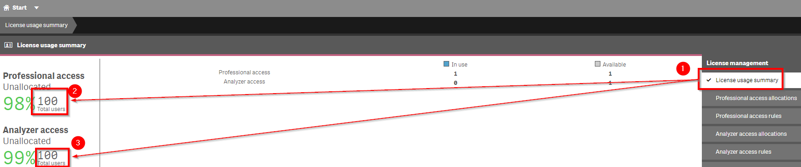](https://raw.githubusercontent.com/qs-admin-guide/qs-admin-playbook/master/docs/licensing/images/Analyze_Audit_License_Allocations_QMC_License_Management_UserMaximums.png)

Next, navigate to the _Monitoring Apps_ section of the QMC, which will route to the _Hub_.

[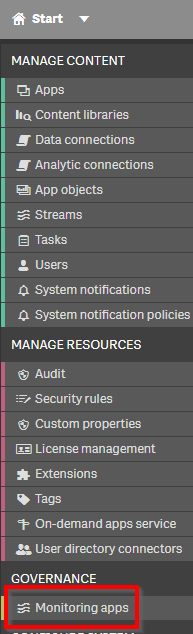](https://raw.githubusercontent.com/qs-admin-guide/qs-admin-playbook/master/docs/licensing/images/Analyze_Audit_License_Allocations_QMC_MonitoringApps.png)

Select the **License Monitor** application.

[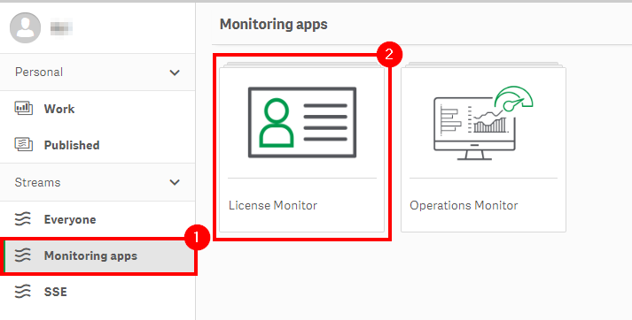](https://raw.githubusercontent.com/qs-admin-guide/qs-admin-playbook/master/docs/licensing/images/Analyze_Audit_License_Allocations_QMC_MonitoringApps_LicenseMonitor.png)

Select the _Overview_ sheet.

[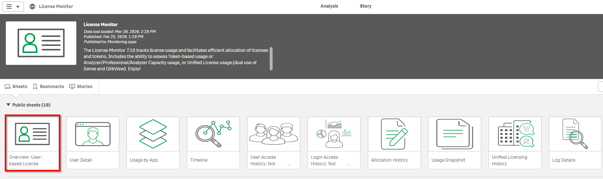](https://raw.githubusercontent.com/qs-admin-guide/qs-admin-playbook/master/docs/licensing/images/Analyze_Audit_License_Allocations_HUB_License_Monitor_App_Overview.png)

Click the _Duplicate_ button on the toolbar.

[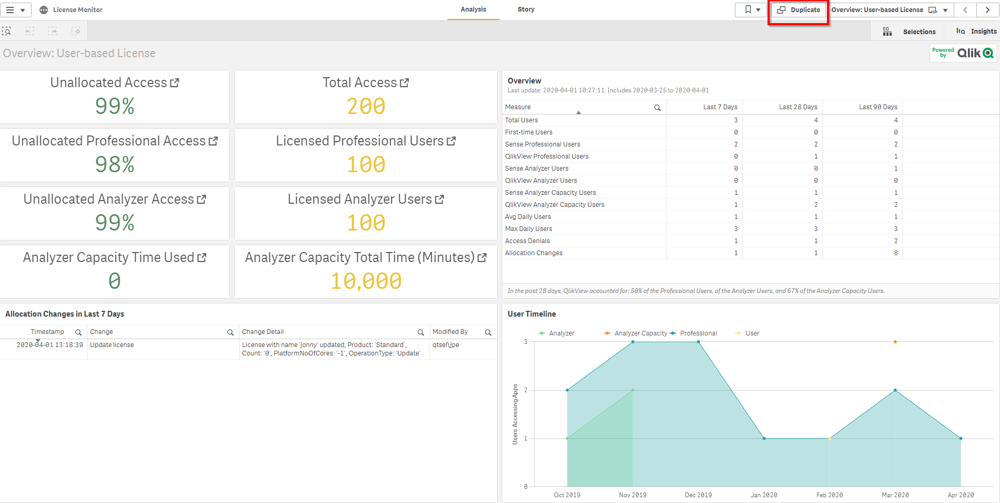](https://raw.githubusercontent.com/qs-admin-guide/qs-admin-playbook/master/docs/licensing/images/Analyze_Audit_License_Allocations_HUB_License_Monitor_App_Overview_Duplicate.png)

Edit the _User Timeline_ Chart by selecting it and deleting the **Access Type** measure.

[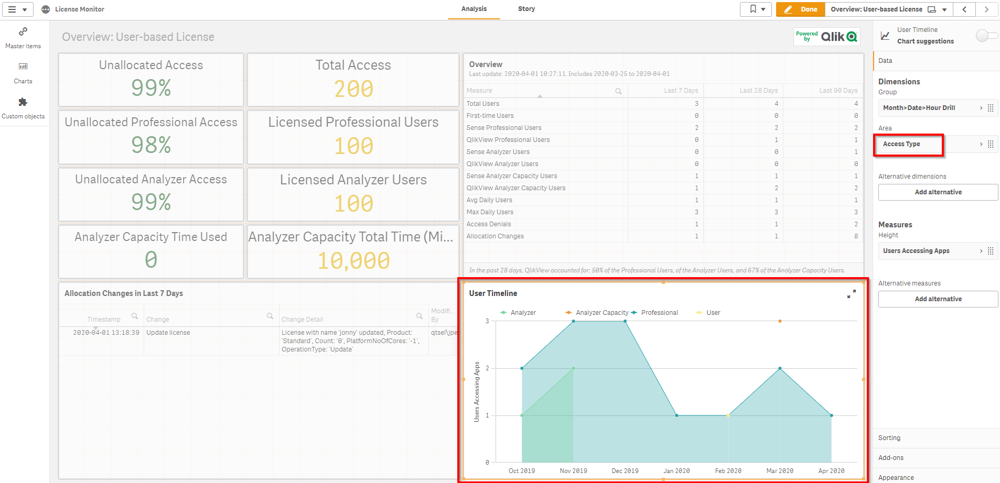](https://raw.githubusercontent.com/qs-admin-guide/qs-admin-playbook/master/docs/licensing/images/Analyze_Audit_License_Allocations_HUB_License_Monitor_App_Overview_AccessType.png)

[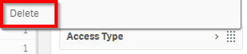](https://raw.githubusercontent.com/qs-admin-guide/qs-admin-playbook/master/docs/licensing/images/Analyze_Audit_License_Allocations_HUB_License_Monitor_App_Overview_AccessType_Delete.png)

With **Access Type** removed, open the _Measures_ pane and select _Add Trend_ under the **User Accessing Apps** measure. 

**_Note that this feature was introduced in the _February 2020_ release, and is documented [here](https://help.qlik.com/en-US/sense/Subsystems/Hub/Content/Sense_Hub/Measures/trend-lines.htm). If the site is not on this release or later, alternative methods can be explored [here](https://community.qlik.com/t5/Qlik-Sense-Documents-Videos/Calculating-trend-lines-values-and-formulas-on-charts-and-tables/ta-p/1479463) using functions like `linest_m()` and `linest_b()` functions._**

[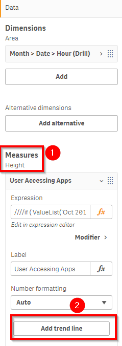](https://raw.githubusercontent.com/qs-admin-guide/qs-admin-playbook/master/docs/licensing/images/Analyze_Audit_License_Allocations_HUB_License_Monitor_App_Overview_AddTrend.png)

Select _Linear_ as the _Trend Type_.

[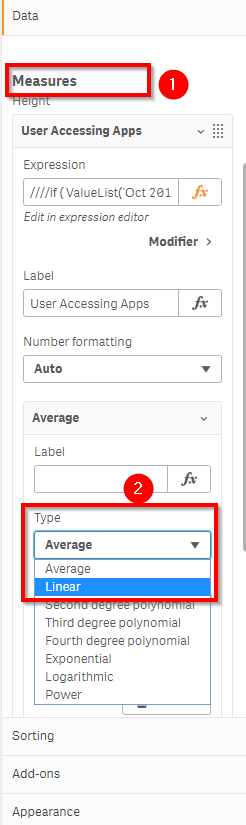](https://raw.githubusercontent.com/qs-admin-guide/qs-admin-playbook/master/docs/licensing/images/Analyze_Audit_License_Allocations_HUB_License_Monitor_App_Overview_AddTrend_Linear.png)

Move the **Allocation Changed in 7 days** table to the left and add a **Filter Pane** in the empty space to the left of the alterered _User Timeline_ chart.

[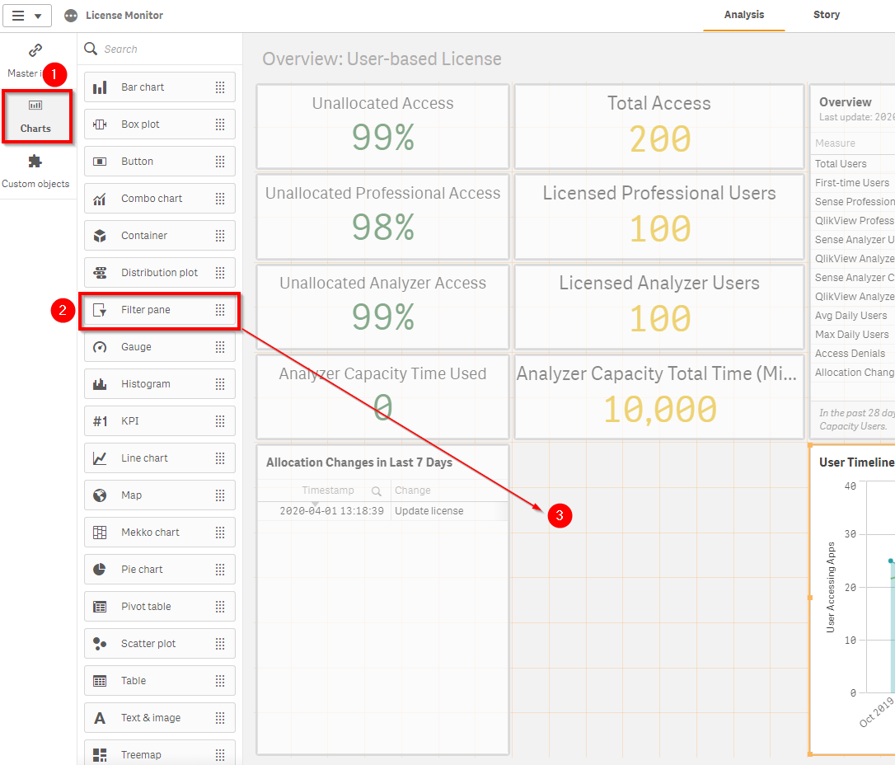](https://raw.githubusercontent.com/qs-admin-guide/qs-admin-playbook/master/docs/licensing/images/Analyze_Audit_License_Allocations_HUB_License_Monitor_App_Overview_DragFilterPane.png)

Select _Dimension_ and choose **Access Type**.

[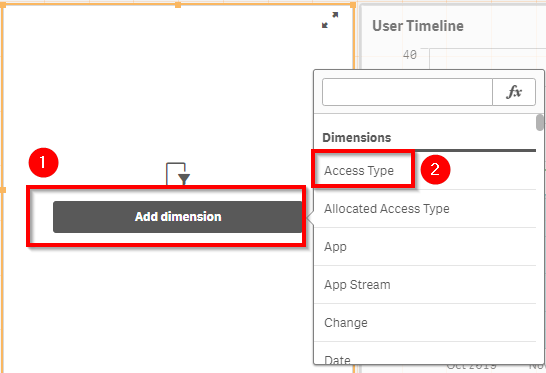](https://raw.githubusercontent.com/qs-admin-guide/qs-admin-playbook/master/docs/licensing/images/Analyze_Audit_License_Allocations_HUB_License_Monitor_App_Overview_AddAccessType.png)

[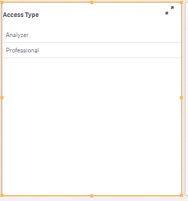](https://raw.githubusercontent.com/qs-admin-guide/qs-admin-playbook/master/docs/licensing/images/Analyze_Audit_License_Allocations_HUB_License_Monitor_App_Overview_AccessTypeAdded.png)

Click _Done_.

[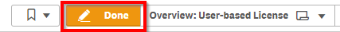](https://raw.githubusercontent.com/qs-admin-guide/qs-admin-playbook/master/docs/licensing/images/Analyze_Audit_License_Allocations_HUB_License_Monitor_App_Overview_DoneButton.png)

Select _Analyzer_ in the filter pane and view/analyze the growth rate in _Analyzer_ app usage. To do this, grab two points on the chart that intersect with Y axis grid lines. In the sample below these two values are '20' and '30' respectively. Since the two points are 4 months apart, one can deduce that the linear growth rate is approximately 2.5 new analyzers per month. 

[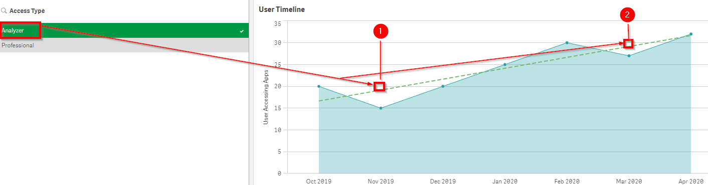](https://raw.githubusercontent.com/qs-admin-guide/qs-admin-playbook/master/docs/licensing/images/Analyze_Audit_License_Allocations_HUB_License_Monitor_App_Overview_AnalyzerTrend.png)

Repeat for _Professional_. In this sample, the growth line is flat. 

In this exercise, it is apparent that 100 analyzer licenses are available. Since the most recent month shows '32' in use, we can expect that licenses will max out in  (100-32)/2.5  or  ~27 months. These are of course estimates without any other variables in play.

The work done to customize the sheet is auto-saved. To make the sheet clear and readily accessible for next time, rename the sheet to _User License Trend_ by clicking in the white space above the app objects as shown by the arrow in the image below, then alter the label to _User License Trend_.

[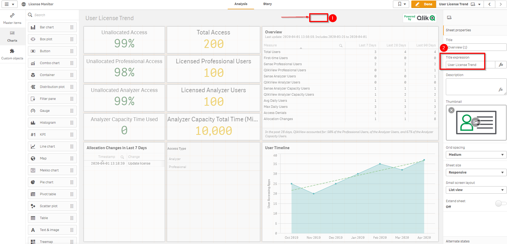](https://raw.githubusercontent.com/qs-admin-guide/qs-admin-playbook/master/docs/licensing/images/Analyze_Audit_License_Allocations_HUB_License_Monitor_App_Overview_UserLicenseTrend.png)

**Tags**

#weekly

#licensing

#license

#users

&nbsp;
