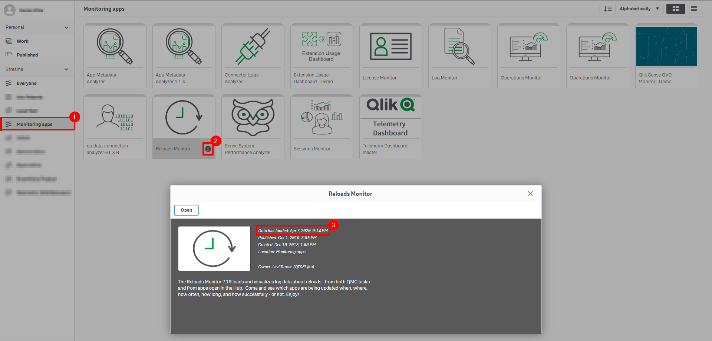
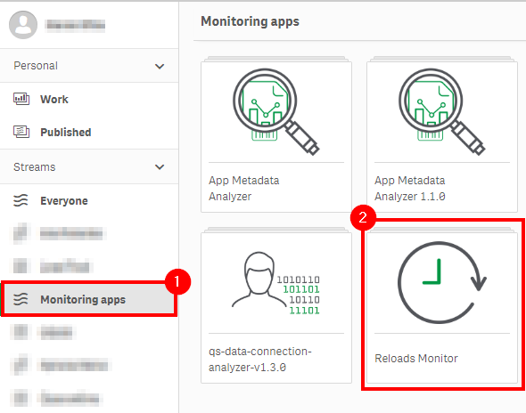
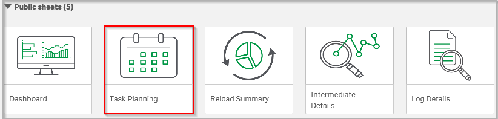
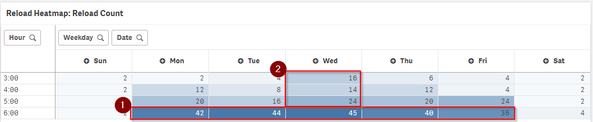
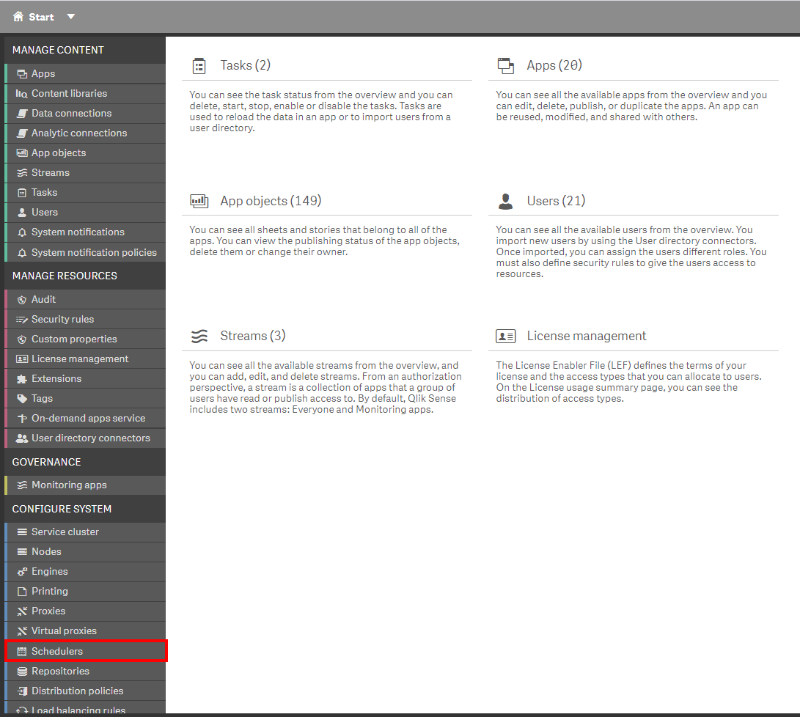
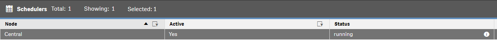
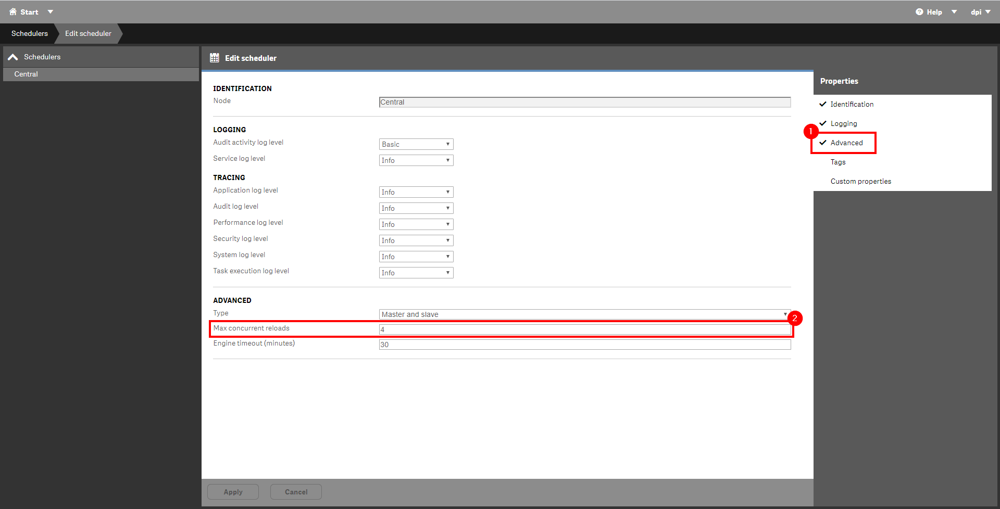

# Optimize Batch Window
{: .no_toc }

production

|                                  		                  | Initial   | Recurring  |
|---------------------------------------------------------|-----------|------------|
| <i class="far fa-clock fa-sm"></i> **Estimated Time**   | 40 min    | 20 min     |

Benefits:

  - Ensure readiness of applications post-batch window
  
-------------------------

## Goal

The goal of this page is to ensure visibility of reload activity within the batch window so that if there is any room for optimization, it can be taken advantage of. The ultimate goal is to ensure that all reloads are able to fit within the batch window with overlapping with consumption hours.

-------------------------

## Reloads Monitor

This page leverages the **Reloads Monitor**. Please refer to the [Reloads Monitor](../../tooling/reloads_monitor.md) page for an overview and relevant documentation links.

### Confirm Reloads Monitor is Operational

Navigate to the **Monitoring apps** and select the _Details_ button (info icon) on the **Reloads Monitor** application. Confirm that the application's data is up-to-date.

If the **Reloads Monitor** is not up-to-date, please refer to the [Reloads Monitor Documentation](../../tooling/reloads_monitor.md#documentation) for configuration details and troubleshooting steps.

-------------------------

## Process

Navigate to the **Monitoring Apps** stream and open up the **Reloads Monitor**.

Navigate to the _Task Planning_ sheet.

Make selections to narrow the scope of the batch window to the appropriate days of the week and hours of the day. In the example below,  Monday - Friday is selected between the hours of 3-6 am. Ensure that the appropriate selections are made to encompass the organization's batch window.

The 6 am hour is highlighted across all 5 days, and demonstrates a very high level of activity compared to the other hours in this batch window example.  This could indicate the opportunity to move some of those reload tasks into the hours prior to 6am, to spread out the processing more evenly. 

Similarly, the second highlighted box shows that Wednesday mornings have more activity in the 3am-6am timeslot than the other days. If there are weekly tasks that can be reallocated to Tuesdays or Thursdays (from that Wednesday slot) this might help even out the processing burden across days.

### Task Optimization & Distribution

#### Task Concurrency

When configuring tasks, ensure that the maximum number of concurrent reloads for each scheduler is set appropriately. For those tasks that do not need to be reloaded serially, this can dramatically cut down on the total batch processing time. 

Navigate to the QMC, and select _Schedulers_.

For each active _Scheduler_, double-click or select **Edit**.

Select _Advanced_ from the _Properties_ pane, and notice the **Max concurrent reloads** option. This option can be set to a maximum of _n-2_, where 'n' is the number of cores on the machine (one dedicated to the OS, and the other dedicated to the Repository). In this example, there are 6 cores available on this scheduler, so that allows for a maximum of 4 concurrent reloads.

#### Task Chaining

Ensure that any tasks that are dependent on each other are run chained, and not just run separately with ample room between. For example if "Task 1" takes 5 minutes to run, and "Task 2" needs to run after "Task 1", do not just simply have "Task 1" run at 2am and "Task 2" run at 3am. "Task" 2 should be chained to execute on the successful completion of "Task 1" to decrease the total batch time.

### QVD Reloads

When utilizing QVD files in a Qlik deployment, it is common to focus on the optimization of these reloads first, as they are critical to the dashboard reloads that depend on them.  The goal should be to reload QVDs as early in the day as possible, to allow more room in the batch window for the dependent reloads that come after them. Sometimes this is as simple as starting the QVD reload tasks earlier on their schedule. However, sometimes these QVD reloads cannot start until a database has been fully updated for the evening’s processing.  In that case, the goal should be to limit the lag time between the source database being updated and the QVD reloads that depend on that database from firing off. There are several methods of "triggering" a QVD reload to happen soon after a database has completed nightly processing. Search "trigger reload" on Qlik Community for examples, but high-level, they can be triggered via API calls, they can poll the database for a flag, etc.

## Actions

If after reviewing and optimizing as per the above there are still issues with fitting everything into the batch windows, some solutions could consist of the following (one or many):

- Add an additional scheduler(s). This would allof for the ability of more concurrent task processing, if the bottle-neck isn't serial.
- Add additional cores to the schedulers to increase the amount of concurrent reloads.
- Optimize application reloads. Best practices can be found [here](https://diagnostictoolkit.qlik-poc.com/#applicationForm) for a start. If the bottleneck is serial, the amount of time an application takes to reload affects all others following.

**Tags**

#quarterly

#system_planning

#batch

&nbsp;