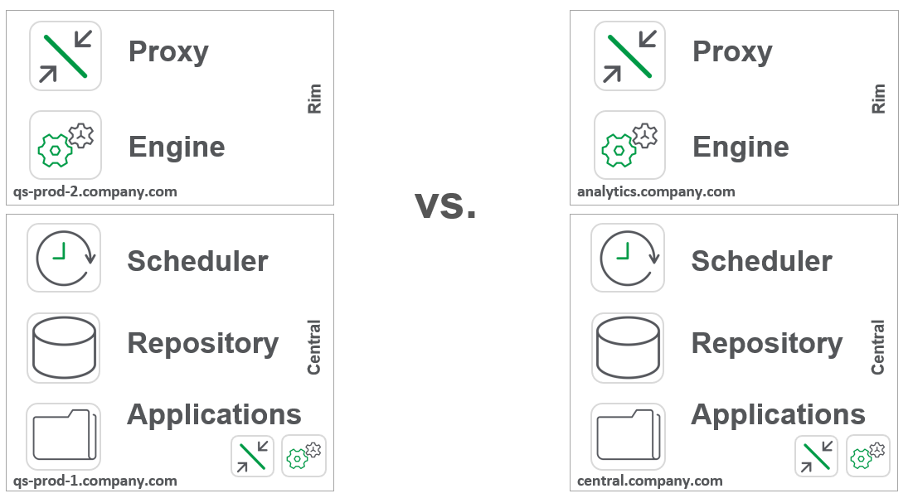

# Plan Disaster Recovery
{: .no_toc }

production

|                                  		                  | Initial   | Recurring  |
|---------------------------------------------------------|-----------|------------|
| <i class="far fa-clock fa-sm"></i> **Estimated Time**   | 40 min    | 20 min     |

Benefits:

  - Ensure readiness
  
-------------------------

## Goal
{:.no_toc}
The goal of this activity is to plan and review the organization's disaster recovery plan. This ensures that the organization can recover from disaster situations and allows the Qlik site to align with the organizational goals of resiliency.

## Table of Contents
{:.no_toc}

* TOC
{:toc}
-------------------------

## Define the Recovery Time Objective (RTO)

In order to plan the processes which will be used to recover Qlik Sense Enterprise after a disaster event, the organization needs to have a target amount of time that downtime is allowed. For many organizations it would be considered acceptable for their business intelligence software to be off-line for a day or two if a disaster event occurs, e.g. their data center is destroyed by a hurricane. For others, the downtime allowance may be much, much smaller. With an understanding of this time objective, the Qlik administrator can then work to architect their deployment to align with this organizational objective.

## Techniques to optimize for recovery

The following techniques can be used to expedite recovery processes for a Qlik site.

### Use of DNS alias for host names

By using a DNS aliases, the organization can abstract from individual server names and IP addresses. This allows for a more dynamic recovery process. Consider two architectures

The architecture on the left uses static server names for routing whereas the architecture on the right uses DNS alias for both front and back-end servers. Deployments which use DNS aliases will have quicker recovery processes, all else being equal.

### Hardened Processes

Organizations who have practiced recovery events will be able to recover quicker. Reference [Practice Recovery Processes](practice_recovery_processes.md) in this guide for more guidance. During the review of the organization's DR plan, feedback from the previous DR exercise should be integrated.

## Hot vs. Warm vs. Cold

Within the context of Qlik Sense Enterprise:

- **Cold** DR: An approach which allows for a new server to be provisioned for Qlik Sense Enterprise. This can include using VM or Cloud based snapshots, or manual back-up and recovery mechanisms. See [Verify Backup Execution](..\backup_and_archiving\verify_backup_execution.md) for more guidance on the manual approach.
- **Warm** DR: A blend of **Cold** and **Hot**, generally involving servers running with software installed. For example, small VMs running in a secondary data center which Qlik Sense Enterprise installed which requires some manual or programmatic intervention to restore the content from the live production site.
- **Hot** DR: A duplicative set of servers with Qlik Sense Enterprise installed and duplicated data. This allows for the quickest recovery but at the cost of increase hardware requirements. Hot DR is difficult with Qlik Sense Enterprise due to the relationship between the physical files on disk used by the site and the metadata stored in the Qlik Repository Database (PostgreSQL). This style of DR is generally confined to environments which are functionally read-only, although allowances for contributed content can be made. This generally is guided by Qlik's Professional Services.

## Disaster Recovery Plan

Once the Qlik administrator has considered the objectives of the organization, they can begin to build out a plan of action for how their Qlik site will be recovered. A template for how this can be documented is as follows:

- Recovery Objective: 1 business day
- Production Server(s): 
  - qs-prod-1.company.com: 8 cores, 64GB RAM
  - qs-prod-2.company.com: 8 cores, 64GB RAM
- Software:
  - Qlik Sense Enterprise November 2019
- Backups
  - Located at `\\somefileshare\applications\qlik\`
- Recovery / Installation Steps
 - Step 1
 - Step 2
 - ...

**Tags**

#yearly

#system_planning

#dr

#DR

&nbsp;