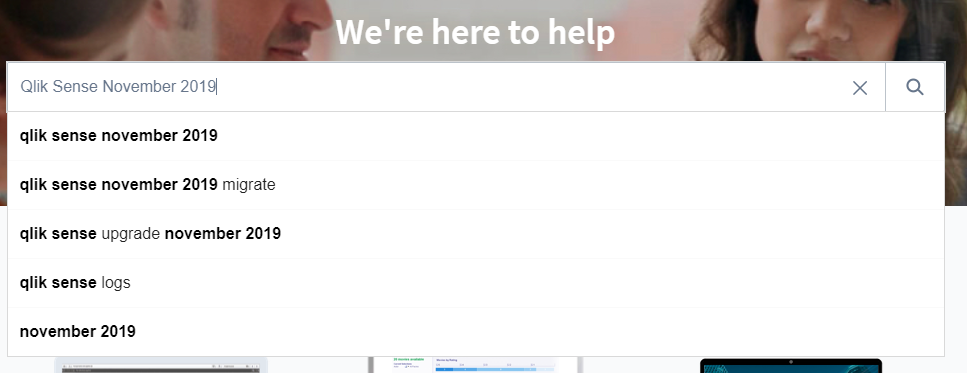

# Plan/Review Upgrade Strategy
{: .no_toc }

all

|                                  		                  | Initial | Recurring |
|---------------------------------------------------------|---------|-----------|
| <i class="far fa-clock fa-sm"></i> **Estimated Time**   | 3 hours | 20 min    |

Benefits:

  - Enable new feature / functions
  - Receive bugfixes

-----------------------

## Goal
{:.no_toc}

The goal of this activity is to review the strategy for upgrading Qlik Sense Enterprise on Windows for the administrator's organization. This includes both reviewing / creating an upgrade strategy, reviewing / creating an upgrade plan, and monitoring the adherence to the plan. Ensuring that the Qlik deployment is up-to-date enables the organization to leverage new features which have been added to Qlik Sense Enterprise on Windows, decreases the risk from an upgrade (an upgrade of N+1 release is inherently less risky than an upgrade of N+5 releases), and ensures readiness should a critical issue be uncovered which requires an out-of-cycle upgrade.

When creating / reviewing an upgrade plan, the Qlik administrator may not be responsible for all portions (e.g. defining the validation procedure on whether apps work as designed), but the expected responsibility here is to build a framework where those responsible can contribute and sign-off where needed.

Great is the enemy of good for this activity. The Qlik administrator does not need to solve for every conceivable problem when constructing their upgrade plan, but instead integrate lessons learned from its execution into the plan going forward.

This activity is intended to scope to the **review** and/or **creation** of an upgrade strategy and prodecure, not to the _execution_ of upgrades. For most deployments, upgrades should be performed more than once per year.

## Table of Contents
{:.no_toc}

* TOC
{:toc}

-------------------------

## Upgrade Strategy

An upgrade strategy for an organization can be as simple as a single sentence goal statement like:

> Company XYZ's goal is to upgrade our Qlik deployment twice a year. The upgrades should target the April and November releases of Qlik Sense Enterprise.

This strategy will be a negotiation between the stakeholder's of the organization and the operational staff who are responsible for the implementation of the upgrade (i.e. administrators, app developers, etc). As staffing, resources, and priorities change for an organization the organization's upgrade strategy should be altered to reflect the changed landscape. 

From a Qlik perspective, we understand that every organization cannot upgrade to the latest release immediately. But we do want organizations to have a strategy and process around upgrades of their Qlik deployment. The goal statement above is extremely common for Enterprise customers. It provides a mimimal lag between the release of new features / functions and availability to the organization's users as well as presents a regular enough cadence between upgrades to ensure that the operational staff have confidence in their ability to execute on the upgrade plan.

It is common for organizations to target an N-1 strategy when it comes to Qlik Sense versions. For example if the latest release is February 2020, the organization will target November 2019. This ensures that there is road testing & patches for the version. 

## Upgrade Plan

After the Qlik administrator has created / verified the existence of a defined goal for the organization's Qlik deployment, they will want to review / create an actual upgrade plan for the organization. This plan has multiple phases, from planning to execution to review of that execution. We will outline an example plan below.

### Review Documentation

Prior to upgrading a Qlik site, the Qlik administrator should review available documentation on the release that they intend to upgrade to. This documentation can include:

- **Release Notes**: Access the [Qlik Support Portal](https://support.qlik.com/) to review the release notes of the release that is targeted _as well as_ all incremental releases between the current and target version. These documents should be reviewed for (a) new features, (b) known issues, (c) upgrade notes, (d) deprecation notices, and (e) system requirement notes. A document (e.g. a Wiki page, Microsoft Word doc, etc) should be started with notes which need to be acted upon on the upgrade. For example, it is expected that Qlik Sense Enterprise will remove support for Microsoft Windows Server 2012 R2 in the future as the end-of-life of that Operating System nears. At that point in time in the future, the organization will want to review the Operating Systems which run their Qlik deployment to ensure compatibility.
- **help.qlik.com**: Access [help.qlik.com](https://help.qlik.com) to review the "What's New" section for the targeted release _as well as_ all incremental releases to document the expected new features which may be relevant to the organization's users. For example, the [Qlik Sense November 2019 release](https://help.qlik.com/en-US/sense/November2019/Content/Sense_Helpsites/WhatsNew/What-is-new-Nov2019.htm) includes improved accumulation options in bar charts, line charts, combo charts, and tables. Document the new features for review by the organization's developers for inclusion in their Qlik apps.
- **Qlik Support's Knowledge Base**: Access the [Qlik Support Portal](https://support.qlik.com/) to search for known issues in the target release of Qlik Sense Enterprise. While it is uncommon for a major issue to be found in a release of Qlik Sense Enterprise, it can occur. The administrator should do a survey of articles provided by Qlik Support to stay abreast of any issues which might be encountered upon their organization's upgrade.

- **Qlik Community**: Access [Qlik Community](https://community.qlik.com/) with special attention to [Qlik Support's Support Updates Blog](https://community.qlik.com/t5/Qlik-Support-Updates-Blog/bg-p/qlik-support-updates-blog) to review notices which may impact the organization's upgrade process.

### Define Milestones

After reviewing and assembling available documentation on the planned upgrade, the Qlik administrator should ensure that the upgrade plan has defined parameters. These parameters should include:

- **Timeline**: Define the time frame during which an upgrade is possible or when the finalized upgrade in the organization's production needs to be completed by. This time frame can be over a weekend, at fiscal year end, or some convenient time for the organization.
- **Upgrade Sequencing**: For organizations which utlize multiple tiers of Qlik Sense Enterprise (e.g. Development, Test, Production), define the expected sequencing of upgrades as well as the expected timeline for the upgrade of each tier. For example an organization may chose to upgrade their development tier of Qlik Sense Enterprise, execute on the upgrade plan, and target an upgrade of the next tier (i.e. Test or Production) two weeks after the upgrade of development. This defined sequencing enables the organization to place the appropriate urgency on each individual's activities in the execution of their upgrade plan.
- **Resources Needed**: Outline the various resources who may be needed during the upgrade process. The goal here is for the Qlik administrator to know who needs to be contacted should issues arise as well as to coordinate the sub-tasks of the upgrade procedure. By being as specific as possible for this task, the Qlik administrator will decrease the complexity of coordinating across multiple teams and, hopefully, decrease the time it takes for those teams to execute on their needed activites. These resources can include:
  - IT Staff for providing service account passwords, reviewing configuration of load balancers / network appliances.
  - Qlik app developers who are responsible for published apps
  - Developers who are responsible for maintaining integrations (e.g. embedding Qlik into some other portal)
- **Training**: If additional training is needed for end users or developers to successfully use new features / functions, document the type of training which will be needed. The BI Admins / Developers of the site may be responsible for this task.
- **Review previous lessons learned**: Review what was learned from previous upgrades. Examples of these can be:
  - Ensure reviews of extensions used in Qlik apps since a break in an important extension was missed previously (reference the task on [Analyzing / Curating Extensions](../asset_management/analyze_curate_extensions.md) in this guide for this item).
  - The Network appliance team requires at least 1 day to be available
  - Restoring a VM snapshot can take 1 week depending on that team's backlog

### Outline Procedure

Once the upgrade plan has some parameters which constrain its successful execution, the Qlik administrator should create / coordinate / review the organization's actual **procedure** for upgrading Qlik Sense Enterprise. Many of the items in this procedure can use sections of this guide both operationalize the process as well as decrease the amount of stuff that needs to be verified / reviewed. An example of this plan can be:

1. **Audit Assets**: Survey what assets exist and thus need to be verified to be functional.
2. **Establish baselines**: When aiming for a highly tuned Qlik deployment, doing baseline performance testing will ensure that the organization has precise numbers on their apps' performance in order to make comparisons across versions of Qlik Sense Enterprise.
3. **Establish dates**: Define the _exact_ dates which the deployment will undergo upgrades as well as the dates by which various signoffs need to occur (e.g. Developer X responsible for Apps A, B, and C needs to confirm functional success of the app).
4. **Signoff from stakeholders on upgrade process**: Ensure that the all the stakeholders for the deployment agree to the execution of the upgrade. This can range from the executive sponsers / champions (e.g. Vice President of Business Analytics) to the BI teams responsible for the Qlik apps to the IT resources who will need to be made available during the upgrade window.
5. **Shutdown Activities / Notices**: Communicate to all relevant parties that the site will be undergoing an upgrade. An email communication to the relevant parties is recommended.
6. **Backups**: Take backups of the Qlik site which is under-going an upgrade. Reference our guide on [Backups](../backup_and_archiving/verify_backup_execution.md) if needed.
7. **Upgrade**: Execute the installer to upgrade the Qlik node(s)
8. **Functional Testing**: Have developers review their assets to verify that they work in an expected manner.
  - Applications: Does everything work as expected?
  - Extensions: Do they operate as expected on the new version?
  - Authentication Mechanisms: Can users authenticate into the site?
  - API integrations: Do any integrations using Qlik's APIs operate as expected? i.e. do our automation processes work? does the embedded apps in Salesforce work as expected? 
  - Reload Tasks: Do all apps reload as needed?
9. **(Optional) Enterprise Testing**
  - Security Reviews: Execute a security / vulnerability scan of the software
  - Load Testing: Exeucte a load test of the site to ensure performance
10. **Go Live**: Communicate with relevant stakeholders and business users that the site is upgraded. Monitor the system for possible issues.
11. **Post Upgrade Issues**: Document any issues and the steps for resolution. This is key when upgrading multiple tiers of Qlik Sense.
12. **Training**: Enable developer and end users on new features / functions.
13. **Review Process**: Document what worked, what didn't work. As gaps are found in the upgrade process, add procedures into the Upgrade plan close those gaps.

**Tags**

#yearly

#system_planning

#upgrade

&nbsp;