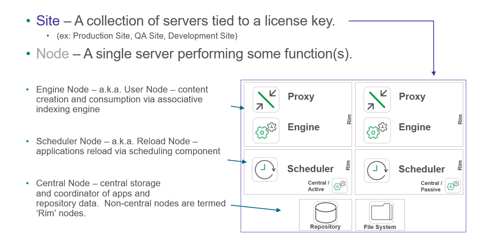

# Architecture 101 (Components, Terminology)
{:.no_toc}

## Goal
{:.no_toc}

The goal of this page is to understand the basic terminology and components/services of a site.

## Table of Contents
{:.no_toc}

* TOC
{:toc}

-------------------------

## Architectural Components

Qlik Sense Hub
  - Drag and drop development, analysis, and self-service environment.
  
Qlik Sense Management Console (QMC)
  - Centralized management of all aspects of a Qlik Sense deployment.
  
Qlik Sense Proxy (QPS)
  - Entry point into Qlik Sense for users and administrators.
  - Manages Authentication (last mile), manages sessions / license provisioning, able to load balance across engines.
  
Qlik Sense Engine (QES)
  - In-memory, associative data indexing engine.
  
Qlik Sense Scheduler (QSS)
  - Scheduling engine for application reloads from data sources.
  
Qlik Sense Repository (QRS)
  - Centralized storage of deployment information.
  
Qlik Sense Applications (.QVF)
  - Centralized storage of Applications before loading into memory, as part of a centralized SMB file share.

For additional documentation regarding the Qlik services, please refer to [Services](https://help.qlik.com/en-US/sense-admin/Subsystems/DeployAdministerQSE/Content/Sense_DeployAdminister/QSEoW/Deploy_QSEoW/Services.htm).

-------------------------

## Terminology

**Tags**

#architecture

#scale

&nbsp;