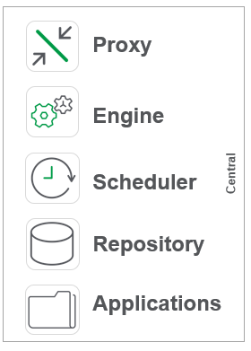
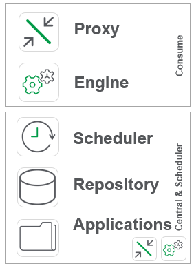
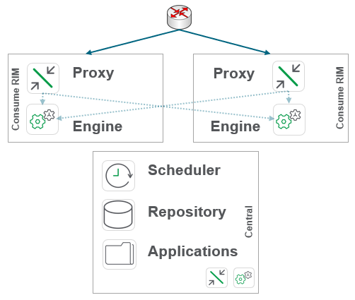
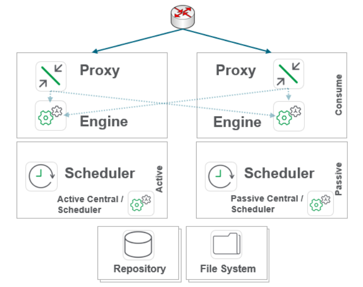
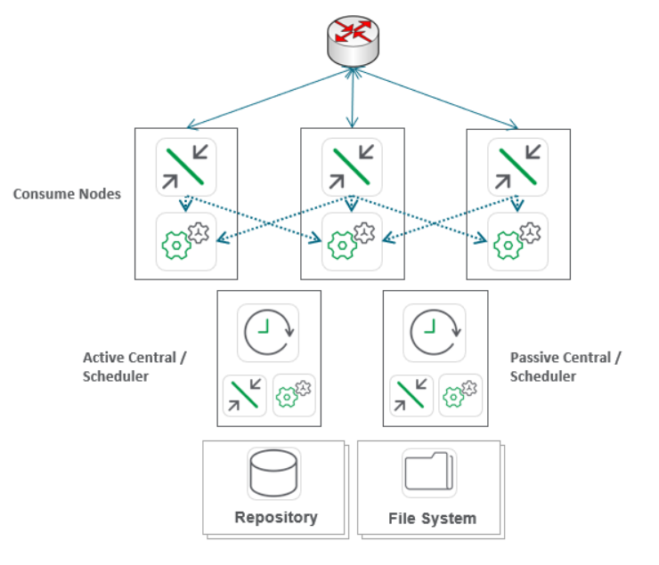

# Example Production Architectures
{:.no_toc}

## Goal
{:.no_toc}

The goal of this page is to provide example generic production architectures to be used for reference.

## Table of Contents
{:.no_toc}

* TOC
{:toc}

-------------------------

## Example Production Architectures

### Single Node Qlik site

**Features**:
- Single Qlik Sense node

This is an incredibly common starting point for Qlik sites. It allows for rapid deployment at the cost of a lack of separation of roles (back end vs. front end) and resiliency.

### Two Server Qlik Site

**Features**:
- Segregation of front and back end activities

This also is an incredibly common starting point for Qlik sites. Likewise is the next logical step for organizations who have deployed Qlik but desire a more performant site. This architecture allows for a separation of back and front end activities and thus is ideal starter architecture for sites which (1) service multiple departments and/or (2) require intra-day reloads. By separating the back-end reload activities, user experience on app consumption is more reliable.

### Three Server Qlik Site

**Features**:
- User Resiliency
- Horizontal scaling

This architecture shows horizontal scaling on consume nodes which allows for resiliency and more compute to be delivered to app consumption.

### Four Server Qlik Site

**Features**:
- Horizontal Scaling
- User resiliency
- Reload resiliency
- Site-wide high availability

This architecture shows horizontal scaling on both the front and back end nodes of Qlik. By segregating PostgreSQL and the persistence layer for Qlik, site-wide high availabiity is possible. This is a common Enterprise archtiecture for multi-department Qlik sites.

### Five Server Qlik Site

**Features**:
- Horizontal Scaling
- User resiliency
- Reload resiliency
- Site-wide high availability

This architecture further horizontally scales the front end compared to the **Four Server Qlik site** to meet additional compute needs for app consumption. Most organizations require more compute for consumption of apps compared to app reloads.

For further documentation and examples, please refer to [Qlik Sense Enterprise on Windows: multi-node deployment](https://help.qlik.com/en-US/sense-admin/Subsystems/DeployAdministerQSE/Content/Sense_DeployAdminister/QSEoW/Deploy_QSEoW/Enterprise-deployment.htm).

**Tags**

#architecture

#scale

&nbsp;
