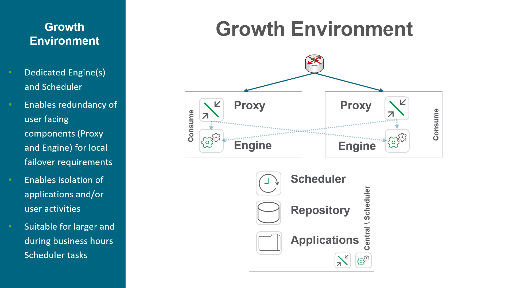
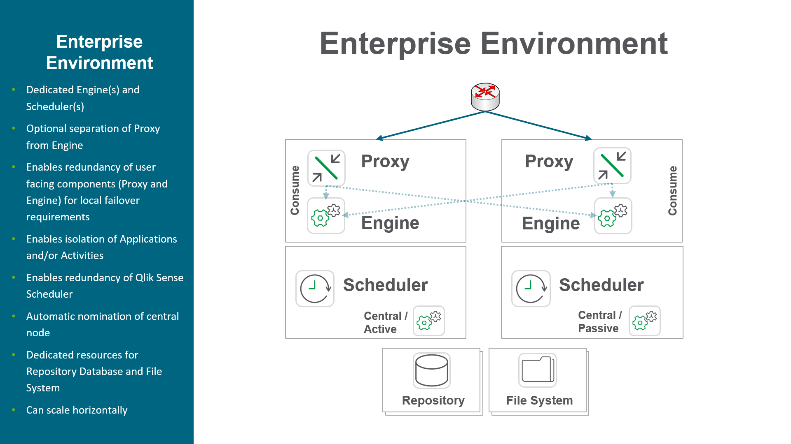
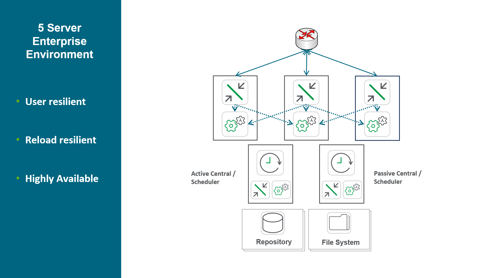
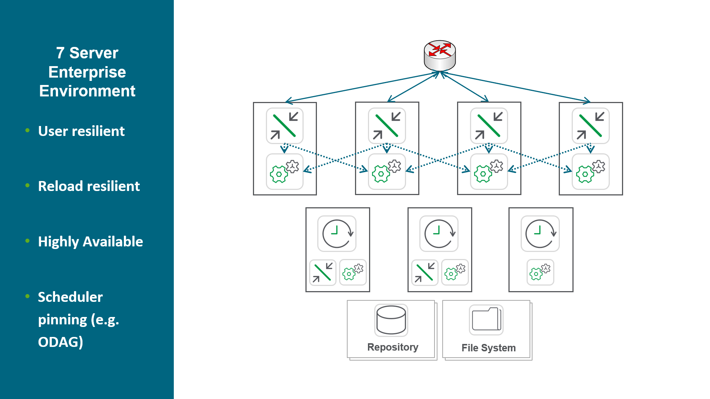

# Example Production Architectures
{:.no_toc}

## Goal
{:.no_toc}

The goal of this page is to provide example generic production architectures.

## Table of Contents
{:.no_toc}

* TOC
{:toc}

-------------------------

## Example Production Architectures

For comprehensive documentation and examples, please refer to [Qlik Sense Enterprise on Windows: multi-node deployment](https://help.qlik.com/en-US/sense-admin/Subsystems/DeployAdministerQSE/Content/Sense_DeployAdminister/QSEoW/Deploy_QSEoW/Enterprise-deployment.htm).

**Tags**

#architecture

#scale

&nbsp;