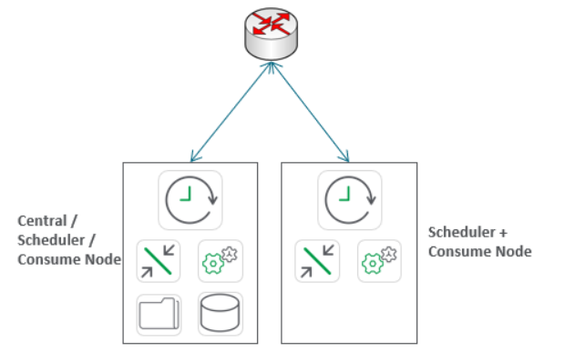
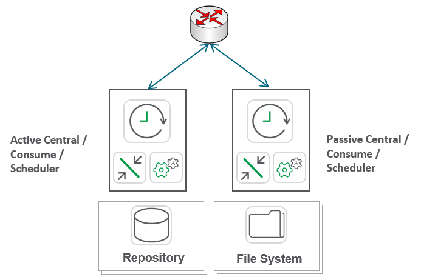
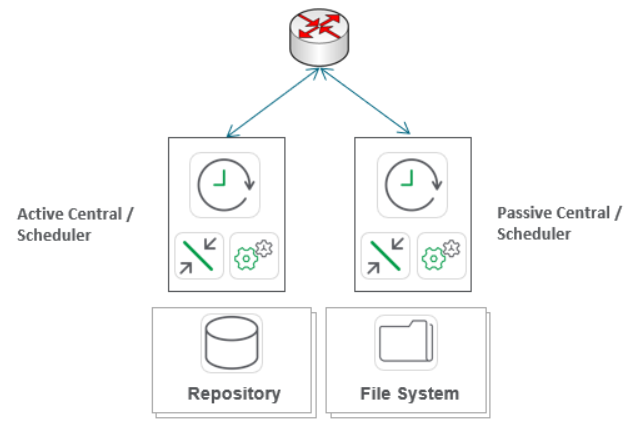
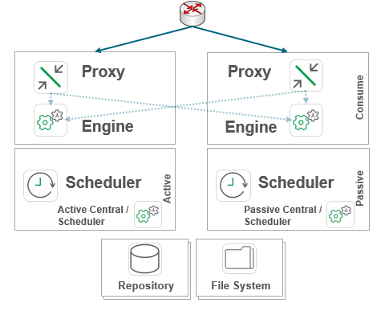

# Resiliency & HA
{:.no_toc}

## Goal
{:.no_toc}

The goal of this page is to gain an understanding of the various resiliency and high availability options available to a Qlik site.

## Table of Contents
{:.no_toc}

* TOC
{:toc}

-------------------------

## Resiliency & High Availability

When speaking about resiliency and high availability within the context of Qlik architecture, there are three tiers to focus on:

1. User Resiliency
  - Requires 2+ Qlik proxy/engine nodes
  - Requires third-party network load balancer
  
2. Reload Resiliency
  - Requires 2+ Qlik scheduler nodes
  
3. Site-wide High Availability
  - Requires both 1 and 2 from above
  - Requires decoupled repository database and decoupled file share
    - The repository database can be stream replicated or clustered for resiliency
    - The file share must be resilient
  - Requires 2+ Qlik nodes with all services enabled, with 1+ nominated as failover candidates
  
A **User Resilient** site minimally would look like this:

A **Reload Resilient** site minimally would look like this:

**Site-wide High Availability** would minimally look like this:

But for the vast majority of Enterprise deployments, **Site-wide High Availability** would minimally look like this:

**Tags**

#architecture

#resiliency

#ha

#HA

&nbsp;
