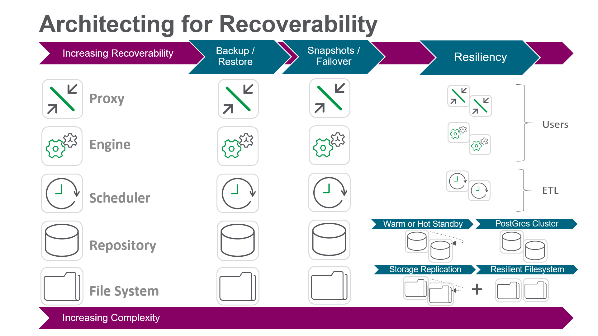

# Resiliency & HA
{:.no_toc}

## Goal
{:.no_toc}

The goal of this page is to gain an understanding of the varying resiliency options and high availability scenarios of a Qlik site.

## Table of Contents
{:.no_toc}

* TOC
{:toc}

-------------------------

## Resiliency & High Availability

When speaking about resiliency and high availability within the context of Qlik architecture, there are three tiers to focus on:

1. Proxy/Engine Resiliency (consumption)
  - Requires 2+ Qlik proxy/engine nodes
  - Requires third-party network load balancer
  
2. Scheduler Resiliency (reloads)
  - Requires 2+ Qlik scheduler nodes
  
3. Site-wide High Availability
  - Requires both 1 and 2 from above
  - Requires decoupled repository database and decoupled file share
    - The repository database can be stream replicated or clustered for resiliency
    - The file share must be resilient
  - Requires 2+ Qlik nodes with all services enabled, with 1+ nominated as failover candidates
  

For information regarding the persistence layer (repository database and file share), please refer to [Persistence](https://help.qlik.com/en-US/sense-admin/Subsystems/DeployAdministerQSE/Content/Sense_DeployAdminister/QSEoW/Deploy_QSEoW/Persistence.htm).

**Tags**

#architecture

#resiliency

#ha

#HA

&nbsp;