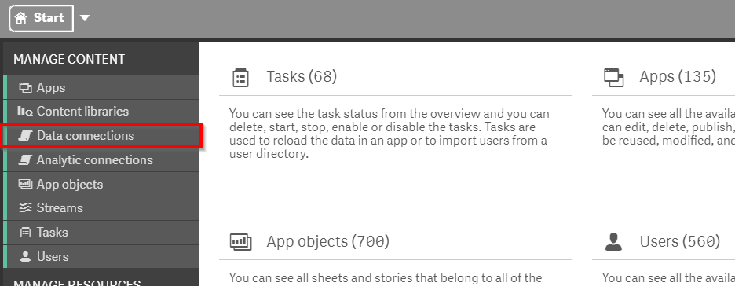
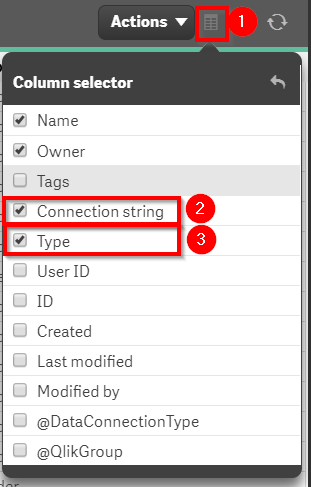
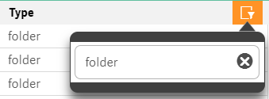
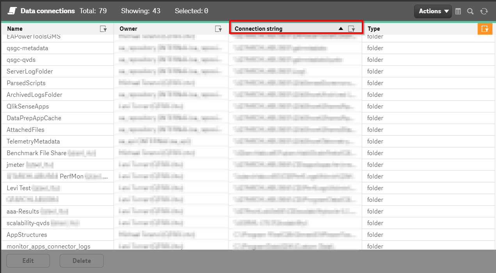
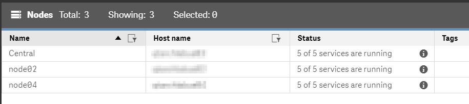

# Review Disk Space
{: .no_toc }

all

|                                  		                      | Initial     | Recurring  |
|-----------------------------------------------------------|-------------|------------|
| <i class="far fa-clock fa-sm"></i> **Estimated Time**     | 20 min      | 20 min     |

Benefits:

  - Increase stability
  
-------------------------

## Goal
{:.no_toc}
The goal for this monthly activity is to review the available disk space on the storage devices which are used by Qlik Sense Enterprise. For some organizations, IT groups have monitoring configured for shared storage. In these instances, this activity may not be needed by administrators of those Qlik Sense deployments. This activity will instruct the administrator on how to enumerate the storage dependencies for their Qlik Sense Enterprise cluster and thus allow the administrator to manually check for disk space usage or confirm with their IT groups that those devices are already monitored.

## Table of Contents
{:.no_toc}

* TOC
{:toc}
-------------------------

## Enumerate Storage used by a Qlik Sense Cluster <i class="fas fa-dolly-flatbed fa-xs" title="Shipped | Native Capability"></i>

### Storage used for Data Connections

In the QMC, select **Data Connections**.

In the upper right hand side of the screen, select the **Column selector**, and then select the **Connection String** and **Type** columns. To make the resulting table a bit more manageable, optionally deselect the **Tags** column.

Now select the filter icon for the **Type** column and then filter on `folder`.

At this stage sort by **Connection String** so that the groupings are visible for paths that are used for data sources.

**Note**: If this is a multi-node Qlik Sense site then the presence of local paths (`C:\`, `D:\`) is concerning. Refer to [Analyzing Data Connections](..\asset_management\data_connections\analyze_data_connections.html) for guidance on converting these to UNC share paths.

### Storage used for Qlik Sense storage

With the distinct locations that are used for data connections, go to the **Service Cluster** section in the QMC.

Add this location to the running list from the previous section on Data Connections.

### Local storage for each Qlik Sense node

Go to the **Nodes** section in the QMC.

Add to the list the server names for each member of the Qlik Sense Enterprise cluster.

After completing each step, the administrator will have an enumerated list of storage dependencies for the Qlik Sense cluster.

- Data source storage
- Storage for the shared resources across the nodes
- Local storage for the servers in the Qlik Sense cluster

At this juncture, the administrator should check the percentage of available free space on each device. For shared storage which is administered by other teams (e.g. SAN or NAS devices) confirm with the relevant team(s) as to percentage of available free space.

If monitoring is **not** configured for any of the enumerated storage dependencies, then the administrator should record the percentage in a location for reference on the following month. This will allow the administrator to build out projections for the storage needs over the next 6-24 months. This projection then can be used to justify budget for additional storage for shared storage devices or to anticipate where additional storage should be allocated to VMs (if virtualization is used).

**Tags**

#monthly

#system_planning

#disk

&nbsp;