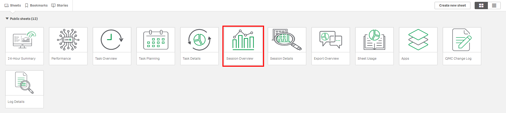
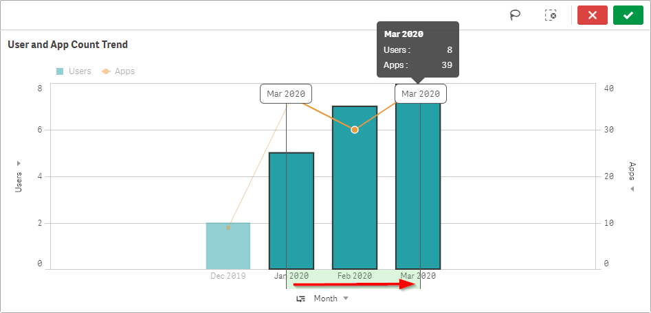
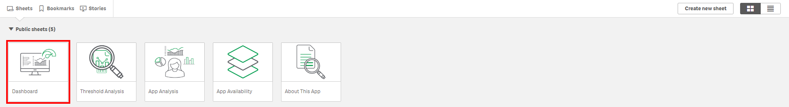
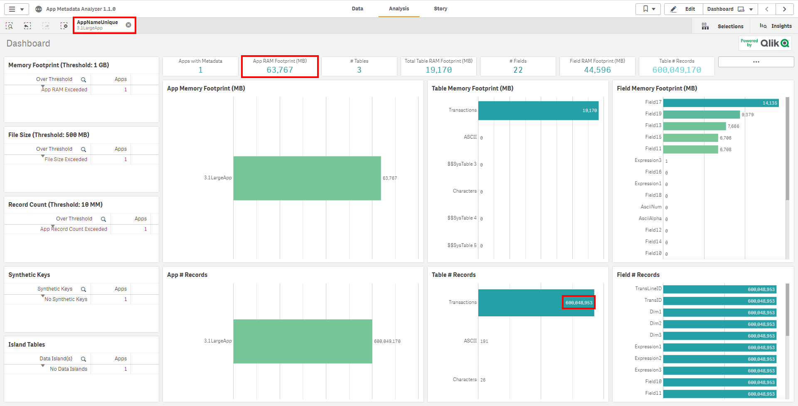
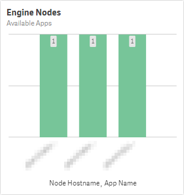
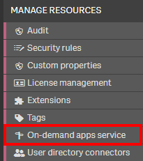
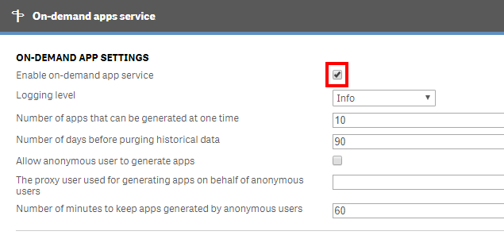

# Capacity Plan: Applications <i class="fas fa-dolly-flatbed fa-xs" title="Shipped | Native Capability"></i>
{:.no_toc}

## Goal
{:.no_toc}

The goal of this exercise is to identify any applications that could be optimized or load balanced to dedicated engines.

There are a number of areas that should be focused on, including the following:

- Candidates for application pinning (load balancing)
- Candidates for data model optimization

## Table of Contents
{:.no_toc}

* TOC
{:toc}

-------------------------

## Operations Monitor

This page leverages the **Operations Monitor**. Please refer to the [Operations Monitor](../../tooling/operations_monitor.md) page for an overview and relevant documentation links.

### Confirm Operations Monitor is Operational

Navigate to the **Monitoring apps** and select the **Details** button (info icon) on the **Operations Monitor** application. Confirm that the application's data is up-to-date.

If the **Operations Monitor** is not up-to-date, please refer to the [Operations Monitor Documentation](../../tooling/operations_monitor.md#documentation) for configuration details and troubleshooting steps.

-------------------------

## App Metadata Analyzer

Please refer to the [App Metadata Analyzer](../../tooling/app_metadata_analyzer.md) page for an overview and relevant documentation links.

-------------------------

## Application Usage

### Gather Top Applications by Usage

Select the **Session Overview** sheet.

Select the last three months (assuming this exercise is executed quarterly) by selecting the **Month** field in the **User and App Count Trend** chart.

Record the top applications by usage in the **Top 50 Apps** chart.

## App Metadata Analyzer

For the next exercise, the [App Metadata Analyzer](../../tooling/app_metadata_analyzer.md) is required. Confirm that it is setup, and then navigate to the **Dashboard** sheet.

Find the intersection of the highly used applications from the **Operations Monitor** with applications with high base RAM footprints. In the below example, an application that is consistently leveraged has been selected that has a base RAM footprint of ~64 GB RAM. This application has ~600 M records.

Two steps need to occur here:

1. If there are mutliple end-user facing engines in the deployment, where is this application currently available? As it is quite large and heavily used, it might not make sense to have it available on all nodes. For example, if there are more than two end-user nodes, it would be worth considering "pinning" this application to a minimum of two nodes for resiliency--allowing the other nodes to not be overloaded.

2. Is there an optimization event? It can be noted in the **Field Memory Footprint (MB)** table that **Field17** consumes ~14 GB RAM. Is that field necessary, can it be optimized? For instance, is it a timestamp that can be floored, or a field that can otherwise be broken apart to reduce cardinality? Other areas of interest include: total number of fields in an application, total number of records in an application and/or table, presence of synthetic keys, presence of data islands, etc. Please refer to the [Analyze App Metadata Analyzer](../../asset_management/apps/analyze_app_metadata_analyzer.md) for examples and documentation.

Step 1 can quickly be validated by navigating to the **App Availability** sheet, while that application remains selected.

Here, it can easily be seen that out of the three available engine nodes, the application is available on all of them.

## ODAG / NPrinting / InsightBot

Is [ODAG](https://help.qlik.com/en-US/sense/Subsystems/Hub/Content/Sense_Hub/DataSource/Manage-big-data.htm) in play or going to be in play with any applications?

It is best to simply ask the business if unaware, and one can check if ODAG is _able_ to be run by navigating to the QMC and selecting **On-demand apps service**, and then viewing whether **Enable on-demand app service** is toggled on or off.

Is [Qlik NPrinting](https://help.qlik.com/en-US/nprinting/Content/NPrinting/Introduction/Introduction.htm) or [Qlik InsightBot](https://help.qlik.com/en-US/insight-bot/Content/QlikInsightBot/Home.htm) on the horizon or in play?

It is important here to recognize how many applications are being used against both. It is encouraged to ask the business.

## Example Takeaway

| Candidates for "App Pinning" | Candidates for Data Model Optimization | ODAG Apps | Qlik NPrinting Apps | Qlik InsightBot Apps |
|------------------------------|----------------------------------------|-----------|---------------------|----------------------|
| 2                            | 3                                      | 1         | 0                   | 0                    |

**Tags**

#capacity_plan

#apps

#operations_monitor

&nbsp;
