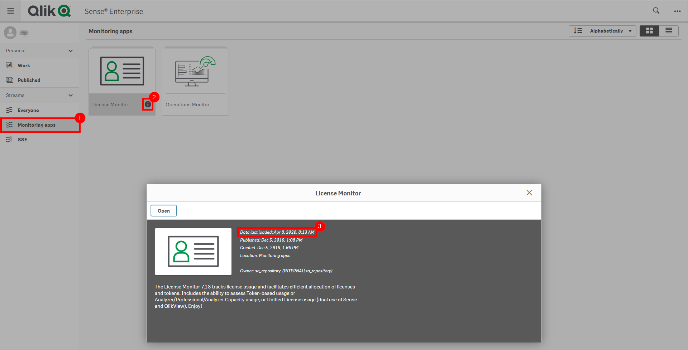

# Capacity Plan: Licenses <i class="fas fa-dolly-flatbed fa-xs" title="Shipped | Native Capability"></i>
{:.no_toc}

## Goal
{:.no_toc}

The goal of this exercise is to identify license usage across a production site. The **License Monitor** application exposes this information simply, so that it can be easily referenced.

There are a number of metrics that should be focused on, including the following for Professional, Analyzer, and Capacity license types. If the site is on tokens, the same principles will apply.

The following should be followed for the Professional and Analyzer access types:

- Licenses
- Licenses Allocated
- Licenses Allocated Unused
- Licenses Remaining

## Table of Contents
{:.no_toc}

* TOC
{:toc}

-------------------------

## License Monitor

This page leverages the **License Monitor**. Please refer to the [License Monitor](../../tooling/license_monitor.md) page for an overview and relevant documentation links.

### Confirm License Monitor is Operational

Navigate to the **Monitoring apps** and select the **Details** button (info icon) on the **License Monitor** application. Confirm that the application's data is up-to-date.

If the **License Monitor** is not up-to-date, please refer to the [License Monitor Documentation](../../tooling/license_monitor.md#documentation) for configuration details and troubleshooting steps.

-------------------------

## Gather License Usage Metrics

Select the **Usage Snapshot** sheet in the **License Monitor**.

The four metrics listed in the [Goals](#goals) section can all be found in this object

## Example Takeaway

If the usage metrics above were to be used as an example (obviously this is a rarely used testing box), a table that could be used for capacity planning could look like the following:

|                  | Licenses | Licenses Allocated | Licenses Allocated Unused | Licenses Remaining |
|------------------|----------|--------------------|---------------------------|--------------------|
| **Professional** | 100      | 10                 | 8                         | 90                 |
| **Analyzer**     | 100      | 0                  | 0                         | 100                |

**Tags**

#capacity_plan

#licenses

#licensing

#users

#license_monitor

&nbsp;
