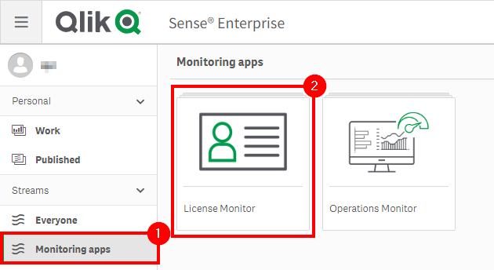
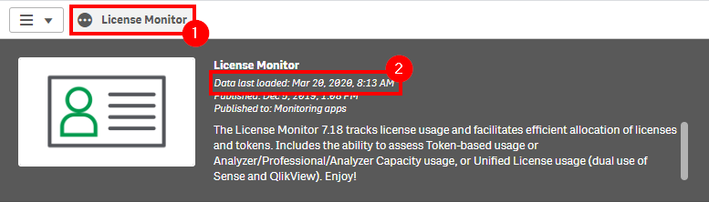
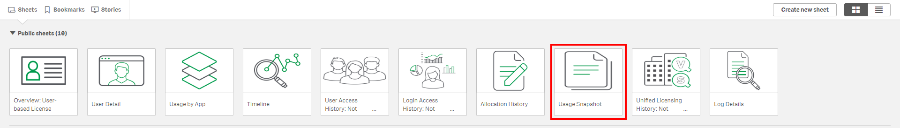
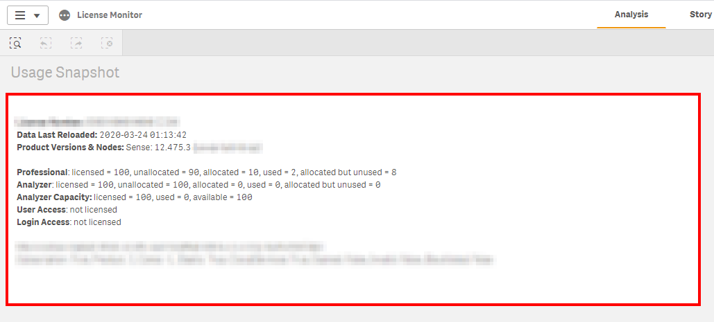

# Capacity Plan: Licenses <i class="fas fa-dolly-flatbed fa-xs" title="Shipped | Native Capability"></i>
{:.no_toc}

## Goal
{:.no_toc}

The goal of this exercise is to identify license usage across a production site. The **License Monitor** application exposes this information simply, so that it can be easily referenced.

There are a number of metrics that should be focused on, including the following for Professional, Analyzer, and Capacity license types. If the site is on tokens, the same principles will apply.

The following should be followed for the Professional and Analyzer access types:

- Licenses
- Licenses Allocated
- Licenses Allocated Unused
- Licenses Remaining

## Table of Contents
{:.no_toc}

* TOC
{:toc}

-------------------------

## License Monitor

Please refer to the [License Monitor](../../tooling/license_monitor.md) page for an overview and relevant documentation links.

-------------------------

## License Usage

### Confirm License Monitor is Operational

Navigate to the **Monitoring apps** stream and open up the **License Monitor** application.

First and foremost, it is essential to confirm that the **License Monitor** is operational and up to date. Ensure that it is by selecting the _Show app information_ button, and then viewing the _Data last loaded_ section of the application's description. Alternatively, one could also check the task status in the QMC.

If the application is not operational [this support article](https://support.qlik.com/articles/000024083) is a great place to start.

### Gather Metrics

Select the _Usage Snapshot_ sheet.

The four metrics listed in the _Goals_ section can all be found in this object

## Example Takeaway

If the _Usage Snapshot_ above was to be used as an example (obviously this is a rarely used testing box), a table that could be used for capacity planning could look like the following:

|                  | Licenses | Licenses Allocated | Licenses Allocated Unused | Licenses Remaining |
|------------------|----------|--------------------|---------------------------|--------------------|
| **Professional** | 100      | 10                 | 8                         | 90                 |
| **Analyzer**     | 100      | 0                  | 0                         | 100                |

**Tags**

#capacity_plan

#licenses

#licensing

#users

&nbsp;