# Capacity Plan: System <i class="fas fa-dolly-flatbed fa-xs" title="Shipped | Native Capability"></i>
{:.no_toc}

## Goal
{:.no_toc}

The goal of this exercise is to identify any potential system concerns across a production site. The **Operations Monitor** application exposes this information simply, so that it can be easily referenced.

There are a number of metrics that should be focused on, including the following:

- Engine CPU
- Engine RAM
- Users per Engine
- Intra-day Reloads
- Batch Window

\* Note that more important than any of the above is the overall end-user experience. If the end-users are complaining about performance issues, even though the above metrics look to be good, it could likely be due to the application itself. Refer to: [Applications](applications.md).

## Table of Contents
{:.no_toc}

* TOC
{:toc}

-------------------------

## Operations Monitor

Please refer to the [Operations Monitor](../../tooling/operations_monitor.md) page for an overview and relevant documentation links.

-------------------------

## Confirm Operations Monitor is Operational

Navigate to the **Monitoring apps** stream and open up the **Operations Monitor** application.

First and foremost, it is essential to confirm that the **Operations Monitor** is operational and up to date. Ensure that it is by selecting the _Show app information_ button, and then viewing the _Data last loaded_ section of the application's description. Alternatively, one could also check the task status in the QMC.

[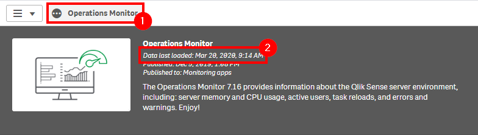](https://raw.githubusercontent.com/qs-admin-guide/qs-admin-playbook/master/docs/system_planning/review_update_capacity_plan/images/capacity_planning_users_2.png)

## Gather Metrics

Select the _Performance_ sheet.

[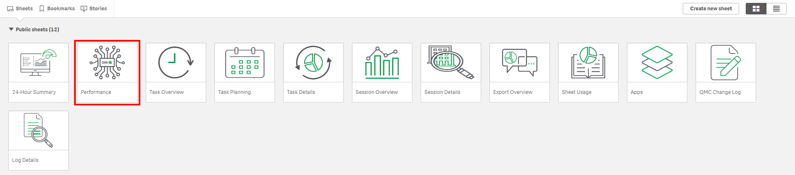](https://raw.githubusercontent.com/qs-admin-guide/qs-admin-playbook/master/docs/system_planning/review_update_capacity_plan/images/capacity_planning_system_1.png)

Select the **Month** field and select the last three months, assuming this exercise is being executed quarterly.

[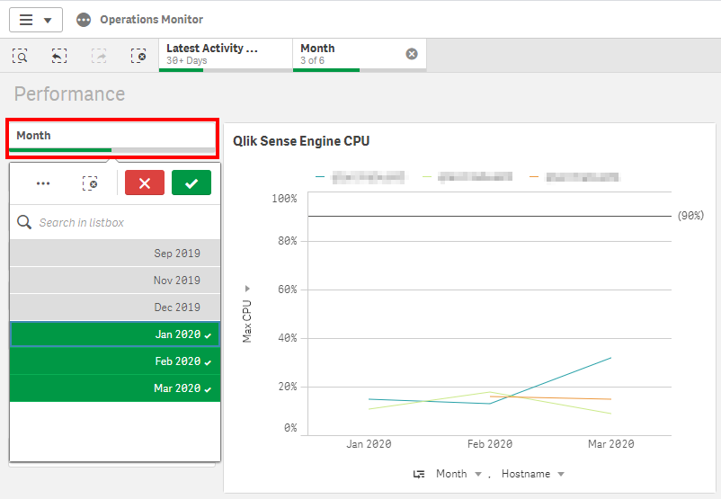](https://raw.githubusercontent.com/qs-admin-guide/qs-admin-playbook/master/docs/system_planning/review_update_capacity_plan/images/capacity_planning_system_2.png)

### CPU

Now, focus on the _Qlik Sense Engine CPU_ chart for a moment. Ensure that the measure is set to _Max CPU_. Note that this chart defaults to viewing at the _Month_, however it can drill down to the day, hour, and ten-minute timeline. It is advised to look for extended durations of high CPU utilization, and to see if those events are recurring. In the below chart, we can see that these servers are not heavily utilized, as the maximum CPU does not go above 32%.

[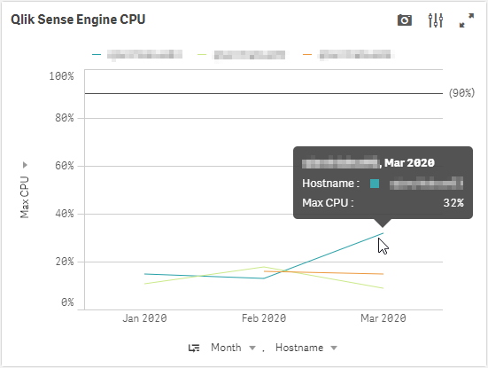](https://raw.githubusercontent.com/qs-admin-guide/qs-admin-playbook/master/docs/system_planning/review_update_capacity_plan/images/capacity_planning_system_3.png)

### RAM

Next, focuse on the _Qlik Sense Engine RAM (GB)_ chart. This chart is of the same construct as the prior, except focusing on RAM utilization. It is important to note that this chart is showing not only the "base RAM footprint" of the applications, but also the "result set cache RAM", as well as RAM for calculations, etc. Take the time to review the chart below and look for extended periods of time of very high RAM utilization, say around 90%, where the server is continuously fighting to clear cache to make room for new result sets. It should be relatively clear if the server is over-taxed if it is flat-lining consistently. The servers in the chart below look healthy, however.

[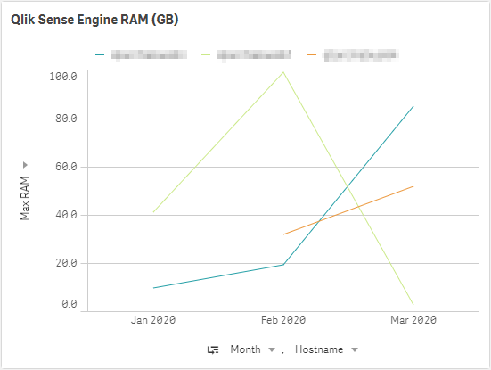](https://raw.githubusercontent.com/qs-admin-guide/qs-admin-playbook/master/docs/system_planning/review_update_capacity_plan/images/capacity_planning_system_4.png)

As there is no simple way here to show what applications are consuming what percentage of that RAM total, a way to draw a line in the sand could be the following best practice:

- *The total base RAM footprint of all applications available to be lifted onto the engine should be <= 40% of the total RAM of the server.

\* Of course, this is a best practice from keeping a server from going off the rails, but it is not guaranteed. If there were thousands of users hitting that box at the same time, they would more than likely consume more than the available amount of RAM left over--but in general, it is a good practice if users have been properly distributed across engines.

To gather this metric, we need to leverage the [App Metadata Analyzer](../../tooling/app_metadata_analyzer.md). Confirm that it is setup, and then navigate to the _App Availability_ sheet.

[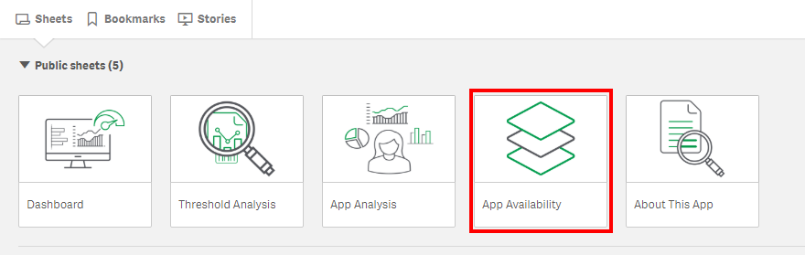](https://raw.githubusercontent.com/qs-admin-guide/qs-admin-playbook/master/docs/system_planning/review_update_capacity_plan/images/capacity_planning_system_5.png)

In the _Engine Node: Available Apps & Base RAM Footprint_ table, one can view the total base RAM footprint for all applications that are able to be lifted on each individual engine node. 

**Note** - This practice should also be repeated with selecting only the highly-used applications, as it is highly unlikely that _all_ applications will be open in RAM at the same time in production, unless there are only a few applications that are deployed. It is suggested to select only highly used applications, which can be found in the **Operations Monitor** -> _Session Overview_ sheet -> _Top 50 Apps_ chart.

[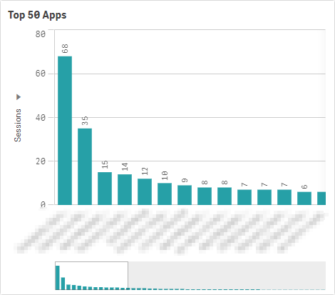](https://raw.githubusercontent.com/qs-admin-guide/qs-admin-playbook/master/docs/system_planning/review_update_capacity_plan/images/capacity_planning_system_19.png)

With no specific applications selected:

[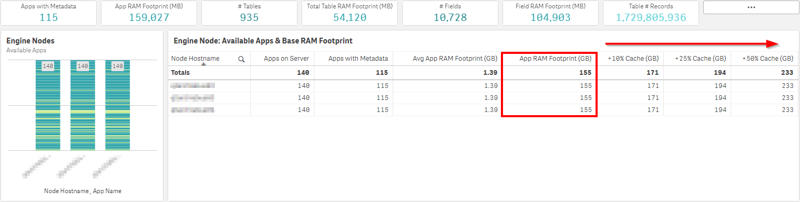](https://raw.githubusercontent.com/qs-admin-guide/qs-admin-playbook/master/docs/system_planning/review_update_capacity_plan/images/capacity_planning_system_6.png)

Here, it is visible that all apps are available on all engine nodes--meaning there are no custom load balancing rules in place. The total application RAM footprint is 155 GB, and in this case, the servers have a total of 512 GB of RAM. This puts the total base RAM footprint at 30% of the total server RAM--which is below that 40% line from the best practice above--so all is well for the time being.

### Max Concurrent Users per Engine

It is also valuable to view the distribution of users across the engines, as this metric is important for creating a custom gauge to help establish a breaking point. For example, if the engine starts performing poorly with 50 concurrent users on it (assuming uniform applications available across all engines), that number can then be used as a compelling event to expand horizontally to another engine node if breached. An admin can then review this metric quarterly to warrant if there needs to be an architectural event to keep this number below the set threshold.

\* This is of course tackling the issue of performance by adding more hardware, while one will also want to consider simultaneously optimizing their applications. There is no silver bullet.

To create this chart, open up the **Operations Monitor** and create a new sheet. Name it _Max Concurrent Users by Hostname_.

[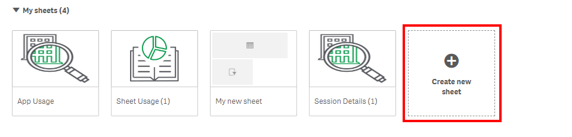](https://raw.githubusercontent.com/qs-admin-guide/qs-admin-playbook/master/docs/system_planning/review_update_capacity_plan/images/capacity_planning_system_7.png)

Drag and drop a _Pivot Table_, then add the **Hostname** field as a dimension.

[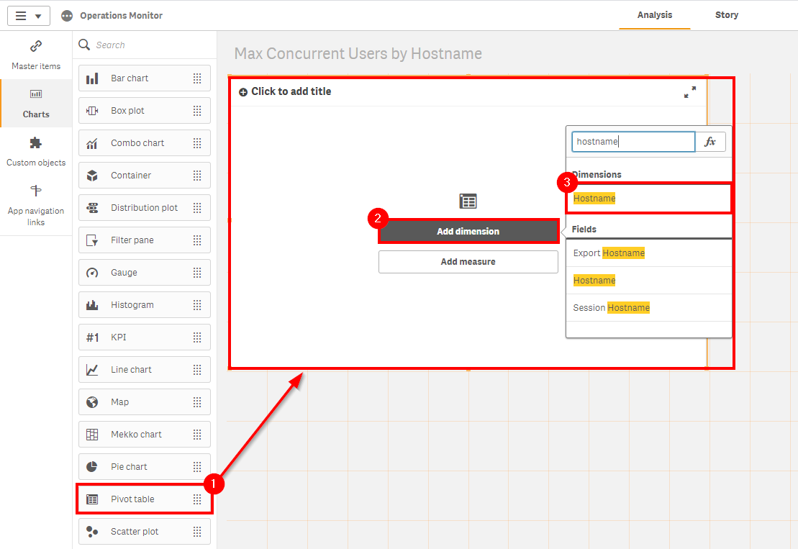](https://raw.githubusercontent.com/qs-admin-guide/qs-admin-playbook/master/docs/system_planning/review_update_capacity_plan/images/capacity_planning_system_8.png)

Next, add the _Max Concurrent Users_ metric as the measure.

[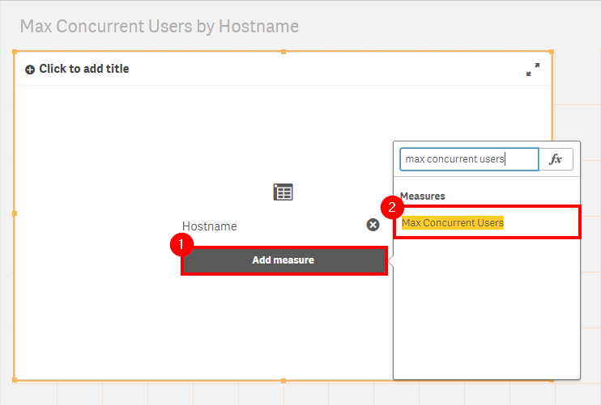](https://raw.githubusercontent.com/qs-admin-guide/qs-admin-playbook/master/docs/system_planning/review_update_capacity_plan/images/capacity_planning_system_9.png)

Name the chart _Max Concurrent Users by Hostname_. Following, review the total concurrent users per engine node.

[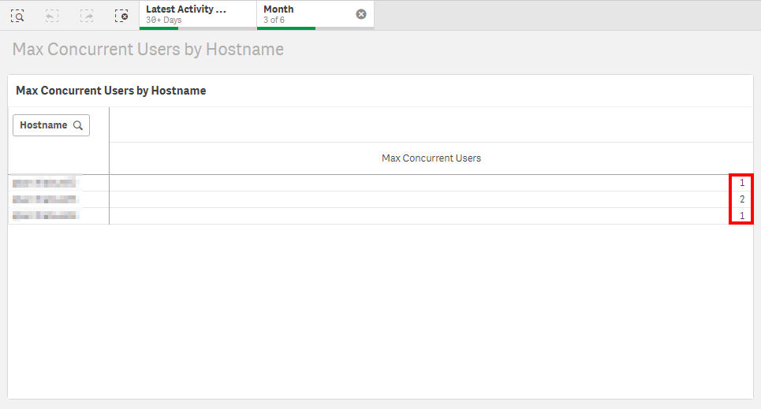](https://raw.githubusercontent.com/qs-admin-guide/qs-admin-playbook/master/docs/system_planning/review_update_capacity_plan/images/capacity_planning_system_10.png)

### Intra-day Reloads

The primary goal of this sub-section is to report on the number of intra-day reloads so that they can be examined. The result should be to minimize if not completely decouple intra-day reloads from end-user facing engine nodes. If the environment is smaller and reloads must operate on end-user nodes, that should at a minimum be pushed to the overnight batch window where viable. If there are intra-day reloads for hourly reloading apps or otherwise, ideally, they should be offloaded to a separate scheduler.

While remaining in the **Operations Monitor**, navigate to the _Task Overview_ sheet.

[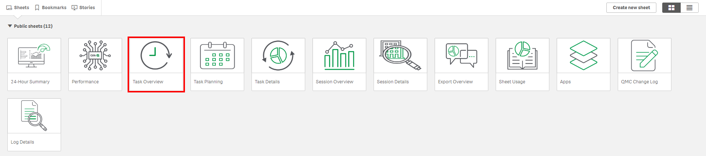](https://raw.githubusercontent.com/qs-admin-guide/qs-admin-playbook/master/docs/system_planning/review_update_capacity_plan/images/capacity_planning_system_11.png)

Select the last three months (assuming quarterly review), and then select any hours that would be considered as "business hours".

In this example, it is visible that there are 354 reloads per day within business hours--the majority of which are from several applications that reload on a frequent basis.

[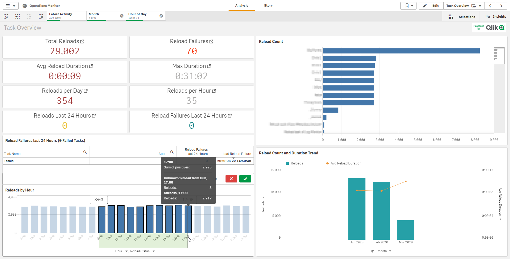](https://raw.githubusercontent.com/qs-admin-guide/qs-admin-playbook/master/docs/system_planning/review_update_capacity_plan/images/capacity_planning_system_12.png)

Now, if all of these reloads are happening on dedicated scheduler nodes and completing successfully without overloading the server(s), then all is well. To view where the reloads are happening, a new chart can be created.

Duplicate the sheet, and copy the _Reload Count_ bar chart.

[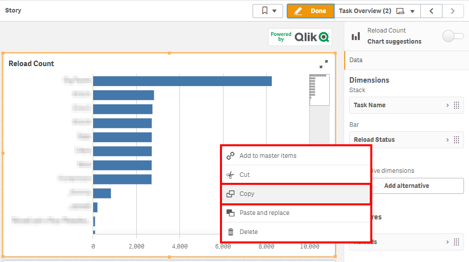](https://raw.githubusercontent.com/qs-admin-guide/qs-admin-playbook/master/docs/system_planning/review_update_capacity_plan/images/capacity_planning_system_13.png)

Make room for the new chart, and paste it.

[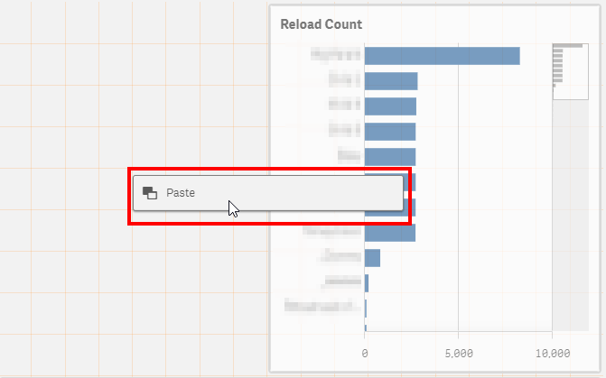](https://raw.githubusercontent.com/qs-admin-guide/qs-admin-playbook/master/docs/system_planning/review_update_capacity_plan/images/capacity_planning_system_14.png)

Delete the **Reload Status** dimension from the new bar chart.

[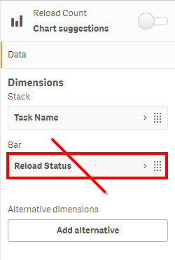](https://raw.githubusercontent.com/qs-admin-guide/qs-admin-playbook/master/docs/system_planning/review_update_capacity_plan/images/capacity_planning_system_15.png)

Add the **Hostname** field.

[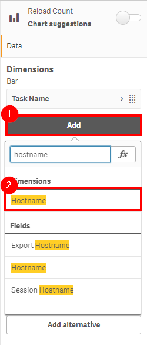](https://raw.githubusercontent.com/qs-admin-guide/qs-admin-playbook/master/docs/system_planning/review_update_capacity_plan/images/capacity_planning_system_16.png)

Drag the **Hostname** field up, to be above the **Task Name** field.

[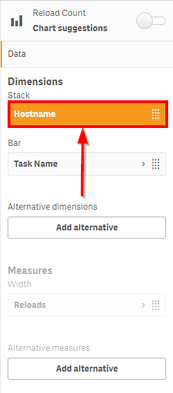](https://raw.githubusercontent.com/qs-admin-guide/qs-admin-playbook/master/docs/system_planning/review_update_capacity_plan/images/capacity_planning_system_17.png)

Review the new chart to see where reloads are occurring.

[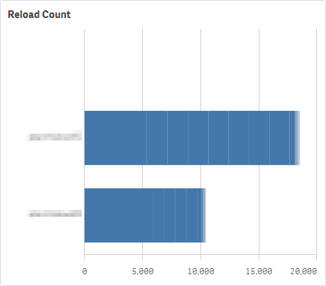](https://raw.githubusercontent.com/qs-admin-guide/qs-admin-playbook/master/docs/system_planning/review_update_capacity_plan/images/capacity_planning_system_18.png)

- Select each node, and confirm whether they are scheduler nodes or end-user facing nodes.
- Record the intra-day reloads for each.

\* If there is a "sandbox" node in the production environment, this node can be ignored from this review, as that node will have hub-based reloads.

### Batch Window

In general, this section represents the capacity of the site's batch window (which is predominantly nightly). The steps to optimize the batch window can be found here: [Optimize Batch Window](../optimize_batch_window.md).

After reading the optimization process, one can apply the following rules:

- **Good**
  - There is plenty of room for more reloads in the batch window. Apps are available with new data prior to any morning rush, and reloads are consistent in speed from day to day.
- **OK**
  - There is some congestion of the batch window, and there is not a lot of room to add many more tasks. Some variation of reload speed may be occurring, but not much.
- **Bad**
  - Fully congested batch window--no room for any additions. Tasks are at risk of or are running over into business hours.
  
## Example Takeaway

Referring to the examples above (obviously this is a rarely used testing environment), tables that could be used for capacity planning could look like the following:

| Engine CPU | Engine RAM |  Batch Window | Avg Intra-day Reloads per Day |
|------------|------------|---------------|-------------------------------|
| Good       | Good       | Good          | 354                           |

| 	         | Max Concurrent Users Per Engine |
|------------|---------------------------------|
| Engine 1   | 1			                         |
| Engine 2   | 2			                         |
| Engine 3   | 1			                         |

| 	         | Intra-day Reloads per Engine | End-User Facing |
|------------|------------------------------|-----------------|
| Engine 1   | 386			                    | No	            |
| Engine 2   | 214			                    | Yes 	          |
| Engine 3   | 0			                      | Yes	            |

**Tags**

#capacity_plan

#system

&nbsp;