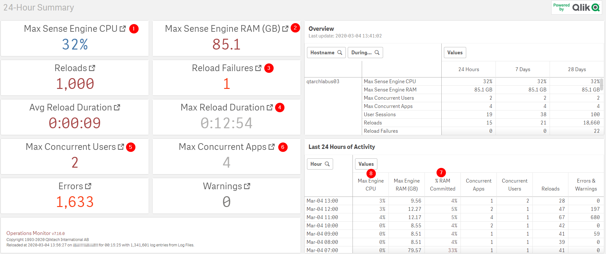

# Review 24 Hour Summary (Ops Monitor)
{: .no_toc }

production

|                                  		                    | Initial | Recurring |
|---------------------------------------------------------|---------|------------|
| <i class="far fa-clock fa-sm"></i> **Estimated Time**   | 2 min   | 2 min      |

Benefits:

  - Increase stability
  - Increase system awareness
  
-------------------------

## Goal
{:.no_toc}
The goal for this spot-check is use the [Operations Monitor](../tooling/operations_monitor.html) to review the last 24 hours of activity for the Qlik site. This will allow the administrator the ability to spot anomalies, keep abreast of trends, and be generally aware of the health of a Qlik Sense Enterprise deployment.

## Table of Contents
{:.no_toc}

* TOC
{:toc}
-------------------------

## 24 Hour Summary (Ops Monitor)

Open the Operations Monitor application and navigate to the **24-Hour Summary** sheet:

On this sheet, there are 6 distinct KPIs and 1 table which are of note. For the KPIs the administrator can click on the relevant KPI to drill into a detailed sheet should the need arise.

- (1) : Max Sense Engine CPU + (2) Max Sense Engine RAM GB : These two metrics signal the maximum compute use by any of the nodes in a Qlik Sense Enterprise cluster. This can be combined with (7) and (8) to spot any spikes. Given the Qlik Engine's ability to scale across available compute, one-off spikes aren't necessarily a signal that action is needed. It's extended saturation events which signal that the available compute is insufficient for the required demands. See [Review Architecture/Scale Plan](../system_planning/review_architecture_scale_plan.html) for more guidance on the considerations when scaling Qlik Sense Enterprise. The detailed information in (7) and (8) allow for easy filtering to the time period where the anomalous compute occurred.
- (3) Reload Failures and (4) Max Reload Duration: This is a complement to the [Spot Check: Tasks](tasks.html) activity. (3) would be well covered by the Spot Check of Tasks whereas (4) would not be. Long-running tasks should be avoided where possible. The causes could range from complicated ETL demands to data source resource constraints (e.g. a slow database). Investigation into the causes of the long-running should be done if they are unexpected.
- (5) Max Concurrent Users and (6) Max Concurrent Apps : These two metrics signal the maximum consumption demands for the site, either defined by unique apps or unique users. Anomalies here may signal the need for more compute (1) and (2) above. Spikes here may also be expected given the applications developed and the user population. For example, an app which is targeted to a sales audience is expected to be more popular during quarter end events where quotas are evaluated. The same is true for applications with tax relevant data which are consumed near the close of the business's fiscal year.

**Tags**

#daily

#spot_check

&nbsp;
