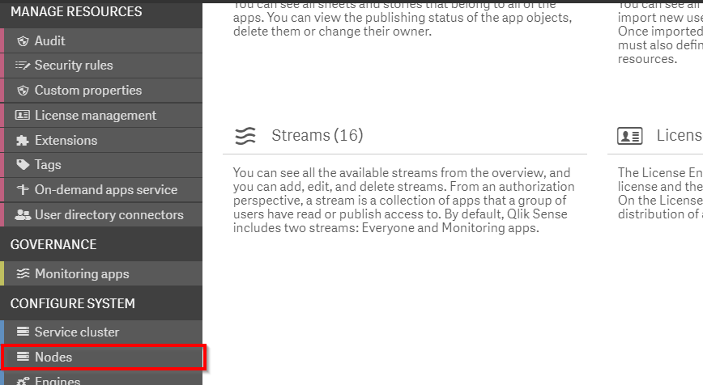
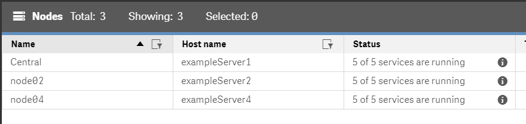
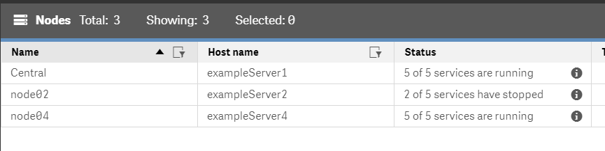
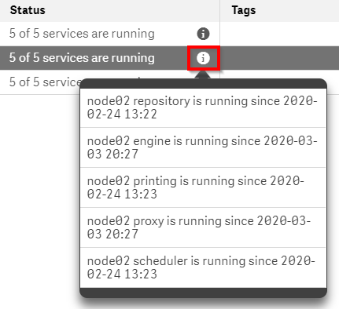

# Spot-Check: Node Health <i class="fas fa-file-code fa-xs" title="API | Script Optional"></i>*
{:.no_toc}

<span class="label prod">production</span>

|                                  		                    | Initial | Recurring  |
|---------------------------------------------------------|---------|------------|
| <i class="far fa-clock fa-sm"></i> **Estimated Time**   | 1 min   | 1 min      |

Benefits:

  - Increase stability
  - Increase awareness
  
-------------------------

## Goal
{:.no_toc}
The goal for this spot-check is to be aware of the health of the node(s) in a Qlik Sense Enterprise deployment. Unexpectedly off-line nodes should be brought online. Nodes where service(s) have unexpectedly restarted should be investigated.

## Table of Contents
{:.no_toc}

* TOC
{:toc}
-------------------------

## Services up? QMC - Nodes

In the QMC, select **Nodes**:

[](https://raw.githubusercontent.com/qs-admin-guide/qs-admin-playbook/master/docs/system_spot_check/images/nodes-1.png)

Inside of the **Nodes** section review the available node(s) in the Qlik Sense Enterprise deployment to ensure that the expected number of services are running:

[](https://raw.githubusercontent.com/qs-admin-guide/qs-admin-playbook/master/docs/system_spot_check/images/nodes-2.png)

An environment where a node is entirely down or some subset of services are not available will display in this section of the QMC:

[](https://raw.githubusercontent.com/qs-admin-guide/qs-admin-playbook/master/docs/system_spot_check/images/nodes-3.png)

An administrator should attempt to start / restart the down services.

-------------------------

## Services unexpectedly restarted? QMC - Nodes

In the QMC, select **Nodes**:

[](https://raw.githubusercontent.com/qs-admin-guide/qs-admin-playbook/master/docs/system_spot_check/images/nodes-1.png)

Inside of the **Nodes** section select the **i** icon to bring up an informational modal for uptime of the node's enabled services:

[](https://raw.githubusercontent.com/qs-admin-guide/qs-admin-playbook/master/docs/system_spot_check/images/nodes-4.png)

This section will detail the uptime of each enabled service. Services with unexpected uptimes (e.g. the **engine** and **proxy** services in this example) should be investigated.

-------------------------

## Service Start / Stop scripts <i class="fas fa-file-code fa-xs" title="API | Requires Script"></i>

The below batch scripts start and stop Qlik Sense Enterprise services. Further customization using alternative languages (e.g. PowerShell) or capability of starting / stopping services on remove servers can be done by the administrator.

### Stop Services Script
```batch
@ECHO OFF
net stop "Qlik Sense Engine Service"
net stop "Qlik Sense Printing Service"
net stop "Qlik Sense Proxy Service"
net stop "Qlik Sense Scheduler Service"
net stop "Qlik Sense Repository Service"
net stop "Qlik Sense Service Dispatcher"
net stop "Qlik Logging Service"
net stop "Qlik Sense Repository Database"
```
{:.snippet}

### Start Services Script
```batch
@ECHO OFF
@ECHO OFF
net start "Qlik Sense Repository Database"
TIMEOUT 2
net start "Qlik Logging Service"
TIMEOUT 2
net start "Qlik Sense Service Dispatcher"
TIMEOUT 10
net start "Qlik Sense Repository Service"
TIMEOUT 2
net start "Qlik Sense Engine Service"
TIMEOUT 2
net start "Qlik Sense Printing Service"
TIMEOUT 2
net start "Qlik Sense Proxy Service"
TIMEOUT 2
net start "Qlik Sense Scheduler Service"
```
{:.snippet}

**Tags**

#daily

#spot_check

&nbsp;
