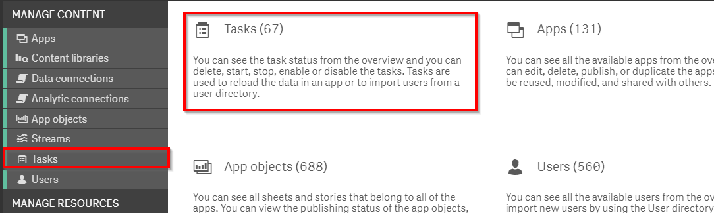
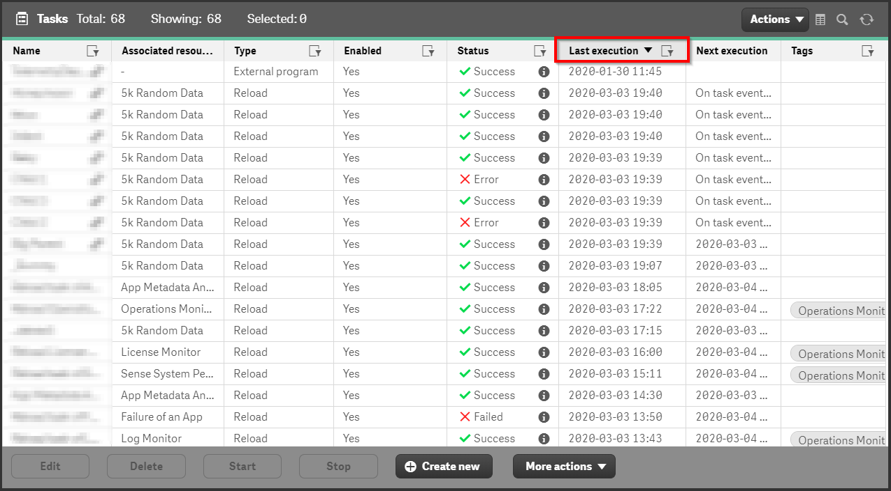
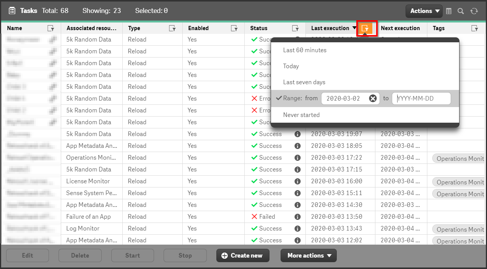
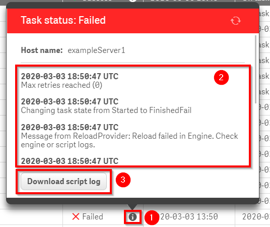

# Spot-Check: Tasks
{:.no_toc}

production

|                                  		                    | Initial | Recurring  |
|---------------------------------------------------------|---------|------------|
| <i class="far fa-clock fa-sm"></i> **Estimated Time**   | 3 Min   | 3 min      |

Benefits:

  - Improve app availability
  - Increase awareness
  
-------------------------

## Goal
{:.no_toc}
The goal for this spot-check is to be aware of any task failures which have occurred. Unexpected task failures should be restarted insofar as this is possible due to resource availability on the Qlik Sense Enterprise server(s) as well as the constraints placed data sourced. For example, bulk queries against a Production database during the business day may be against policy / best practices for a given organization. While this administrative task is _not_ intended to be a deep dive, investigation into the causes of task failures for (a) critical tasks / task chains and/or (b) repeated failures is encouraged. Further guidance on this investigation can be found elsewhere in this guide (INSERT LINKS).

## Table of Contents
{:.no_toc}

* TOC
{:toc}
-------------------------

## QMC - Tasks

In the QMC, select **Tasks**:

For smaller deployments, a simple sorting of the **Last execution** column can be done to focus on recently executed tasks:

For deployments with a great number of reload tasks, further filtering can be done using the filter option in the **Last execution** column to provide greater specificity:

To do a cursory exploration of the task failure, select the **i** icon to bring up an informational modal for the reload task:

 * **Note** : Reload tasks have two primary components:
   * (a) : Initiation of the reload task from the Qlik Repository Service to the Qlik Scheduler Service which determines an available Qlik Engine to execute the reload task.
   * (b) : Execution of the application's load script by the Qlik Engine

From the above screen-shot, the presence of the **Download script** log (step 3) indicates that the flow has successfully reached step (b). Therefore, the failure was due to the logic specified in the application's load script. If step 3 is not available, this typically signals that the process failed on step (a). Further investigation of the trace in the informational modal will be needed. If no obvious clues are present, a deeper investigation of the Qlik Sense logs would be required.

Once the administrator is satisfied at a cursory understanding of what reload tasks have failed recently as well as a proximate root cause, they can proceed to the action. At this point, a general understanding of the Qlik deployment will be required. For many environments, restarting the task is acceptable. But as outlined in the **Goal** section, some environments may be resource constrained on the Qlik server side or the data source side such that an intra-day reload is not recommended. The administrator is encouraged to use their best judgment on the appropriate step.

**Tags**

#daily

#spot_check

#tasks

&nbsp;
