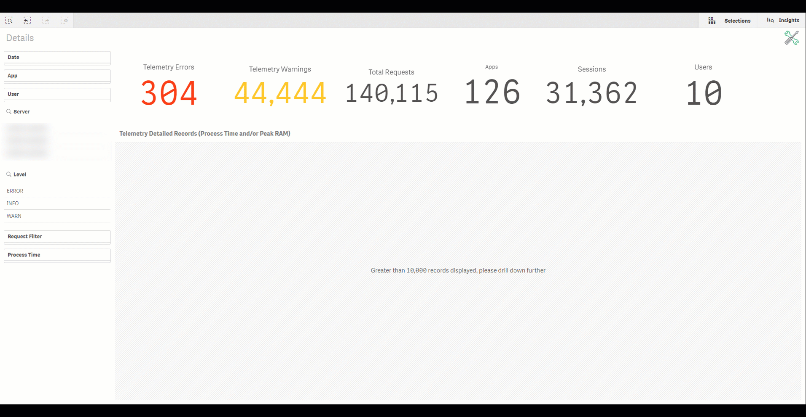

# Review Expensive Objects (Telemetry) <i class="fas fa-tools fa-xs" title="Tooling | Pre-Built Solutions"></i>
{:.no_toc}

production

|                                  		                    | Initial  | Recurring  |
|---------------------------------------------------------|----------|------------|
| <i class="far fa-clock fa-sm"></i> **Estimated Time**   | 35 min   | 8 min      |

Benefits:

  - Optimize objects
  - Increase performance
  - Control thresholds
  
-------------------------

## Goal
{:.no_toc}
The goal for this spot-check is use the [Qlik Sense Telemetry Dashboard](../tooling/telemetry_dashboard.html) to look for expensive objects. This process is ideal to be generally aware of the performance of a Qlik Sense Enterprise deployment. With a narrow set of items to focus on, action can be taken to improve performance.

## Table of Contents
{:.no_toc}

* TOC
{:toc}
-------------------------

## Prerequisite <i class="fas fa-tools fa-xs" title="Tooling | Pre-Built Solutions"></i>

- [Telemetry Dashboard](../tooling/telemetry_dashboard.md)

The Qlik Sense Telemetry Dashboard is a project created and maintained by the Enterprise Architecture team in Qlik’s Americas Presales organization. It leverages additional logging which can be enabled in Qlik Sense Enterprise February 2018 and newer releases of Qlik Sense with some data enrichment with API calls to provide visualization-level performance data for Qlik apps. The goal of the tool is to present this performance data in actionable ways for administrators / developers to have precision when focusing on performance improvements for Qlik apps.

-------------------------

## Telemetry Dashboard - Details

Open the Qlik Sense Telemetry Dashboard application and navigate to the **Details** sheet. Inside this sheet, drill to the most recent day (since this task is a daily task), select the relevant **Request Filters**, and drill to the **Process Time** values which broach the threshold that you are interested in. Example:

For this example, we are interested in Visualization objects, App Open Events, and Reloads which have taken more than 30 seconds.

 * **Note**: The primary Engine calls which are relevant for most users of the Telemetry Dashboard are:
   * OpenApp : The request to the Engine to open an application. This is the time it takes for the Engine to request the application binary from disk, load it over the network, and un-compress it to RAM.
   * Reloads : How long a reload execution takes. This type of request is less frequently relevant to most organizations. At least for the scope of this task.
   * Visualizations : The request to the Engine to render a visualization, e.g. a table chart.
 * A more exhaustive write-up of the Telemetry Dashboard is found [here](../tooling/telemetry_dashboard.html)

With a narrowed set of interactions, action plans can be constructed. For example:

 * App Open : If the threshold is unacceptable given the important of the application, then a cache warming process can be built. Reference [here](../tooling/cache_warming.html) for more specific guidance.
 * Visualization : Use the data from the Telemetry Dashboard like **App**, **Sheet** and **Object Type** + **ObjectID** to reach out to the application's owner and/or maintainer in order for a fix to be implemented. Since the Qlik Sense Telemetry Dashboard does not imply a specific fix, the developer will need to review the application to see what improvements can be made. Potential avenues for fixes: 
   * Table / Pivot Table : Use calculation conditions to force drill downs.
   * Other visualizations : Review expressions used. Simplify where possible and/or off-load the calculations to the application's load script to pre-calculate. The [Diagnostic Toolkit](https://diagnostictoolkit.qlik-poc.com/) project can be used for reference.

**Tags**

#daily

#spot_check

#telemetry

&nbsp;
