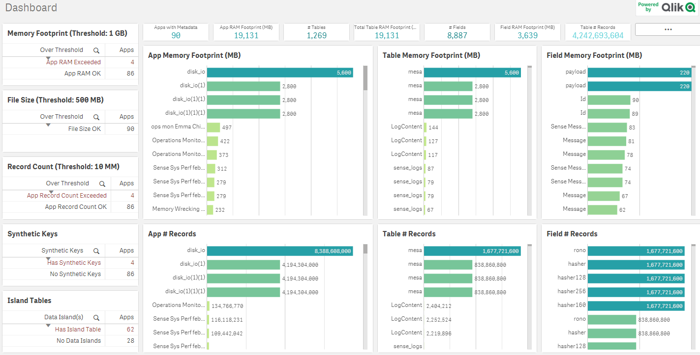
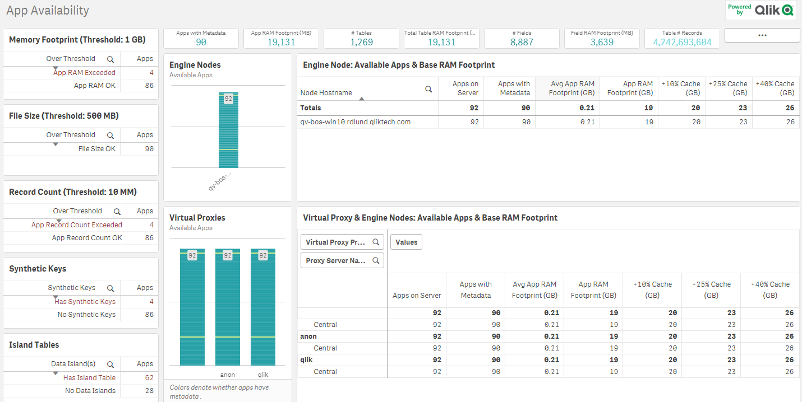

# App Metadata Analyzer
{:.no_toc}

<span class="label dev">development</span><span class="label prod">production</span>

| <i class="far fa-clock fa-sm"></i> **Estimated Configuration Time**   | 5 min  |

## Table of Contents
{:.no_toc}

* TOC
{:toc}

-------------------------

## About

**_The App Metadata Analyzer is now a supported application that is shipped with Qlik Sense as of the September 2019 release._**

The App Metadata Analyzer iterates over every application metadata endpoint along with several other QRS calls (Nodes, Apps, Proxies, LB audit), ultimately providing a comprehensive dashboard to analyze your application metadata server-wide.

This allows you to have a holistic view of the makeup of all of your Qlik applications, enabling you to have awareness at a granular level of the types of applications in your organization. This application is 100% native to Qlik without any installer, and is easy to configure within the Qlik Sense Enterprise environment as the app takes advantage of the existing 'monitor_apps_REST_app' connection to drive all of the REST calls.
 
As of the Qlik Sense June 2018 release, a new application level metadata endpoint is available. Data is populated for this endpoint per app post-reload in a June 2018+ environment. You can view this application metadata within your own June 2018+ environment at:

`http(s)://<server>/api/v1/apps/<GUID>/data/metadata`
 
where <server> is your Qlik Sense Enterprise server and <GUID> is the application ID. Note that the application does not need to be lifted into RAM for the metadata to be accessed.

Data from this endpoint is derived as part of the app reload process, and therefore does not include any object or expression related metadata. 

**The data from the endpoint includes:**

- server metadata including number of server cores, total server RAM
- reload time
- app RAM base footprint
- field metadata including cardinality, tags, total count, RAM size
- table metadata including fields, rows, key fields, RAM size

<details>

```
{"reload_meta":{"cpu_time_spent_ms":12696,"hardware":{"logical_cores":4,"total_memory":13018009600}},"static_byte_size":252583030,"fields":[{"name":"$Field","src_tables":[],"is_system":true,"is_hidden":true,"is_semantic":false,"distinct_only":false,"cardinal":239,"total_count":244,"is_locked":false,"always_one_selected":false,"is_numeric":false,"comment":"","tags":["$ascii","$text","$hidden","$system","$key"],"byte_size":6208},{"name":"$Table","src_tables":[],"is_system":true,"is_hidden":true,"is_semantic":false,"distinct_only":false,"cardinal":7,"total_count":244,"is_locked":false,"always_one_selected":false,"is_numeric":false,"comment":"","tags":["$ascii","$text","$hidden","$system","$key"],"byte_size":110},{"name":"$Rows","src_tables":[],"is_system":true,"is_hidden":true,"is_semantic":false,"distinct_only":false,"cardinal":5,"total_count":7,"is_locked":false,"always_one_selected":false,"is_numeric":true,"comment":"","tags":["$numeric","$integer","$hidden","$system"],"byte_size":70},{"name":"$Fields","src_tables":[],"is_system":true,"is_hidden":true,"is_semantic":false,"distinct_only":false,"cardinal":5,"total_count":7,"is_locked":false,"always_one_selected":false,"is_numeric":true,"comment":"","tags":["$numeric","$integer","$hidden","$system"],"byte_size":59},{"name":"$FieldNo","src_tables":[],"is_system":true,"is_hidden":true,"is_semantic":false,"distinct_only":false,"cardinal":114,"total_count":244,"is_locked":false,"always_one_selected":false,"is_numeric":true,"comment":"","tags":["$numeric","$integer","$hidden","$system"],"byte_size":1374},{"name":"$Info","src_tables":[],"is_system":true,"is_hidden":true,"is_semantic":false,"distinct_only":false,"cardinal":1,"total_count":239,"is_locked":false,"always_one_selected":false,"is_numeric":false,"comment":"","tags":["$ascii","$text","$hidden","$system"],"byte_size":6},{"name":"Game URL","src_tables":["Plays"],"is_system":false,"is_hidden":false,"is_semantic":false,"distinct_only":false,"cardinal":2298,"total_count":343045,"is_locked":false,"always_one_selected":false,"is_numeric":false,"comment":"","tags":["$ascii","$text"],"byte_size":174648},{"name":"GameID","src_tables":["Plays","Link","FinalScores","GamePassStats","PlayerPassStats"],"is_system":false,"is_hidden":false,"is_semantic":false,"distinct_only":true,"cardinal":2304,"total_count":0,"is_locked":false,"always_one_selected":false,"is_numeric":true,"comment":"","tags":["$numeric","$integer","$key"],"byte_size":46080},{"name":"WinningTeam","src_tables":["Plays"],"is_system":false,"is_hidden":false,"is_semantic":false,"distinct_only":false,"cardinal":35,"total_count":343045,"is_locked":false,"always_one_selected":false,"is_numeric":false,"comment":"","tags":["$ascii","$text"],"byte_size":307},{"name":"LosingTeam","src_tables":["Plays"],"is_system":false,"is_hidden":false,"is_semantic":false,"distinct_only":false,"cardinal":35,"total_count":343045,"is_locked":false,"always_one_selected":false,"is_numeric":false,"comment":"","tags":["$ascii","$text"],"byte_size":307},{"name":"FinalHomeScore","src_tables":["FinalScores"],"is_system":false,"is_hidden":false,"is_semantic":false,"distinct_only":false,"cardinal":57,"total_count":2298,"is_locked":false,"always_one_selected":false,"is_numeric":true,"comment":"","tags":["$numeric","$integer"],"byte_size":677},{"name":"FinalAwayScore","src_tables":["FinalScores"],"is_system":false,"is_hidden":false,"is_semantic":false,"distinct_only":false,"cardinal":52,"total_count":2298,"is_locked":false,"always_one_selected":false,"is_numeric":true,"comment":"","tags":["$numeric","$integer"],"byte_size":617},{"name":"offense_won","src_tables":["Plays"],"is_system":false,"is_hidden":false,"is_semantic":false,"distinct_only":false,"cardinal":2,"total_count":343045,"is_locked":false,"always_one_selected":false,"is_numeric":false,"comment":"","tags":["$ascii","$text"],"byte_size":21},{"name":"ID","src_tables":["Plays"],"is_system":false,"is_hidden":false,"is_semantic":false,"distinct_only":false,"cardinal":343045,"total_count":343045,"is_locked":false,"always_one_selected":false,"is_numeric":true,"comment":"","tags":["$numeric","$integer"],"byte_size":2744360},{"name":"Date","src_tables":["Plays"],"is_system":false,"is_hidden":false,"is_semantic":false,"distinct_only":false,"cardinal":426,"total_count":343045,"is_locked":false,"always_one_selected":false,"is_numeric":true,"comment":"","tags":["$numeric","$integer","$timestamp","$date"],"byte_size":3408},{"name":"Drive","src_tables":["Plays"],"is_system":false,"is_hidden":false,"is_semantic":false,"distinct_only":false,"cardinal":35,"total_count":343045,"is_locked":false,"always_one_selected":false,"is_numeric":true,"comment":"","tags":["$numeric","$integer"],"byte_size":411},{"name":"qtr","src_tables":["Plays"],"is_system":false,"is_hidden":false,"is_semantic":false,"distinct_only":false,"cardinal":4,"total_count":343045,"is_locked":false,"always_one_selected":false,"is_numeric":false,"comment":"","tags":["$ascii","$text"],"byte_size":32},{"name":"down","src_tables":["Plays"],"is_system":false,"is_hidden":false,"is_semantic":false,"distinct_only":false,"cardinal":4,"total_count":343045,"is_locked":false,"always_one_selected":false,"is_numeric":true,"comment":"","tags":["$numeric","$integer"],"byte_size":44},{"name":"time","src_tables":["Plays"],"is_system":false,"is_hidden":false,"is_semantic":false,"distinct_only":false,"cardinal":901,"total_count":343045,"is_locked":false,"always_one_selected":false,"is_numeric":true,"comment":"","tags":["$numeric"],"byte_size":19822},{"name":"TimeUnder","src_tables":["Plays"],"is_system":false,"is_hidden":false,"is_semantic":false,"distinct_only":false,"cardinal":16,"total_count":343045,"is_locked":false,"always_one_selected":false,"is_numeric":true,"comment":"","tags":["$numeric","$integer"],"byte_size":182},{"name":"TimeSecsDual","src_tables":["Plays"],"is_system":false,"is_hidden":false,"is_semantic":false,"distinct_only":false,"cardinal":343045,"total_count":343045,"is_locked":false,"always_one_selected":false,"is_numeric":true,"comment":"","tags":["$numeric","$integer"],"byte_size":4687758},{"name":"TimeSecs","src_tables":["Plays"],"is_system":false,"is_hidden":false,"is_semantic":false,"distinct_only":false,"cardinal":3601,"total_count":343045,"is_locked":false,"always_one_selected":false,"is_numeric":true,"comment":"","tags":["$numeric","$integer"],"byte_size":49304},{"name":"PlayTimeDiff","src_tables":["Plays"],"is_system":false,"is_hidden":false,"is_semantic":false,"distinct_only":false,"cardinal":149,"total_count":343045,"is_locked":false,"always_one_selected":false,"is_numeric":true,"comment":"","tags":[],"byte_size":1823},{"name":"SideofField","src_tables":["Plays"],"is_system":false,"is_hidden":false,"is_semantic":false,"distinct_only":false,"cardinal":36,"total_count":343045,"is_locked":false,"always_one_selected":false,"is_numeric":false,"comment":"","tags":["$ascii","$text"],"byte_size":316},{"name":"yrdline100Adjusted","src_tables":["Plays"],"is_system":false,"is_hidden":false,"is_semantic":false,"distinct_only":false,"cardinal":99,"total_count":343045,"is_locked":false,"always_one_selected":false,"is_numeric":true,"comment":"","tags":["$numeric","$integer"],"byte_size":792},{"name":"yrdln","src_tables":["Plays"],"is_system":false,"is_hidden":false,"is_semantic":false,"distinct_only":false,"cardinal":99,"total_count":343045,"is_locked":false,"always_one_selected":false,"is_numeric":true,"comment":"","tags":["$numeric","$integer"],"byte_size":792},{"name":"yrdline100","src_tables":["Plays"],"is_system":false,"is_hidden":false,"is_semantic":false,"distinct_only":false,"cardinal":99,"total_count":343045,"is_locked":false,"always_one_selected":false,"is_numeric":true,"comment":"","tags":["$numeric","$integer"],"byte_size":1179},{"name":"yrdlnOriginal","src_tables":["Plays"],"is_system":false,"is_hidden":false,"is_semantic":false,"distinct_only":false,"cardinal":50,"total_count":343045,"is_locked":false,"always_one_selected":false,"is_numeric":true,"comment":"","tags":["$numeric","$integer"],"byte_size":591},{"name":"ydstogo","src_tables":["Plays"],"is_system":false,"is_hidden":false,"is_semantic":false,"distinct_only":false,"cardinal":46,"total_count":343045,"is_locked":false,"always_one_selected":false,"is_numeric":true,"comment":"","tags":["$numeric","$integer"],"byte_size":543},{"name":"ydsnet","src_tables":["Plays"],"is_system":false,"is_hidden":false,"is_semantic":false,"distinct_only":false,"cardinal":152,"total_count":343045,"is_locked":false,"always_one_selected":false,"is_numeric":true,"comment":"","tags":["$numeric","$integer"],"byte_size":1857},{"name":"GoalToGo","src_tables":["Plays"],"is_system":false,"is_hidden":false,"is_semantic":false,"distinct_only":false,"cardinal":2,"total_count":343045,"is_locked":false,"always_one_selected":false,"is_numeric":true,"comment":"","tags":["$numeric","$integer"],"byte_size":22},{"name":"FirstDown","src_tables":["Plays"],"is_system":false,"is_hidden":false,"is_semantic":false,"distinct_only":false,"cardinal":2,"total_count":343045,"is_locked":false,"always_one_selected":false,"is_numeric":true,"comment":"","tags":["$numeric","$integer"],"byte_size":22},{"name":"posteam","src_tables":["Plays"],"is_system":false,"is_hidden":false,"is_semantic":false,"distinct_only":false,"cardinal":35,"total_count":343045,"is_locked":false,"always_one_selected":false,"is_numeric":false,"comment":"","tags":["$ascii","$text"],"byte_size":307},{"name":"DefensiveTeam","src_tables":["Plays"],"is_system":false,"is_hidden":false,"is_semantic":false,"distinct_only":false,"cardinal":35,"total_count":343045,"is_locked":false,"always_one_selected":false,"is_numeric":false,"comment":"","tags":["$ascii","$text"],"byte_size":307},{"name":"desc","src_tables":["Plays"],"is_system":false,"is_hidden":false,"is_semantic":false,"distinct_only":false,"cardinal":342749,"total_count":343045,"is_locked":false,"always_one_selected":false,"is_numeric":false,"comment":"","tags":["$ascii","$text"],"byte_size":32903981},{"name":"PlayAttempted","src_tables":["Plays"],"is_system":false,"is_hidden":false,"is_semantic":false,"distinct_only":false,"cardinal":1,"total_count":343045,"is_locked":false,"always_one_selected":false,"is_numeric":true,"comment":"","tags":["$numeric","$integer"],"byte_size":11},{"name":"Yards.Gained","src_tables":["Plays"],"is_system":false,"is_hidden":false,"is_semantic":false,"distinct_only":false,"cardinal":126,"total_count":343045,"is_locked":false,"always_one_selected":false,"is_numeric":true,"comment":"","tags":["$numeric","$integer"],"byte_size":1520},{"name":"sp","src_tables":["Plays"],"is_system":false,"is_hidden":false,"is_semantic":false,"distinct_only":false,"cardinal":2,"total_count":343045,"is_locked":false,"always_one_selected":false,"is_numeric":true,"comment":"","tags":["$numeric","$integer"],"byte_size":22},{"name":"Touchdown","src_tables":["Plays"],"is_system":false,"is_hidden":false,"is_semantic":false,"distinct_only":false,"cardinal":2,"total_count":343045,"is_locked":false,"always_one_selected":false,"is_numeric":true,"comment":"","tags":["$numeric","$integer"],"byte_size":22},{"name":"ExPointResult","src_tables":["Plays"],"is_system":false,"is_hidden":false,"is_semantic":false,"distinct_only":false,"cardinal":1,"total_count":343045,"is_locked":false,"always_one_selected":false,"is_numeric":false,"comment":"","tags":["$ascii","$text"],"byte_size":8},{"name":"TwoPointConv","src_tables":["Plays"],"is_system":false,"is_hidden":false,"is_semantic":false,"distinct_only":false,"cardinal":1,"total_count":343045,"is_locked":false,"always_one_selected":false,"is_numeric":false,"comment":"","tags":["$ascii","$text"],"byte_size":8},{"name":"DefTwoPoint","src_tables":["Plays"],"is_system":false,"is_hidden":false,"is_semantic":false,"distinct_only":false,"cardinal":1,"total_count":343045,"is_locked":false,"always_one_selected":false,"is_numeric":false,"comment":"","tags":["$ascii","$text"],"byte_size":8},{"name":"Safety","src_tables":["Plays"],"is_system":false,"is_hidden":false,"is_semantic":false,"distinct_only":false,"cardinal":2,"total_count":343045,"is_locked":false,"always_one_selected":false,"is_numeric":true,"comment":"","tags":["$numeric","$integer"],"byte_size":22},{"name":"Onsidekick","src_tables":["Plays"],"is_system":false,"is_hidden":false,"is_semantic":false,"distinct_only":false,"cardinal":2,"total_count":343045,"is_locked":false,"always_one_selected":false,"is_numeric":true,"comment":"","tags":["$numeric","$integer"],"byte_size":22},{"name":"PuntResult","src_tables":["Plays"],"is_system":false,"is_hidden":false,"is_semantic":false,"distinct_only":false,"cardinal":3,"total_count":343045,"is_locked":false,"always_one_selected":false,"is_numeric":false,"comment":"","tags":["$ascii","$text"],"byte_size":32},{"name":"PlayType","src_tables":["Plays"],"is_system":false,"is_hidden":false,"is_semantic":false,"distinct_only":false,"cardinal":11,"total_count":343045,"is_locked":false,"always_one_selected":false,"is_numeric":false,"comment":"","tags":["$ascii","$text"],"byte_size":133},{"name":"Passer","src_tables":["Plays"],"is_system":false,"is_hidden":false,"is_semantic":false,"distinct_only":false,"cardinal":346,"total_count":343045,"is_locked":false,"always_one_selected":false,"is_numeric":false,"comment":"","tags":["$ascii","$text"],"byte_size":4969},{"name":"Passer_ID","src_tables":["Plays"],"is_system":false,"is_hidden":false,"is_semantic":false,"distinct_only":false,"cardinal":334,"total_count":343045,"is_locked":false,"always_one_selected":false,"is_numeric":false,"comment":"","tags":["$ascii","$text"],"byte_size":5338},{"name":"PassAttempt","src_tables":["Plays"],"is_system":false,"is_hidden":false,"is_semantic":false,"distinct_only":false,"cardinal":2,"total_count":343045,"is_locked":false,"always_one_selected":false,"is_numeric":true,"comment":"","tags":["$numeric","$integer"],"byte_size":22},{"name":"PassOutcome","src_tables":["Plays"],"is_system":false,"is_hidden":false,"is_semantic":false,"distinct_only":false,"cardinal":3,"total_count":343045,"is_locked":false,"always_one_selected":false,"is_numeric":false,"comment":"","tags":["$ascii","$text"],"byte_size":43},{"name":"PassLength","src_tables":["Plays"],"is_system":false,"is_hidden":false,"is_semantic":false,"distinct_only":false,"cardinal":4,"total_count":343045,"is_locked":false,"always_one_selected":false,"is_numeric":false,"comment":"","tags":[],"byte_size":41},{"name":"AirYards","src_tables":["Plays"],"is_system":false,"is_hidden":false,"is_semantic":false,"distinct_only":false,"cardinal":109,"total_count":343045,"is_locked":false,"always_one_selected":false,"is_numeric":true,"comment":"","tags":["$numeric","$integer"],"byte_size":1329},{"name":"YardsAfterCatch","src_tables":["Plays"],"is_system":false,"is_hidden":false,"is_semantic":false,"distinct_only":false,"cardinal":115,"total_count":343045,"is_locked":false,"always_one_selected":false,"is_numeric":true,"comment":"","tags":["$numeric","$integer"],"byte_size":1387},{"name":"QBHit","src_tables":["Plays"],"is_system":false,"is_hidden":false,"is_semantic":false,"distinct_only":false,"cardinal":2,"total_count":343045,"is_locked":false,"always_one_selected":false,"is_numeric":true,"comment":"","tags":["$numeric","$integer"],"byte_size":22},{"name":"PassLocation","src_tables":["Plays"],"is_system":false,"is_hidden":false,"is_semantic":false,"distinct_only":false,"cardinal":4,"total_count":343045,"is_locked":false,"always_one_selected":false,"is_numeric":false,"comment":"","tags":["$ascii","$text"],"byte_size":41},{"name":"InterceptionThrown","src_tables":["Plays"],"is_system":false,"is_hidden":false,"is_semantic":false,"distinct_only":false,"cardinal":2,"total_count":343045,"is_locked":false,"always_one_selected":false,"is_numeric":true,"comment":"","tags":["$numeric","$integer"],"byte_size":22},{"name":"Interceptor","src_tables":["Plays"],"is_system":false,"is_hidden":false,"is_semantic":false,"distinct_only":false,"cardinal":897,"total_count":343045,"is_locked":false,"always_one_selected":false,"is_numeric":false,"comment":"","tags":["$ascii","$text"],"byte_size":12888},{"name":"Rusher","src_tables":["Plays"],"is_system":false,"is_hidden":false,"is_semantic":false,"distinct_only":false,"cardinal":1217,"total_count":343045,"is_locked":false,"always_one_selected":false,"is_numeric":false,"comment":"","tags":["$ascii","$text"],"byte_size":17525},{"name":"Rusher_ID","src_tables":["Plays"],"is_system":false,"is_hidden":false,"is_semantic":false,"distinct_only":false,"cardinal":1069,"total_count":343045,"is_locked":false,"always_one_selected":false,"is_numeric":false,"comment":"","tags":[],"byte_size":17093},{"name":"RushAttempt","src_tables":["Plays"],"is_system":false,"is_hidden":false,"is_semantic":false,"distinct_only":false,"cardinal":2,"total_count":343045,"is_locked":false,"always_one_selected":false,"is_numeric":true,"comment":"","tags":["$numeric","$integer"],"byte_size":22},{"name":"RunLocation","src_tables":["Plays"],"is_system":false,"is_hidden":false,"is_semantic":false,"distinct_only":false,"cardinal":4,"total_count":343045,"is_locked":false,"always_one_selected":false,"is_numeric":false,"comment":"","tags":["$ascii","$text"],"byte_size":41},{"name":"RunGap","src_tables":["Plays"],"is_system":false,"is_hidden":false,"is_semantic":false,"distinct_only":false,"cardinal":4,"total_count":343045,"is_locked":false,"always_one_selected":false,"is_numeric":false,"comment":"","tags":["$ascii","$text"],"byte_size":40},{"name":"Receiver","src_tables":["Plays"],"is_system":false,"is_hidden":false,"is_semantic":false,"distinct_only":false,"cardinal":1381,"total_count":343045,"is_locked":false,"always_one_selected":false,"is_numeric":false,"comment":"","tags":["$ascii","$text"],"byte_size":19874},{"name":"Receiver_ID","src_tables":["Plays"],"is_system":false,"is_hidden":false,"is_semantic":false,"distinct_only":false,"cardinal":1488,"total_count":343045,"is_locked":false,"always_one_selected":false,"is_numeric":false,"comment":"","tags":[],"byte_size":23797},{"name":"Reception","src_tables":["Plays"],"is_system":false,"is_hidden":false,"is_semantic":false,"distinct_only":false,"cardinal":2,"total_count":343045,"is_locked":false,"always_one_selected":false,"is_numeric":true,"comment":"","tags":["$numeric","$integer"],"byte_size":22},{"name":"ReturnResult","src_tables":["Plays"],"is_system":false,"is_hidden":false,"is_semantic":false,"distinct_only":false,"cardinal":4,"total_count":343045,"is_locked":false,"always_one_selected":false,"is_numeric":false,"comment":"","tags":["$ascii","$text"],"byte_size":54},{"name":"Returner","src_tables":["Plays"],"is_system":false,"is_hidden":false,"is_semantic":false,"distinct_only":false,"cardinal":552,"total_count":343045,"is_locked":false,"always_one_selected":false,"is_numeric":false,"comment":"","tags":["$ascii","$text"],"byte_size":7914},{"name":"BlockingPlayer","src_tables":["Plays"],"is_system":false,"is_hidden":false,"is_semantic":false,"distinct_only":false,"cardinal":101,"total_count":343045,"is_locked":false,"always_one_selected":false,"is_numeric":false,"comment":"","tags":["$ascii","$text"],"byte_size":1435},{"name":"Tackler1","src_tables":["Plays"],"is_system":false,"is_hidden":false,"is_semantic":false,"distinct_only":false,"cardinal":3464,"total_count":343045,"is_locked":false,"always_one_selected":false,"is_numeric":false,"comment":"","tags":["$ascii","$text"],"byte_size":50067},{"name":"Tackler2","src_tables":["Plays"],"is_system":false,"is_hidden":false,"is_semantic":false,"distinct_only":false,"cardinal":2226,"total_count":343045,"is_locked":false,"always_one_selected":false,"is_numeric":false,"comment":"","tags":["$ascii","$text"],"byte_size":32129},{"name":"FieldGoalResult","src_tables":["Plays"],"is_system":false,"is_hidden":false,"is_semantic":false,"distinct_only":false,"cardinal":4,"total_count":343045,"is_locked":false,"always_one_selected":false,"is_numeric":false,"comment":"","tags":["$ascii","$text"],"byte_size":44},{"name":"FieldGoalDistance","src_tables":["Plays"],"is_system":false,"is_hidden":false,"is_semantic":false,"distinct_only":false,"cardinal":52,"total_count":343045,"is_locked":false,"always_one_selected":false,"is_numeric":true,"comment":"","tags":[],"byte_size":620},{"name":"Fumble","src_tables":["Plays"],"is_system":false,"is_hidden":false,"is_semantic":false,"distinct_only":false,"cardinal":2,"total_count":343045,"is_locked":false,"always_one_selected":false,"is_numeric":true,"comment":"","tags":["$numeric","$integer"],"byte_size":22},{"name":"RecFumbTeam","src_tables":["Plays"],"is_system":false,"is_hidden":false,"is_semantic":false,"distinct_only":false,"cardinal":35,"total_count":343045,"is_locked":false,"always_one_selected":false,"is_numeric":false,"comment":"","tags":["$ascii","$text"],"byte_size":306},{"name":"RecFumbPlayer","src_tables":["Plays"],"is_system":false,"is_hidden":false,"is_semantic":false,"distinct_only":false,"cardinal":1729,"total_count":343045,"is_locked":false,"always_one_selected":false,"is_numeric":false,"comment":"","tags":["$ascii","$text"],"byte_size":24817},{"name":"Sack","src_tables":["Plays"],"is_system":false,"is_hidden":false,"is_semantic":false,"distinct_only":false,"cardinal":2,"total_count":343045,"is_locked":false,"always_one_selected":false,"is_numeric":true,"comment":"","tags":["$numeric","$integer"],"byte_size":22},{"name":"Challenge.Replay","src_tables":["Plays"],"is_system":false,"is_hidden":false,"is_semantic":false,"distinct_only":false,"cardinal":2,"total_count":343045,"is_locked":false,"always_one_selected":false,"is_numeric":true,"comment":"","tags":["$numeric","$integer"],"byte_size":22},{"name":"ChalReplayResult","src_tables":["Plays"],"is_system":false,"is_hidden":false,"is_semantic":false,"distinct_only":false,"cardinal":3,"total_count":343045,"is_locked":false,"always_one_selected":false,"is_numeric":false,"comment":"","tags":["$ascii","$text"],"byte_size":34},{"name":"Accepted.Penalty","src_tables":["Plays"],"is_system":false,"is_hidden":false,"is_semantic":false,"distinct_only":false,"cardinal":2,"total_count":343045,"is_locked":false,"always_one_selected":false,"is_numeric":true,"comment":"","tags":["$numeric","$integer"],"byte_size":22},{"name":"PenalizedTeam","src_tables":["Plays"],"is_system":false,"is_hidden":false,"is_semantic":false,"distinct_only":false,"cardinal":35,"total_count":343045,"is_locked":false,"always_one_selected":false,"is_numeric":false,"comment":"","tags":["$ascii","$text"],"byte_size":306},{"name":"PenaltyType","src_tables":["Plays"],"is_system":false,"is_hidden":false,"is_semantic":false,"distinct_only":false,"cardinal":69,"total_count":343045,"is_locked":false,"always_one_selected":false,"is_numeric":false,"comment":"","tags":["$ascii","$text"],"byte_size":3962},{"name":"PenalizedPlayer","src_tables":["Plays"],"is_system":false,"is_hidden":false,"is_semantic":false,"distinct_only":false,"cardinal":3230,"total_count":343045,"is_locked":false,"always_one_selected":false,"is_numeric":false,"comment":"","tags":["$ascii","$text"],"byte_size":46639},{"name":"Penalty.Yards","src_tables":["Plays"],"is_system":false,"is_hidden":false,"is_semantic":false,"distinct_only":false,"cardinal":59,"total_count":343045,"is_locked":false,"always_one_selected":false,"is_numeric":true,"comment":"","tags":["$numeric","$integer"],"byte_size":698},{"name":"PosTeamScore","src_tables":["Plays"],"is_system":false,"is_hidden":false,"is_semantic":false,"distinct_only":false,"cardinal":60,"total_count":343045,"is_locked":false,"always_one_selected":false,"is_numeric":true,"comment":"","tags":["$numeric","$integer"],"byte_size":710},{"name":"DefTeamScore","src_tables":["Plays"],"is_system":false,"is_hidden":false,"is_semantic":false,"distinct_only":false,"cardinal":60,"total_count":343045,"is_locked":false,"always_one_selected":false,"is_numeric":true,"comment":"","tags":["$numeric","$integer"],"byte_size":710},{"name":"ScoreDiff","src_tables":["Plays"],"is_system":false,"is_hidden":false,"is_semantic":false,"distinct_only":false,"cardinal":103,"total_count":343045,"is_locked":false,"always_one_selected":false,"is_numeric":true,"comment":"","tags":["$numeric","$integer"],"byte_size":1268},{"name":"AbsScoreDiff","src_tables":["Plays"],"is_system":false,"is_hidden":false,"is_semantic":false,"distinct_only":false,"cardinal":52,"total_count":343045,"is_locked":false,"always_one_selected":false,"is_numeric":true,"comment":"","tags":["$numeric","$integer"],"byte_size":614},{"name":"HomeTeam","src_tables":["Plays"],"is_system":false,"is_hidden":false,"is_semantic":false,"distinct_only":false,"cardinal":35,"total_count":343045,"is_locked":false,"always_one_selected":false,"is_numeric":false,"comment":"","tags":["$ascii","$text"],"byte_size":307},{"name":"AwayTeam","src_tables":["Plays"],"is_system":false,"is_hidden":false,"is_semantic":false,"distinct_only":false,"cardinal":35,"total_count":343045,"is_locked":false,"always_one_selected":false,"is_numeric":false,"comment":"","tags":["$ascii","$text"],"byte_size":307},{"name":"Timeout_Indicator","src_tables":["Plays"],"is_system":false,"is_hidden":false,"is_semantic":false,"distinct_only":false,"cardinal":2,"total_count":343045,"is_locked":false,"always_one_selected":false,"is_numeric":true,"comment":"","tags":["$numeric","$integer"],"byte_size":22},{"name":"Timeout_Team","src_tables":["Plays"],"is_system":false,"is_hidden":false,"is_semantic":false,"distinct_only":false,"cardinal":36,"total_count":343045,"is_locked":false,"always_one_selected":false,"is_numeric":false,"comment":"","tags":["$ascii","$text"],"byte_size":317},{"name":"posteam_timeouts_pre","src_tables":["Plays"],"is_system":false,"is_hidden":false,"is_semantic":false,"distinct_only":false,"cardinal":4,"total_count":343045,"is_locked":false,"always_one_selected":false,"is_numeric":true,"comment":"","tags":["$numeric","$integer"],"byte_size":44},{"name":"HomeTimeouts_Remaining_Pre","src_tables":["Plays"],"is_system":false,"is_hidden":false,"is_semantic":false,"distinct_only":false,"cardinal":7,"total_count":343045,"is_locked":false,"always_one_selected":false,"is_numeric":true,"comment":"","tags":["$numeric","$integer"],"byte_size":80},{"name":"AwayTimeouts_Remaining_Pre","src_tables":["Plays"],"is_system":false,"is_hidden":false,"is_semantic":false,"distinct_only":false,"cardinal":5,"total_count":343045,"is_locked":false,"always_one_selected":false,"is_numeric":true,"comment":"","tags":["$numeric","$integer"],"byte_size":56},{"name":"HomeTimeouts_Remaining_Post","src_tables":["Plays"],"is_system":false,"is_hidden":false,"is_semantic":false,"distinct_only":false,"cardinal":7,"total_count":343045,"is_locked":false,"always_one_selected":false,"is_numeric":true,"comment":"","tags":["$numeric","$integer"],"byte_size":80},{"name":"AwayTimeouts_Remaining_Post","src_tables":["Plays"],"is_system":false,"is_hidden":false,"is_semantic":false,"distinct_only":false,"cardinal":5,"total_count":343045,"is_locked":false,"always_one_selected":false,"is_numeric":true,"comment":"","tags":["$numeric","$integer"],"byte_size":56},{"name":"No_Score_Prob","src_tables":["Plays"],"is_system":false,"is_hidden":false,"is_semantic":false,"distinct_only":false,"cardinal":278638,"total_count":343045,"is_locked":false,"always_one_selected":false,"is_numeric":true,"comment":"","tags":["$numeric"],"byte_size":8891075},{"name":"Opp_Field_Goal_Prob","src_tables":["Plays"],"is_system":false,"is_hidden":false,"is_semantic":false,"distinct_only":false,"cardinal":278637,"total_count":343045,"is_locked":false,"always_one_selected":false,"is_numeric":true,"comment":"","tags":["$numeric"],"byte_size":8765499},{"name":"Opp_Safety_Prob","src_tables":["Plays"],"is_system":false,"is_hidden":false,"is_semantic":false,"distinct_only":false,"cardinal":278637,"total_count":343045,"is_locked":false,"always_one_selected":false,"is_numeric":true,"comment":"","tags":["$numeric"],"byte_size":9284760},{"name":"Opp_Touchdown_Prob","src_tables":["Plays"],"is_system":false,"is_hidden":false,"is_semantic":false,"distinct_only":false,"cardinal":278637,"total_count":343045,"is_locked":false,"always_one_selected":false,"is_numeric":true,"comment":"","tags":["$numeric"],"byte_size":8720048},{"name":"Field_Goal_Prob","src_tables":["Plays"],"is_system":false,"is_hidden":false,"is_semantic":false,"distinct_only":false,"cardinal":278687,"total_count":343045,"is_locked":false,"always_one_selected":false,"is_numeric":true,"comment":"","tags":["$numeric"],"byte_size":8627430},{"name":"Safety_Prob","src_tables":["Plays"],"is_system":false,"is_hidden":false,"is_semantic":false,"distinct_only":false,"cardinal":278637,"total_count":343045,"is_locked":false,"always_one_selected":false,"is_numeric":true,"comment":"","tags":["$numeric"],"byte_size":9195884},{"name":"Touchdown_Prob","src_tables":["Plays"],"is_system":false,"is_hidden":false,"is_semantic":false,"distinct_only":false,"cardinal":278637,"total_count":343045,"is_locked":false,"always_one_selected":false,"is_numeric":true,"comment":"","tags":["$numeric"],"byte_size":8624242},{"name":"ExPoint_Prob","src_tables":["Plays"],"is_system":false,"is_hidden":false,"is_semantic":false,"distinct_only":false,"cardinal":1,"total_count":343045,"is_locked":false,"always_one_selected":false,"is_numeric":true,"comment":"","tags":["$numeric","$integer"],"byte_size":11},{"name":"TwoPoint_Prob","src_tables":["Plays"],"is_system":false,"is_hidden":false,"is_semantic":false,"distinct_only":false,"cardinal":1,"total_count":343045,"is_locked":false,"always_one_selected":false,"is_numeric":true,"comment":"","tags":["$numeric","$integer"],"byte_size":11},{"name":"ExpPts","src_tables":["Plays"],"is_system":false,"is_hidden":false,"is_semantic":false,"distinct_only":false,"cardinal":278687,"total_count":343045,"is_locked":false,"always_one_selected":false,"is_numeric":true,"comment":"","tags":["$numeric"],"byte_size":8467471},{"name":"EPA","src_tables":["Plays"],"is_system":false,"is_hidden":false,"is_semantic":false,"distinct_only":false,"cardinal":334629,"total_count":343045,"is_locked":false,"always_one_selected":false,"is_numeric":true,"comment":"","tags":[],"byte_size":10444278},{"name":"airEPA","src_tables":["Plays"],"is_system":false,"is_hidden":false,"is_semantic":false,"distinct_only":false,"cardinal":155478,"total_count":343045,"is_locked":false,"always_one_selected":false,"is_numeric":true,"comment":"","tags":[],"byte_size":4810747},{"name":"yacEPA","src_tables":["Plays"],"is_system":false,"is_hidden":false,"is_semantic":false,"distinct_only":false,"cardinal":133918,"total_count":343045,"is_locked":false,"always_one_selected":false,"is_numeric":true,"comment":"","tags":[],"byte_size":4153854},{"name":"Home_WP_pre","src_tables":["Plays"],"is_system":false,"is_hidden":false,"is_semantic":false,"distinct_only":false,"cardinal":338079,"total_count":343045,"is_locked":false,"always_one_selected":false,"is_numeric":true,"comment":"","tags":["$numeric"],"byte_size":10485254},{"name":"Away_WP_pre","src_tables":["Plays"],"is_system":false,"is_hidden":false,"is_semantic":false,"distinct_only":false,"cardinal":338080,"total_count":343045,"is_locked":false,"always_one_selected":false,"is_numeric":true,"comment":"","tags":["$numeric"],"byte_size":10506196},{"name":"Home_WP_post","src_tables":["Plays"],"is_system":false,"is_hidden":false,"is_semantic":false,"distinct_only":false,"cardinal":336064,"total_count":343045,"is_locked":false,"always_one_selected":false,"is_numeric":true,"comment":"","tags":[],"byte_size":10422876},{"name":"Away_WP_post","src_tables":["Plays"],"is_system":false,"is_hidden":false,"is_semantic":false,"distinct_only":false,"cardinal":336066,"total_count":343045,"is_locked":false,"always_one_selected":false,"is_numeric":true,"comment":"","tags":[],"byte_size":10443871},{"name":"Win_Prob","src_tables":["Plays"],"is_system":false,"is_hidden":false,"is_semantic":false,"distinct_only":false,"cardinal":336231,"total_count":343045,"is_locked":false,"always_one_selected":false,"is_numeric":true,"comment":"","tags":["$numeric"],"byte_size":10438050},{"name":"WPA","src_tables":["Plays"],"is_system":false,"is_hidden":false,"is_semantic":false,"distinct_only":false,"cardinal":340236,"total_count":343045,"is_locked":false,"always_one_selected":false,"is_numeric":true,"comment":"","tags":[],"byte_size":11164686},{"name":"airWPA","src_tables":["Plays"],"is_system":false,"is_hidden":false,"is_semantic":false,"distinct_only":false,"cardinal":157036,"total_count":343045,"is_locked":false,"always_one_selected":false,"is_numeric":true,"comment":"","tags":[],"byte_size":5124447},{"name":"yacWPA","src_tables":["Plays"],"is_system":false,"is_hidden":false,"is_semantic":false,"distinct_only":false,"cardinal":134238,"total_count":343045,"is_locked":false,"always_one_selected":false,"is_numeric":true,"comment":"","tags":[],"byte_size":4384842},{"name":"Season","src_tables":["Plays"],"is_system":false,"is_hidden":false,"is_semantic":false,"distinct_only":false,"cardinal":9,"total_count":343045,"is_locked":false,"always_one_selected":false,"is_numeric":true,"comment":"","tags":["$numeric","$integer"],"byte_size":126},{"name":"HomeTeamCurrScore","src_tables":["Plays"],"is_system":false,"is_hidden":false,"is_semantic":false,"distinct_only":false,"cardinal":57,"total_count":343045,"is_locked":false,"always_one_selected":false,"is_numeric":true,"comment":"","tags":["$numeric","$integer"],"byte_size":676},{"name":"AwayTeamCurrScore","src_tables":["Plays"],"is_system":false,"is_hidden":false,"is_semantic":false,"distinct_only":false,"cardinal":54,"total_count":343045,"is_locked":false,"always_one_selected":false,"is_numeric":true,"comment":"","tags":["$numeric","$integer"],"byte_size":638},{"name":"QuarterSecondsElasped","src_tables":["Plays"],"is_system":false,"is_hidden":false,"is_semantic":false,"distinct_only":false,"cardinal":900,"total_count":343045,"is_locked":false,"always_one_selected":false,"is_numeric":true,"comment":"","tags":["$numeric","$integer"],"byte_size":8102},{"name":"GameIDPlayType","src_tables":["Plays"],"is_system":false,"is_hidden":false,"is_semantic":false,"distinct_only":false,"cardinal":15974,"total_count":343045,"is_locked":false,"always_one_selected":false,"is_numeric":false,"comment":"","tags":["$ascii","$text"],"byte_size":345158},{"name":"_Key","src_tables":["Link","FinalScoreLink"],"is_system":false,"is_hidden":false,"is_semantic":false,"distinct_only":false,"cardinal":4596,"total_count":4596,"is_locked":false,"always_one_selected":false,"is_numeric":false,"comment":"","tags":["$ascii","$text","$key"],"byte_size":90899},{"name":"Team_Master","src_tables":["Link"],"is_system":false,"is_hidden":false,"is_semantic":false,"distinct_only":false,"cardinal":35,"total_count":4596,"is_locked":false,"always_one_selected":false,"is_numeric":false,"comment":"","tags":["$ascii","$text"],"byte_size":307},{"name":"FinalScore","src_tables":["FinalScoreLink"],"is_system":false,"is_hidden":false,"is_semantic":false,"distinct_only":false,"cardinal":59,"total_count":4596,"is_locked":false,"always_one_selected":false,"is_numeric":true,"comment":"","tags":["$numeric","$integer"],"byte_size":700},{"name":"WonFlag","src_tables":["FinalScoreLink"],"is_system":false,"is_hidden":false,"is_semantic":false,"distinct_only":false,"cardinal":2,"total_count":4596,"is_locked":false,"always_one_selected":false,"is_numeric":true,"comment":"","tags":["$numeric","$integer"],"byte_size":22},{"name":"GamePassStats.Team","src_tables":["GamePassStats"],"is_system":false,"is_hidden":false,"is_semantic":false,"distinct_only":false,"cardinal":34,"total_count":5492,"is_locked":false,"always_one_selected":false,"is_numeric":false,"comment":"","tags":["$ascii","$text"],"byte_size":298},{"name":"GamePassStats.Opponent","src_tables":["GamePassStats"],"is_system":false,"is_hidden":false,"is_semantic":false,"distinct_only":false,"cardinal":34,"total_count":5492,"is_locked":false,"always_one_selected":false,"is_numeric":false,"comment":"","tags":["$ascii","$text"],"byte_size":298},{"name":"GamePassStats.Player_Name","src_tables":["GamePassStats"],"is_system":false,"is_hidden":false,"is_semantic":false,"distinct_only":false,"cardinal":330,"total_count":5492,"is_locked":false,"always_one_selected":false,"is_numeric":false,"comment":"","tags":["$ascii","$text"],"byte_size":4724},{"name":"GamePassStats.Attempts","src_tables":["GamePassStats"],"is_system":false,"is_hidden":false,"is_semantic":false,"distinct_only":false,"cardinal":66,"total_count":5492,"is_locked":false,"always_one_selected":false,"is_numeric":true,"comment":"","tags":["$numeric","$integer"],"byte_size":783},{"name":"GamePassStats.Completions","src_tables":["GamePassStats"],"is_system":false,"is_hidden":false,"is_semantic":false,"distinct_only":false,"cardinal":46,"total_count":5492,"is_locked":false,"always_one_selected":false,"is_numeric":true,"comment":"","tags":["$numeric","$integer"],"byte_size":542},{"name":"GamePassStats.Drives","src_tables":["GamePassStats"],"is_system":false,"is_hidden":false,"is_semantic":false,"distinct_only":false,"cardinal":17,"total_count":5492,"is_locked":false,"always_one_selected":false,"is_numeric":true,"comment":"","tags":["$numeric","$integer"],"byte_size":195},{"name":"GamePassStats.Comp_Perc","src_tables":["GamePassStats"],"is_system":false,"is_hidden":false,"is_semantic":false,"distinct_only":false,"cardinal":454,"total_count":5492,"is_locked":false,"always_one_selected":false,"is_numeric":true,"comment":"","tags":["$numeric"],"byte_size":13777},{"name":"GamePassStats.Total_Yards","src_tables":["GamePassStats"],"is_system":false,"is_hidden":false,"is_semantic":false,"distinct_only":false,"cardinal":477,"total_count":5492,"is_locked":false,"always_one_selected":false,"is_numeric":true,"comment":"","tags":["$numeric","$integer"],"byte_size":6082},{"name":"GamePassStats.Total_Raw_AirYards","src_tables":["GamePassStats"],"is_system":false,"is_hidden":false,"is_semantic":false,"distinct_only":false,"cardinal":581,"total_count":5492,"is_locked":false,"always_one_selected":false,"is_numeric":true,"comment":"","tags":["$numeric","$integer"],"byte_size":7437},{"name":"GamePassStats.Total_Comp_AirYards","src_tables":["GamePassStats"],"is_system":false,"is_hidden":false,"is_semantic":false,"distinct_only":false,"cardinal":317,"total_count":5492,"is_locked":false,"always_one_selected":false,"is_numeric":true,"comment":"","tags":["$numeric","$integer"],"byte_size":4002},{"name":"GamePassStats.Yards_per_Att","src_tables":["GamePassStats"],"is_system":false,"is_hidden":false,"is_semantic":false,"distinct_only":false,"cardinal":2878,"total_count":5492,"is_locked":false,"always_one_selected":false,"is_numeric":true,"comment":"","tags":["$numeric"],"byte_size":83404},{"name":"GamePassStats.Yards_per_Comp","src_tables":["GamePassStats"],"is_system":false,"is_hidden":false,"is_semantic":false,"distinct_only":false,"cardinal":2133,"total_count":5492,"is_locked":false,"always_one_selected":false,"is_numeric":true,"comment":"","tags":[],"byte_size":60718},{"name":"GamePassStats.Yards_per_Drive","src_tables":["GamePassStats"],"is_system":false,"is_hidden":false,"is_semantic":false,"distinct_only":false,"cardinal":1646,"total_count":5492,"is_locked":false,"always_one_selected":false,"is_numeric":true,"comment":"","tags":["$numeric"],"byte_size":44349},{"name":"GamePassStats.Raw_AirYards_per_Att","src_tables":["GamePassStats"],"is_system":false,"is_hidden":false,"is_semantic":false,"distinct_only":false,"cardinal":2990,"total_count":5492,"is_locked":false,"always_one_selected":false,"is_numeric":true,"comment":"","tags":["$numeric"],"byte_size":86651},{"name":"GamePassStats.Comp_AirYards_per_Att","src_tables":["GamePassStats"],"is_system":false,"is_hidden":false,"is_semantic":false,"distinct_only":false,"cardinal":2524,"total_count":5492,"is_locked":false,"always_one_selected":false,"is_numeric":true,"comment":"","tags":["$numeric"],"byte_size":73743},{"name":"GamePassStats.Raw_AirYards_per_Comp","src_tables":["GamePassStats"],"is_system":false,"is_hidden":false,"is_semantic":false,"distinct_only":false,"cardinal":2809,"total_count":5492,"is_locked":false,"always_one_selected":false,"is_numeric":true,"comment":"","tags":[],"byte_size":79995},{"name":"GamePassStats.Comp_AirYards_per_Comp","src_tables":["GamePassStats"],"is_system":false,"is_hidden":false,"is_semantic":false,"distinct_only":false,"cardinal":1988,"total_count":5492,"is_locked":false,"always_one_selected":false,"is_numeric":true,"comment":"","tags":[],"byte_size":56135},{"name":"GamePassStats.Raw_AirYards_per_Drive","src_tables":["GamePassStats"],"is_system":false,"is_hidden":false,"is_semantic":false,"distinct_only":false,"cardinal":1785,"total_count":5492,"is_locked":false,"always_one_selected":false,"is_numeric":true,"comment":"","tags":["$numeric"],"byte_size":48061},{"name":"GamePassStats.Comp_AirYards_per_Drive","src_tables":["GamePassStats"],"is_system":false,"is_hidden":false,"is_semantic":false,"distinct_only":false,"cardinal":1311,"total_count":5492,"is_locked":false,"always_one_selected":false,"is_numeric":true,"comment":"","tags":["$numeric"],"byte_size":35284},{"name":"GamePassStats.PACR","src_tables":["GamePassStats"],"is_system":false,"is_hidden":false,"is_semantic":false,"distinct_only":false,"cardinal":4584,"total_count":5492,"is_locked":false,"always_one_selected":false,"is_numeric":true,"comment":"","tags":[],"byte_size":143372},{"name":"GamePassStats.TimesHit","src_tables":["GamePassStats"],"is_system":false,"is_hidden":false,"is_semantic":false,"distinct_only":false,"cardinal":14,"total_count":5492,"is_locked":false,"always_one_selected":false,"is_numeric":true,"comment":"","tags":["$numeric","$integer"],"byte_size":158},{"name":"GamePassStats.TimesHit_per_Drive","src_tables":["GamePassStats"],"is_system":false,"is_hidden":false,"is_semantic":false,"distinct_only":false,"cardinal":81,"total_count":5492,"is_locked":false,"always_one_selected":false,"is_numeric":true,"comment":"","tags":["$numeric"],"byte_size":2251},{"name":"GamePassStats.Interceptions","src_tables":["GamePassStats"],"is_system":false,"is_hidden":false,"is_semantic":false,"distinct_only":false,"cardinal":7,"total_count":5492,"is_locked":false,"always_one_selected":false,"is_numeric":true,"comment":"","tags":["$numeric","$integer"],"byte_size":77},{"name":"GamePassStats.TDs","src_tables":["GamePassStats"],"is_system":false,"is_hidden":false,"is_semantic":false,"distinct_only":false,"cardinal":9,"total_count":5492,"is_locked":false,"always_one_selected":false,"is_numeric":true,"comment":"","tags":["$numeric","$integer"],"byte_size":99},{"name":"GamePassStats.Air_TDs","src_tables":["GamePassStats"],"is_system":false,"is_hidden":false,"is_semantic":false,"distinct_only":false,"cardinal":6,"total_count":5492,"is_locked":false,"always_one_selected":false,"is_numeric":true,"comment":"","tags":["$numeric","$integer"],"byte_size":66},{"name":"GamePassStats.Success_Rate","src_tables":["GamePassStats"],"is_system":false,"is_hidden":false,"is_semantic":false,"distinct_only":false,"cardinal":451,"total_count":5492,"is_locked":false,"always_one_selected":false,"is_numeric":true,"comment":"","tags":["$numeric"],"byte_size":13701},{"name":"GamePassStats.TD_per_Drive","src_tables":["GamePassStats"],"is_system":false,"is_hidden":false,"is_semantic":false,"distinct_only":false,"cardinal":53,"total_count":5492,"is_locked":false,"always_one_selected":false,"is_numeric":true,"comment":"","tags":["$numeric"],"byte_size":1488},{"name":"PlayerPassStats.Passer_ID","src_tables":["PlayerPassStats"],"is_system":false,"is_hidden":false,"is_semantic":false,"distinct_only":false,"cardinal":332,"total_count":5492,"is_locked":false,"always_one_selected":false,"is_numeric":false,"comment":"","tags":["$ascii","$text"],"byte_size":5312},{"name":"PlayerPassStats.Team","src_tables":["PlayerPassStats"],"is_system":false,"is_hidden":false,"is_semantic":false,"distinct_only":false,"cardinal":34,"total_count":5492,"is_locked":false,"always_one_selected":false,"is_numeric":false,"comment":"","tags":["$ascii","$text"],"byte_size":298},{"name":"PlayerPassStats.Opponent","src_tables":["PlayerPassStats"],"is_system":false,"is_hidden":false,"is_semantic":false,"distinct_only":false,"cardinal":34,"total_count":5492,"is_locked":false,"always_one_selected":false,"is_numeric":false,"comment":"","tags":["$ascii","$text"],"byte_size":298},{"name":"PlayerPassStats.Player_Name","src_tables":["PlayerPassStats"],"is_system":false,"is_hidden":false,"is_semantic":false,"distinct_only":false,"cardinal":330,"total_count":5492,"is_locked":false,"always_one_selected":false,"is_numeric":false,"comment":"","tags":["$ascii","$text"],"byte_size":4724},{"name":"PlayerPassStats.Attempts","src_tables":["PlayerPassStats"],"is_system":false,"is_hidden":false,"is_semantic":false,"distinct_only":false,"cardinal":66,"total_count":5492,"is_locked":false,"always_one_selected":false,"is_numeric":true,"comment":"","tags":["$numeric","$integer"],"byte_size":783},{"name":"PlayerPassStats.Completions","src_tables":["PlayerPassStats"],"is_system":false,"is_hidden":false,"is_semantic":false,"distinct_only":false,"cardinal":46,"total_count":5492,"is_locked":false,"always_one_selected":false,"is_numeric":true,"comment":"","tags":["$numeric","$integer"],"byte_size":542},{"name":"PlayerPassStats.Drives","src_tables":["PlayerPassStats"],"is_system":false,"is_hidden":false,"is_semantic":false,"distinct_only":false,"cardinal":17,"total_count":5492,"is_locked":false,"always_one_selected":false,"is_numeric":true,"comment":"","tags":["$numeric","$integer"],"byte_size":195},{"name":"PlayerPassStats.Comp_Perc","src_tables":["PlayerPassStats"],"is_system":false,"is_hidden":false,"is_semantic":false,"distinct_only":false,"cardinal":454,"total_count":5492,"is_locked":false,"always_one_selected":false,"is_numeric":true,"comment":"","tags":["$numeric"],"byte_size":13777},{"name":"PlayerPassStats.Total_Yards","src_tables":["PlayerPassStats"],"is_system":false,"is_hidden":false,"is_semantic":false,"distinct_only":false,"cardinal":477,"total_count":5492,"is_locked":false,"always_one_selected":false,"is_numeric":true,"comment":"","tags":["$numeric","$integer"],"byte_size":6082},{"name":"PlayerPassStats.Total_Raw_AirYards","src_tables":["PlayerPassStats"],"is_system":false,"is_hidden":false,"is_semantic":false,"distinct_only":false,"cardinal":581,"total_count":5492,"is_locked":false,"always_one_selected":false,"is_numeric":true,"comment":"","tags":["$numeric","$integer"],"byte_size":7437},{"name":"PlayerPassStats.Total_Comp_AirYards","src_tables":["PlayerPassStats"],"is_system":false,"is_hidden":false,"is_semantic":false,"distinct_only":false,"cardinal":317,"total_count":5492,"is_locked":false,"always_one_selected":false,"is_numeric":true,"comment":"","tags":["$numeric","$integer"],"byte_size":4002},{"name":"PlayerPassStats.Yards_per_Att","src_tables":["PlayerPassStats"],"is_system":false,"is_hidden":false,"is_semantic":false,"distinct_only":false,"cardinal":2878,"total_count":5492,"is_locked":false,"always_one_selected":false,"is_numeric":true,"comment":"","tags":["$numeric"],"byte_size":83404},{"name":"PlayerPassStats.Yards_per_Comp","src_tables":["PlayerPassStats"],"is_system":false,"is_hidden":false,"is_semantic":false,"distinct_only":false,"cardinal":2133,"total_count":5492,"is_locked":false,"always_one_selected":false,"is_numeric":true,"comment":"","tags":[],"byte_size":60718},{"name":"PlayerPassStats.Yards_per_Drive","src_tables":["PlayerPassStats"],"is_system":false,"is_hidden":false,"is_semantic":false,"distinct_only":false,"cardinal":1646,"total_count":5492,"is_locked":false,"always_one_selected":false,"is_numeric":true,"comment":"","tags":["$numeric"],"byte_size":44349},{"name":"PlayerPassStats.Raw_AirYards_per_Att","src_tables":["PlayerPassStats"],"is_system":false,"is_hidden":false,"is_semantic":false,"distinct_only":false,"cardinal":2990,"total_count":5492,"is_locked":false,"always_one_selected":false,"is_numeric":true,"comment":"","tags":["$numeric"],"byte_size":86651},{"name":"PlayerPassStats.Comp_AirYards_per_Att","src_tables":["PlayerPassStats"],"is_system":false,"is_hidden":false,"is_semantic":false,"distinct_only":false,"cardinal":2524,"total_count":5492,"is_locked":false,"always_one_selected":false,"is_numeric":true,"comment":"","tags":["$numeric"],"byte_size":73743},{"name":"PlayerPassStats.Raw_AirYards_per_Comp","src_tables":["PlayerPassStats"],"is_system":false,"is_hidden":false,"is_semantic":false,"distinct_only":false,"cardinal":2809,"total_count":5492,"is_locked":false,"always_one_selected":false,"is_numeric":true,"comment":"","tags":[],"byte_size":79995},{"name":"PlayerPassStats.Comp_AirYards_per_Comp","src_tables":["PlayerPassStats"],"is_system":false,"is_hidden":false,"is_semantic":false,"distinct_only":false,"cardinal":1988,"total_count":5492,"is_locked":false,"always_one_selected":false,"is_numeric":true,"comment":"","tags":[],"byte_size":56135},{"name":"PlayerPassStats.Raw_AirYards_per_Drive","src_tables":["PlayerPassStats"],"is_system":false,"is_hidden":false,"is_semantic":false,"distinct_only":false,"cardinal":1785,"total_count":5492,"is_locked":false,"always_one_selected":false,"is_numeric":true,"comment":"","tags":["$numeric"],"byte_size":48061},{"name":"PlayerPassStats.Comp_AirYards_per_Drive","src_tables":["PlayerPassStats"],"is_system":false,"is_hidden":false,"is_semantic":false,"distinct_only":false,"cardinal":1311,"total_count":5492,"is_locked":false,"always_one_selected":false,"is_numeric":true,"comment":"","tags":["$numeric"],"byte_size":35284},{"name":"PlayerPassStats.PACR","src_tables":["PlayerPassStats"],"is_system":false,"is_hidden":false,"is_semantic":false,"distinct_only":false,"cardinal":4584,"total_count":5492,"is_locked":false,"always_one_selected":false,"is_numeric":true,"comment":"","tags":[],"byte_size":143372},{"name":"PlayerPassStats.TimesHit","src_tables":["PlayerPassStats"],"is_system":false,"is_hidden":false,"is_semantic":false,"distinct_only":false,"cardinal":14,"total_count":5492,"is_locked":false,"always_one_selected":false,"is_numeric":true,"comment":"","tags":["$numeric","$integer"],"byte_size":158},{"name":"PlayerPassStats.TimesHit_per_Drive","src_tables":["PlayerPassStats"],"is_system":false,"is_hidden":false,"is_semantic":false,"distinct_only":false,"cardinal":81,"total_count":5492,"is_locked":false,"always_one_selected":false,"is_numeric":true,"comment":"","tags":["$numeric"],"byte_size":2251},{"name":"PlayerPassStats.Interceptions","src_tables":["PlayerPassStats"],"is_system":false,"is_hidden":false,"is_semantic":false,"distinct_only":false,"cardinal":7,"total_count":5492,"is_locked":false,"always_one_selected":false,"is_numeric":true,"comment":"","tags":["$numeric","$integer"],"byte_size":77},{"name":"PlayerPassStats.TDs","src_tables":["PlayerPassStats"],"is_system":false,"is_hidden":false,"is_semantic":false,"distinct_only":false,"cardinal":9,"total_count":5492,"is_locked":false,"always_one_selected":false,"is_numeric":true,"comment":"","tags":["$numeric","$integer"],"byte_size":99},{"name":"PlayerPassStats.Air_TDs","src_tables":["PlayerPassStats"],"is_system":false,"is_hidden":false,"is_semantic":false,"distinct_only":false,"cardinal":6,"total_count":5492,"is_locked":false,"always_one_selected":false,"is_numeric":true,"comment":"","tags":["$numeric","$integer"],"byte_size":66},{"name":"PlayerPassStats.aPACR","src_tables":["PlayerPassStats"],"is_system":false,"is_hidden":false,"is_semantic":false,"distinct_only":false,"cardinal":4731,"total_count":5492,"is_locked":false,"always_one_selected":false,"is_numeric":true,"comment":"","tags":[],"byte_size":148130},{"name":"PlayerPassStats.Air_TD_Rate","src_tables":["PlayerPassStats"],"is_system":false,"is_hidden":false,"is_semantic":false,"distinct_only":false,"cardinal":17,"total_count":5492,"is_locked":false,"always_one_selected":false,"is_numeric":true,"comment":"","tags":[],"byte_size":365},{"name":"PlayerPassStats.TD_to_Int","src_tables":["PlayerPassStats"],"is_system":false,"is_hidden":false,"is_semantic":false,"distinct_only":false,"cardinal":24,"total_count":5492,"is_locked":false,"always_one_selected":false,"is_numeric":true,"comment":"","tags":[],"byte_size":423},{"name":"PlayerPassStats.Total_EPA","src_tables":["PlayerPassStats"],"is_system":false,"is_hidden":false,"is_semantic":false,"distinct_only":false,"cardinal":5490,"total_count":5492,"is_locked":false,"always_one_selected":false,"is_numeric":true,"comment":"","tags":["$numeric"],"byte_size":174910},{"name":"PlayerPassStats.Success_Rate","src_tables":["PlayerPassStats"],"is_system":false,"is_hidden":false,"is_semantic":false,"distinct_only":false,"cardinal":451,"total_count":5492,"is_locked":false,"always_one_selected":false,"is_numeric":true,"comment":"","tags":["$numeric"],"byte_size":13701},{"name":"PlayerPassStats.EPA_per_Att","src_tables":["PlayerPassStats"],"is_system":false,"is_hidden":false,"is_semantic":false,"distinct_only":false,"cardinal":5490,"total_count":5492,"is_locked":false,"always_one_selected":false,"is_numeric":true,"comment":"","tags":["$numeric"],"byte_size":180539},{"name":"PlayerPassStats.EPA_per_Comp","src_tables":["PlayerPassStats"],"is_system":false,"is_hidden":false,"is_semantic":false,"distinct_only":false,"cardinal":5266,"total_count":5492,"is_locked":false,"always_one_selected":false,"is_numeric":true,"comment":"","tags":[],"byte_size":168058},{"name":"PlayerPassStats.EPA_Comp_Perc","src_tables":["PlayerPassStats"],"is_system":false,"is_hidden":false,"is_semantic":false,"distinct_only":false,"cardinal":5070,"total_count":5492,"is_locked":false,"always_one_selected":false,"is_numeric":true,"comment":"","tags":[],"byte_size":163284},{"name":"PlayerPassStats.TD_per_Att","src_tables":["PlayerPassStats"],"is_system":false,"is_hidden":false,"is_semantic":false,"distinct_only":false,"cardinal":174,"total_count":5492,"is_locked":false,"always_one_selected":false,"is_numeric":true,"comment":"","tags":["$numeric"],"byte_size":5411},{"name":"PlayerPassStats.Air_TD_per_Att","src_tables":["PlayerPassStats"],"is_system":false,"is_hidden":false,"is_semantic":false,"distinct_only":false,"cardinal":138,"total_count":5492,"is_locked":false,"always_one_selected":false,"is_numeric":true,"comment":"","tags":["$numeric"],"byte_size":4255},{"name":"PlayerPassStats.Int_per_Att","src_tables":["PlayerPassStats"],"is_system":false,"is_hidden":false,"is_semantic":false,"distinct_only":false,"cardinal":149,"total_count":5492,"is_locked":false,"always_one_selected":false,"is_numeric":true,"comment":"","tags":["$numeric"],"byte_size":4597},{"name":"PlayerPassStats.TD_per_Comp","src_tables":["PlayerPassStats"],"is_system":false,"is_hidden":false,"is_semantic":false,"distinct_only":false,"cardinal":124,"total_count":5492,"is_locked":false,"always_one_selected":false,"is_numeric":true,"comment":"","tags":[],"byte_size":3713},{"name":"PlayerPassStats.Air_TD_per_Comp","src_tables":["PlayerPassStats"],"is_system":false,"is_hidden":false,"is_semantic":false,"distinct_only":false,"cardinal":95,"total_count":5492,"is_locked":false,"always_one_selected":false,"is_numeric":true,"comment":"","tags":[],"byte_size":2806},{"name":"PlayerPassStats.TD_per_Drive","src_tables":["PlayerPassStats"],"is_system":false,"is_hidden":false,"is_semantic":false,"distinct_only":false,"cardinal":53,"total_count":5492,"is_locked":false,"always_one_selected":false,"is_numeric":true,"comment":"","tags":["$numeric"],"byte_size":1488},{"name":"PlayerPassStats.Air_TD_per_Drive","src_tables":["PlayerPassStats"],"is_system":false,"is_hidden":false,"is_semantic":false,"distinct_only":false,"cardinal":41,"total_count":5492,"is_locked":false,"always_one_selected":false,"is_numeric":true,"comment":"","tags":["$numeric"],"byte_size":1129},{"name":"PlayerPassStats.Int_per_Drive","src_tables":["PlayerPassStats"],"is_system":false,"is_hidden":false,"is_semantic":false,"distinct_only":false,"cardinal":45,"total_count":5492,"is_locked":false,"always_one_selected":false,"is_numeric":true,"comment":"","tags":["$numeric"],"byte_size":1243},{"name":"PlayerPassStats.EPA_per_Drive","src_tables":["PlayerPassStats"],"is_system":false,"is_hidden":false,"is_semantic":false,"distinct_only":false,"cardinal":5490,"total_count":5492,"is_locked":false,"always_one_selected":false,"is_numeric":true,"comment":"","tags":["$numeric"],"byte_size":177852},{"name":"PlayerPassStats.Total_WPA","src_tables":["PlayerPassStats"],"is_system":false,"is_hidden":false,"is_semantic":false,"distinct_only":false,"cardinal":5489,"total_count":5492,"is_locked":false,"always_one_selected":false,"is_numeric":true,"comment":"","tags":["$numeric"],"byte_size":181942},{"name":"PlayerPassStats.Win_Success_Rate","src_tables":["PlayerPassStats"],"is_system":false,"is_hidden":false,"is_semantic":false,"distinct_only":false,"cardinal":463,"total_count":5492,"is_locked":false,"always_one_selected":false,"is_numeric":true,"comment":"","tags":["$numeric"],"byte_size":14089},{"name":"PlayerPassStats.WPA_per_Att","src_tables":["PlayerPassStats"],"is_system":false,"is_hidden":false,"is_semantic":false,"distinct_only":false,"cardinal":5489,"total_count":5492,"is_locked":false,"always_one_selected":false,"is_numeric":true,"comment":"","tags":["$numeric"],"byte_size":188655},{"name":"PlayerPassStats.WPA_per_Comp","src_tables":["PlayerPassStats"],"is_system":false,"is_hidden":false,"is_semantic":false,"distinct_only":false,"cardinal":5266,"total_count":5492,"is_locked":false,"always_one_selected":false,"is_numeric":true,"comment":"","tags":[],"byte_size":177129},{"name":"PlayerPassStats.WPA_Comp_Perc","src_tables":["PlayerPassStats"],"is_system":false,"is_hidden":false,"is_semantic":false,"distinct_only":false,"cardinal":5071,"total_count":5492,"is_locked":false,"always_one_selected":false,"is_numeric":true,"comment":"","tags":[],"byte_size":163391},{"name":"PlayerPassStats.WPA_per_Drive","src_tables":["PlayerPassStats"],"is_system":false,"is_hidden":false,"is_semantic":false,"distinct_only":false,"cardinal":5489,"total_count":5492,"is_locked":false,"always_one_selected":false,"is_numeric":true,"comment":"","tags":["$numeric"],"byte_size":186573},{"name":"PlayerPassStats.Total_Clutch_EPA","src_tables":["PlayerPassStats"],"is_system":false,"is_hidden":false,"is_semantic":false,"distinct_only":false,"cardinal":5487,"total_count":5492,"is_locked":false,"always_one_selected":false,"is_numeric":true,"comment":"","tags":["$numeric"],"byte_size":179004},{"name":"PlayerPassStats.Clutch_EPA_per_Att","src_tables":["PlayerPassStats"],"is_system":false,"is_hidden":false,"is_semantic":false,"distinct_only":false,"cardinal":5487,"total_count":5492,"is_locked":false,"always_one_selected":false,"is_numeric":true,"comment":"","tags":["$numeric"],"byte_size":186258},{"name":"PlayerPassStats.Clutch_EPA_per_Drive","src_tables":["PlayerPassStats"],"is_system":false,"is_hidden":false,"is_semantic":false,"distinct_only":false,"cardinal":5487,"total_count":5492,"is_locked":false,"always_one_selected":false,"is_numeric":true,"comment":"","tags":["$numeric"],"byte_size":183727},{"name":"PlayerPassStats.airEPA_Comp","src_tables":["PlayerPassStats"],"is_system":false,"is_hidden":false,"is_semantic":false,"distinct_only":false,"cardinal":5267,"total_count":5492,"is_locked":false,"always_one_selected":false,"is_numeric":true,"comment":"","tags":["$numeric"],"byte_size":167160},{"name":"PlayerPassStats.airEPA_Incomp","src_tables":["PlayerPassStats"],"is_system":false,"is_hidden":false,"is_semantic":false,"distinct_only":false,"cardinal":5271,"total_count":5492,"is_locked":false,"always_one_selected":false,"is_numeric":true,"comment":"","tags":["$numeric"],"byte_size":166273},{"name":"PlayerPassStats.Total_Raw_airEPA","src_tables":["PlayerPassStats"],"is_system":false,"is_hidden":false,"is_semantic":false,"distinct_only":false,"cardinal":5492,"total_count":5492,"is_locked":false,"always_one_selected":false,"is_numeric":true,"comment":"","tags":["$numeric"],"byte_size":173556},{"name":"PlayerPassStats.Raw_airEPA_per_Att","src_tables":["PlayerPassStats"],"is_system":false,"is_hidden":false,"is_semantic":false,"distinct_only":false,"cardinal":5492,"total_count":5492,"is_locked":false,"always_one_selected":false,"is_numeric":true,"comment":"","tags":["$numeric"],"byte_size":177153},{"name":"PlayerPassStats.Raw_airEPA_per_Drive","src_tables":["PlayerPassStats"],"is_system":false,"is_hidden":false,"is_semantic":false,"distinct_only":false,"cardinal":5492,"total_count":5492,"is_locked":false,"always_one_selected":false,"is_numeric":true,"comment":"","tags":["$numeric"],"byte_size":174807},{"name":"PlayerPassStats.airEPA_per_Att","src_tables":["PlayerPassStats"],"is_system":false,"is_hidden":false,"is_semantic":false,"distinct_only":false,"cardinal":5267,"total_count":5492,"is_locked":false,"always_one_selected":false,"is_numeric":true,"comment":"","tags":["$numeric"],"byte_size":173598},{"name":"PlayerPassStats.airEPA_per_Comp","src_tables":["PlayerPassStats"],"is_system":false,"is_hidden":false,"is_semantic":false,"distinct_only":false,"cardinal":5267,"total_count":5492,"is_locked":false,"always_one_selected":false,"is_numeric":true,"comment":"","tags":[],"byte_size":172293},{"name":"PlayerPassStats.airEPA_per_Drive","src_tables":["PlayerPassStats"],"is_system":false,"is_hidden":false,"is_semantic":false,"distinct_only":false,"cardinal":5267,"total_count":5492,"is_locked":false,"always_one_selected":false,"is_numeric":true,"comment":"","tags":["$numeric"],"byte_size":170763},{"name":"PlayerPassStats.air_Success_Rate","src_tables":["PlayerPassStats"],"is_system":false,"is_hidden":false,"is_semantic":false,"distinct_only":false,"cardinal":463,"total_count":5492,"is_locked":false,"always_one_selected":false,"is_numeric":true,"comment":"","tags":["$numeric"],"byte_size":14059},{"name":"PlayerPassStats.air_Comp_Success_Rate","src_tables":["PlayerPassStats"],"is_system":false,"is_hidden":false,"is_semantic":false,"distinct_only":false,"cardinal":418,"total_count":5492,"is_locked":false,"always_one_selected":false,"is_numeric":true,"comment":"","tags":["$numeric"],"byte_size":12791},{"name":"PlayerPassStats.airWPA_Comp","src_tables":["PlayerPassStats"],"is_system":false,"is_hidden":false,"is_semantic":false,"distinct_only":false,"cardinal":5266,"total_count":5492,"is_locked":false,"always_one_selected":false,"is_numeric":true,"comment":"","tags":["$numeric"],"byte_size":174685},{"name":"PlayerPassStats.airWPA_Incomp","src_tables":["PlayerPassStats"],"is_system":false,"is_hidden":false,"is_semantic":false,"distinct_only":false,"cardinal":5270,"total_count":5492,"is_locked":false,"always_one_selected":false,"is_numeric":true,"comment":"","tags":["$numeric"],"byte_size":172153},{"name":"PlayerPassStats.Total_Raw_airWPA","src_tables":["PlayerPassStats"],"is_system":false,"is_hidden":false,"is_semantic":false,"distinct_only":false,"cardinal":5492,"total_count":5492,"is_locked":false,"always_one_selected":false,"is_numeric":true,"comment":"","tags":["$numeric"],"byte_size":178858},{"name":"PlayerPassStats.Raw_airWPA_per_Att","src_tables":["PlayerPassStats"],"is_system":false,"is_hidden":false,"is_semantic":false,"distinct_only":false,"cardinal":5492,"total_count":5492,"is_locked":false,"always_one_selected":false,"is_numeric":true,"comment":"","tags":["$numeric"],"byte_size":186138},{"name":"PlayerPassStats.Raw_airWPA_per_Drive","src_tables":["PlayerPassStats"],"is_system":false,"is_hidden":false,"is_semantic":false,"distinct_only":false,"cardinal":5492,"total_count":5492,"is_locked":false,"always_one_selected":false,"is_numeric":true,"comment":"","tags":["$numeric"],"byte_size":183660},{"name":"PlayerPassStats.airWPA_per_Att","src_tables":["PlayerPassStats"],"is_system":false,"is_hidden":false,"is_semantic":false,"distinct_only":false,"cardinal":5266,"total_count":5492,"is_locked":false,"always_one_selected":false,"is_numeric":true,"comment":"","tags":["$numeric"],"byte_size":181137},{"name":"PlayerPassStats.airWPA_per_Comp","src_tables":["PlayerPassStats"],"is_system":false,"is_hidden":false,"is_semantic":false,"distinct_only":false,"cardinal":5267,"total_count":5492,"is_locked":false,"always_one_selected":false,"is_numeric":true,"comment":"","tags":[],"byte_size":180372},{"name":"PlayerPassStats.airWPA_per_Drive","src_tables":["PlayerPassStats"],"is_system":false,"is_hidden":false,"is_semantic":false,"distinct_only":false,"cardinal":5266,"total_count":5492,"is_locked":false,"always_one_selected":false,"is_numeric":true,"comment":"","tags":["$numeric"],"byte_size":179125},{"name":"PlayerPassStats.air_Win_Success_Rate","src_tables":["PlayerPassStats"],"is_system":false,"is_hidden":false,"is_semantic":false,"distinct_only":false,"cardinal":455,"total_count":5492,"is_locked":false,"always_one_selected":false,"is_numeric":true,"comment":"","tags":["$numeric"],"byte_size":13806},{"name":"PlayerPassStats.air_Comp_Win_Success_Rate","src_tables":["PlayerPassStats"],"is_system":false,"is_hidden":false,"is_semantic":false,"distinct_only":false,"cardinal":415,"total_count":5492,"is_locked":false,"always_one_selected":false,"is_numeric":true,"comment":"","tags":["$numeric"],"byte_size":12695},{"name":"PlayerPassStats.yacEPA_Comp","src_tables":["PlayerPassStats"],"is_system":false,"is_hidden":false,"is_semantic":false,"distinct_only":false,"cardinal":5182,"total_count":5492,"is_locked":false,"always_one_selected":false,"is_numeric":true,"comment":"","tags":["$numeric"],"byte_size":163410},{"name":"PlayerPassStats.yacEPA_Drop","src_tables":["PlayerPassStats"],"is_system":false,"is_hidden":false,"is_semantic":false,"distinct_only":false,"cardinal":5270,"total_count":5492,"is_locked":false,"always_one_selected":false,"is_numeric":true,"comment":"","tags":["$numeric"],"byte_size":171202},{"name":"PlayerPassStats.Total_yacEPA","src_tables":["PlayerPassStats"],"is_system":false,"is_hidden":false,"is_semantic":false,"distinct_only":false,"cardinal":5432,"total_count":5492,"is_locked":false,"always_one_selected":false,"is_numeric":true,"comment":"","tags":["$numeric"],"byte_size":175545},{"name":"PlayerPassStats.yacEPA_per_Att","src_tables":["PlayerPassStats"],"is_system":false,"is_hidden":false,"is_semantic":false,"distinct_only":false,"cardinal":5432,"total_count":5492,"is_locked":false,"always_one_selected":false,"is_numeric":true,"comment":"","tags":["$numeric"],"byte_size":179945},{"name":"PlayerPassStats.yacEPA_per_Comp","src_tables":["PlayerPassStats"],"is_system":false,"is_hidden":false,"is_semantic":false,"distinct_only":false,"cardinal":5183,"total_count":5492,"is_locked":false,"always_one_selected":false,"is_numeric":true,"comment":"","tags":[],"byte_size":166087},{"name":"PlayerPassStats.yacEPA_Rec_per_Drive","src_tables":["PlayerPassStats"],"is_system":false,"is_hidden":false,"is_semantic":false,"distinct_only":false,"cardinal":5182,"total_count":5492,"is_locked":false,"always_one_selected":false,"is_numeric":true,"comment":"","tags":["$numeric"],"byte_size":164927},{"name":"PlayerPassStats.yacEPA_Drop_per_Drive","src_tables":["PlayerPassStats"],"is_system":false,"is_hidden":false,"is_semantic":false,"distinct_only":false,"cardinal":5270,"total_count":5492,"is_locked":false,"always_one_selected":false,"is_numeric":true,"comment":"","tags":["$numeric"],"byte_size":171631},{"name":"PlayerPassStats.yacWPA_Comp","src_tables":["PlayerPassStats"],"is_system":false,"is_hidden":false,"is_semantic":false,"distinct_only":false,"cardinal":5181,"total_count":5492,"is_locked":false,"always_one_selected":false,"is_numeric":true,"comment":"","tags":["$numeric"],"byte_size":168600},{"name":"PlayerPassStats.yacWPA_Drop","src_tables":["PlayerPassStats"],"is_system":false,"is_hidden":false,"is_semantic":false,"distinct_only":false,"cardinal":5269,"total_count":5492,"is_locked":false,"always_one_selected":false,"is_numeric":true,"comment":"","tags":["$numeric"],"byte_size":175085},{"name":"PlayerPassStats.Total_yacWPA","src_tables":["PlayerPassStats"],"is_system":false,"is_hidden":false,"is_semantic":false,"distinct_only":false,"cardinal":5431,"total_count":5492,"is_locked":false,"always_one_selected":false,"is_numeric":true,"comment":"","tags":["$numeric"],"byte_size":181258},{"name":"PlayerPassStats.yacWPA_per_Att","src_tables":["PlayerPassStats"],"is_system":false,"is_hidden":false,"is_semantic":false,"distinct_only":false,"cardinal":5431,"total_count":5492,"is_locked":false,"always_one_selected":false,"is_numeric":true,"comment":"","tags":["$numeric"],"byte_size":188211},{"name":"PlayerPassStats.yacWPA_per_Comp","src_tables":["PlayerPassStats"],"is_system":false,"is_hidden":false,"is_semantic":false,"distinct_only":false,"cardinal":5182,"total_count":5492,"is_locked":false,"always_one_selected":false,"is_numeric":true,"comment":"","tags":[],"byte_size":174909},{"name":"PlayerPassStats.yacWPA_Comp_per_Drive","src_tables":["PlayerPassStats"],"is_system":false,"is_hidden":false,"is_semantic":false,"distinct_only":false,"cardinal":5181,"total_count":5492,"is_locked":false,"always_one_selected":false,"is_numeric":true,"comment":"","tags":["$numeric"],"byte_size":173448},{"name":"PlayerPassStats.yacWPA_Drop_per_Drive","src_tables":["PlayerPassStats"],"is_system":false,"is_hidden":false,"is_semantic":false,"distinct_only":false,"cardinal":5269,"total_count":5492,"is_locked":false,"always_one_selected":false,"is_numeric":true,"comment":"","tags":["$numeric"],"byte_size":179896},{"name":"PlayerPassStats.yac_Success_Rate","src_tables":["PlayerPassStats"],"is_system":false,"is_hidden":false,"is_semantic":false,"distinct_only":false,"cardinal":467,"total_count":5492,"is_locked":false,"always_one_selected":false,"is_numeric":true,"comment":"","tags":["$numeric"],"byte_size":14246},{"name":"PlayerPassStats.yac_Rec_Success_Rate","src_tables":["PlayerPassStats"],"is_system":false,"is_hidden":false,"is_semantic":false,"distinct_only":false,"cardinal":457,"total_count":5492,"is_locked":false,"always_one_selected":false,"is_numeric":true,"comment":"","tags":["$numeric"],"byte_size":13966},{"name":"PlayerPassStats.yac_Win_Success_Rate","src_tables":["PlayerPassStats"],"is_system":false,"is_hidden":false,"is_semantic":false,"distinct_only":false,"cardinal":466,"total_count":5492,"is_locked":false,"always_one_selected":false,"is_numeric":true,"comment":"","tags":["$numeric"],"byte_size":14196},{"name":"PlayerPassStats.yac_Comp_Win_Success_Rate","src_tables":["PlayerPassStats"],"is_system":false,"is_hidden":false,"is_semantic":false,"distinct_only":false,"cardinal":464,"total_count":5492,"is_locked":false,"always_one_selected":false,"is_numeric":true,"comment":"","tags":["$numeric"],"byte_size":14170},{"name":"ModelFileName","src_tables":["Models"],"is_system":false,"is_hidden":false,"is_semantic":false,"distinct_only":false,"cardinal":32,"total_count":32,"is_locked":false,"always_one_selected":false,"is_numeric":false,"comment":"","tags":["$ascii","$text"],"byte_size":726},{"name":"ModelName","src_tables":["Models"],"is_system":false,"is_hidden":false,"is_semantic":false,"distinct_only":false,"cardinal":32,"total_count":32,"is_locked":false,"always_one_selected":false,"is_numeric":false,"comment":"","tags":[],"byte_size":470}],"tables":[{"name":"Plays","is_system":false,"is_semantic":false,"is_loose":false,"no_of_rows":343045,"no_of_fields":114,"no_of_key_fields":1,"comment":"","byte_size":37992945},{"name":"Link","is_system":false,"is_semantic":false,"is_loose":false,"no_of_rows":4596,"no_of_fields":3,"no_of_key_fields":2,"comment":"","byte_size":17828},{"name":"FinalScoreLink","is_system":false,"is_semantic":false,"is_loose":false,"no_of_rows":4596,"no_of_fields":3,"no_of_key_fields":1,"comment":"","byte_size":11510},{"name":"FinalScores","is_system":false,"is_semantic":false,"is_loose":false,"no_of_rows":2298,"no_of_fields":3,"no_of_key_fields":1,"comment":"","byte_size":6913},{"name":"GamePassStats","is_system":false,"is_semantic":false,"is_loose":false,"no_of_rows":5492,"no_of_fields":28,"no_of_key_fields":1,"comment":"","byte_size":165629},{"name":"PlayerPassStats","is_system":false,"is_semantic":false,"is_loose":false,"no_of_rows":5492,"no_of_fields":91,"no_of_key_fields":1,"comment":"","byte_size":661629},{"name":"Models","is_system":false,"is_semantic":false,"is_loose":false,"no_of_rows":32,"no_of_fields":2,"no_of_key_fields":0,"comment":"","byte_size":54},{"name":"$$SysTable 7","is_system":true,"is_semantic":false,"is_loose":false,"no_of_rows":244,"no_of_fields":3,"no_of_key_fields":2,"comment":"","byte_size":563},{"name":"$$SysTable 8","is_system":true,"is_semantic":false,"is_loose":false,"no_of_rows":7,"no_of_fields":3,"no_of_key_fields":1,"comment":"","byte_size":30},{"name":"$$SysTable 9","is_system":true,"is_semantic":false,"is_loose":false,"no_of_rows":239,"no_of_fields":2,"no_of_key_fields":1,"comment":"","byte_size":239}],"has_section_access":false}
  ```
  {:.snippet}
  
</details>

-------------------------

## Demo & Analysis

For a demo video and information on the benefits of the application, see: [Analyze App Metadata Analyzer](../asset_management/apps/analyze_app_metadata_analyzer.md).

-------------------------

## Where to get it

The application can be found under **_%ProgramData%\Qlik\Sense\Repository\DefaultApps_** and is titled _App Metadata Analyzer.qvf_. This however might not be the most recent version of the app, as there have been bug fixes since. The most recent version of the app can be found at [Qlik Community - Sense App Metadata Analyzer](https://community.qlik.com/t5/Qlik-Monitoring-Administration/Sense-App-Metadata-Analyzer/gpm-p/1592163), and can be used from June 2018 and beyond.

-------------------------

## Screenshots

[](https://raw.githubusercontent.com/qs-admin-guide/qs-admin-playbook/master/docs/tooling/sense_app_metadata_analyzer_dashboard.png)

[](https://raw.githubusercontent.com/qs-admin-guide/qs-admin-playbook/master/docs/tooling/sense_app_metadata_analyzer_threshold.png)

[](https://raw.githubusercontent.com/qs-admin-guide/qs-admin-playbook/master/docs/tooling/sense_app_metadata_analyzer_app_analysis.png)

[](https://raw.githubusercontent.com/qs-admin-guide/qs-admin-playbook/master/docs/tooling/sense_app_metadata_analyzer_app_availability.png)

-------------------------

## Documentation

[App Metadata Analyzer - Qlik Help](https://help.qlik.com/en-US/sense-admin/November2019/Subsystems/DeployAdministerQSE/Content/Sense_DeployAdminister/QSEoW/Administer_QSEoW/Monitoring_QSEoW/app-metadata-analyzer-app.htm)

**Tags**

#tooling

#apps

&nbsp;