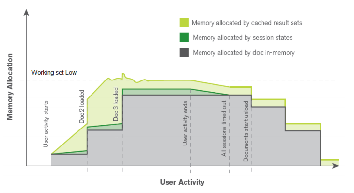

# Cache Warming <i class="fas fa-tools fa-xs" title="Tooling | Pre-Built Solutions"></i>
{: .no_toc }

<span class="label prod">production</span>

|<i class="far fa-clock fa-sm"></i> **Estimated Configuration Time**   | 1 hr |

## Table of Contents
{:.no_toc}

* TOC
{:toc}

## About
Cache Warming in Qlik Sense Enterprise refers to programmatically opening Qlik applications so that the base application is preloaded into RAM before users attempt to open the application. When users open and interact with a Qlik application, there are three types of caching which occur. This can be visualized using this example:

[](https://raw.githubusercontent.com/qs-admin-guide/qs-admin-playbook/master/docs/tooling/images/cache_warming-1.png)

(taken from [Qlik Engine Technical Brief](https://www.qlik.com/us/-/media/files/resource-library/global-us/direct/datasheets/ds-technical-brief-qlik-associative-engine-memory-management-cpu-en.pdf))

In this example, the types are symbolized by colors:

- Grey : Base App RAM cache
- Dark Green : User session cache
- Light Green : Cached result set cache

The **Base App** cache is the result of the Qlik Engine opening the Qlik app from disk and uncompressing it into RAM. This process is what is occurring when a user first opens an app (or if the app opens on a new engine) and must wait for the app to render. The **user session** cache is the meta-data of a user's session with a given app. This includes things like the current selections and all previous selections. This cache is generally quite low in terms of a percentage since it's pure metadata; think metadata like `country=canada` rather than any resulting calculations from that selection. The **Cached result set** cache is the cache of the _calculations_ which resulted from all user's selections. This would be something like `Sum(Sales)` or `Count(DISTINCT ProductId)` when the user had `country=canada` selected.

For many deployments of Qlik Sense Enterprise, an administrator may want to reduce the time spent waiting for an app to *initially* load. To achieve this, a cache warming process needs to be run.

### Frequency of cache warming

The Qlik Engine is configured to retain the **Base App** RAM for a period of time. By default this time period is 28,800 seconds (or 8 hours) but can be configured in the QMC > Engines > Edit > Apps > `App cache time (seconds)`:

[](https://raw.githubusercontent.com/qs-admin-guide/qs-admin-playbook/master/docs/tooling/images/cache_warming-2.png)

This means that the administrator needs to plan to execute a cache warming frequency that is aware of this configuration. Practically the two options are:

1. Execute a cache warming process _before_ the first users are expected to access the application
2. Execute a cache warming process at an interval which smaller than the `App cache time (seconds)` configuration

While these two options can be combined, the straight-forward guidance is that option (1) is ideal for deployments which are have regional user access (e.g. standard US or Europe timezones only) and/or have computationally expensive batch reloads running during off-hours which would conflict with the cache warming process. Option (2) is ideal for deployments which are expected to serve users across multiple time zones.

## Options

In order to cache warm a Qlik app, the administrator needs to run a process which can programmatically open a Qlik app and optionally make selections. The options covered in this guide which can achieve this result are:


| Tool                           | Technical Approach | Complexity  | Flexibility  |
| -------------                  | -------------      | -----       | -----        |
| `CacheInitializer`             | .NET SDK           | Low         | Medium/High  |
| `Butler-Cache Warming`         | JavaScript         | Low/Medium  | Medium       |
| `Qlik Sense Scalability Tools` | .NET SDK           | Medium      | High         |

### CacheInitializer <i class="fas fa-tools fa-xs" title="Tooling | Pre-Built Solutions"></i>

The [`CacheInitializer`](https://github.com/jparis/CacheInitializer) is a project initially developed by a Product Manager at Qlik, but has since been taken on by the America's Presales Enterprise Architecture team. It is a project built in C# using the .NET SDK to:

1. open apps
2. (optionally) pre-cache the visualizations on the app's sheets
3. (optionally) pass selections

It is a very lightweight tool which is ideal for an initial introduction to cache warming or for smaller environments where the limitations of this tool are not problematic.

#### Usage

To use the `CacheInitializer` tool, the administrator will download the tool from the project's [releases page](https://github.com/eapowertools/CacheInitializer/releases) (or optionally download the source files and compile themselves in Visual Studio). The release will include the primary executable and supporting files for the tool's execution. Available parameters are:

```
  -s, --server     Required. URL to the server.
  -a, --appname    App to load (using app name)
  -i, --appid      App to load (using app ID)
  -p, --proxy      Virtual Proxy to use
  -o, --objects    (Default: False) cycle through all sheets and objects
  -f, --field      field to make selections in e.g Region
  -v, --values     values to select e.g  "France","Germany","Spain"
  --help           Display this help screen.
```
{:.snippet}

The required parameters are `server` and `app` (specified by Name or ID). The optional parameters allow the administrator to specify a virtual proxy (`-p` or `--proxy`) if Windows authentication is not the prefixless virtual proxy, open up the objects on each sheet in the app (`-o` or `--objects`), pass through selections (`-v` or `--values`) on given fields (`-f` or `--field`).

The tool will use _Windows_ authentication to open the app as the user who is executing the process. This means that if this tool is used, the administrator should execute it in the context of a dedicated user who both has a license assigned to them and the required permissions to open the app using security rules (and section access if used).

- **Note**: While the parameters have both short and long forms, this guide will use the long forms for consumability purposes.
- **Note**: This guide will use `--appname` for consumability purposes. It is recommended to use `--appid` to ensure precision of the app being opened.

The simplest scenario involves opening a Qlik app on a specified server so that the **Base App** cache is built:
`CacheInitializer.exe --server https://qliksense.company.com --appname "Operations Monitor"`
the tool will then provide the resulting style of output:

```
02:27:54 - Operations Monitor: Opening app
02:27:55 - Operations Monitor: App open
02:27:55 - Operations Monitor: App cache completed
02:27:55 - Cache initialization complete. Total time: 00:00:07.3192225
```
{:.snippet}

A more complex scenario involves opening a Qlik app on a specified server and opening all visualizations within the Qlik App. This will build out the **Base App** cache as well as seed the **Cached result sets** cache. Example:

`CacheInitializer.exe --server https://qliksense.company.com --appname "Operations Monitor" --objects`
the tool will then provide the resulting style of output:

```
02:30:49 - Operations Monitor: Opening app
02:30:50 - Operations Monitor: App open
02:30:50 - Operations Monitor: Clearing Selections
02:30:50 - Operations Monitor: Getting sheets
02:30:50 - Operations Monitor: Number of sheets - 17, getting children
02:30:50 - Operations Monitor: Number of objects - 144, caching all objects
02:30:51 - Operations Monitor: Objects cached
02:30:51 - Operations Monitor: App cache completed
02:30:51 - Cache initialization complete. Total time: 00:00:06.5812126
```
{:.snippet}

The next example will combine the previous example along with specifying a specific virtual proxy (named `windows`) and passing selections for the **Cached result sets** cache. Example:

`CacheInitializer.exe --server https://qliksense.company.com --proxy windows --appname "Operations Monitor" --objects --field "App Name" --values "Operations Monitor","License Monitor"`
the tool will then provide the resulting style of output:

```
02:33:55 - Operations Monitor: Opening app
02:33:56 - Operations Monitor: App open
02:33:56 - Operations Monitor: Clearing Selections
02:33:56 - Operations Monitor: Applying Selection: App Name = Operations Monitor
02:33:56 - Operations Monitor: Getting sheets
02:33:56 - Operations Monitor: Number of sheets - 17, getting children
02:33:56 - Operations Monitor: Number of objects - 144, caching all objects
02:33:57 - Operations Monitor: Objects cached
02:33:57 - Operations Monitor: Clearing Selections
02:33:57 - Operations Monitor: Applying Selection: App Name = License Monitor
02:33:57 - Operations Monitor: Getting sheets
02:33:57 - Operations Monitor: Number of sheets - 17, getting children
02:33:57 - Operations Monitor: Number of objects - 144, caching all objects
02:33:57 - Operations Monitor: Objects cached
02:33:57 - Operations Monitor: App cache completed
02:33:57 - Cache initialization complete. Total time: 00:00:09.1996060
```
{:.snippet}

In this last example, a specific application is opened across multiple Qlik Engine nodes (using dedicated virtual proxies for each Engine) both with no selections and with defined selections:

```powershell
# Function for logging
function Get-TimeStamp {
    return "[{0:MM/dd/yyyy} {0:HH:mm:ss}]" -f (Get-Date)
}

<#
Add Logging
#>
Set-Location $PSScriptRoot
$logdir = $PSScriptRoot + '\logs'
$logfile = $logdir + "\" + "CacheInitializer-Deploy-" + (Get-Date -Format yyyyMMdd) + ".log"
if (!(Test-Path $logdir)){
    New-Item -path $logdir -type directory | Out-Null
}

# Set the working directory
Set-Location "C:\temp\CacheInitializer"
# Set the name of the Qlik Sense server whose Qlik Proxy Service is hosting the virtual proxies
$server = 'https://qliksense.company.com'

<# CacheInitializer Options:
  -s, --server     Required. URL to the server.
  -a, --appname    App to load (using app name)
  -i, --appid      App to load (using app ID)
  -p, --proxy      Virtual Proxy to use
  -o, --objects    (Default: False) cycle through all sheets and objects
  -f, --field      field to make selections in e.g Region
  -v, --values     values to select e.g  "France","Germany","Spain"
  --help           Display this help screen.
#>

# Define the virtual proxy prefixes
$vps = @(
    "02windows"
    , "03windows"
    , "04windows"
)

# Define the app
$appid = '40c69bba-1825-4109-985c-399af8e96e63'

Write-Output "$(Get-TimeStamp): Begin Cache Warm for $($appid)" | Out-File -FilePath $logfile -Append
# Loop over each virtual proxy and execute the CacheInitializer

foreach ($vp in $vps) {
    Write-Output "$(Get-TimeStamp): Connecting to $($server) on $($vp)" | Out-File -FilePath $logfile -Append
    $results = ''
    $results = .\CacheInitializer.exe --server $($server) --proxy $vp --appid $appid --objects
    if ($results.count -gt 1) {
        Write-Output "Successfully cached $($appid) on $($vp)" | Out-File -FilePath $logfile -Append
        $results | Out-File -FilePath $logfile -Append
    } else {
        Write-Output "Cache Failure on $($vp) for $($appid) on $($vp)" | Out-File -FilePath $logfile -Append
    }
    # Example of passing selection states for a given field and accompanying value(s)
    Write-Output "$(Get-TimeStamp): Connecting to $($server) on $($vp)" | Out-File -FilePath $logfile -Append
    $results = ''
    $results = .\CacheInitializer.exe --server $($server) --proxy $vp --appid $appid --objects --field "Country" --values "United States","Germany"
    if ($results.count -gt 1) {
        Write-Output "Successfully cached $($appid) on $($vp) with selections" | Out-File -FilePath $logfile -Append
        $results | Out-File -FilePath $logfile -Append
    } else {
        Write-Output "Cache Failure on $($vp) for $($appid) on $($vp) with selections" | Out-File -FilePath $logfile -Append
    }
}

```
{:.snippet}

Resulting log file:

**cacheinitializer_deploy.log**
<details>
  
```log
[03/07/2020 14:51:20]: Begin Cache Warm for 40c69bba-1825-4109-985c-399af8e96e63
[03/07/2020 14:51:20]: Connecting to https://qliksense.company.com on 02windows
Successfully cached 40c69bba-1825-4109-985c-399af8e96e63 on 02windows
02:51:23 - Scalability Sample - PT Sales Analytics-50M: Opening app
02:51:24 - Scalability Sample - PT Sales Analytics-50M: App open
02:51:24 - Scalability Sample - PT Sales Analytics-50M: Clearing Selections
02:51:24 - Scalability Sample - PT Sales Analytics-50M: Getting sheets
02:51:24 - Scalability Sample - PT Sales Analytics-50M: Number of sheets - 4, getting children
02:51:25 - Scalability Sample - PT Sales Analytics-50M: Number of objects - 28, caching all objects
02:51:25 - Scalability Sample - PT Sales Analytics-50M: Objects cached
02:51:25 - Scalability Sample - PT Sales Analytics-50M: App cache completed
02:51:25 - Cache initialization complete. Total time: 00:00:04.6379880
[03/07/2020 14:51:25]: Connecting to https://qliksense.company.com on 02windows
Successfully cached 40c69bba-1825-4109-985c-399af8e96e63 on 02windows with selections
02:51:28 - Scalability Sample - PT Sales Analytics-50M: Opening app
02:51:29 - Scalability Sample - PT Sales Analytics-50M: App open
02:51:29 - Scalability Sample - PT Sales Analytics-50M: Clearing Selections
02:51:29 - Scalability Sample - PT Sales Analytics-50M: Applying Selection: Country = United States
02:51:29 - Scalability Sample - PT Sales Analytics-50M: Getting sheets
02:51:29 - Scalability Sample - PT Sales Analytics-50M: Number of sheets - 4, getting children
02:51:30 - Scalability Sample - PT Sales Analytics-50M: Number of objects - 28, caching all objects
02:51:30 - Scalability Sample - PT Sales Analytics-50M: Objects cached
02:51:30 - Scalability Sample - PT Sales Analytics-50M: Clearing Selections
02:51:30 - Scalability Sample - PT Sales Analytics-50M: Applying Selection: Country = Germany
02:51:30 - Scalability Sample - PT Sales Analytics-50M: Getting sheets
02:51:30 - Scalability Sample - PT Sales Analytics-50M: Number of sheets - 4, getting children
02:51:30 - Scalability Sample - PT Sales Analytics-50M: Number of objects - 28, caching all objects
02:51:30 - Scalability Sample - PT Sales Analytics-50M: Objects cached
02:51:30 - Scalability Sample - PT Sales Analytics-50M: App cache completed
02:51:30 - Cache initialization complete. Total time: 00:00:04.9299998
[03/07/2020 14:51:30]: Connecting to https://qliksense.company.com on 03windows
Successfully cached 40c69bba-1825-4109-985c-399af8e96e63 on 03windows
02:51:34 - Scalability Sample - PT Sales Analytics-50M: Opening app
02:51:34 - Scalability Sample - PT Sales Analytics-50M: App open
02:51:34 - Scalability Sample - PT Sales Analytics-50M: Clearing Selections
02:51:34 - Scalability Sample - PT Sales Analytics-50M: Getting sheets
02:51:35 - Scalability Sample - PT Sales Analytics-50M: Number of sheets - 4, getting children
02:51:35 - Scalability Sample - PT Sales Analytics-50M: Number of objects - 28, caching all objects
02:51:35 - Scalability Sample - PT Sales Analytics-50M: Objects cached
02:51:35 - Scalability Sample - PT Sales Analytics-50M: App cache completed
02:51:35 - Cache initialization complete. Total time: 00:00:04.5729952
[03/07/2020 14:51:35]: Connecting to https://qliksense.company.com on 03windows
Successfully cached 40c69bba-1825-4109-985c-399af8e96e63 on 03windows with selections
02:51:39 - Scalability Sample - PT Sales Analytics-50M: Opening app
02:51:39 - Scalability Sample - PT Sales Analytics-50M: App open
02:51:39 - Scalability Sample - PT Sales Analytics-50M: Clearing Selections
02:51:39 - Scalability Sample - PT Sales Analytics-50M: Applying Selection: Country = United States
02:51:40 - Scalability Sample - PT Sales Analytics-50M: Getting sheets
02:51:40 - Scalability Sample - PT Sales Analytics-50M: Number of sheets - 4, getting children
02:51:40 - Scalability Sample - PT Sales Analytics-50M: Number of objects - 28, caching all objects
02:51:41 - Scalability Sample - PT Sales Analytics-50M: Objects cached
02:51:41 - Scalability Sample - PT Sales Analytics-50M: Clearing Selections
02:51:41 - Scalability Sample - PT Sales Analytics-50M: Applying Selection: Country = Germany
02:51:41 - Scalability Sample - PT Sales Analytics-50M: Getting sheets
02:51:41 - Scalability Sample - PT Sales Analytics-50M: Number of sheets - 4, getting children
02:51:41 - Scalability Sample - PT Sales Analytics-50M: Number of objects - 28, caching all objects
02:51:41 - Scalability Sample - PT Sales Analytics-50M: Objects cached
02:51:41 - Scalability Sample - PT Sales Analytics-50M: App cache completed
02:51:41 - Cache initialization complete. Total time: 00:00:05.3330192
[03/07/2020 14:51:41]: Connecting to https://qliksense.company.com on 04windows
Successfully cached 40c69bba-1825-4109-985c-399af8e96e63 on 04windows
02:51:44 - Scalability Sample - PT Sales Analytics-50M: Opening app
02:51:45 - Scalability Sample - PT Sales Analytics-50M: App open
02:51:45 - Scalability Sample - PT Sales Analytics-50M: Clearing Selections
02:51:45 - Scalability Sample - PT Sales Analytics-50M: Getting sheets
02:51:46 - Scalability Sample - PT Sales Analytics-50M: Number of sheets - 4, getting children
02:51:46 - Scalability Sample - PT Sales Analytics-50M: Number of objects - 28, caching all objects
02:51:46 - Scalability Sample - PT Sales Analytics-50M: Objects cached
02:51:46 - Scalability Sample - PT Sales Analytics-50M: App cache completed
02:51:46 - Cache initialization complete. Total time: 00:00:04.7609894
[03/07/2020 14:51:46]: Connecting to https://qliksense.company.com on 04windows
Successfully cached 40c69bba-1825-4109-985c-399af8e96e63 on 04windows with selections
02:51:50 - Scalability Sample - PT Sales Analytics-50M: Opening app
02:51:50 - Scalability Sample - PT Sales Analytics-50M: App open
02:51:50 - Scalability Sample - PT Sales Analytics-50M: Clearing Selections
02:51:50 - Scalability Sample - PT Sales Analytics-50M: Applying Selection: Country = United States
02:51:50 - Scalability Sample - PT Sales Analytics-50M: Getting sheets
02:51:51 - Scalability Sample - PT Sales Analytics-50M: Number of sheets - 4, getting children
02:51:51 - Scalability Sample - PT Sales Analytics-50M: Number of objects - 28, caching all objects
02:51:51 - Scalability Sample - PT Sales Analytics-50M: Objects cached
02:51:51 - Scalability Sample - PT Sales Analytics-50M: Clearing Selections
02:51:51 - Scalability Sample - PT Sales Analytics-50M: Applying Selection: Country = Germany
02:51:51 - Scalability Sample - PT Sales Analytics-50M: Getting sheets
02:51:52 - Scalability Sample - PT Sales Analytics-50M: Number of sheets - 4, getting children
02:51:52 - Scalability Sample - PT Sales Analytics-50M: Number of objects - 28, caching all objects
02:51:52 - Scalability Sample - PT Sales Analytics-50M: Objects cached
02:51:52 - Scalability Sample - PT Sales Analytics-50M: App cache completed
02:51:52 - Cache initialization complete. Total time: 00:00:05.0779960
```
{:.snippet}

</details>

#### Limitations

- Concurrency : Since this tool opens applications over the Qlik Proxy Service, the user who executes the process will be limited to 5 executions in a 5 minute period. This is due to a [throttle on the number of parallel sessions](https://help.qlik.com/en-US/sense-admin/Subsystems/DeployAdministerQSE/Content/Sense_DeployAdminister/QSEoW/Administer_QSEoW/Managing_QSEoW/manage-licenses.htm) which a license can use. For most cache warming scenarios, this isn't a major issue, although this limitation may be encountered when doing initial testing of the process.
- Multinode : If an administrator needs to open a given app across multiple Qlik Engine nodes, then they will need to have separate virtual proxies using Windows Authentication which are each attached to a single Qlik Engine. This ensures that the application will be opened across each Qlik Engine node. Building off the **Concurrency** limitation above, this means that the `CacheInitializer` tool will only be able to cache warm a given app across 5 separate Qlik Engine nodes during a 5 minute period. If attempting to build a cache warming process for multiple apps across multiple engines, then this 5 distinct session limitation needs to be accounted for.

### Butler-Cache Warming <i class="fas fa-tools fa-xs" title="Tooling | Pre-Built Solutions"></i>

An alternative project using NodeJS to interact with Qlik's Engine API(s) is [`Butler-Cache Warming`](https://github.com/ptarmiganlabs/butler-cw) which was developed by Göran Sander. Göran is a consultant and Qlik Luminary who previously has worked with a very large Qlik customer to help deploy Qlik at scale. The tool provides the ability to:

1. open apps
2. cycle through sheets to build out the **Cached result sets** cache
3. define a schedule to open applications

The tool communicates with the Qlik Engine over the Qlik Engine API port (4747) and uses an internal Qlik account (`sa_repository`) to open applications programmatically. Due to this, the administrator will not need to account for license assignment nor for security rule permissions. A license is not needed to access an app using `sa_repository` (or any internal account) since no interactive user can use these accounts. Likewise, the default security rule **ServiceAccount** ensures that the internal accounts have the requisite authorization to access any Qlik app. If section access is used, then modification of the section access table to include `INTERNAL\sa_repository` will be required with the default configuration present in `Butler-Cache Warming`.

#### Usage

Since configuration of this tool is covered on the tool's [GitHub](https://github.com/ptarmiganlabs/butler-cw#configuration-files) page, this guide will only review the high level configuration needed.

- Open up a command prompt: `set NODE_ENV=production`
- Edit `butler-cw-master\config\apps.yaml`
  - Enter an appropriate server or servers
  - Enter an appropriate app GUID(s)
  - Enter an appropriate schedule (every X units, e.g. every 5 minutes, every 1 hour)
- Edit `butler-cw-master\config\production.yaml`
  - Set an appropriate logDirectory
- If running on one of the members of the Qlik Sense cluster, then proceed to execution
  - If not, grab the `client.pem` and `client_key.pem` from `C:\ProgramData\Qlik\Sense\Repository\Exported Certificates\.Local Certificates` on one of the members
    - NodeJS needs to be installed on the server
  - Adjust the `clientCertPath` & `clientCertKeyPath` paths in `production.yaml` to the path where those certificates live
- Execute in a command prompt:
  - If on one of the members of the Qlik Sense Cluster, this works:
    - `cd C:\temp\butler-cw-master`
      - Where this is the path of the project
    - `C:\Program Files\Qlik\Sense\ServiceDispatcher\Node\"node.exe index.js`
  - If on another server:
    - `cd C:\temp\butler-cw-master`
      - Where this is the path of the project
    - `node index.js`

An example yaml file is:

```yaml
apps:
  - server: qlikserver02
    appId: 4ebe6de0-ab6e-4c35-b6dd-70cc1c27ebe0
    appDescription: Cache warm big app on Node02
    appStepThroughSheets: true
    freq: every 5 hours
  - server: qlikserver03
    appId: 4ebe6de0-ab6e-4c35-b6dd-70cc1c27ebe0
    appDescription: Cache warm big app on Node03
    appStepThroughSheets: true
    freq: every 5 hours
  - server: qlikserver04
    appId: 4ebe6de0-ab6e-4c35-b6dd-70cc1c27ebe0
    appDescription: Cache warm big app on Node04
    appStepThroughSheets: true
    freq: every 5 hours
  - server: qlikserver02
    appId: bb5b386b-9bf5-4aaf-b946-3cceb7eb409d
    appDescription: Cache warm app with section access on Node02
    appStepThroughSheets: true
    freq: every 5 minutes
  - server: qlikserver03
    appId: bb5b386b-9bf5-4aaf-b946-3cceb7eb409d
    appDescription: Cache warm app with section access on Node03
    appStepThroughSheets: true
    freq: every 5 minutes
  - server: qlikserver04
    appId: bb5b386b-9bf5-4aaf-b946-3cceb7eb409d
    appDescription: Cache warm app with section access on Node04
    appStepThroughSheets: true
    freq: every 5 minutes
```
{:.snippet}

And the resulting example output is:

```
C:\temp\butler-cw-master>"C:\Program Files\Qlik\Sense\ServiceDispatcher\Node\"node.exe index.js
2020-02-24T00:27:14.205Z info: Starting Qlik Sense cache warmer.
2020-02-24T00:27:15.601Z info: App loaded: bb5b386b-9bf5-4aaf-b946-3cceb7eb409d
2020-02-24T00:27:15.631Z info: App bb5b386b-9bf5-4aaf-b946-3cceb7eb409d: Cached 1 visualizations on 1 sheets.
2020-02-24T00:27:15.700Z info: App loaded: 4ebe6de0-ab6e-4c35-b6dd-70cc1c27ebe0
2020-02-24T00:27:15.756Z info: App loaded: bb5b386b-9bf5-4aaf-b946-3cceb7eb409d
2020-02-24T00:27:15.772Z info: App bb5b386b-9bf5-4aaf-b946-3cceb7eb409d: Cached 1 visualizations on 1 sheets.
2020-02-24T00:27:16.015Z info: App 4ebe6de0-ab6e-4c35-b6dd-70cc1c27ebe0: Cached 3 visualizations on 1 sheets.
2020-02-24T00:27:16.036Z info: App loaded: 4ebe6de0-ab6e-4c35-b6dd-70cc1c27ebe0
2020-02-24T00:27:16.179Z info: App loaded: bb5b386b-9bf5-4aaf-b946-3cceb7eb409d
2020-02-24T00:27:16.195Z info: App bb5b386b-9bf5-4aaf-b946-3cceb7eb409d: Cached 1 visualizations on 1 sheets.
2020-02-24T00:27:16.393Z info: App 4ebe6de0-ab6e-4c35-b6dd-70cc1c27ebe0: Cached 3 visualizations on 1 sheets.
2020-02-24T00:29:21.126Z info: App loaded: 4ebe6de0-ab6e-4c35-b6dd-70cc1c27ebe0
2020-02-24T00:30:00.160Z info: App loaded: 4ebe6de0-ab6e-4c35-b6dd-70cc1c27ebe0
2020-02-24T00:30:00.385Z info: App loaded: bb5b386b-9bf5-4aaf-b946-3cceb7eb409d
2020-02-24T00:30:00.408Z info: App bb5b386b-9bf5-4aaf-b946-3cceb7eb409d: Cached 1 visualizations on 1 sheets.
```
{:.snippet}

#### Limitations

- Connectivity : Since this tool communicates with the Qlik Engine Services directly, the Qlik Engine API port `4747` will need to be open between the server executing `Butler-CW` and the Qlik Sense node(s). The primary benefit of this approach is that the session limitation present for `CacheInitializer` and `Qlik Sense Scalability Tools` will not affect `Butler-CW`.
- Selections : This tool does not have the ability to pass selection states to the Qlik app. This means that the **Cached result set** cache will not be warmed with selections.

### Qlik Sense Scalability Tools <i class="fas fa-tools fa-xs" title="Tooling | Pre-Built Solutions"></i>

The last project that will be reviewied is the [`Qlik Sense Scalability Tools`](https://community.qlik.com/t5/Qlik-Scalability/Qlik-Sense-Scalability-Tools/gpm-p/1490846). This is a project created by Qlik's Performance and Scalability team within R&D. It is an open source release of one of the key pieces of tooling that Qlik's R&D team uses to test scalability and performance of Qlik Sense Enterprise. It is a compiled project using the .NET SDK to:

1. open apps
2. (optionally) pre-cache the visualizations on the app's sheets
3. (optionally) pass selections

While the Scalability Tools package is _primarily_ used for scale testing Qlik applications, it does allow for command line execution, which means that it can be used for cache warming activities. When using this approach, the administrator needs to ensure that the user/users being simulated both has/have a license assigned to them and the required permissions to open the app using security rules (and section access if used).

#### Usage

After downloading the package, the administrator will configure initial connectivity ([Youtube video on initial setup](https://www.youtube.com/watch?v=8H0JJYyUft8)) and build a scenario ([Youtube video on building a test](https://www.youtube.com/watch?v=GiSF1yV9D9g)) which describes the actions that the simulated user will perform in the app. In the scenario, you can optionally pass one to many selection values in the context of the entire application or on a per-sheet basis.

Once the scenario is built and initial success is found using the process, the administrator can execute the scenario via command line like so:

`C:\scalabilitytools\SDKExerciser\Sep2018\SDKExerciserConsole.exe config="C:\scalabilitytools\Scenario\app1-cachewarm.json" configname="1-app1-cachewarm" server=qliksenseserver02 app="325c3daa-1aeb-434c-9c1d-c7ce14ee201a" ssl=True headername=X-Qlik-User virtualproxyprefix=header iterations=1 usernameprefix=CacheWarmUser concurrentusers=1 rampupdelay=2.00 executiontime=3600 instancenumber=1 appmode=Open newuserforeachiteration=True afteriterationwait=NoWait afteriterationwaittime=0 logDir="C:\scalabilitytools\Results\cachewarm"`

This execution defines the scenario to run (`config`), the Qlik Proxy to connect to (`server`), the header based virtual proxy to authenticate against (`virtualproxyprefix` + it's corresponding `headername`), the app to open (`app`), and the user's prefix (`usernameprefix`).

#### Limitations

- Concurrency : Since this tool opens applications over the Qlik Proxy Service, the user who executes the process will be limited to 5 executions in a 5 minute period. This is due to a [throttle on the number of parallel sessions](https://help.qlik.com/en-US/sense-admin/Subsystems/DeployAdministerQSE/Content/Sense_DeployAdminister/QSEoW/Administer_QSEoW/Managing_QSEoW/manage-licenses.htm) which a license can use. For most cache warming scenarios, this isn't a major issue, although this limitation may be encountered when doing initial testing of the process.
- Multinode : If an administrator needs to open a given app across multiple Qlik Engine nodes, then they will need to have separate virtual proxies using Header Authentication which are each attached to a single Qlik Engine. This ensures that the application will be opened across each Qlik Engine node. Building off the **Concurrency** limitation above, this means that the `Qlik Sense Scalability Tool`  will only be able to cache warm a given app across 5 separate Qlik Engine nodes during a 5 minute period _for each scenario_. If attempting to build a cache warming process for multiple apps across multiple engines, then the administrator can alter the `usernameprefix` parameter to emulate different users to avoid the **Concurrency** limitation above, at the cost of additional license consumption.
- Authentication : Since this tool uses Header authentication to emulate users, it is recommended to only attach the header virtual proxy(ies) to back-end nodes which are not user facing. Header authentication is intrinsically insecure and thus can constitute a security concern for most organizations without separating this authentication to back-end nodes.

**Tags**

#tooling

&nbsp;
