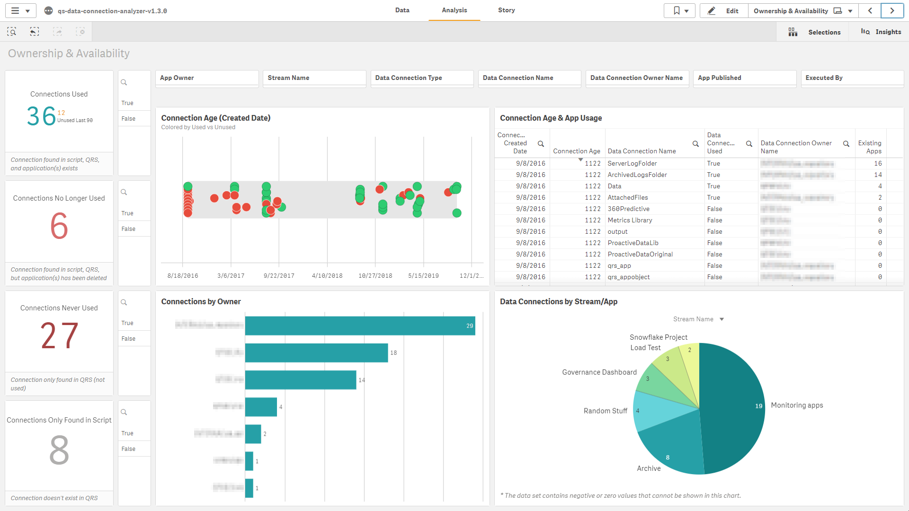
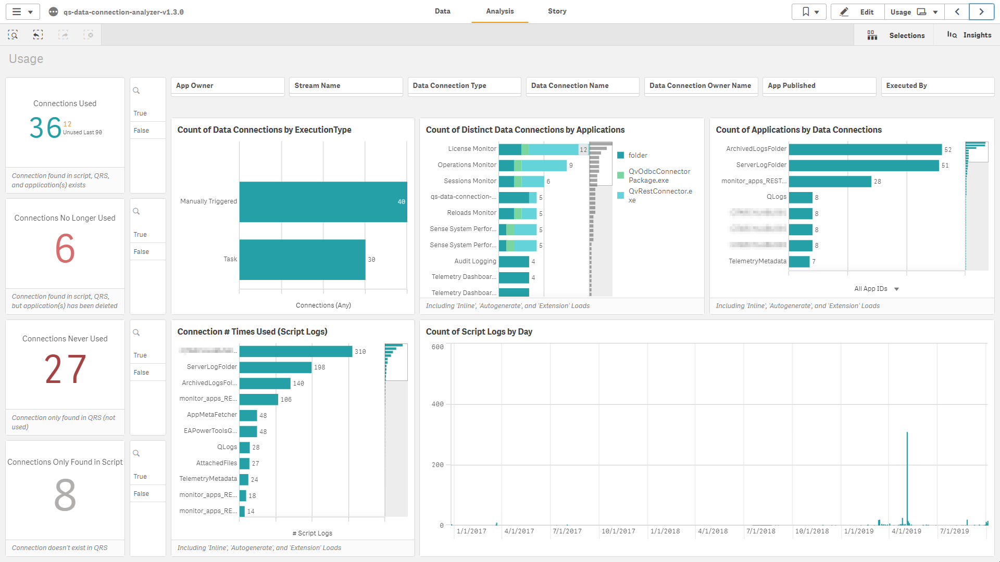
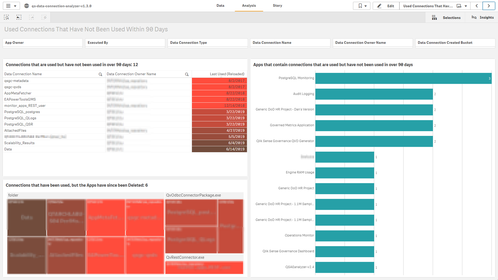
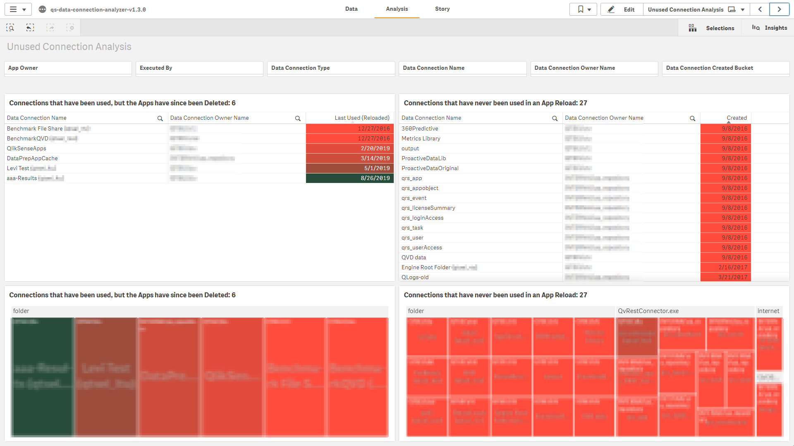
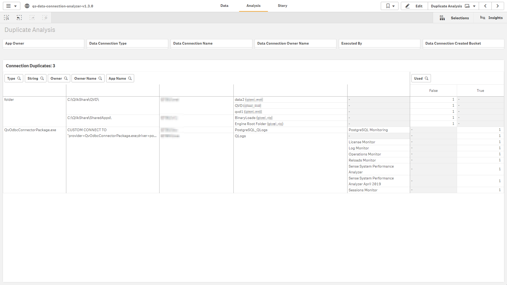

# Data Connection Analyzer <i class="fas fa-tools fa-xs" title="Tooling | Pre-Built Solutions"></i>
{:.no_toc}

developmentproduction

|<i class="far fa-clock fa-sm"></i> **Estimated Configuration Time**   | 15 min  |

## Table of Contents
{:.no_toc}

* TOC
{:toc}

-------------------------

## About

The Qlik Sense Data Connection Analyzer is a Qlik application that parses script log files and queries the QRS API, allowing analysis of data connection usage, patterns, age, and cleanliness across a Qlik Sense site. In short, this app will help to run a leaner, more performant, and more easily and holistically governed Qlik Sense site. 

The application is supported by Qlik's Americas Enterprise Architecture team, and uses only native connections and capabilities of the Qlik platform--making it plug-and-play

-------------------------

## Analysis

For a walkthrough of all how to answer all of the questions in the section below, please refer to [Analyze Data Connections](../asset_management/data_connections/analyze_data_connections.md).

-------------------------

## Common Questions & Associated Benefits of the App

**Which connections are no longer used? (A data connection is found in a script log and exists in the Qlik Sense site, however no associated applications currently exist that at one point had used it).**

- Removing unused connections will increase performance across a site, as less connections will have to be evaluated in security rule evaluations. If a site has hundreds or thousands of connections, this calculation time can build up.
Removing unused connections makes general administration easier, as there is less to manage.

**What connections have never been used? (A data connection exists in the Qlik Sense site, but no reference exists to it in any script log.)**

- It is common that users will create data connections to test connectivity, but then never actually use them. By leveraging this app, one can identify connections that have never been used and have existed for x amount of time (say 90+ days), so that action can be taken to remove them. The benefits from both simpler management and performance are listed in the bullet above.

**What connections have been deleted that used to be used? (A data connection that is found in script logs, but no longer exists in the Qlik Sense site and no app is using it.)**

- By parsing the script logs, one can visualize old data connection names/paths that can help to serve as an audit trail.

**What are the most widely used data connections?**

- Depending on how this application is deployed, whether it be strictly administrative or potentially visible to developers, this metric is important both administratively and socially throughout the organization.

**Do we have duplicate data connections?**

- By analyzing the connection strings, one can tackle duplicate connections to the same source data. This eases administration overhead and will ensure that there is reusability/consistency across the platform.

**Who is using what data connections?**

- While "User A" might own "Data Connection A", "User B" might also have read access to that data connection. This can of course be visualized through the audit capability of the QMC, however this application will physically reveal who is executing any reloads of those data connections, giving greater visibility and allowing a deeper level of auditing and governance.

**Where are data connections being used?**

- Let's say a data source is being transformed and will be moved from one database to another location. The first question one might ask is, "What applications are using that connection, so we can re-route it to the new db and make adjustments to the load scripts?". This historically has not been easy to answer. This application allows one to select that connection and visualize apps that are using it.

**Via what mechanism are data connections being used?**

- The application visualizes what connections are being run as tasks, manually, or in ODAG (or other API) requests. This is crucial in understanding user behavior.

-------------------------

## Screenshots

-------------------------

## Where to get it

The application can be found on GitHub under the EA Powertools repository here: [Data Connection Analyzer](https://github.com/eapowertools/qs-data-connection-analyzer).

-------------------------

## Documentation

Complete documentation can be found here: [Data Connection Analyzer - Documentation](https://github.com/eapowertools/qs-data-connection-analyzer/blob/assets/qs-data-connection-analyzer.pdf).

**Tags**

#tooling

#data_connections

&nbsp;
