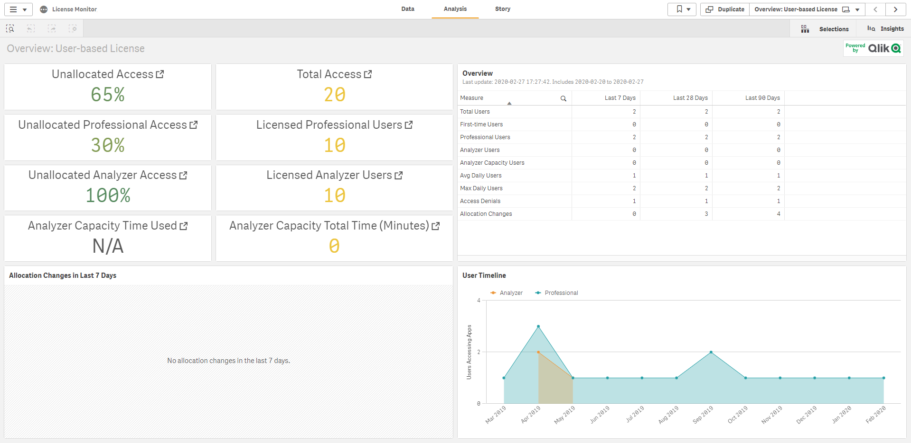
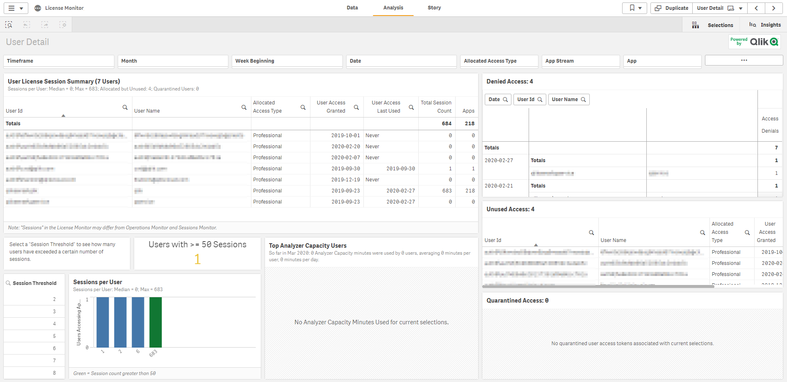
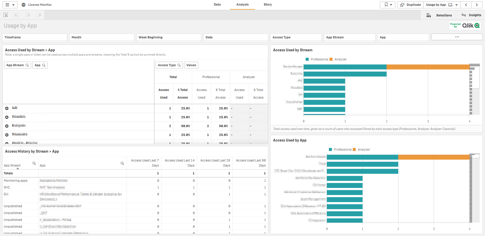
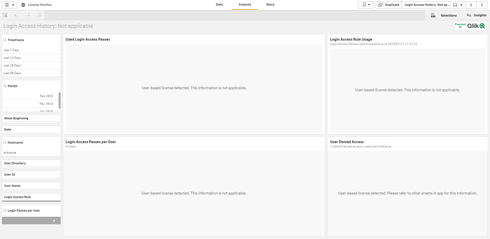
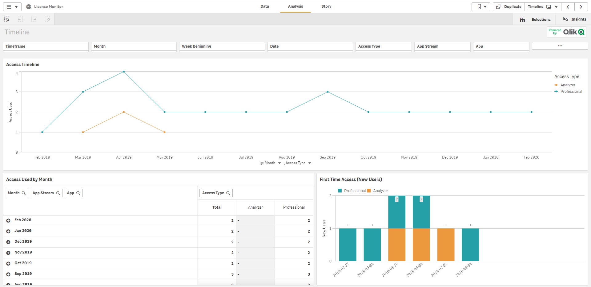
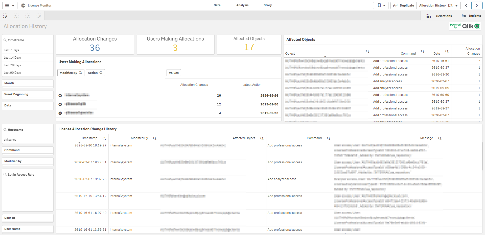
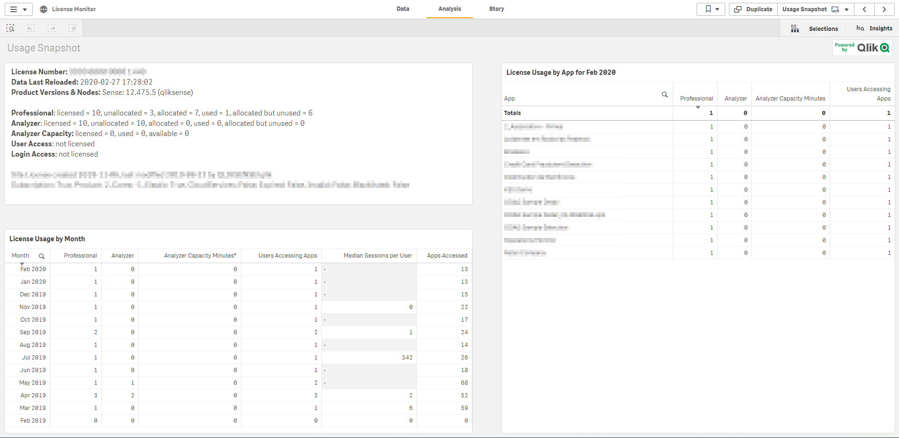
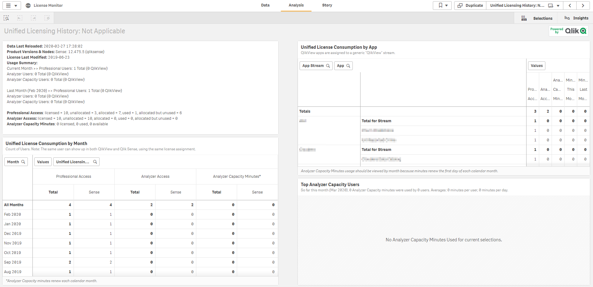
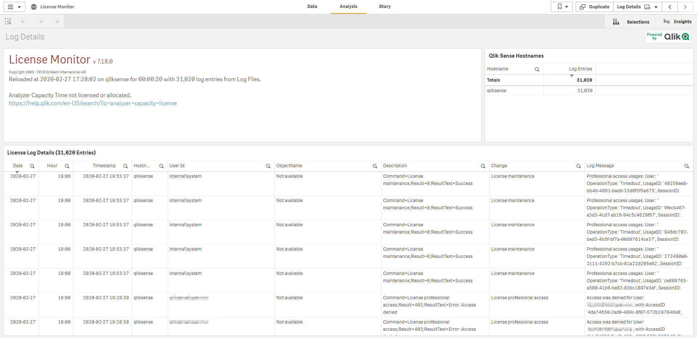

# License Monitor
{:.no_toc}

<span class="label dev">development</span><span class="label prod">production</span>


## Table of Contents
{:.no_toc}

* TOC
{:toc}

-------------------------

## About

The License Monitor it is already embedded in Qlik Sense and can be found at **Monitoring apps** stream.

The License Monitor loads service logs to populate charts and tables covering token allocation, usage of login and user passes, and errors and warnings.

>For a more detailed description of the sheets and visualizations, visit the story About the License Monitor that is available from the app overview page, under Stories.

For the location and naming convention of the log files, see [Logging](https://help.qlik.com/en-US/sense-admin/Subsystems/DeployAdministerQSE/Content/Sense_DeployAdminister/QSEoW/Deploy_QSEoW/Server-Logging.htm).

>If you have a user-based license with professional and analyzer access, you will instead see figures relevant to that license type.

## License Monitor sheets

The License Monitor sheets display Qlik Sense performance on the current node, and, when properly configured for multi-node (as described in [Configuring multi-node environments](https://help.qlik.com/en-US/sense-admin/Subsystems/DeployAdministerQSE/Content/Sense_DeployAdminister/QSEoW/Administer_QSEoW/Monitoring_QSEoW/Configure-monitoring-apps.htm#Configuring)), the app includes information across all nodes.


Sheet | Content
---------|----------
Overview | Displays an overview of unallocated access versus total access, the available and total analyzer capacity (in minutes), summary data about login and user access sessions over the last 7, 28, and 90 days, changes in the allocation of license tokens over the last 7 days, and license usage over time.
User Detail | Allows the user to select a time period over which to display user access pass sessions, the number of users starting sessions, and the individual users starting sessions.
Usage by App | Allows the user to select a time period over which to display the apps for which access passes are being used and the number of tokens consumed by each app.
Timeline | The _Timeline_ sheet displays token usage over time so administrators can monitor usage and anticipate future token allocation needs.
User Access History | Allows the user to select a time period over which to display user access pass sessions, the number of users starting sessions, and the individual users starting sessions. ```Only valid for token-based license.```
Login Access History | Allows the user to select a time period over which to display login pass utilization, login access users, and denials of login access. ```Only valid for token-based license.```
Allocation History | Displays the latest changes and changes over selected times to the allocation of license tokens to login and user access passes.
Usage Snapshot | Overview sheet providing snapshot view of license allocation and historical usage.
Unified Licensing History | Displays the license usage for Qlik Sense and QlikView side by side. ```To see the QlikView license usage, the new monitor_apps_qlikview_logs data connection must point to the folder containing the QlikView Server logs. You update the data connection in the QMC.```
Log Details | Lists servers in the cluster and provides details about license usage entered in server's logs.

>Data in the License Monitor is updated when the app is reloaded. Data is not live.
 -------------------------

## Screenshots

[](https://raw.githubusercontent.com/qs-admin-guide/qs-admin-playbook/master/docs/tooling/images/qs_license_monitor_01.png)

[](https://raw.githubusercontent.com/qs-admin-guide/qs-admin-playbook/master/docs/tooling/images/qs_license_monitor_02.png)

[](https://raw.githubusercontent.com/qs-admin-guide/qs-admin-playbook/master/docs/tooling/images/qs_license_monitor_03.png)

[](https://raw.githubusercontent.com/qs-admin-guide/qs-admin-playbook/master/docs/tooling/images/qs_license_monitor_04.png)

[](https://raw.githubusercontent.com/qs-admin-guide/qs-admin-playbook/master/docs/tooling/images/qs_license_monitor_05.png)

[](https://raw.githubusercontent.com/qs-admin-guide/qs-admin-playbook/master/docs/tooling/images/qs_license_monitor_06.png)

[](https://raw.githubusercontent.com/qs-admin-guide/qs-admin-playbook/master/docs/tooling/images/qs_license_monitor_07.png)

[](https://raw.githubusercontent.com/qs-admin-guide/qs-admin-playbook/master/docs/tooling/images/qs_license_monitor_08.png)

[](https://raw.githubusercontent.com/qs-admin-guide/qs-admin-playbook/master/docs/tooling/images/qs_license_monitor_09.png)

-------------------------

## Documentation

* [License Monitor - Qlik Help](https://help.qlik.com/en-US/sense-admin/Subsystems/DeployAdministerQSE/Content/Sense_DeployAdminister/QSEoW/Administer_QSEoW/Monitoring_QSEoW/License-monitor-app.htm)
* [Youtube Video - STT - Configuring Monitoring Apps in Qlik Sense](https://youtube.com/watch?v=_WywE9AXnvs)
* [Youtube Video - Configuring Qlik Sense Enterprise Monitoring Apps for Multi Node](https://youtube.com/watch?v=ycGESqJME3E)
* [Youtube Video - Qlik Fix: Troubleshooting Qlik Sense Monitoring Apps](https://youtube.com/watch?v=ulZw6_ZJ_ek&t=23s)

**Tags**

#tooling

&nbsp;