# Operations Monitor
{:.no_toc}

developmentproduction

## Table of Contents
{:.no_toc}

* TOC
{:toc}

-------------------------

## About

The Operations Monitor it is already embedded in Qlik Sense and can be found at **Monitoring apps** stream.

The Operations Monitor loads service logs to populate charts covering performance history of hardware utilization, active users, app sessions, results of reload tasks, and errors and warnings. It also tracks changes made in the QMC that affect the Operations Monitor.

> For a more detailed description of the sheets and visualizations, visit the story About the Operations Monitor that is available from the app overview page, under Stories.

For the location and naming convention of the log files, see [Logging](https://help.qlik.com/en-US/sense-admin/Subsystems/DeployAdministerQSE/Content/Sense_DeployAdminister/QSEoW/Deploy_QSEoW/Server-Logging.htm).

With the Operations Monitor, you can track system performance and investigate activity that might adversely affect it. For example, by analyzing reload tasks and sessions, you can find bottlenecks that might be alleviated by rescheduling reloads or redistributing sessions. Or you can use the **QMC Change Log** sheet to review changes that might explain changes in system performance.

-------------------------

## Operations Monitor sheets

The Operations Monitor sheets display Qlik Sense performance on the current node, and, when properly configured for multi-node (as described in [Configuring multi-node environments](https://help.qlik.com/en-US/sense-admin/Subsystems/DeployAdministerQSE/Content/Sense_DeployAdminister/QSEoW/Administer_QSEoW/Monitoring_QSEoW/Configure-monitoring-apps.htm#Configuring)), the app includes information across all nodes.

Sheet       | Content |
------------|----------|
 24-Hour Summary | Displays hardware utilization, active users, active apps, and reload tasks over the last twenty-four hours. |
 Performance | Allows the user to select a time period over which to display hardware utilization, concurrent users, and concurrent apps. |
 Task Overview | Provides a statistical overview of the success, duration, and failure of reload tasks.|
 Task Planning | Provides details about reload count, reload CPU spent, and task dependencies.|
 Task Details | Provides details about the success and failure of individual app reloads, including execution details about duration and start and end times.|
 Session Overview | Provides summary information about apps, app sessions, and app users over selected periods to show which users use which apps when.|
 Session Details | Provides details about individual user and app sessions, including number, average duration, days since last session, start and end times, reasons for ending sessions, and the type of client on which the app was run.|
 Export Overview | Provides summary information about apps, app objects, and app users to show which users export which app objects when. |
 Sheet Usage | Provides summary and detailed information about users accessing sheets – and which sheets in which apps are not accessed.|
 Apps | Provides details about the apps in the Qlik Sense Repository Service (QRS), including name and ID of app objects, owners, publishing, and streams.|
 QMC Change Log | Displays changes made in the QMC that affect a range of factors from system performance to user access, including changes by QMC resource type, by specific QMC resources, by users who made changes, or by a type of action performed in the QMC.|
 Log Details | Provides details about reloads of the Operations Monitor, including the time of reloads, results, error messages and warnings, and log entries.|

>  Data in the Operations Monitor is updated when the app is reloaded. Data is not live.

 -------------------------

## Screenshots

[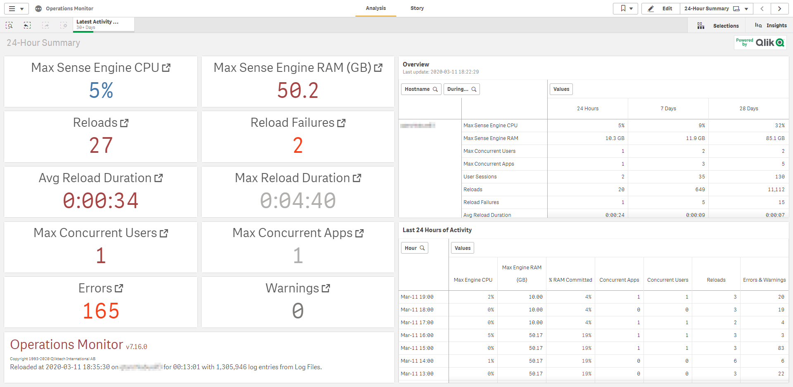](https://raw.githubusercontent.com/qs-admin-guide/qs-admin-playbook/master/docs/tooling/images/qs_ops_monitor_01.png)

[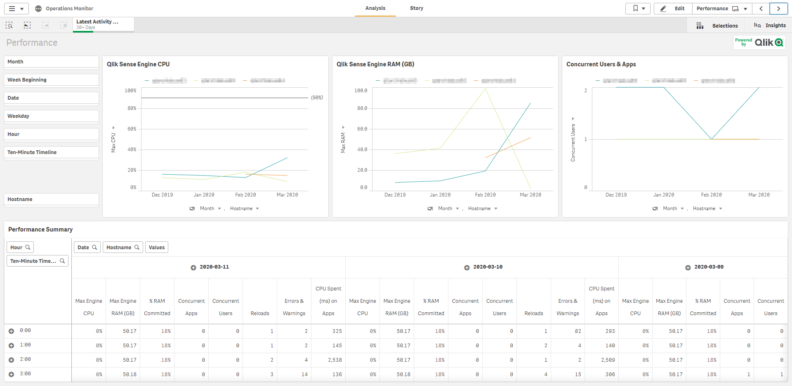](https://raw.githubusercontent.com/qs-admin-guide/qs-admin-playbook/master/docs/tooling/images/qs_ops_monitor_02.png)

[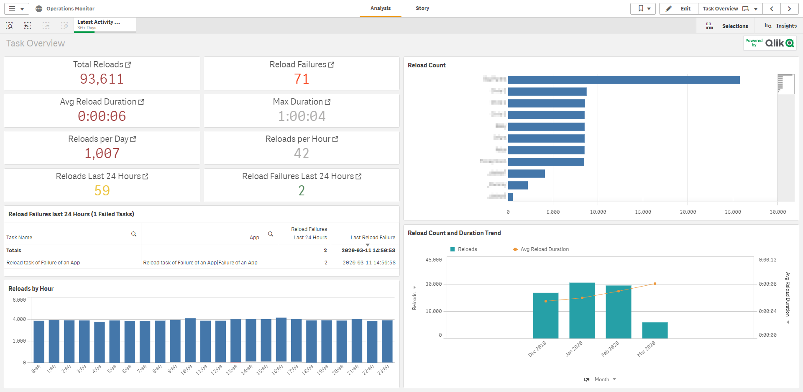](https://raw.githubusercontent.com/qs-admin-guide/qs-admin-playbook/master/docs/tooling/images/qs_ops_monitor_03.png)

[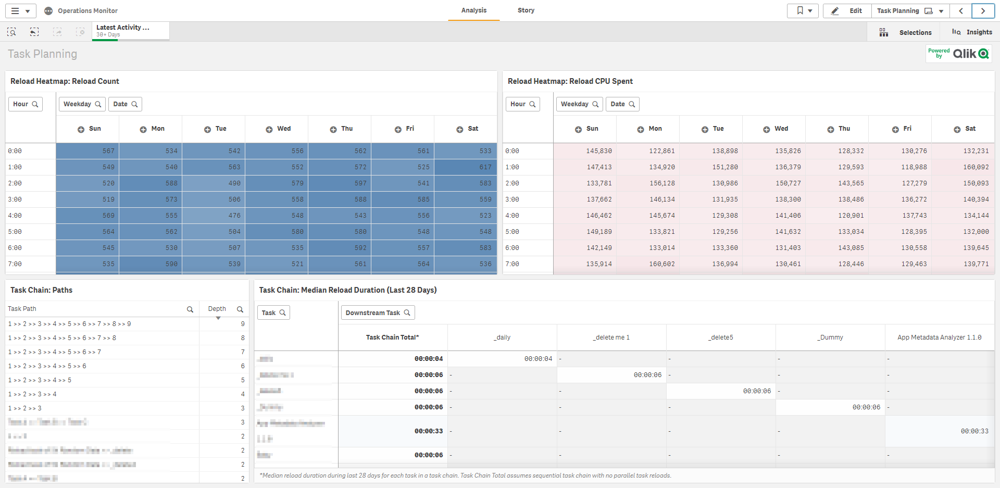](https://raw.githubusercontent.com/qs-admin-guide/qs-admin-playbook/master/docs/tooling/images/qs_ops_monitor_04.png)

[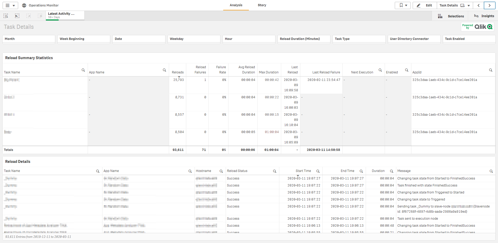](https://raw.githubusercontent.com/qs-admin-guide/qs-admin-playbook/master/docs/tooling/images/qs_ops_monitor_05.png)

[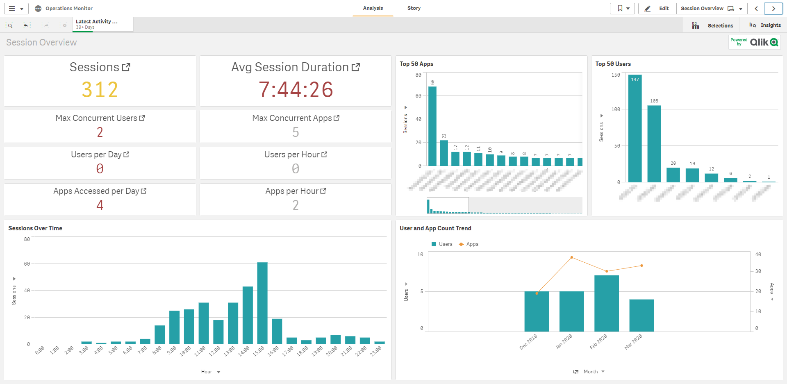](https://raw.githubusercontent.com/qs-admin-guide/qs-admin-playbook/master/docs/tooling/images/qs_ops_monitor_06.png)

[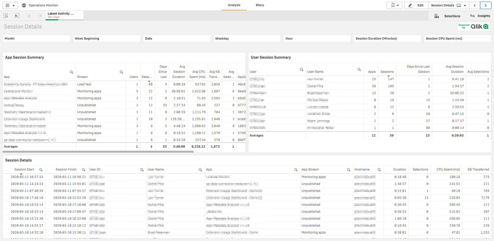](https://raw.githubusercontent.com/qs-admin-guide/qs-admin-playbook/master/docs/tooling/images/qs_ops_monitor_07.png)

[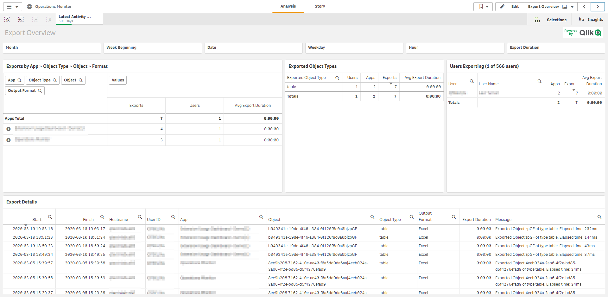](https://raw.githubusercontent.com/qs-admin-guide/qs-admin-playbook/master/docs/tooling/images/qs_ops_monitor_08.png)

[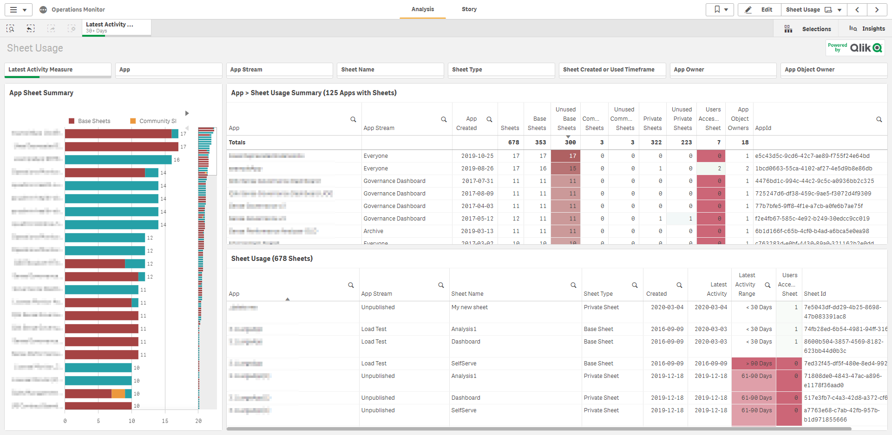](https://raw.githubusercontent.com/qs-admin-guide/qs-admin-playbook/master/docs/tooling/images/qs_ops_monitor_09.png)

[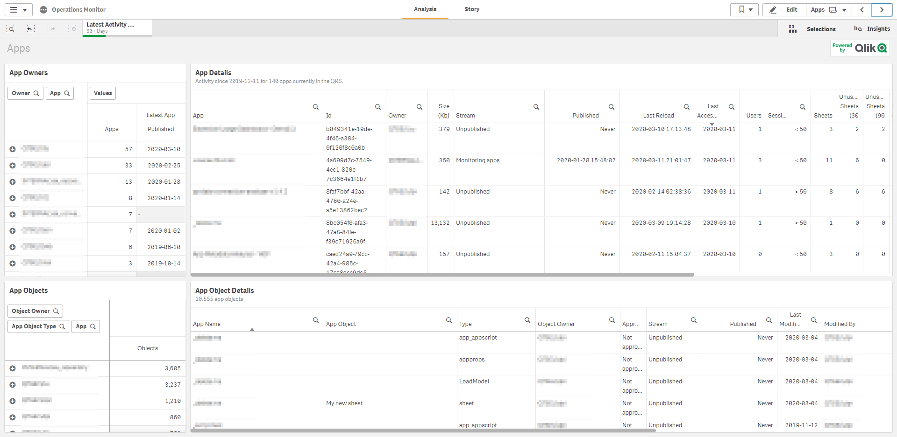](https://raw.githubusercontent.com/qs-admin-guide/qs-admin-playbook/master/docs/tooling/images/qs_ops_monitor_10.png)

[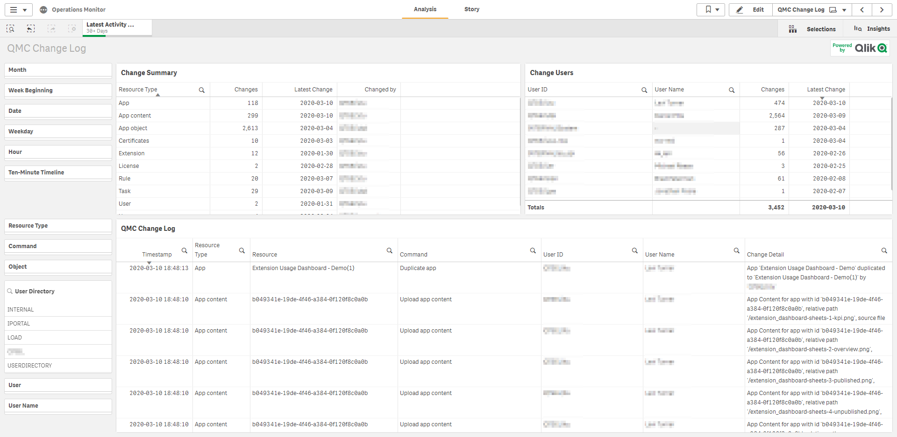](https://raw.githubusercontent.com/qs-admin-guide/qs-admin-playbook/master/docs/tooling/images/qs_ops_monitor_11.png)

[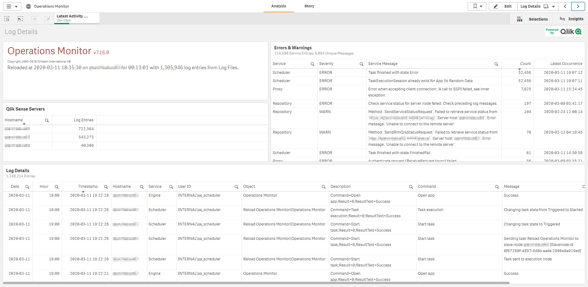](https://raw.githubusercontent.com/qs-admin-guide/qs-admin-playbook/master/docs/tooling/images/qs_ops_monitor_12.png)

-------------------------

## Documentation

* [Operations Monitor - Qlik Help](https://help.qlik.com/en-US/sense-admin/Subsystems/DeployAdministerQSE/Content/Sense_DeployAdminister/QSEoW/Administer_QSEoW/Monitoring_QSEoW/Operations-monitor-app.htm)
* [Youtube Video - STT - Configuring Monitoring Apps in Qlik Sense](https://youtube.com/watch?v=_WywE9AXnvs)
* [Youtube Video - Configuring Qlik Sense Enterprise Monitoring Apps for Multi Node](https://youtube.com/watch?v=ycGESqJME3E)
* [Youtube Video - Qlik Fix: Troubleshooting Qlik Sense Monitoring Apps](https://youtube.com/watch?v=ulZw6_ZJ_ek&t=23s)

**Tags**

#tooling

&nbsp;