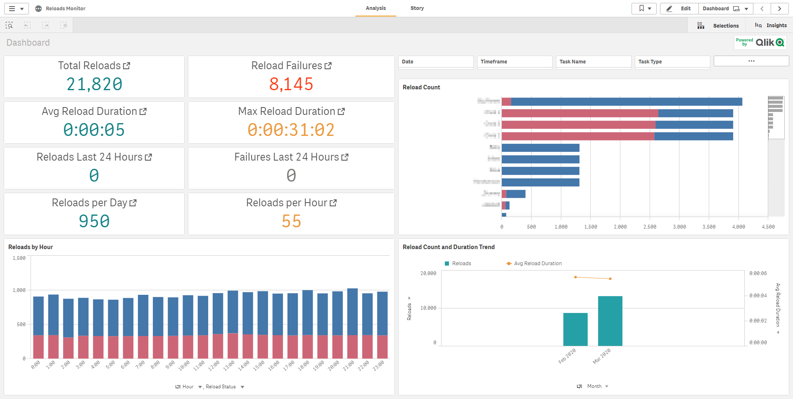
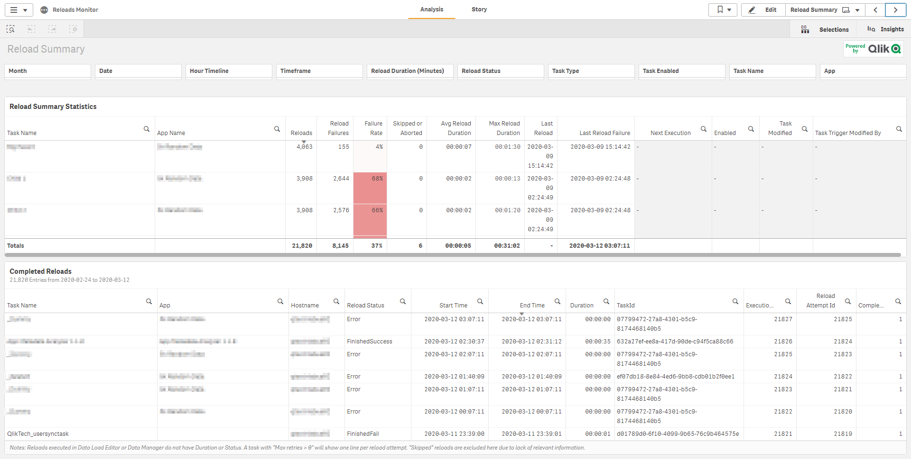
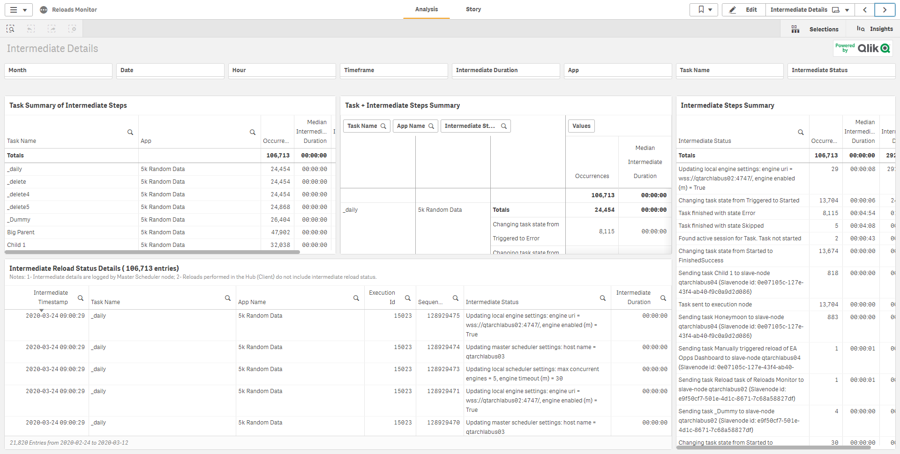
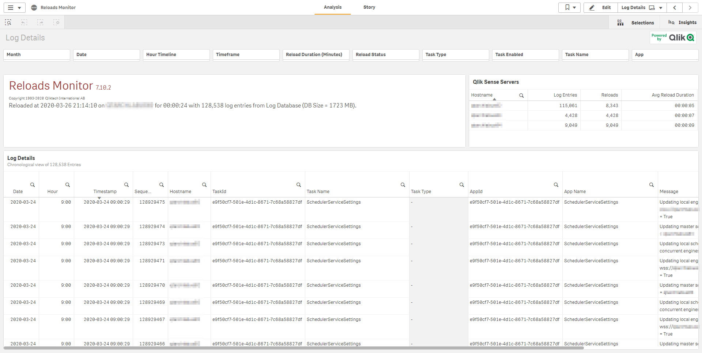

# Reloads Monitor
{:.no_toc}

developmentproduction

|<i class="far fa-clock fa-sm"></i> **Estimated Configuration Time**   | 15 min  |

## Table of Contents
{:.no_toc}

* TOC
{:toc}

-------------------------

## About

The Reloads Monitor loads and presents log data about reloads. Reload data is collected both from QMC tasks and apps open in the hub. You can see which apps are updated, and details about when, where, and how often they are updated.

-------------------------

## Where to get it

The application can be found under **_%ProgramData%\Qlik\Sense\Repository\DefaultApps_** and is titled _Reloads_Monitor.qvf_. This however might not be the most recent version of the app, as there have been bug fixes since. The most recent version of the app can be found at [Qlik Community - Sense: Sessions Monitor, Reloads Monitor, Log Monitor](https://community.qlik.com/t5/Qlik-Monitoring-Administration/Sense-Sessions-Monitor-Reloads-Monitor-Log-Monitor/gpm-p/1578597), and can be used from April 2018 and beyond.

> Note: you might be able to use this with Feb 2018, but proceed at own risk.

-------------------------

## Importing the Reloads Monitor app to the Monitoring apps

If you haven't already imported the extra monitoring apps that come with Qlik Sense, but are not by default exposed in the QMC/Hub, it's time to do so. Follow the directions in this link ([Importing New Monitoring Apps](https://help.qlik.com/en-US/sense/Subsystems/Monitoring/Content/Sense_Monitoring/Introduction/Configure-monitoring-apps.htm#Importing_)).

Once you open the Reloads Monitor application in your Work area of the Hub, follow the instructions in the Load Script Editor (comments on first tab of script) for the right runtime setting.   Then reload the application from the script editor to ensure it runs without error.   If you experience errors reloading this application, follow this link ([Support - Operations Monitor or License Monitor Tasks Do Not Reload - Monitoring Apps](https://support.qlik.com/articles/000024083)) for helpful tips on resolutions to monitoring app reload issues.

-------------------------

## Screenshots

-------------------------

## Documentation

* [Reloads Monitor - Qlik Help](https://help.qlik.com/en-US/sense-admin/Subsystems/DeployAdministerQSE/Content/Sense_DeployAdminister/QSEoW/Administer_QSEoW/Monitoring_QSEoW/Reloads-monitor-app.htm)
* [Youtube Video - STT - Configuring Monitoring Apps in Qlik Sense](https://youtube.com/watch?v=_WywE9AXnvs)
* [Youtube Video - Configuring Qlik Sense Enterprise Monitoring Apps for Multi Node](https://youtube.com/watch?v=ycGESqJME3E)
* [Youtube Video - Qlik Fix: Troubleshooting Qlik Sense Monitoring Apps](https://youtube.com/watch?v=ulZw6_ZJ_ek&t=23s)

**Tags**

#tooling

#tasks

#reloads

&nbsp;