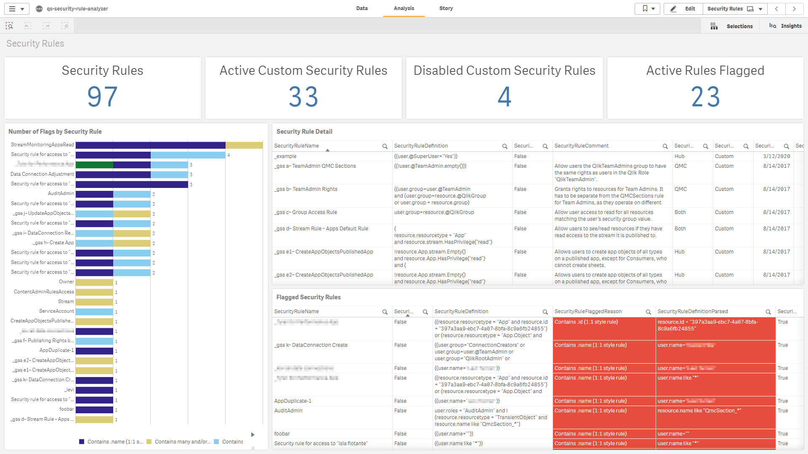

# Security Rule Analyzer <i class="fas fa-tools fa-xs" title="Tooling | Pre-Built Solutions"></i>
{: .no_toc }

developmentproduction

|<i class="far fa-clock fa-sm"></i> **Estimated Configuration Time**   | 30 min  |

## Table of Contents
{:.no_toc}

* TOC
{:toc}

## About

The **Security Rule Analyzer** is intended to be a companion application to the [Analyze Security Rules](../asset_management/security_rules/analyze_security_rules.md) section.

The application is an application supported by the Americas Enterprise Architecture team from Qlik. It is a very straight forward application that makes to calls to the QRS (repository database) that fetches metadata around custom properties and all security rule information. The application itself takes advantage of the existing `monitor_apps_REST_app` data connection, so there is no installer and it is plug and play, spare a couple of variable settings and ensuring that the user executing the reload has _RootAdmin_ rights and access to the data connection. Complete setup instructions can be found in the script.

## Screenshot

## Where to get it

The application can be found on GitHub [here](https://github.com/eapowertools/qs-security-rule-analyzer).

**Tags**

#security

#rule

#security_rule

#analyzer

&nbsp
